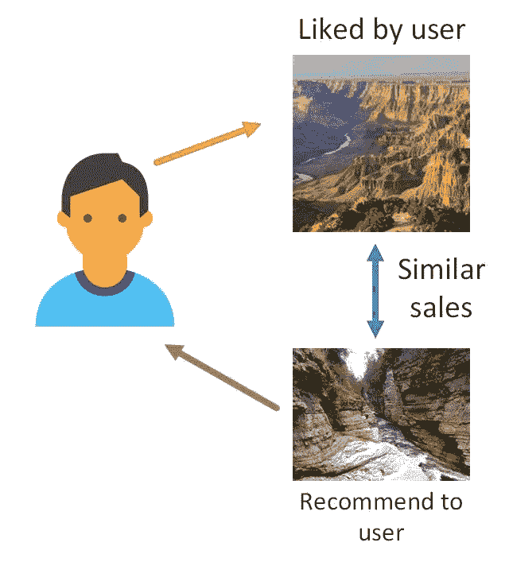
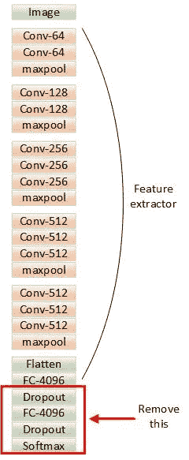
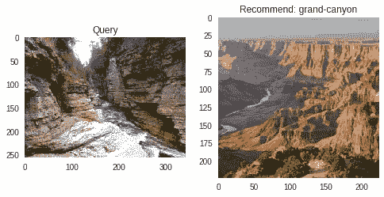

# 设置 Keras 深度学习框架和构建旅游推荐引擎的简明指南(第 2 部分)

> 原文：<https://medium.com/hackernoon/gentle-guide-to-setup-keras-deep-learning-framework-and-build-a-travel-recommendation-engine-part-9c805b325a2d>


让我们继续构建旅游推荐引擎的旅程。你可以在我的博客上找到《T2》系列的第一部分。读完这篇文章后，你会知道如何将一个为分类而训练的模型变成一个提取图像特征向量的模型。然后，我们将通过它们的特征向量来研究如何计算两幅图像之间的相似性。最后，我们将生成具有最相似图像的旅行推荐。

为了获得最佳的学习体验，我建议在阅读本教程时打开 [Colab 笔记本](https://drive.google.com/file/d/1MER51W-x2JLvAjKJnmGXLQduWaqjTsUf/view?usp=sharing)。

我们要打造的引擎是一个基于内容的推荐引擎。如果用户喜欢目的地照片，那么系统将向他/她显示类似的旅行目的地图像。



# 从分类器到特征提取器

在我们之前的帖子中，构建了一个模型来将输入图像分类为 365 个地点/场景名称中的一个。

我们将删除负责生成位置逻辑的最后 4 层，只保留网络的“特征提取器”部分。



在 Keras 中，我们可以像这样弹出最后 4 层。

上面的最后一行将模型权重保存到一个文件中，供以后使用。下一次，我们只需要定义没有 4 个分类器层的模型，并用保存的权重初始化网络。

如果您再次运行`mode.predict`，您会注意到输出不再是 365 个浮点数的向量。相反，它现在是一个 4096 浮点数的向量。这是特征向量，输入图像的抽象表示。

# 推荐相似图片

我们的推荐引擎获取用户喜欢的查询图像并推荐相似的地方。

通过测量两个特征向量之间的距离来计算两个图像之间的相似性。

你可以想象在 4096 维的空间里测量两个特征向量之间的距离。距离越小，两幅图像越相似。

# 预计算图像特征

我们可以在运行时计算所有已知图像的特征向量，并与查询图像的特征向量进行比较。但是这将是无效的，因为我们基本上是一次又一次地计算这些值。另一种更快的方法是预先计算这些特征向量，并将它们存储在存储器中。在运行时，我们只需要计算查询图像的特征向量，如果它以前没有被计算过，这节省了很多时间，特别是当你有很多图像要比较的时候。

这是通过调用特征提取器模型的预测函数来计算图像特征向量的函数。

我们还有另一个功能来预先计算所有已知的图像特征向量，并将它们存储到存储器中，这只需要做一次。

# 获得最相似的图像

下面是我们在运行时执行的函数，用于搜索和显示与新查询图像最相似的图像。

让我们通过运行下面的代码来尝试一下。

```
get_similar_photo("images/canyon2.jpg")[0].name
```

这是结果，我们的模型推荐了一张与查询图像相似的照片。



# 进一步的改进

如果您使用推荐引擎，您可能会注意到它偶尔会生成错误的推荐。

有两个原因，

1.该模型被训练用于分类，并且网络的图像特征提取器部分被优化用于将图像分类为 356 类，而不是用于区分相似的图像。

2.该模型在分布于 365 类地点的图像数据集上进行训练。训练集可能没有足够的图像用于特定类型的海滩或不同季节的一个地方。

第一个问题的一个解决方案是使用具有三重丢失的的**连体网络，这在人脸验证任务中很流行。该模型将被训练以识别两个图像是否来自同一个地方。你可以看看 Coursera 上关于这个概念的[视频介绍](https://www.coursera.org/learn/convolutional-neural-networks/lecture/bjhmj/siamese-network)，我觉得很有帮助。**

第二个问题的解决方案是通过“冻结”一些早期的卷积层，将**转移学习**应用于我们的模型，并用我们的自定义图像数据集训练其余的模型参数。在训练新图像模型时，迁移学习是利用从大型图像数据集学习的一般特征的一种很好的方式。

# 结论

现在，您已经尝到了深度学习的无限潜力，并且可能对亲手构建和运行 Keras 模型留下了深刻的印象。掌握任何技术的旅程都不容易，深度学习也不例外。这就是最初激励我创建这个博客网站的原因，我通过分享和教授我在这个过程中所学到的东西，来更好地将深度学习应用于现实生活中的问题。如果您正在寻找解决方案或只是打个招呼，请不要犹豫，直接联系我。

*在* [GitHub](https://github.com/Tony607) 、 [LinkedIn](https://www.linkedin.com/in/chengweizhang/) 、[微信](https://mp.weixin.qq.com/s?__biz=MzIyNTI3NTI3Mg==&mid=100000016&idx=1&sn=3b7e519ffcabd65efe339a9ee8bb327d&chksm=68037df75f74f4e1aa762fc8d69d9ce725f40189ca4534786492267b448239926c943a8b2970&mpshare=1&scene=1&srcid=1212R4Cm7BhxGSfTAa9V5Ofw#rd)、 [Twitter](https://twitter.com/TonyZhang607) 或[脸书](https://www.facebook.com/chengwei.zhang.96)上找我。

*原载于*[*www.dlology.com*](https://www.dlology.com/blog/gentle-guide-to-setup-keras-deep-learning-framework-and-build-a-travel-recommendation-engine-part-2/)*。*