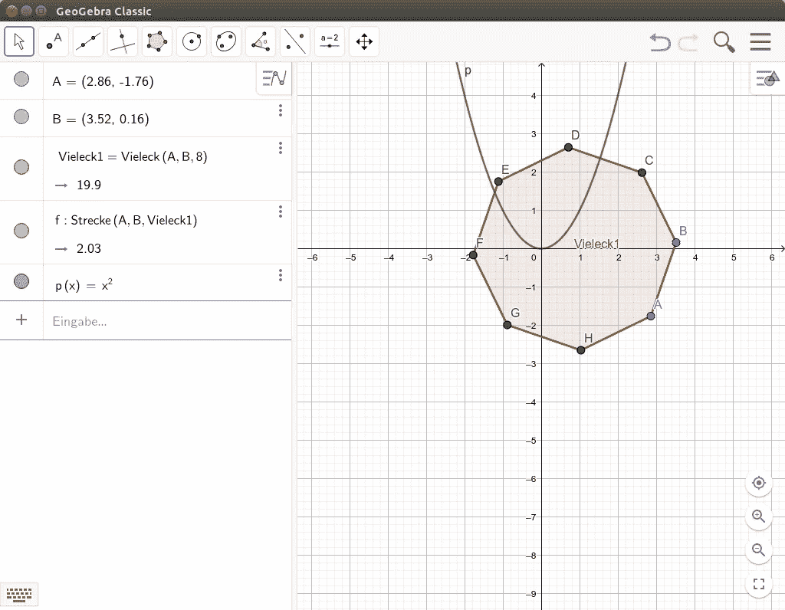

# GeoGebra —本月应用

> 原文：<https://medium.com/hackernoon/geogebra-app-of-the-month-open-school-solutions-f91da574a704>



今天，我想向大家介绍 GeoGebra，它是本月的另一款[应用](https://openschoolsolutions.org/category/app-of-the-month/)。这是一个非常著名的[项目](http://www.geogebra.org/)，几乎所有学校的数学课都会用到它。但是 GeoGebra 到底是什么？

> *GeoGebra 是一个交互式的几何、代数、统计和微积分应用程序，用于从小学到大学的数学和科学的学习和教学。GeoGebra 可在多个平台上使用，其桌面应用程序适用于 Windows、macOS 和 Linux，其平板应用程序适用于 Android、iPad 和 Windows，其 web 应用程序基于 HTML5 技术。* [*(维基)*](https://en.wikipedia.org/wiki/GeoGebra)

# GeoGebra 的特征

维基百科关于 GeoGebra 的文章列出了一些函数。简而言之，GeoGebra 在易于使用的用户界面背后提供了许多强大的功能。其中包括:

*   功能图
*   某些积分和基本函数
*   距离的长度，角度的大小
*   向量，法线向量
*   用复数、矩阵、多项式计算
*   内置计算机代数系统
*   内置的统计和计算工具

# 装置

GeoGebra 是另一个例子，说明如今 it 越来越不依赖于操作系统，但人们实际上只需要一个浏览器就可以使用教育应用程序。它适用于各种平台，但您也可以在线使用它。

在项目网站上，你可以下载 DEB 或 RPM 格式的[包](https://www.geogebra.org/download)。在那里你还可以找到一个可以直接从 u 盘启动的便携式版本。要安装 Debian 或 Ubuntu 的 DEB，[下载合适的包](http://www.geogebra.org/download/deb.php?arch=amd64&ver=6)并用包管理器安装它。

```
$ sudo dpkg -i geogebra-classic*
```

然后，您可以通过程序启动器启动程序。

几乎所有平台都有不同版本的 GeoGebra。除此之外，还有一款增强现实应用。这允许功能、形状等。在空间中被虚拟化。这里有一个例子:

[https://www.youtube.com/watch?v=nmIIO9KZNww](https://www.youtube.com/watch?v=nmIIO9KZNww)

在我们学校，我们主要在数学课上使用 GeoGebra。就我个人而言，作为一名小学教师，我在教学中很少使用它🙂

# 结论

GeoGebra 是一款屡获殊荣的软件，可以在课堂上非常好地使用。还有一个“考试模式”，这样你就可以在考试中使用该应用程序。然而，一些人批评这个软件使用的许可证。软件的一部分是根据 GPL 许可的，其他部分(例如安装程序或语言文件)是根据他们自己的许可证许可的。对学生和教师来说，用于教学是免费的。

总的来说，你只能推荐这个软件，因为它提供了很多功能，而且仍然很容易使用。

*最初发表于*[T5【openschoolsolutions.org】](https://openschoolsolutions.org/geogebra-app-month/)*。* ***注册*** *订阅我们的时事通讯，获取免费的 PDF 格式，并为您的课堂提供出色的开源应用程序，或者在 Twitter 上关注*[*@ OpenSchoolZ*](https://twitter.com/OpenSchoolZ)*。*