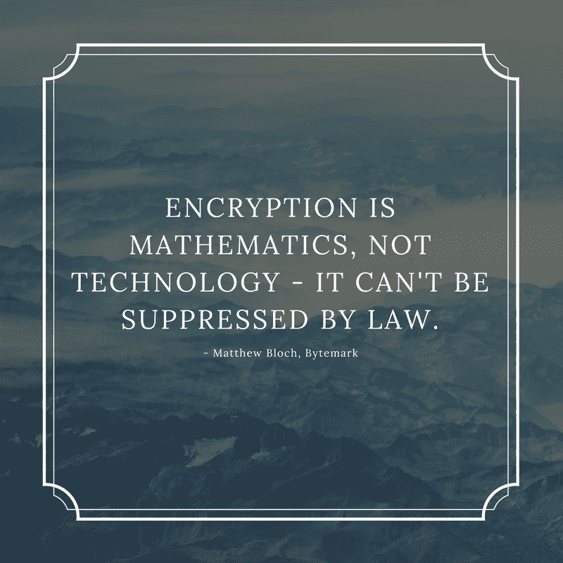

# 加密禁令的地理分布

> 原文：<https://medium.com/hackernoon/geography-of-bans-40abdfa066dd>

***政府反对加密和安全通信手段的最奇特案例***

*最近俄国对电报的禁令，以及埃及新立法带来的言论自由的终结，启发我们创建了一个由偏执狂驱动的禁止安全通信工具的国家大游行。*

“不要偷——政府不喜欢竞争”这是一句著名的匿名名言。试图完全保证你的通讯安全似乎也在以错误的方式与不同的世界政府摩擦。虽然禁止或[获得 E2EE](https://www.justsecurity.org/53316/criminalize-security-criminals-secure/) (目前在许多流行的信使中使用)的后门的理论概念是可笑的，因为官员们对 E2EE 的工作原理缺乏理解(也许他们应该查看我们关于 E2EE 的 ELI5 [文章)，但仍有许多尝试在国家层面上禁止或劫持加密通信手段(即使最近的理论论文证明双方仍可以](/@cossacklabs/eli5-end-to-end-encryption-ae46821db74f)[使用带有后门的通信系统](https://www.schneier.com/blog/archives/2018/04/subverting_back.html)创建安全的通信通道)。

政府为禁令和窃听提供正当理由的原因是打击恐怖主义，但被监视的损失是显而易见的，而没有隐私的真正好处充其量是模糊的。

# **美国**

政府诉加密案是最著名的案件之一，也是最古老的案件之一，它有自己合适的标题*——*[“联邦调查局-苹果加密纠纷”](https://en.wikipedia.org/wiki/FBI%E2%80%93Apple_encryption_dispute)。

在整个 2015-2016 年，美国联邦调查局要求苹果公司提供一款新软件，用于解密运行 iOS 7 的 iPhones 手机上存储的信息。不出所料，这一要求遭到了拒绝，导致了激烈的法律纠纷，直到最初有问题的 iPhone 获得了正确的密码(但不是通用的 iPhone 解锁软件)。

美国中央情报局也试图击败苹果的加密技术，试图创建一个伪造的 Xcode 替代版本，为 iOS 应用程序添加后门。当这个[通过维基解密](http://appleinsider.com/articles/17/03/08/wikileaks-documents-show-cia-struggling-with-apple-gear-little-danger-to-everyday-folk)为人所知时，它导致了苹果开发者中广泛的安全审计。

规范美国政府监控的最重要文件是《外国情报监控法案》第 702 条( [FISA](https://intelligence.house.gov/fisa-702/) )。FISA 允许政府情报部门窃听和存储从居住在美国以外的外国嫌疑人的数字通信中收集的数据。

FISA 将于 2017 年 12 月 31 日到期，由众议院司法委员会起草的新法案取代。由注重隐私的立法者起草的草案[重新构建了安全和隐私之间的平衡，旨在限制政府窃听，特别是在没有法院发布命令的情况下(涉及反恐的案件除外)。然而，国会通过了一项 FISA 再授权法案，不仅根据第 702 条延长了无线监控，而且在许多重要方面扩大了它。新通过的法案将第 702 条款重新授权了六年。奇怪的是，川普总统起初反对 FISA 延期，但后来他改变了主意。](https://www.reuters.com/article/us-usa-cyber-surveillance/u-s-lawmakers-want-to-restrict-internet-surveillance-on-americans-idUSKBN1C92T5)

# **欧洲**

欧洲议会的一份报告草案提议禁止加密后门，这一禁令应扩展到所有欧盟成员国。此外，根据欧洲议会公民自由、司法和内政事务委员会提出的对《基本权利宪章》第 7 条的修正案，端到端加密应该成为所有形式的电子通信的强制性规定。

然而，一些欧盟国家在这个问题上有着截然不同的观点。

## **英国**

2016 年通过的调查权力法案[使英国成为监控最密集的国家之一](https://www.theguardian.com/world/2016/nov/19/extreme-surveillance-becomes-uk-law-with-barely-a-whimper)。该法案还使政府窥探用户隐私的许多工具合法化。端到端加密仍然是隐私的最后一道防线，但却屡遭攻击。

2015 年，英国前首相[大卫·卡梅隆已经试图提议禁止加密服务](https://en.wikipedia.org/wiki/Encryption_ban_proposal_in_the_United_Kingdom)(即 iMessage、Snapchat 和 WhatsApp)，但这一尝试失败了。鉴于 2017 年 3 月的恐怖袭击，这一法案被重新提出来讨论。英国内政大臣 Amber Rudd 解释了采取激烈措施的必要性，称政府不应该提供“恐怖分子相互交流的秘密场所”。可能新的证券交易委员会最终将有权在立法层面禁止 E2EE。现实中如何做到这一点还不清楚。

## **德国和法国**

法国和德国一致声称提供加密的后门对于打击恐怖主义至关重要。虽然还没有像 WhatsApp 或 Telegram 这样受欢迎的端到端应用在法国被禁止，但法国内政部长伯纳德·卡泽纳夫和他的德国同事托马斯·德·迈齐埃在一份[联合提案](http://www.interieur.gouv.fr/Actualites/L-actu-du-Ministere/Initiative-franco-allemande-sur-la-securite-interieure-en-Europe)中表示，这类应用在调查期间构成挑战。他们一起呼吁欧盟委员会制定新的法律，根据政府有关恐怖主义相关调查的要求,[迫使开发者提供后门、解密信息并删除不想要的内容。至少可以说，这个想法遭到了很多人的怀疑。](https://www.theverge.com/2016/8/24/12621834/france-germany-encryption-terorrism-eu-telegram)

## **澳大利亚**

澳大利亚支持英国政府在全州范围内禁止端到端加密的尝试。澳大利亚司法部长 George [Brandis 甚至说](https://www.theaustralian.com.au/national-affairs/brandis-to-meet-apple-to-discuss-encryption-laws/news-story/d2dd5e9be06194ee99bff4088e196bef)新的隐私相关法律将直接模仿英国的调查权力法案。

不幸的是，对澳大利亚政府来说，禁止端到端加密的问题没有任何进展——你要么只针对某些明确的服务精选禁令，要么破坏整个互联网安全交易的概念。

澳大利亚新提出的立法旨在迫使科技制造商向政府提供用户数据，无论这些数据是否以任何方式加密。Brandis [表示，他将与苹果](https://9to5mac.com/2017/07/17/apple-australia-encryption-law/)会面，讨论如何合作寻找披露端到端加密的方法，这似乎忽略了它的工作原理。

禁止所有加密通信的尝试是勇敢的，但也是极不可行的。唯一半实用的端到端加密信息可以以某种方式透露给第三方的方法是通过在软件中添加键盘记录器。然后，键盘记录器将在用户键入信息时拦截信息，有效地使所有进一步的加密过程变得无用，更不用说这看起来更像是犯罪分子会做的事情，而不是政府想要通过阅读他们的信息来阻止犯罪分子(这甚至将道德部分排除在外！).

# **亚洲**

## **中国**

之前在中国有一些 WhatsApp 的临时禁令，但[从 2017 年 9 月](https://techcrunch.com/2017/09/25/whatsapp-blocked-in-china/)开始的禁令似乎是永久性的。这项禁令让 mainland China 的大多数用户无法发送和接收 WhatsApp 信息。有传言称，2017 年 10 月在北京召开中共代表大会后，WhatsApp 的正常功能可能会得到恢复，但这从未发生过。另一个加密的 messenger Snapchat 从第一天起就在中国被禁(这并没有阻止 [Snapchat 在中国开设办事处](https://www.theverge.com/2016/12/21/14037970/snapchat-office-china-ban-spectacles))。

## **韩国**

虽然朝鲜公民缺乏任何加密通信手段都不足为奇，但正是韩国加入了我们的反加密“大游行”。事实证明，韩国官员非常倾向于监听他们的公民。

2014 年，朴槿惠总统宣布，通过[KakaoTalk](https://en.wikipedia.org/wiki/KakaoTalk)——类似于 WhatsApp 或 iMessage 的韩国信使[发送的消息将被筛选掉不适当的内容](http://bigstory.ap.org/article/97c92b056482488abd990db9a4acb388/s-korea-rumor-crackdown-jolts-social-media-users)(即散布谣言和侮辱政府)。这使得韩国人迅速转向 WhatsApp 和 Telegram，在交流中寻求更多隐私。KakaoTalk 信使也很快跟进，在其功能中加入了端到端加密。

# **阿拉伯半岛和非洲**

## 阿联酋和沙特阿拉伯

在沙特阿拉伯和迪拜，WhatsApp、Viber、Imo 和 Facebook Messenger 的许多重要应用功能都受到限制。这不是隐私或打击犯罪/恐怖主义措施的问题，而是政府对国家 VOIP 服务提供商的支持，以阻止用户迁移到免费信使的损失。[基本上，为了保持国家对提供网络电话服务的垄断，所有具有语音和视频通话功能的聊天应用至少部分受到当地“法规”](https://www.independent.co.uk/life-style/gadgets-and-tech/news/facebook-messenger-blocked-in-saudi-arabia-chat-apps-have-voice-and-video-call-functions-banned-over-a7027301.html)的限制。

禁止信使在这一地区并不是什么新鲜事。例如，2010 年[沙特和阿联酋都威胁禁止黑莓即时通讯](http://www.bbc.co.uk/news/business-10860491)，并要求该公司安装本地服务器来审查服务。

[*Official ad image from the advertising campaign for C’me VOIP messenger*](http://www.t3me.com/en/news/apps-software/phone-apps/c%E2%80%99me-app-users-etisalat-can-now-receive-unlimited-voice-and-video)

苹果的 FaceTime 不仅在阿联酋、埃及、约旦、卡塔尔和沙特被禁——出于同样的原因，在这些国家出售的 iPhones 中也找不到它([在硬件层面受到限制](https://support.apple.com/en-us/HT204168))。FaceTime 是与国内 VOIP 服务提供商 C'me(用于通过 WiFi 拨打国内和国际电话)和漫游回拨应用(用于在漫游时通过 WiFi 拨打电话)在 Android 和 iOS 上的竞争。

Etisalat(和 [du](http://www.du.ae/personal/at-home/broadband) ) VOIP 信使和其他著名替代产品的主要区别在于，C'me 和漫游回拨应用程序的服务不是免费的。

使用网络电话的付费等同于在覆盖区域内拨打国内电话(官方资费指南注明*“C'Me app 用户可订阅 Dh20 周或 Dh50 月 C ' me 包，享受不限量优惠。用户可以在 WiFi 或移动数据网络上接听电话。此外，从 C'Me app 拨打的漫游电话将按每分钟 2.4 迪拉姆* [*收费*](http://www.absolutegeeks.com/etisalats-introduces-roaming-offer-for-cme-app-users/) *。”* with 1DH = $0，27)。对于那些想要从[打电话回家的旅行者，漫游](http://www.emirates247.com/business/technology/uae-resident-alert-free-app-for-roaming-calls-at-local-rates-2016-07-12-1.635523)将支付每分钟 3DH 的统一费率。

尽管 2017 年 9 月[沙特阿拉伯决定撤销对 Skype、WhatsApp 和其他互联网通话服务的禁令](https://techcrunch.com/2017/09/20/saudi-arabia-voip-ban-internet-calling/)，但它们在阿联酋仍然受到限制。阻止 VoIP 服务的其他非洲和阿拉伯半岛国家有:

*   圭亚那，
*   科威特，
*   利比亚，
*   朝鲜，
*   阿曼，
*   卡塔尔，
*   叙利亚。

## **埃及**

2015 年，随着 Skype、WhatsApp 和 Viber 被[暂时封禁，埃及公民第一次尝到了互联网审查的滋味。2016 年 12 月，](https://egyptianstreets.com/2015/10/07/social-media-users-enraged-over-alleged-skype-viber-whatsapp-ban-in-egypt/)[Signal](https://signal.org/)——一款使用端到端加密的消息应用(目前被认为是最安全的信使之一)被永久封禁。Signal 的创造者 [Open Whisper System 证实了关于禁令](https://twitter.com/whispersystems/status/810945070182469632)的消息，并初步找到了通过[域前置](https://www.bamsoftware.com/papers/fronting/)绕过禁令的变通办法。既然谷歌和亚马逊禁止[域名使用](https://www.theverge.com/2018/4/30/17304782/amazon-domain-fronting-google-discontinued)域名，Signal 在埃及的未来还不明朗。

埃及接下来的数字政治迫害是从反对 OpenVPN 开始的。2017 年 8 月，埃及政府迈出了试图屏蔽 VPN 的第一步，屏蔽了 PPTP 和 L2TP。 [OpenVPN 于 2017 年 10 月初在埃及被封](https://www.reddit.com/r/VPN/comments/73zc61/openvpn_got_blocked_in_egypt_yesterday_night_and/)。在那段时间，埃及唯一还在运行的 VPN 服务是 TCP 上的 Softether(据报道速度极慢)、Shadowsocks 和 Tor。

从技术上讲，VPN 在埃及是合法的，因为目前埃及没有法律禁止使用 VPN。并不是所有的服务器都能稳定工作(OpenVPN 根本不能工作)，但是他们的很多服务器和网站都被屏蔽了。许多埃及网络资源警告想去该国旅行的人在到达之前下载并设置他们选择的 VPN。

2017 年[恐怖袭击后通过的监控法律](https://www.theguardian.com/world/2017/dec/29/gunman-launches-deadly-attack-on-coptic-church-near-cairo)也允许埃及当局在没有司法监督的情况下监控和关闭在线通信和媒体。

不仅仅是 Signal 的安全 E2EE 交换，许多提供 VoIP 服务的信使也在 2017 年 8 月在埃及被部分屏蔽。与沙特阿拉伯的 Facebook Messenger 的功能类似，通过 VoIP 进行的语音和视频通话在 Skype、FaceTime 和 WhatsApp 中受到限制。

埃及政府还命令互联网服务提供商使用新的[法律屏蔽许多博客和新闻网站，该法律允许屏蔽社交媒体](https://www.reuters.com/article/us-egypt-politics/egypt-targets-social-media-with-new-law-idUSKBN1K722C)账户，并惩罚发布“假新闻”的记者。根据 2018 年 7 月通过的这部法律，拥有超过 5000 名粉丝的社交媒体账户可能会因发布假新闻而被起诉。该法律还命令任何想要创建新的在线媒体的人从埃及最高委员会获得许可。现有网站可能会因涉嫌帮助恐怖分子而被封锁或罚款。

# 俄罗斯联邦

Roskomnadzor(俄罗斯联邦通信、信息技术和大众媒体监督局)试图禁止一个加密的信使，[最终禁止了谷歌、YouTube、Viber、Spotify 和亚马逊](https://www.independent.co.uk/life-style/gadgets-and-tech/news/russia-telegram-ban-amazon-google-fifa-spotify-nintendo-twitch-down-latest-updates-a8313776.html)。运气不好。你猜怎么着？信使仍然工作。

俄罗斯官员警告负责安全信息服务 [Telegram Messenger](https://telegram.org/) 的团队，他们需要向 FSB(联邦安全局)交出用于解密该服务用户之间端到端通信的密钥。当 Telegram 拒绝后，[莫斯科法院于 2018 年 4 月下令禁止 Telegram](https://www.theguardian.com/world/2018/apr/13/moscow-court-bans-telegram-messaging-app) 在俄罗斯的服务。

由此产生的制裁导致许多关键服务在俄罗斯被意外禁止，因为数百万亚马逊、谷歌和其他热门平台的 IP 在试图关闭电报时被封锁。

Telegram 最初使用域名转发来为俄罗斯联邦境内的人们保持功能，并引导他们的相当大的资源流来保持信使为其用户工作。你可以下载 messenger 或使用其网页版本的 Telegram 官方网站在俄罗斯确实是被禁止的(除非专门使用 ipv6 或 DualStack)，但除此之外，它在大多数情况下都是功能性的和稳定的。

事实上，电报不能被完全屏蔽，因为目前在技术上不可能。Roskomnadzor 的第一波禁令发生在 ipv4 空间内，每天一次大约有 100-200 万个地址(被检测为访问 messenger 的地址)被禁止。第二天电报只是转移到新的可用地址。所以猫捉老鼠的游戏可以永远进行下去，直到地址空间用完。更有趣的是，ipv6 对于禁令来说完全遥不可及，因为地址空间永远不会用完。事实上，并不是每个人都在使用 ipv6，但它是可用的，并且正在工作。

此外，Telegram 不仅利用了这个漏洞，还创建了一个 MTProxy，它只允许 messenger 中创建的流量通过。除非有人直接投诉，否则 Roskomnadzor 不能依法禁止此类代理。有趣的是，这使得 Telegram 的作品在中国和伊朗重新流行起来，而在这两个国家，Telegram 也是被禁止的。

# **总结还是应该担心？(或者有人*真的能*用立法对抗数学吗？)**

隐私不仅仅是交换猫的裸体、购买枪支或在去超市的路上给你的配偶发送购物清单的专有权利——它是我们数字世界的基石之一，也是一项基本人权。

虽然这篇文章主要使用信使作为例子，[端到端加密](https://www.newscientist.com/article/mg23331100-600-encryption-wars-the-privacy-debate-raging-in-your-smartphone)不仅特别支持消息应用，还支持网上购物、银行，甚至政府网站。禁止它会引起混乱。无论如何，你不能立法反对数学。人们仍然能够找到安全通信的方法，并在必要时加密他们的信息。

政府对他们无法访问的加密技术的这种反应表明，我们正在做一些强大的事情，我们应该尽一切努力继续发展 E2EE 通信。如果我们设法将端到端信任的概念从科学密码文件的地狱中直接变成一个标准的东西，我们将使这个世界不仅更安全，而且更自由。

在哥萨克实验室，我们非常重视隐私，将先进的加密技术转化为简单易用的开源加密工具。如果你想给自己的应用程序带来更多的安全性，你可能想[看看它们](https://github.com/cossacklabs/)。

*如果你有一个关于你的国家奇怪的加密禁令的故事要分享*——*我们很乐意听到你的故事！请通过推特上的***或*[*@ cossacklabs*](https://twitter.com/cossacklabs)*联系我们。**