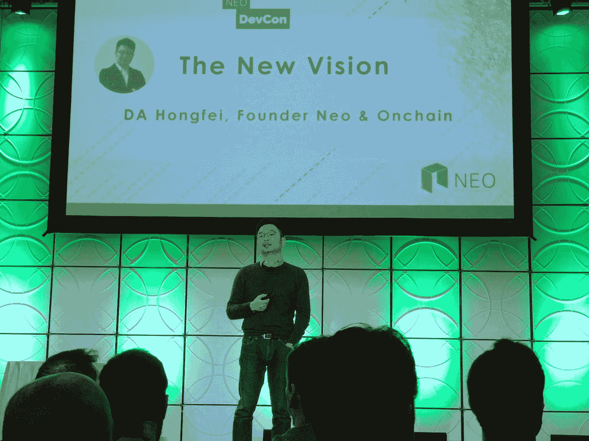
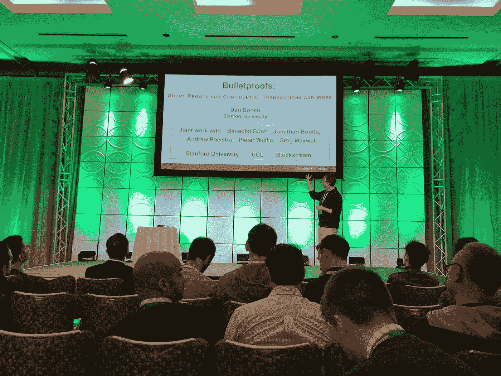

# 与托尔托肯的首席技术官马特·莫拉维克一起先睹为快

> 原文：<https://medium.com/hackernoon/get-a-sneak-peek-at-neo-devcon-with-thor-tokens-cto-matt-moravec-f00d75bbff2d>

Da Hongfei presenting his “New Vision” for NEO

1 月 30 日星期二，近 500 名痴迷于加密的与会者聚集在旧金山的第一个新敌无双。能量是电能。你一走进去就能感觉到。来自世界各地的开发人员和企业家挤在一个小组里，带着准备改变世界的兴奋心情谈论着他们的项目。投资者也在那里，寻找下一个独角兽。每个人都觉得他们马上就要听到下一件大事了。

西方从事近地天体研究的开发小组叫做锡安城。我就是这些开发者中的一员。我在那里第一次见到了我的同伴，并发布了托尔令牌白皮书，这是我最近帮助推出的针对零工经济的 T2 区块链 T3 解决方案。

会议开始的前一天晚上，我在旧金山一家名为 ABV 的酒吧主持了《锡安之城》,谈论了自六个月前成立该组织以来我们所经历的代码、社区和协议戏剧。令人惊讶的是，终于看到了《锡安之城》的一些项目背后的面孔，如 [NEX](https://neonexchange.org/) 、[月光](https://moonlight.io/)、[尼奥认证](https://neoauth.org/)和[哈希小狗](https://steemit.com/neo/@rksumanthraju/hash-puppies-is-the-new-project-coming-on-neo-platform-just-like-cryptokitties-on-ethereum-platform)。我不仅看到了这些项目的巨大潜力，还见到了 Thor Token 未来可能的合作伙伴。

Dan Boneh presenting his talk on Bulletproofs

大会有一个很棒的演讲者阵容。从听到达·洪飞对近地天体的新设想，到斯坦福大学教授丹·博纳对防弹片的介绍，点击不断。第一天我在 Github 办公室帮忙主持了黑客马拉松。房间里挤满了开发人员，他们兴奋地安装自己的 NEO 节点，私下测试他们想要建立的智能合同。一位激动的[开发者](https://hackernoon.com/tagged/developer)举手问道:“Docker 跑哪去了？”"本地在你的机器上！"我告诉他了。当他意识到自己刚刚制造出自己的私人新区块链时，他笑了。

其余的时间，我都在管理我们的展位，分发白皮书的硬拷贝。对 Thor Token 的反应非常积极，社区的其他人听到我们的公司就像我们听到他们的公司一样兴奋。一个引起我注意的项目是 [Bluzelle](https://bluzelle.com/) ，这是一个分散的数据库服务，为 dApps 提供了一个优雅的存储解决方案。我与 Bluzelle 的首席技术官 Neeraj Murarka 进行了交谈，他解释了他们的目标是让开发人员像 Firebase 一样简单易用。Thor Token 将需要分散存储来存储我们提供给医疗保健公司的用户记录，我可能已经见过我的人了。

这次会议是一次不寻常的经历，也是一次难得的机会，可以见到那些踢开去中心化未来大门的密码专家们。令人惊讶的是，我和托尔托肯周围的社区证实了我的希望，并知道我将在我的追求中与好公司一起使区块链成为主流。美国的第一个新敌无双非常成功——如果明年的敌无双是它的 100 倍，我也不会感到惊讶。

马特·莫拉维克