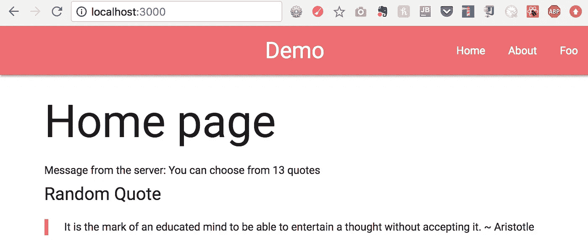
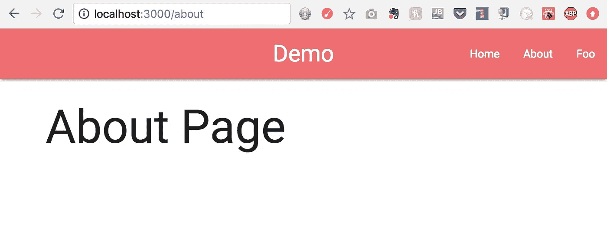
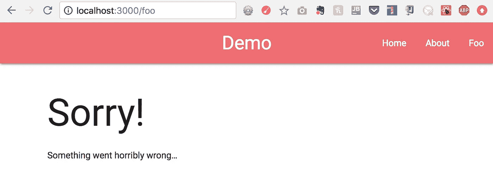
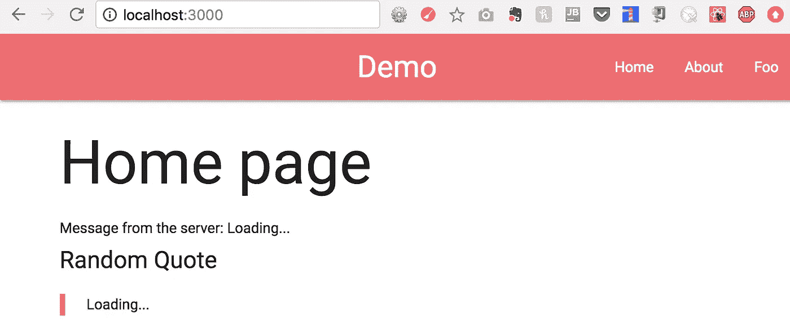

# 在 5 分钟内启动并运行同构 web 应用

> 原文：<https://medium.com/hackernoon/get-an-isomorphic-web-app-up-and-running-in-5-minutes-72da028c15dd>

一个同构的 web 应用程序给你提供了服务器端渲染和单页应用程序(SPA)的优点。

## TL；速度三角形定位法(dead reckoning)

让代码在 localhost 上运行:3000

```
$ git clone [https://github.com/xiaoyunyang/isomorphic-router-demo.git](https://github.com/xiaoyunyang/isomorphic-router-demo.git)
$ cd isomorphic-router-demo
$ npm install
$ npm start
```

这是检查代码的仓库:[https://github.com/xiaoyunyang/isomorphic-router-demo](https://github.com/xiaoyunyang/isomorphic-router-demo)

# 动机

已经有很多文章写了同构 web app 的好处，像[这个](/@ghengeveld/isomorphism-vs-universal-javascript-4b47fb481beb)、[这个](https://writing.pupius.co.uk/beyond-pushstate-building-single-page-applications-4353246f4480)、[这个](/airbnb-engineering/isomorphic-javascript-the-future-of-web-apps-10882b7a2ebc)，还有[这个](https://ponyfoo.com/articles/stop-breaking-the-web)。有一本关于它的书正在写。我喜欢把同构的 web 应用程序想象成 SPA 2.0。它是带有服务器端渲染的 SPA。

SPA 是一个客户端(浏览器渲染)应用程序，在初始加载后启动整个网站。这意味着当你使用浏览器访问 example.com 时，example . com 的服务器会发送一个 HTML 模板和一些 javascript 代码，供你的浏览器执行代码，呈现网页的实际内容。因为创建 DOM 的代码和 DOM 之间的紧密耦合，spa 可以处理复杂的 DOM 操作。

我们都很熟悉 SPA 的特点:对用户输入的快速响应，高度互动的网页(想想 google docs)，以及在页面加载后离线使用的能力。最重要的是，对于像我这样试图用一些虚拟数据快速创建网站原型的初创公司创始人来说，SPA 可以让你独立于服务器应用程序构建网站。在许多情况下，如果您使用一个复杂的前端库，如 [React](https://hackernoon.com/tagged/react) 、亚马逊 S3 来托管，并且将数据存储在一个 CSV 文件中，那么您根本不用构建服务器应用程序。这正是我为[活页](http://looseleafapp.com/)所做的。

当您为您的网站构建 MVP 原型时，这种关注点的分离最初会提高生产率，但是对于部署为 SPA 的网站来说，会有一个收益递减点，该 SPA 通过 API 与服务器进行数据通信。这种方法的主要缺点是:

## **加载时间长(坏 UX)**

因为网站是引导式的，所以页面内容在初始加载后需要一段时间才能显示出来。当您在浏览器中键入 example.com 并按 enter 键时，会出现初始加载。浏览器从初始加载中获得的内容就是服务器发送的内容。

如果服务器发送一个空白的 HTML 模板和 javascript 来呈现模板中的内容，那么用户将会看到一个空白的页面和一个页面加载动画。用户需要等待多长时间才能看到内容，这取决于网页的复杂程度以及移动设备上的互联网服务速度，因此网页加载速度往往会慢得多。

## **糟糕的 SEO(不利于商业)**

搜索引擎和社交分享是获取新用户的两个最重要的手段。

可以把搜索引擎优化(SEO)看作是让谷歌将你的网页在相关查询搜索列表中排名靠前的方法。为了让谷歌对你的网页内容进行排名，它需要知道你的网页上有什么内容。谷歌部署了一大批爬虫，它们只是一些程序，向网页发出请求，查看响应，从 HTML 中删除内容，并查看如何根据相关性在互联网上的其他网页中对该网页进行排名。这些爬虫一般不会运行 JavaScript，也不会等待很长时间让页面自动呈现。如果你的网页在初次加载时给爬虫留下空白页面，那么当在 google.com 上输入相关搜索查询时，谷歌将不会知道你的页面将会准确地把你的网页放在命中列表的较高位置。

同样的事情也发生在社交媒体网站上，比如脸书和 Twitter sharing，他们有自己的爬虫大军，根据 HTML 标题中的 meta 标签来呈现页面预览。当网页在浏览器中引导时，标题在服务器端呈现，并且当内容基于动态加载而改变时不会改变。这意味着，如果你有一个销售书籍的网站和一个 SPA，它使用相同的 HTML 模板为不同的书籍呈现不同的页面，那么当你在脸书上分享某本书的页面链接时，预览将显示关于你的网站的通用预览，它说这是一个销售成千上万本书的地方，但不会显示特定书籍的任何独特信息。[这篇文章](/@cereallarceny/server-side-rendering-with-create-react-app-fiber-react-router-v4-helmet-redux-and-thunk-275cb25ca972)很好地展示了 SPA 在为社交分享生成独特标题的能力方面的局限性，以及如何使用服务器渲染来解决这个问题。

## **纯服务器渲染解决方案怎么样？**

如果你正在读这篇文章，那意味着我已经说服你，简单的水疗不是一个好办法。纯粹的服务器端应用程序也不合适，因为从开发的角度来看，我们希望能够分别构建我们的客户端应用程序和服务器应用程序。从用户体验的角度来看，一旦 SPA 完全加载，用户体验可能会大大超过服务器呈现的网页。此外，我不希望每次单击按钮时都要重新加载整个页面。

因此，纯 SPA 的缺点在于初始负载。纯服务器渲染解决方案的缺点是初始加载后会发生什么。我们怎样做才能两全其美？🤔

# 设置同构的 web 应用程序

客户端渲染和服务器端渲染互为补充。我们可以构建一个同构的 web 应用程序，用 SPA 增强服务器呈现页面的能力。我将要介绍的同构 web app starter 项目利用了 JavaScript 用于构建客户端应用程序和服务器应用程序这一事实。这促进了代码的可重用性，因为我们可以使用相同的代码来呈现 SPA 以及服务器为初始加载发送的 HTML。

所有的代码都包含在这个库中。在本文的剩余部分，我将逐一介绍其中的代码片段。

[](https://github.com/xiaoyunyang/isomorphic-router-demo) [## 杨晓云/同构路由器演示

### 这个项目向你展示了如何使用 React Router 4 和 React Router 4 建立一个同构的 webapp

github.com](https://github.com/xiaoyunyang/isomorphic-router-demo) 

## **堆栈**

这个 starter 项目的栈包括[节点](https://nodejs.org/en/)、 [Express](http://expressjs.com/) 、 [React](https://reactjs.org/) 、 [React Router 4](https://github.com/ReactTraining/react-router) 和 [react-router-config](https://github.com/ReactTraining/react-router/tree/master/packages/react-router-config) ，babel 和 [Webpack 4](/webpack/webpack-4-mode-and-optimization-5423a6bc597a) 。我没有使用任何第三方通用应用中间件或框架，如[React Universal Component](https://github.com/faceyspacey/react-universal-component)或 [Loadable Component](https://github.com/smooth-code/loadable-components) 。

## 文件结构

该项目分为特定于服务器的代码、用于呈现 SPA 的特定于客户端的代码，以及支持服务器和客户端呈现的共享代码。

```
~/isomorphic-router-demo$ tree -l 3 --ignore 'node_modules'/isomorphic-router-demo├── build
|  └── main.bundle.js
├── client
|  └── main.js
├── iso-middleware
|  └── renderRoute.js
├── package.json
├── .babelrc
├── .env
├── server
|  ├── run.js
|  └── server.js
├── shared
|  ├── App.js
|  ├── components
|  |  ├── About.js
|  |  ├── HTML.js
|  |  ├── TopNav.js
|  |  ├── Home.js
|  |  ├── Main.js
|  |  └── NotFound.js
|  └── routes.js
└── webpack.config.js
```

## **共享代码**

共享代码的主要入口点是`<App>`组件:

```
// shared/App.jsimport React from 'react';
import TopNav from './components/TopNav';
import Main from './components/Main';const App = () => (
  <div>
    <TopNav />
    <Main />
  </div>
);export default App;
```

这是一个非常标准的 top React 组件，它使用子组件来呈现不同的页面。

`<TopNav>`使用 React 路由器的`<Link>`组件定义应用导航:

```
// shared/components/TopNav.jsimport React from 'react';
import { Link } from 'react-router-dom';export default () => (
  <nav>
    <div className="nav-wrapper">
      <a href="/" className="brand-logo">Demo</a>
      <ul id="nav-mobile" className="right">
        <li><Link to="/">Home</Link></li>
        <li><Link to="/about">About</Link></li>
        <li><Link to="/foo">Foo</Link></li>
      </ul>
    </div>
  </nav>
);
```

基于路由为哪个页面提供服务的映射包含在`routes.js`中，它被导入到`<Main>`组件中。

```
// shared/routes.js
import Home from './components/Home';
import About from './components/About';
import NotFound from './components/NotFound';const routes = [
  {
    path: '/',
    exact: true,
    component: Home
  },
  {
    path: '/about',
    component: About
  },
  {
    path: '*',
    restricted: false,
    component: NotFound
  }
];export default routes;
```

在`<Main>`组件中，`[react-router-config](https://github.com/ReactTraining/react-router/tree/master/packages/react-router-config)` renderRoutes 函数用于根据`routes`中定义的组件映射路径生成`<Route>`组件。

```
import React from 'react';
import { Switch } from 'react-router-dom';
import { renderRoutes } from 'react-router-config';import routes from '../routes';const Main = () => (
  <Switch>
    {renderRoutes(routes)}
  </Switch>
);export default Main;
```

如`routes`中所定义，您可以呈现的页面有 Home、About 和 NotFound，如下所示:



Home Page



About page



NotFound page

## 服务器渲染

我们的想法是，当我们在浏览器中键入`localhost:3000`并按 enter 键时，我们希望服务器发送主页的 HTML。

我们从安装中间件功能开始，用于将应用程序渲染到服务器应用程序，如下面的`server.js`所示:

```
// server/server.jsimport express from 'express';
import renderRouterMiddleware from '../iso-middleware/renderRoute';// ...app.get('*', renderRouterMiddleware);// ...
```

`renderRouterMiddleware`包含使用`shared`文件夹中的组件创建 HTML 字符串的所有逻辑。

`renderRouterMiddleware`是我们项目中最重要的文件之一，因为它具有使应用程序同构的逻辑。

在很大程度上，代码的服务器端呈现部分是非常样板化的，但是具有 HTML 的服务器端呈现的秘密成分，这使得客户端应用程序在初始加载之后接管成为可能。具体来说，这里为服务器端呈现导入的`<HTML>`组件包含与客户端应用程序的联系。但是在我给你看代码之前，我们需要检查一些其他的东西。

**边注:**另一件值得注意的事情是，对于服务器渲染，我们希望在使用 React 的`renderToString`函数转换一切之前，将我们的`<App>`包装在 React 路由器的`<StaticRouter>`组件中。对于我们接下来将要讨论的客户端渲染，我们想要使用`<BrowserRouter>`。

## 客户端渲染

下面的服务器代码为浏览器提供了呈现 SPA 所需的所有代码:

```
// server/server.js// ...const buildPath = path.join(__dirname, '../', 'build');
app.use('/', express.static(buildPath));
app.use(express.static(__dirname));// ...
```

这段代码告诉服务器从构建文件夹向`localhost:3000/`提供静态资产。

如上面的文件结构所示，在构建文件夹中只有一个文件— `main.bundle.js`。如果你在浏览器中输入`localhost:3000/main.bundle.js`,你会看到一堆 JavaScript，其中包含来自我们的`shared`文件夹的代码，这些代码已经从 ES6 转到了 JavaScript 的早期版本。

`main.bundle.js`是由 Webpack 创建的。在`[package.json](https://github.com/xiaoyunyang/isomorphic-router-demo/blob/master/package.json)`中，脚本已经被设置为在启动服务器之前执行构建，因此`main.bundle.js`在我们每次启动服务器时都会被重新构建。

构建定义在我们的`webpack.config.js`文件中，它将`./client/main.js`定义为构建的条目。

`main.js`而它所使用的一切都被捆绑成`main.bundle.js`。以下是`main.js`的代码:

```
// client/main.jsimport React from 'react';
import ReactDOM from 'react-dom';
import { BrowserRouter } from 'react-router-dom';
import App from '../shared/App';const renderRouter = Component => {
  ReactDOM.hydrate(
    <BrowserRouter>
      <Component />
    </BrowserRouter>, document.getElementById('root')
  );
};renderRouter(App);
```

你可能注意到的第一件事是使用了`ReactDOM.hydrate`而不是`ReactDOM.render`。这是因为我们希望将客户端呈现的应用程序附加到服务器呈现的 HTML 的`root` div。虽然我们使用 React v16 的应用程序将与`ReactDOM.render`一起工作，但 React 会给你一个警告，告诉你:“ *ReactDOM.render()将在 React v17 中停止工作。如果您希望 React 附加到服务器 HTML* ，请用 ReactDOM.hydrate()替换 ReactDOM.render()调用

还记得我之前说过的`<HTML>`组件是服务器端呈现的 HTML 和客户端呈现的应用程序之间的纽带吗？

服务器使用`<HTML>`来呈现初始加载的 HTML，它创建一个`root` div 并在脚本标签中动态加载`main.bundle.js`。**这就是这个同构 app 的工作原理！**

## 运行中的同构应用

使用`npm start`启动应用程序后，在浏览器地址栏中键入`localhost:3000`，按 enter 键，在浏览器标签中页面加载轮旋转一点后，您将看到主页被渲染。

页面加载轮旋转表明服务器已经做了一些工作来传递这个页面给你。如果你点击了导航栏上的**关于**和 **Foo** ，你会看到“关于”页面和“未找到”页面加载，而浏览器标签中没有任何页面加载轮旋转。这告诉您 SPA 模式已经启动，并且正在处理基于点击事件的页面导航。事实上，当您停止服务器时，应用程序甚至可以运行。继续从终端停止服务器，看看您仍然可以像以前一样点击加载页面…但是有一点不同:



Home Page with Server Stopped

您看到的不是来自服务器的消息和随机引用，而是“正在加载”这个词。

这是故意的。我试图让这款应用变得更有趣，每当你通过客户端应用 TopNav 导航到主页，或者直接从服务器加载时，它都会向主页发送一段随机的励志名言。

这也是为了演示现代 web 应用程序中的一种常见设计模式，通过这种模式，页面内容的一部分是在页面通过从 API 的异步获取加载之后加载的。

`<Home>`组件在挂载后立即从两个 API 端点获取一些数据。

```
// shared/components/Home.jsimport React from 'react';
import fetch from 'isomorphic-fetch';class Home extends React.Component {
  constructor(props) {
    super(props);
    this.state = {
      resHello: 'Loading...',
      resQuote: 'Loading...'
    };
  }
  componentDidMount() {
    // Get hello message
    this.callApi('[http://localhost:3000/api/hello'](http://localhost:3000/api/hello'))
      .then(res => this.setState({ resHello: res.express }))
      .catch(err => console.log(err)); // Get random quote
    const rand = Math.random();
    this.callApi(`[http://localhost:3000/api/quote/${rand}`](http://localhost:3000/api/quote/${rand}`))
      .then(res => this.setState({ resQuote: res.express }))
      .catch(err => console.log(err));
    }
    callApi = async function (endpoint) {
      const response = await fetch(endpoint);
      const body = await response.json();

      if (response.status !== 200) throw Error(body.message);
      return body;
  }
  render() {
    console.log('rendering: Home');
    return (
      <div className="container">
        <h1>Home page</h1>
        <h6>
          {`Message from the server: ${this.state.resHello}`}
        </h6>
        <h5>Random Quote</h5>
        <blockquote>
          {this.state.resQuote}
        </blockquote>
      </div>
    );
  }
}export default Home;
```

负责向这些 API 端点交付数据的服务器代码如下所示:

```
// server/server.jsimport apiVersion1 from './api/api1';// ... 
app.use('/api', apiVersion1);// ...
```

还有这里:

```
// server/api/api1.jsimport express from 'express';const api = express.Router();// const quotes = ... too long to write it out hereapi.get('/quote/:rand', (req, res) => {
  const rand = parseFloat(req.params.rand);
  if (Number.isNaN(rand)) {
    res.send({ express: 'Bad request.' });
    return;
  }
  const randomQuote = quotes[randomInd(rand)];
  res.send({ express: `${randomQuote}` });
});module.exports = api;
```

为了简单起见，我将`quotes` JSON 直接硬编码在 api 代码中，但是您可以将引号放在`quotes.json`文件中或存储在数据库中，并使用 express 中间件在使用前获取它们。

# 底线

同构的 web 应用程序支持网页的服务器端渲染和动态渲染。这为开发您的 web 应用程序提供了很大的灵活性，并获得了很好的用户界面以及良好的 SEO 和快速的加载时间。但是权力越大，责任越大。作为 web 开发人员，我们必须决定如何将我们的 web 应用程序划分成更小的同构应用程序、spa 或服务器呈现页面。我们必须决定在浏览器中动态呈现什么，以及只在服务器端做什么，这取决于什么对我们正在构建的应用程序更有意义。

## 感谢阅读！

同样，这是同构启动项目的回购:

```
[https://github.com/xiaoyunyang/isomorphic-router-demo](https://github.com/xiaoyunyang/isomorphic-router-demo.git)
```

我阅读了许多教程来设置这个项目的最新和最大的堆栈。repo 的自述文件中提供了属性。

我希望这篇文章和 starter project 可以帮助更多的人理解一个同构 web app 背后的动机和概念，并开始使用它。