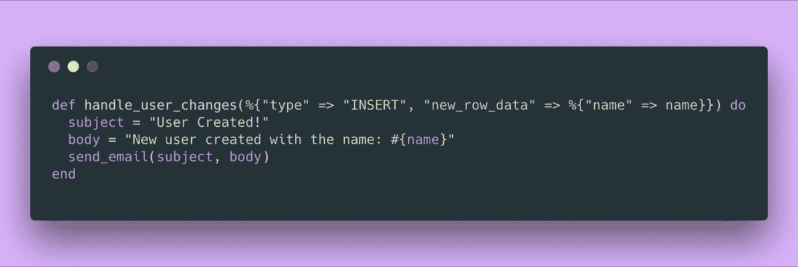
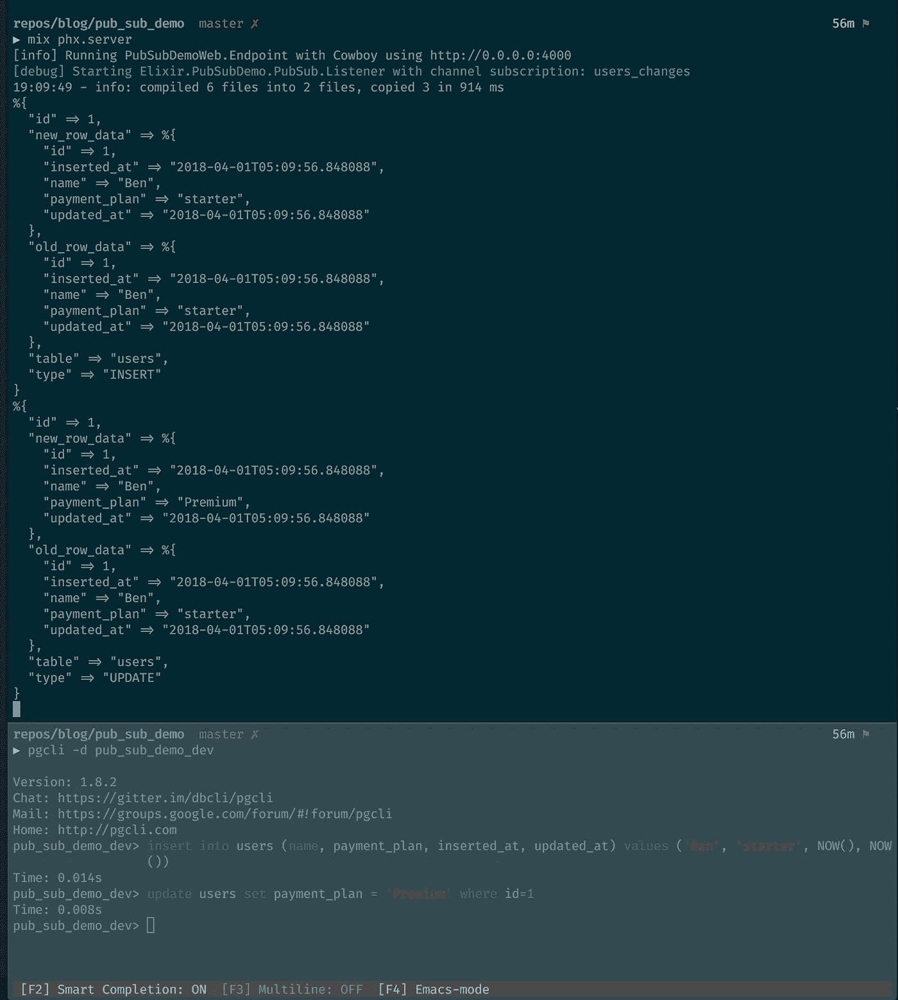
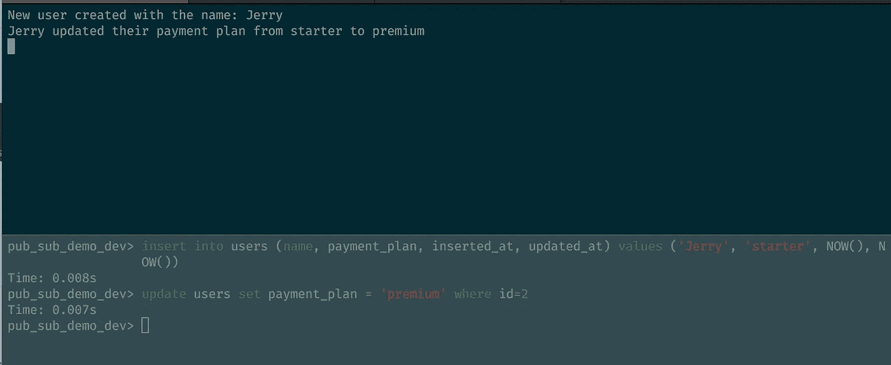
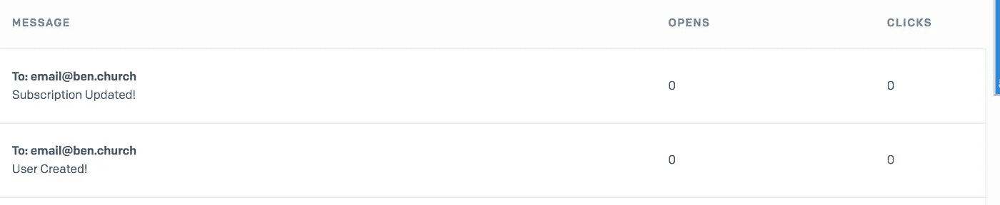

# 使用 Postgres & Phoenix PubSub 自动获得用户注册和计划变更的通知

> 原文：<https://medium.com/hackernoon/get-notified-of-user-signups-and-plan-changes-automatically-using-postgres-phoenix-pubsub-e67d061b04bc>



A look in to the future 🔮

很多时候你需要创建一个系统，它可以根据事件向你自己或其他用户**发送**通知**，特别是与你的数据库中的变化相关的事件。Postgres** 和 **Phoenix** 让这变得简单得可笑。

在这篇简短的**文章结束时，你将拥有:**

1.  设置一个 Phoenix 1.3 项目
2.  在 Postgres 中设置广播功能和触发器
3.  使用 GenServer 监听来自 Postgres 的广播
4.  当用户注册或更改他们的支付计划时，使用 Bamboo 给自己发送电子邮件。

# 获取设置

## 开始之前

请确保您已经安装和/或准备好以下内容:

1.  [仙丹](https://elixir-lang.org/install.html)
2.  [凤凰](https://hexdocs.pm/phoenix/installation.html)
3.  [PostgreSQL](https://www.postgresql.org/download/)
4.  有效的 [SendGrid](http://www.sendgrid.com) 账户

## 初始化项目

让我们创建一个新的 Phoenix 1.3 项目，名为`pub_sub_demo`

```
mix phx.new pub_sub_democd pub_sub_demomix ecto.create
```

## 添加两个附加依赖项

接下来，我们想添加`HTTPoison`来帮助解码从数据库发送的字符串，添加`Bamboo`来帮助我们发送电子邮件。

要在您的`mix.exs`文件中做到这一点，请将以下内容添加到您的`deps`中:

```
{:httpoison, "~> 1.0"},
{:bamboo, "~> 0.8"}
```

此外，更新`extra_applications`部分以包含`:bamboo`

```
extra_applications: [:logger, :runtime_tools, :bamboo]
```

## 创建模型

最后，让我们创建`User`模型，我们将使用它来展示所有这些广播的优点。

```
mix phx.gen.context Accounts User users name:string payment_plan:string
```

*注:我们在一个名为* `*Accounts*` *的新上下文中创建了* `*User*` *。如果您不熟悉上下文，也没什么好怕的，这只是 phoenix 用来对功能进行分组的惯例。它们并不特别，只是一种将功能打包在一起的方式。*

## 踢它！

迁移数据库，获取您的依赖项，然后放手吧！

```
mix ecto.migrate
mix deps.get
mix phx.server
```

*注:您现在应该能够导航到* `*localhost:4000*` *并看到您的应用程序正在运行。尽管出于演示的目的，您不会真正看到任何屏幕。*

# Postgres 的广播变化

这样做的全部目的是让 Postgres 让 ***US*** 知道什么时候事情发生了变化。为此，我们需要设置两件事情:

1.  一个函数，它对一行执行一个动作(`INSERT`、`UPDATE`、`DELETE`)，目的是在数据库之外传播该行。
2.  当特定表上发生操作时调用此函数的触发器。

## 创建外业迁移

```
mix ecto.gen.migration broadcast_users_table_changes
```

## 添加函数和触发器

更新您在上面创建的迁移文件，以包括以下内容

*如果你想更好地理解这里正在发生的事情，看看@kaisersly 的这篇博客文章，它很大程度上是你在这里阅读的灵感来源:*

[*https://medium . com/@ kaisersly/postgrex-notifications-759574 f 5796 e*](/@kaisersly/postgrex-notifications-759574f5796e)

# 倾听变化

现在我们已经有了数据库广播发生在我们的`users`表上的变化，我们需要能够在相同的通道上监听和操作。幸运的是，Postgrex 默认使用`Postgrex.Notifications`来提供这个功能。

要使用它，我们必须创建一个负责监听`Postgrex`并根据消息广播采取行动的`GenServer`。

## 创建我们的 GenServer

创建文件`lib/pub_sub_demo/pub_sub/listener.ex`并用以下内容填充它:

目前，它所做的只是监听所提供的通道，并记录广播到该通道的消息。

接下来，让我们将它配置为一个 Worker，并给它一个它将监听的通道。

## 吸引听众

更新`application.ex`文件，以便它启动我们刚刚用适当的`users_changes`通道定义的`Listener`。

## 看看它的实际效果

现在，您应该能够通过运行以下命令再次启动您的应用程序:

```
mix ecto.migrate
mix phx.server
```

然后，您通过 Postgres 的 CLI 对`users`表所做的任何更改都应该输出到我们的应用程序`stdout`。



# 监听特定的动作

虽然能够看到数据库中发生的 ***一切*** 很好，但我们通常只关心这些变化的一小部分。特别针对本演示:

1.  用户创建的
2.  用户订阅已更新

幸运的是，Elixir 的模式匹配提供了一种非常简单的方法来减少所有的干扰，并准确地专注于您正在寻找的数据的形状。

我们想要做的是更新`handle_info`以将有效载荷发送给一个函数，该函数将匹配重要的事件。

上面只对我们正在寻找的确切事件起作用，并向我们的日志输出特定的消息。其他的都忽略。



# 把它链接到电子邮件服务

标准输出很好，但是在一个正在运行的应用程序中，您不希望为您的业务所关心的事件梳理日志，您希望得到实时通知。

让我们把信息链接到电子邮件提供商，这样当用户注册或升级他们的计划时，我们就能在收件箱里收到通知。

`Bamboo`药剂库和`Send Grid`服务让这变得太容易了。

## 设置竹子

将以下内容添加到您的`config.exs`文件中

*注意:如果您有不同的偏好，Bamboo 提供了比 Send Grid 更多的适配器。*[*https://github.com/thoughtbot/bamboo#adapters*](https://github.com/thoughtbot/bamboo#adapters)

在你的`pub_sub_demo`文件夹中创建一个`mailer.ex`文件

## 从我们的听众发送电子邮件

更新`listener.ex`中的`handle_user_changes`，将我们的日志消息发送到我们自己的电子邮件地址。

# 最后一次运行它

现在，如果您在`users`表中创建和更新了一个用户，您应该会看到电子邮件出现在您的 SendGrid 日志中。



就是这样！

# 结论

直接从数据库广播事件的概念并不新鲜，因此这种类型的功能在任何语言和框架中都可用。

但是！Elixir 和 Phoenix 的核心特性和功能使得使用数据库事件比我在任何其他系统中发现的更容易和更合理。模式匹配和 OTP 原则既简单又强大，我鼓励任何人在可能的情况下深入研究它们。


> 🧞‍这是开源的！你可以在 Github 上找到它
> 
> ❤️:我只写编程和远程工作。如果你在推特上关注我，我不会浪费你的时间。