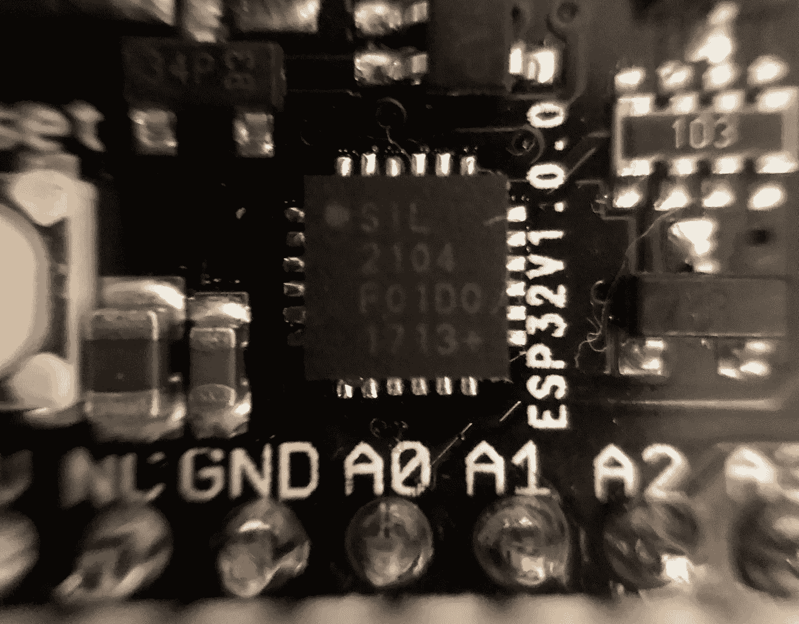
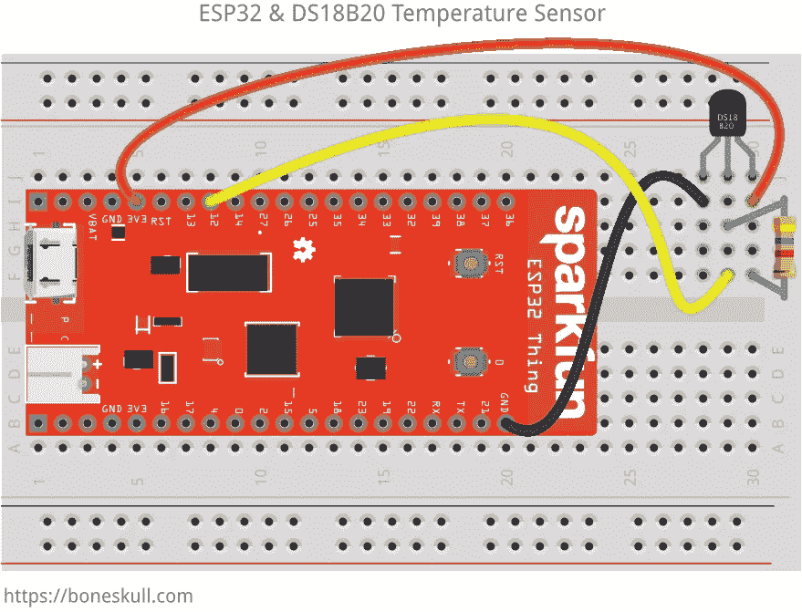

# 在 ESP32 上使用 MicroPython 取得成功

> 原文：<https://medium.com/hackernoon/get-on-the-good-foot-with-micropython-on-the-esp32-decdd32c4720>


Photo by [Regina Valetova](https://unsplash.com/photos/VawUHVxUvJ4?utm_source=unsplash&utm_medium=referral&utm_content=creditCopyText) on [Unsplash](https://unsplash.com/?utm_source=unsplash&utm_medium=referral&utm_content=creditCopyText)

我将向您展示如何在 [Espressif ESP32](https://en.wikipedia.org/wiki/ESP32) 开发板上开始使用 [MicroPython](http://micropython.org/) 。在本教程的第一部分*中，我将向你展示如何:*

*   在 ESP32 上使用 [MicroPython](https://hackernoon.com/tagged/micropython) 开始运行
*   连接到 WiFi
*   将脚本上传到公告板
*   读取环境温度(每个人都喜欢这样，对吗？)

> 在本教程接下来的第二部分中，我将展示如何发布您用 [MQTT](https://en.wikipedia.org/wiki/Mqtt) 收集的数据。

本指南期望您具备:

*   …熟悉命令行
*   …与开发板(如 Arduino)接口的基本经验
*   …对用 [Python](https://en.wikipedia.org/wiki/Python_(programming_language)) 编程的基本理解

如果我掩盖了一些我不应该掩盖的东西，请[告诉我](mailto:boneskull@boneskull.com)！

在我们开始之前，你需要一些东西。

# 物品清单

你需要以下几类东西。

# 五金器具


Not necessarily *this* stuff, but same idea. Photo by [Alexandra Cárdenas](https://flic.kr/p/7b3Bqb)

*   一(1)个 ESP32 开发板，如 [SparkFun ESP32 Thing](https://www.sparkfun.com/products/13907) (任何类型均可；都大致相同)
*   TO-92 包装中的一(1)个 [DS18B20](https://www.maximintegrated.com/en/products/analog/sensors-and-sensor-interface/DS18B20.html) 数字温度计([数据表](https://cdn.sparkfun.com/datasheets/Sensors/Temp/DS18B20.pdf)
*   一(1)个 4.7kꭥ电阻器
*   四(4)根[跳线](https://en.wikipedia.org/wiki/Jump_wire)
*   一(1)个 400 点或更大的试验板
*   一(1)根 USB 微型 B 电缆

*如果您需要在开发板上焊接接头引脚:*这样做。

*如果你有一个 DS18B20“分线板”:*这些通常有内置电阻，所以你不需要它。然而，你*将*需要找出哪个是哪个。

# 软件

你需要下载并安装一些软件。其中一些你可能已经安装了。其他的东西可能需要升级。本指南假设你没有千斤顶深蹲。

> 我很抱歉我没有太多的信息给 Windows 用户！然而，我向你保证，这一切都不是不可能的。

## VCP 司机

如果您运行的是 macOS 或 Windows，您可能需要下载并安装一个虚拟 COM 端口(VCP)驱动程序，如果您还没有这样做的话。通常，这些板上的 USB 转串行芯片是一个 [CP210x](https://www.silabs.com/products/development-tools/software/usb-to-uart-bridge-vcp-drivers) 或[ft 232 rl](http://www.ftdichip.com/Drivers/VCP.htm)；查看特定主板的数据手册，或者看看 USB 端口附近的 ic。

> 较新的 Linux 内核支持这些内置芯片，因此不需要安装驱动程序。

下面是我的一个 ESP32 开发板上的 CP2104 示例:



A SiLabs CP2104\. Thanks, macro lens!

要断言驱动程序正在工作，请将您的开发板插入您的计算机。如果你在 Linux 上，检查`/dev/ttyUSB0`:

```
$ ls -l /dev/ttyUSB0
crw-rw---- 1 root dialout 188, 0 Dec 19 17:04 /dev/ttyUSB0
```

或者 macOS 上的`/dev/tty.SLAB_USBtoUART`:

```
$ ls -l /dev/tty.SLAB_USBtoUART
crw-rw-rw-  1 root  wheel   21,  20 Dec 19 17:10 /dev/tty.SLAB_USBtoUART
```

## 串行终端

一个免费的、跨平台的 GUI 终端是 CoolTerm。Linux 的 macOS 用户可以在命令行中使用`screen`而不受影响。更多专门构建的解决方案包括 Python 3 附带的`miniterm`，可以通过`python3 -m serial.tools.miniterm`和`minicom`启动。

## Python 等。

您还需要:

*   python 3.6 . x 版
*   对于额外的库，[micropython/micropython-lib](https://github.com/micropython/micropython-lib)(`git clone [https://github.com/micropython/micropython-lib](https://github.com/micropython/micropython-lib))`[)](https://github.com/micropython/micropython-lib))的克隆或归档

根据 Python 的安装情况，安装方式会有所不同:

*   为了刷新电路板， [esptool](https://pypi.python.org/pypi/esptool/2.2) (版本 2.2 或更新版本)
*   管理板上的文件， [adafruit-ampy](https://pypi.python.org/pypi/adafruit-ampy/1.0.3)

你可以试试`pip3 install esptool adafruit-ampy`。这在装有自制软件的 macOS 上对我有效；YMMV。如果不使用自制软件，你可能需要在前面加上`sudo`。

## MicroPython 固件

最后，你需要为 ESP32 下载最新的 MicroPython 固件。

现在我们的工具已经准备好了，我们可以开始用 MicroPython 刷新 ESP32 板了。

# 闪烁的 MicroPython &第一步

除非 MicroPython 已经*安装在您的 ESP32 上*，否则您将希望通过 USB 将其连接到您的计算机，并擦除其闪存:

> 在下面的例子中，用适合您系统的设备或 COM 端口替换`/dev/tty.SLAB_USBtoUART`。

```
$ esptool.py --chip esp32 -p /dev/tty.SLAB_USBtoUART erase_flash
esptool.py v2.2
Connecting........___
Chip is ESP32D0WDQ6 (revision 1)
Uploading stub...
Running stub...
Stub running...
Erasing flash (this may take a while)...
Chip erase completed successfully in 4.6s
Hard resetting...
```

现在，我们可以用之前下载的[固件](https://micropython.org/download/#esp32)来刷新它:

```
$ esptool.py --chip esp32 -p /dev/tty.SLAB_USBtoUART write_flash \
  -z 0x1000 ~/Downloads/esp32-20171219-v1.9.2-445-g84035f0f.bin
esptool.py v2.2
Connecting........_
Chip is ESP32D0WDQ6 (revision 1)
Uploading stub...
Running stub...
Stub running...
Configuring flash size...
Auto-detected Flash size: 4MB
Compressed 936288 bytes to 587495...
Wrote 936288 bytes (587495 compressed) at 0x00001000 in 51.7 seconds (effective 144.8 kbit/s)...
Hash of data verified.Leaving...
Hard resetting...
```

> 如果你感到危险，你可以通过使用`--baud`选项来增加闪烁时的波特率。

如果这行得通，您应该能够通过打开端口进入 MicroPython REPL:

```
# 115200 is the baud rate at which the REPL communicates
$ screen /dev/tty.SLAB_USBtoUART 115200>>>
```

恭喜你，`>>>`是你的 REPL 提示。这类似于普通的 Python REPL(例如，不带参数地运行`python3`)。试试`help()`功能:

```
>>> help()
Welcome to MicroPython on the ESP32!For generic online docs please visit http://docs.micropython.org/For access to the hardware use the 'machine' module:import machine
pin12 = machine.Pin(12, machine.Pin.OUT)
pin12.value(1)
pin13 = machine.Pin(13, machine.Pin.IN, machine.Pin.PULL_UP)
print(pin13.value())
i2c = machine.I2C(scl=machine.Pin(21), sda=machine.Pin(22))
i2c.scan()
i2c.writeto(addr, b'1234')
i2c.readfrom(addr, 4)Basic WiFi configuration:import network
sta_if = network.WLAN(network.STA_IF); sta_if.active(True)
sta_if.scan()                             # Scan for available access points
sta_if.connect("<AP_name>", "<password>") # Connect to an AP
sta_if.isconnected()                      # Check for successful connectionControl commands:
  CTRL-A        -- on a blank line, enter raw REPL mode
  CTRL-B        -- on a blank line, enter normal REPL mode
  CTRL-C        -- interrupt a running program
  CTRL-D        -- on a blank line, do a soft reset of the board
  CTRL-E        -- on a blank line, enter paste modeFor further help on a specific object, type help(obj)
For a list of available modules, type help('modules')
```

如果你以前没在单片机上见过这个:*我知道*，疯了吧？

您可以在“基本 WiFi 配置”中键入命令进行连接。您将会看到大量来自 ESP32 的调试信息(您将会看到，这是可以取消的):

```
>>> import network
>>> sta_if = network.WLAN(network.STA_IF)
I (323563) wifi: wifi firmware version: 111e74d
I (323563) wifi: config NVS flash: enabled
I (323563) wifi: config nano formating: disabled
I (323563) system_api: Base MAC address is not set, read default base MAC address from BLK0 of EFUSE
I (323573) system_api: Base MAC address is not set, read default base MAC address from BLK0 of EFUSE
I (323593) wifi: Init dynamic tx buffer num: 32
I (323593) wifi: Init data frame dynamic rx buffer num: 64
I (323593) wifi: Init management frame dynamic rx buffer num: 64
I (323603) wifi: wifi driver task: 3ffe1584, prio:23, stack:4096
I (323603) wifi: Init static rx buffer num: 10
I (323613) wifi: Init dynamic rx buffer num: 0
I (323613) wifi: Init rx ampdu len mblock:7
I (323623) wifi: Init lldesc rx ampdu entry mblock:4
I (323623) wifi: wifi power manager task: 0x3ffe84b0 prio: 21 stack: 2560
W (323633) phy_init: failed to load RF calibration data (0x1102), falling back to full calibration
I (323793) phy: phy_version: 362.0, 61e8d92, Sep  8 2017, 18:48:11, 0, 2
I (323803) wifi: mode : null
>>> sta_if.active(True)
I (328553) wifi: mode : sta (30:ae:a4:27:d4:88)
I (328553) wifi: STA_START
True
>>> sta_if.scan()
I (389423) network: event 1
[(b'SON OF ZOLTAR', b"`\xe3'\xcf\xf4\xf5", 1, -57, 4, False), (b'CenturyLink6105', b'`1\x97%\xd9t', 1, -96, 4, False)]
>>> sta_if.connect('SON OF ZOLTAR', '<REDACTED>')
>>> I (689573) wifi: n:1 0, o:1 0, ap:255 255, sta:1 0, prof:1
I (690133) wifi: state: init -> auth (b0)
I (690133) wifi: state: auth -> assoc (0)
I (690143) wifi: state: assoc -> run (10)
I (690163) wifi: connected with SON OF ZOLTAR, channel 1
I (690173) network: event 4
I (691723) event: sta ip: 10.0.0.26, mask: 255.255.255.0, gw: 10.0.0.1
I (691723) network: GOT_IP
I (693143) wifi: pm start, type:0>>> sta_if.isconnected()
True
```

很酷吧。

现在我们知道我们可以连接到 WiFi，让主板每次通电时都进行连接。

# 创建 MicroPython 模块

为了在启动时执行任务，MicroPython 希望您将代码放在名为`boot.py`的文件中，这是一个 MicroPython 模块。

让我们用从 MicroPython ESP8266 文档的[修改的代码创建`boot.py`，替换指定的位置:](http://docs.micropython.org/en/latest/esp8266/esp8266/tutorial/network_basics.html)

```
def connect():
    import network
    sta_if = network.WLAN(network.STA_IF)
    if not sta_if.isconnected():
        print('connecting to network...')
        sta_if.active(True)
        sta_if.connect('<YOUR WIFI SSID>', '<YOUR WIFI PASS>')
        while not sta_if.isconnected():
            pass
    print('network config:', sta_if.ifconfig())
```

我们还可以创建一个函数来禁用调试输出。附加到`boot.py`:

```
def no_debug():
    import esp
    # this can be run from the REPL as well
    esp.osdebug(None)
```

这些函数将在引导时由*定义*，但不会自动调用。让我们在让它们自动执行之前测试它们。

为此，我们可以上传`boot.py`。您需要关闭与串行端口的连接。如果你使用`screen`，输入`Ctrl-A Ctrl-\`，然后`y`确认；否则断开连接或退出您的终端程序。

# 上传 MicroPython 模块

虽然有其他方法可以做到这一点，但我发现对 ESP32 来说最直接的方法是使用 [ampy](https://github.com/adafruit/ampy) ，这是一个由 [Adafruit](https://adafruit.org/) 开发的通用工具。这是它能做的:

```
$ ampy --helpUsage: ampy [OPTIONS] COMMAND [ARGS]... ampy - Adafruit MicroPython Tool Ampy is a tool to control MicroPython boards over a serial
  connection.  Using ampy you can manipulate files on the board's
  internal filesystem and even run scripts.Options:
  -p, --port PORT  Name of serial port for connected board.  Can
                   optionally specify with AMPY_PORT environemnt
                   variable.  [required]
  -b, --baud BAUD  Baud rate for the serial connection (default
                   115200).  Can optionally specify with AMPY_BAUD
                   environment variable.
  --version        Show the version and exit.
  --help           Show this message and exit.Commands:
  get    Retrieve a file from the board.
  ls     List contents of a directory on the board.
  mkdir  Create a directory on the board.
  put    Put a file or folder and its contents on the...
  reset  Perform soft reset/reboot of the board.
  rm     Remove a file from the board.
  rmdir  Forcefully remove a folder and all its...
  run    Run a script and print its output.
```

MicroPython 将文件(脚本或任何合适的东西)存储在一个非常基本的文件系统中。默认情况下，空的`boot.py`应该已经存在。要列出主板上的文件，请执行:

```
$ ampy -p /dev/tty.SLAB_USBtoUART ls
boot.py
```

使用`get`命令将文件内容回显到您的 shell(如果您愿意，可以通过管道传输到文件):

```
$ ampy -p /dev/tty.SLAB_USBtoUART get boot.py
# This file is executed on every boot (including wake-boot from deepsleep)
```

我们可以用自己的`boot.py`覆盖它:

```
$ ampy -p /dev/tty.SLAB_USBtoUART put boot.py
```

并检索它以查看它是否覆盖了默认的`boot.py`:

```
$ ampy -p /dev/tty.SLAB_USBtoUART get boot.py
def connect():
    import network
    sta_if = network.WLAN(network.STA_IF)
    if not sta_if.isconnected():
        print('connecting to network...')
        sta_if.active(True)
        sta_if.connect('<YOUR WIFI SSID>', '<YOUR WIFI PASS>')
        while not sta_if.isconnected():
            pass
    print('network config:', sta_if.ifconfig())def no_debug():
    import esp
    # this can be run from the REPL as well
    esp.osdebug(None)
```

成功！这就是用`ampy`上传文件的要领。你也可以上传整个文件夹，我们稍后会看到。

从这里，我们可以再次打开 REPL，并运行我们的代码。不需要重启主板！

# 运行 MicroPython 模块

**在下面的例子中，为了便于复制&粘贴，我将从 REPL 的代码运行中删除命令提示符(** `**>>>**` **)。**

重新连接到 REPL。

```
$ screen /dev/tty.SLAB_USBtoUART 115200
```

首先，我们将断开 WiFi 连接:

```
import network
sta_if = network.WLAN(network.STA_IF)
sta_if.disconnect()
```

调试输出如下:

```
I (3299583) wifi: state: run -> init (0)
I (3299583) wifi: n:1 0, o:1 0, ap:255 255, sta:1 0, prof:1
I (3299583) wifi: pm stop, total sleep time: 0/-1688526567
I (3299583) wifi: STA_DISCONNECTED, reason:8
```

然后，我们可以`import`这个`boot`模块。这将使我们的`connect`和`no_debug`功能可用。

```
import boot
connect()
```

输出:

```
connecting to network...
I (87841) wifi: n:1 0, o:1 0, ap:255 255, sta:1 0, prof:1
I (88401) wifi: state: init -> auth (b0)
I (88401) wifi: state: auth -> assoc (0)
I (88411) wifi: state: assoc -> run (10)
I (88441) wifi: connected with SON OF ZOLTAR, channel 1
I (88441) network: event 4
I (90081) event: sta ip: 10.0.0.26, mask: 255.255.255.0, gw: 10.0.0.1
I (90081) network: GOT_IP
network config: ('10.0.0.26', '255.255.255.0', '10.0.0.1', '10.0.0.1')
I (91411) wifi: pm start, type:0
```

超级棒。让我们安静下来，再试一次:

```
no_debug()
sta_if.disconnect()
connect()
```

输出:

```
connecting to network...
network config: ('10.0.0.26', '255.255.255.0', '10.0.0.1', '10.0.0.1')
```

LGTM。

> 上述 IP 地址取决于您的本地网络配置，可能会有所不同。

从端口断开(如果使用`screen` : `Ctrl-A Ctrl-\`，`y`)，并将这些行附加到`boot.py`:

```
no_debug()
connect()
```

通过`ampy put boot.py`再次上传，将会覆盖现有的`boot.py`。硬重置(“按下按钮”)或重启主板。重新连接到 REPL，并执行`connect()`以断言连通性:

```
connect()
```

输出:

```
network config: ('10.0.0.26', '255.255.255.0', '10.0.0.1', '10.0.0.1')
```

你会注意到“连接到网络…”没有打印到控制台；如果已经连接，`connect()`功能打印配置并返回。如果您已经做到这一步，那么您的主板在启动时成功连接到 Wifi。干得好！

我们现在还有两个项目要核对，除非你忘了我们要做什么:

1.  我们需要每隔一段时间读取环境温度。
2.  我们需要将这些信息发布给一个 MQTT 代理。

接下来，我们将剔除温度读数。

# MicroPython 中的温度读数

当我们编写代码时，我们可以使用 REPL 来进行实验。

我用的是这里的例子。您需要导入三(3)个模块，`machine`、`onewire`和`ds18x20`(注意`x`):

```
import machine, onewire, ds18x20
```

我已经将我的传感器连接到我的 ESP32 上的第 12 针。你的试验板应该看起来像这样:



Example breadboard wiring for ESP32 dev board and DS18B20

为了读取温度，我们将创建一个类似[套娃](https://en.wikipedia.org/wiki/Matryoshka_doll)的对象，方法是将一个`Pin`实例传递给一个`OneWire`构造函数(阅读关于[单线](https://en.wikipedia.org/wiki/1-Wire)的内容)并最终传递给一个`DS18X20`构造函数:

```
pin = machine.Pin(12)
wire = onewire.OneWire(pin)
ds = ds18x20.DS18X20(wire)
```

> 请注意，如果以下命令的输出是一个空列表(`[]`)，则无法找到传感器。检查你的线路！

现在，我们可以让`ds`扫描连接的设备，并返回它们的地址:

```
ds.scan()
```

输出:

```
[bytearray(b'(\xee3\x0c"\x15\x004')]
```

`ds.scan()`以`bytearray`格式返回设备地址的`list`。你的可能看起来略有不同。因为我们只有一个，所以我们可以将它的地址保存到一个变量中。为了读取温度数据，我们通过`ds.convert_temp()`告诉 1 线总线复位，暂停 750 毫秒(如果你正在粘贴这个):

```
import time
addr = ds.scan().pop()
ds.convert_temp()
time.sleep_ms(750)
temp = ds.read_temp(addr)
temp
```

输出:

```
19.875
```

这个读数是摄氏度。如果你和我一样，你不会说摄氏，所以也许你想把它转换成华氏:

```
(temp * 1.8) + 32
```

输出:

```
67.775
```

…这正是我所期望的！

让我们利用我们所做的创建一个新文件，`temperature.py`:

```
import time
from machine import Pin
from onewire import OneWire
from ds18x20 import DS18X20 class TemperatureSensor:
    """
    Represents a Temperature sensor
    """
    def __init__(self, pin):
        """
        Finds address of single DS18B20 on bus specified by `pin`
        :param pin: 1-Wire bus pin
        :type pin: int
        """
        self.ds = DS18X20(OneWire(Pin(pin)))
        addrs = self.ds.scan()
        if not addrs:
            raise Exception('no DS18B20 found at bus on pin %d' % pin)
        # save what should be the only address found
        self.addr = addrs.pop() def read_temp(self, fahrenheit=True):
        """
        Reads temperature from a single DS18X20
        :param fahrenheit: Whether or not to return value in Fahrenheit
        :type fahrenheit: bool
        :return: Temperature
        :rtype: float
        """
        self.ds.convert_temp()
        time.sleep_ms(750)
        temp = self.ds.read_temp(self.addr)
        if fahrenheit:
            return self.c_to_f(temp)
        return temp @staticmethod
    def c_to_f(c):
        """
        Converts Celsius to Fahrenheit
        :param c: Temperature in Celsius
        :type c: float
        :return: Temperature in Fahrenheit
        :rtype: float
        """
        return (c * 1.8) + 32
```

断开与 REPL 的连接。通过`ampy`上传`temperature.py`:

```
$ ampy -p /dev/tty.SLAB_USBtoUART put temperature.py
```

然后我们可以再次打开我们的 REPL，并尝试它:

```
from temperature import TemperatureSensor
t = TemperatureSensor(12)
t.read_temp() # use t.read_temp(False) to return Celsius
```

似乎变暖了一点。输出:

```
68.7875
```

干得好！

# 第一部分的结论(1)

在本教程的第一部分，我们学习了如何:

1.  使用 MicroPython 刷新 ESP32 开发板
2.  使用 MicroPython 的 REPL 进行实验
3.  将 ESP32 连接到 WiFi
4.  上传和执行 MicroPython 脚本
5.  用单线 DS18B20 传感器读取温度

在本教程接下来的第二部分中，我们将了解 MQTT，如何将我们的温度数据发布到 MQTT 代理，以及如何与基于 MQTT 的云“物联网平台”进行交互。

*本文* [*原载*](https://boneskull.com/micropython-on-esp32-part-1/)*2018 年 1 月 8 日*[*【boneskull.com】*](https://boneskull.com)*。*