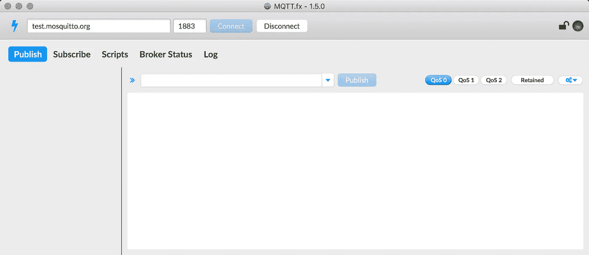
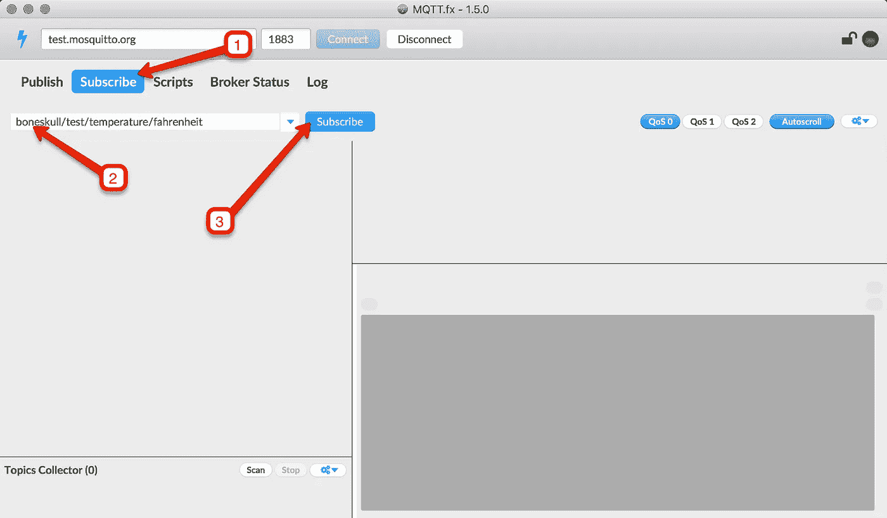
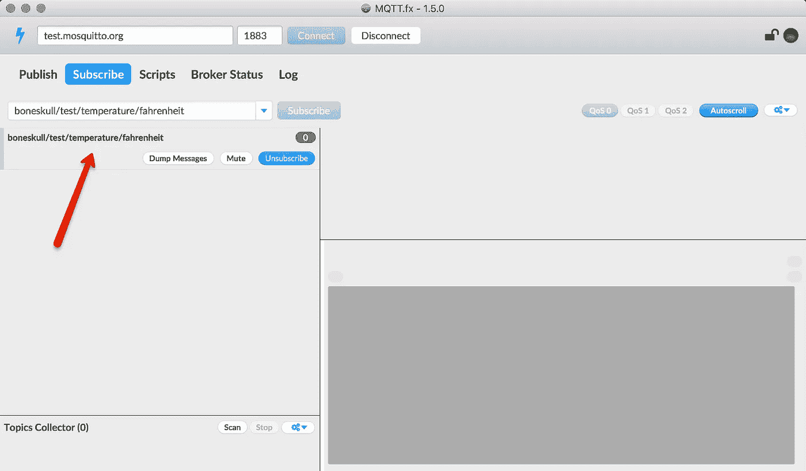
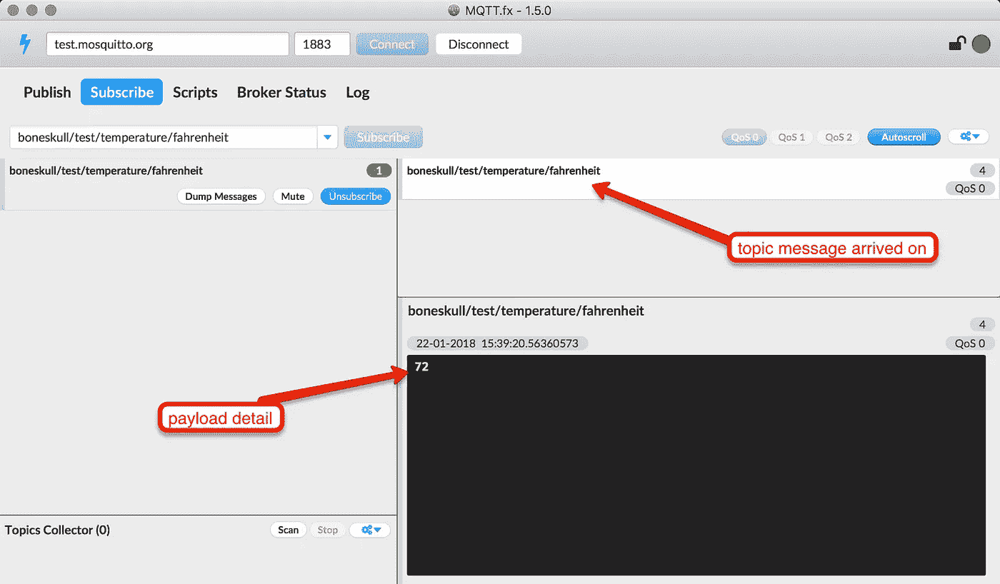
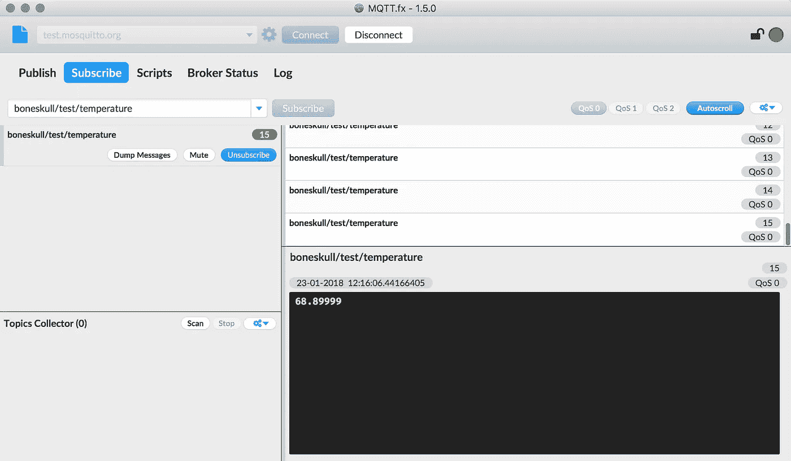
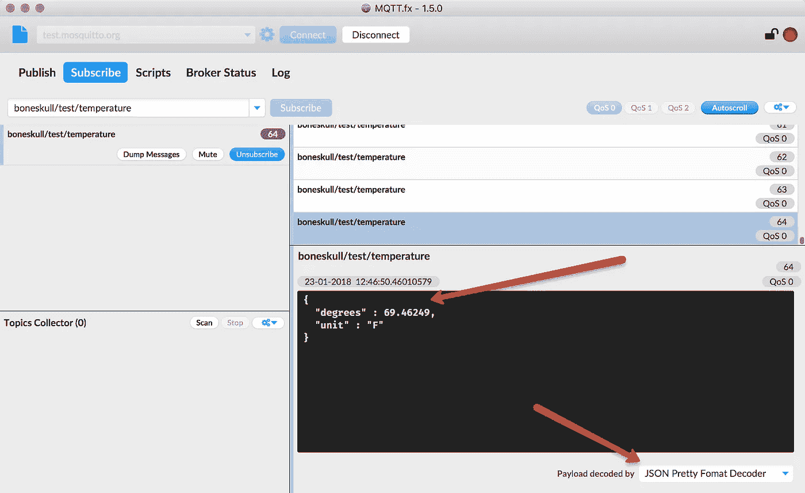
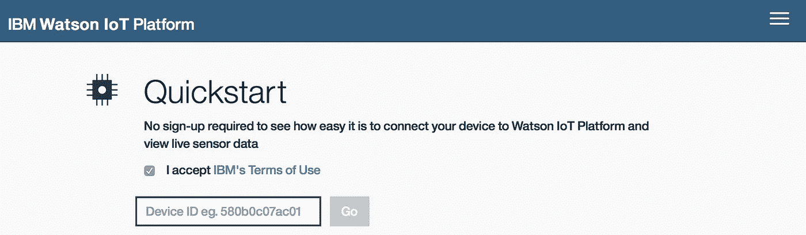
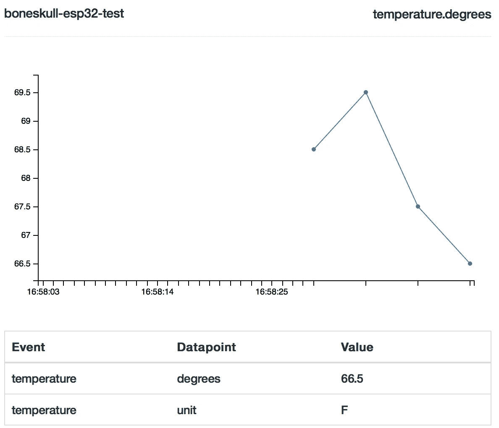

# 使用 MicroPython 获得良好的开端，第 2 部分

> 原文：<https://medium.com/hackernoon/get-on-the-good-foot-with-micropython-part-2-e1f2efaad50b>


Photo by [Jeremy Hockin](https://www.flickr.com/photos/jhoc/)

[在这个折磨人的教程的第一部分](https://hackernoon.com/get-on-the-good-foot-with-micropython-on-the-esp32-decdd32c4720)中，我教读者如何在基于 ESP32 的开发板上开始使用 [MicroPython](https://hackernoon.com/tagged/micropython) 。我们:

1.  闪了一下黑板
2.  在 REPL 嬉戏
3.  已配置的 WiFi
4.  上传的脚本
5.  使用 DS18B20 单线温度传感器构建电路
6.  使用 MicroPython 读取温度

在教程的*这一*部分，我们将利用传感器收集数据，并通过 [MQTT](https://hackernoon.com/tagged/mqtt) 发布。

如果您对这个概念不熟悉，我将尝试简单地解释 MQTT。

# 简单地说，MQTT

[MQTT](https://en.wikipedia.org/wiki/MQTT) 是一个用于发布和订阅消息的机器对机器*协议*。重要的是，MQTT 对这些消息的内容和结构都没有限制。

在典型的设置中，您有一个 MQTT *代理*和一个或多个 MQTT *客户机*。客户端可以发布消息、订阅消息或两者兼而有之。客户端不必是物联网设备、web 应用、桌面或移动应用、微服务或任何特定的东西，只要它能说 MQTT。

所有客户端都连接到代理。代理负责接收发布的消息，并(可能)将它们传递给感兴趣的客户。

每条消息都有一个“主题”。对于发布/订阅模式来说至关重要的是，消息的发布者*不一定关心*是否有人在监听。感兴趣的客户将*订阅*这个话题。

# MQTT 示例

您有一个 MQTT 客户机——可能是一个带有温度传感器的设备——叫做`bob`,它想要发布温度数据。它可以发布诸如`bob/sensor/temperature`的主题，并且消息将是数据，例如`68.75`。

另一个 MQTT 客户机`ray`可能想要监听温度数据，这样我们就可以在仪表板上将它显示为时间序列图；`ray`会告诉经纪人它希望订阅`bob/sensor/temperature`主题。最后，当`bob`发布这个话题时，代理通知`ray`，然后`ray`收到消息。然后可以对其数据做任何需要做的事情。

# 通配符

订阅支持*通配符*。如果客户端`bob`有另一个报告相对湿度的传感器，它可以在主题`bob/sensor/humidity`下发布该数据。客户端`ray`可以使用一个*单级通配符*，比如`bob/sensor/+`，它将接收在`bob/sensor/humidity` *和* `bob/sensor/temperature`发布的消息。或者可能是一个*多级通配符*，比如`bob/#`，它将订阅*任何以`bob/`开头的*主题。

> 对于我们的例子来说,“每个客户一个主题”仅仅是一个约定。MQTT 没有强制这样的约束。

当然，除了以上这些，还有更多——但这是事实，我称之为好。


Photo by [Caleb Martin](https://unsplash.com/@cmart10?utm_source=ghost&utm_medium=referral&utm_campaign=api-credit) / [Unsplash](https://unsplash.com/?utm_source=ghost&utm_medium=referral&utm_campaign=api-credit)

# 为什么选择 MQTT？

理解*为什么*你想要使用一种技术而不是另一种(或者根本不使用)同样重要。

MQTT 的设计者考虑的是资源受限的设备(比如传感器)；这是一个“瘦”协议，比 HTTP 更容易实现。因此，你会发现 MQTT 是许多基于云的“物联网平台”背后的核心技术，包括 [IBM](https://internetofthings.ibmcloud.com/#/) 、[亚马逊](https://aws.amazon.com/iot/)、[微软](https://azure.microsoft.com/en-us/services/iot-hub/)、 [Adafruit](https://io.adafruit.com/) 以及许多其他产品。

你*可以*通过[RESTful](https://en.wikipedia.org/wiki/Representational_state_transfer)API 直接访问这些服务，但是这样做必然会消耗更多的设备资源。

> 如果您需要进行[远程过程调用](https://en.wikipedia.org/wiki/Remote_procedure_call)，或者如果[请求/响应](https://en.wikipedia.org/wiki/Request%E2%80%93response)模型在您的问题域中比 MQTT 的发布/订阅模型更自然，那么使用 HTTP(S)代替 MQTT 是有意义的。即便如此，像 CoAP 这样的协议也需要更少的资源。

现在我们已经了解了 MQTT 的全部(或者更准确地说，“部分”)内容，让我们用它来传播我们的环境温度。

# 引导脚本和温度模块

我们将使用上一篇教程中的代码开始。作为参考，我将在下面展示它们。

您应该有两(2)个文件，第一个是我们的启动脚本，`boot.py`:

```
def connect():
    import network
    sta_if = network.WLAN(network.STA_IF)
    if not sta_if.isconnected():
        print('connecting to network...')
        sta_if.active(True)
        sta_if.connect('<YOUR SSID>', '<YOUR PASSWORD>')
        while not sta_if.isconnected():
            pass
    print('network config:', sta_if.ifconfig())def no_debug():
    import esp
    # you can run this from the REPL as well
    esp.osdebug(None)no_debug()
connect()
```

第二个是`temperature.py`，围绕温度传感器的抽象概念:

```
import time
from machine import Pin
from onewire import OneWire
from ds18x20 import DS18X20 class TemperatureSensor:
    """
    Represents a Temperature sensor
    """
    def __init__(self, pin):
        """
        Finds address of single DS18B20 on bus specified by `pin`
        :param pin: 1-Wire bus pin
        :type pin: int
        """
        self.ds = DS18X20(OneWire(Pin(pin)))
        addrs = self.ds.scan()
        if not addrs:
            raise Exception('no DS18B20 found at bus on pin %d' 
                             % pin)
        # save what should be the only address found
        self.addr = addrs.pop() def read_temp(self, fahrenheit=True):
        """
        Reads temperature from a single DS18X20
        :param fahrenheit: Whether or not to return value in
                           Fahrenheit
        :type fahrenheit: bool
        :return: Temperature
        :rtype: float
        """ self.ds.convert_temp()
        time.sleep_ms(750)
        temp = self.ds.read_temp(self.addr)
        if fahrenheit:
            return self.c_to_f(temp)
        return temp @staticmethod
    def c_to_f(c):
        """
        Converts Celsius to Fahrenheit
        :param c: Temperature in Celsius
        :type c: float
        :return: Temperature in Fahrenheit
        :rtype: float
        """
        return (c * 1.8) + 32
```

通过`ampy`上传这两个文件:

```
$ ampy --port /dev/tty.SLAB_USBtoUART put boot.py && \
  ampy --port /dev/tty.SLAB_USBtoUART put temperature.py
```

(用您的设备路径或 COM 端口替换`/dev/tty.SLAB_USBtoUART`。)

在本教程的第一部分，我告诉你下载(或克隆)micropython-lib 项目。这个没必要！请继续阅读。

# 通过`upip`安装 MQTT 模块

既然你的设备应该在线，我们可以使用 REPL 的`upip`。`upip`是一个精简的 MicroPython 包管理器。它内置在 MicroPython 的 ESP32 端口中；你已经有了。它从 [PyPi](https://pypi.org/) 下载包，就像`pip`一样。

打开你的 REPL，执行:

```
import upip
upip.install('micropython-umqtt.robust')
```

样本输出:

```
Installing to: /lib/
Warning: pypi.python.org SSL certificate is not validated
Installing micropython-umqtt.robust 1.0 from [https://pypi.python.org/packages/31/02/7268a19a5054cff8ff4cbbb126f00f098848dbe8f402caf083295a3a6a11/micropython-umqtt.robust-1.0.tar.gz](https://pypi.python.org/packages/31/02/7268a19a5054cff8ff4cbbb126f00f098848dbe8f402caf083295a3a6a11/micropython-umqtt.robust-1.0.tar.gz)
```

> 请注意:如果您的设备不在线，`upip`将无法从设备的 REPL 工作。

你还需要抓住它的依赖关系，`micropython-umqtt.simple`:

```
upip.install('micropython-umqtt.robust')
```

样本输出:

```
Installing to: /lib/
Installing micropython-umqtt.simple 1.3.4 from [https://pypi.python.org/packages/bd/cf/697e3418b2f44222b3e848078b1e33ee76aedca9b6c2430ca1b1aec1ce1d/micropython-umqtt.simple-1.3.4.tar.gz](https://pypi.python.org/packages/bd/cf/697e3418b2f44222b3e848078b1e33ee76aedca9b6c2430ca1b1aec1ce1d/micropython-umqtt.simple-1.3.4.tar.gz)
```

> `umqtt.simple`是一个准系统 MQTT 客户机。`umqtt.robust`依赖`umqtt.simple`；这是一个 MQTT 客户机，如果发生连接断开，它会自动重新连接到代理。

要验证安装是否正确，您可以从您的 REPL 执行:

```
from umqtt.robust import MQTTClient
```

没有错误？你很棒。

# 获取 MQTT 客户端应用程序

在我们开始下一节之前，您可能希望手边有另一个应用程序——一个独立的 MQTT 客户机。你可以试试:

*   [mqtt . FX](http://mqttfx.org/)(GUI；Windows/Mac)
*   [MQTTBox](http://workswithweb.com/mqttbox.html)(GUI；Windows/Mac/Linux)
*   `mosquitto-clients`从[mosquitt 到](https://mosquitto.org/)可通过软件包管理器(CLILinux/Mac)
*   应用商店(iOS/Android)上的各种免费客户端
*   [Node-RED](https://nodered.org/) 也可以连接到 MQTT 代理(WebWindows/Mac/Linux)

严格来说，使用一个并不是必要的，但是会有助于实验。

# 在 REPL 做实验

如果你一直在仔细阅读，你会明白我们需要一个 MQTT *代理*(“服务器”)；没有代理的 MQTT 客户机是没有用的。

恰好 *public* MQTT 经纪人存在；Mosquitto 项目就是这样一个经纪人。作为大众的一员，可以用！请注意:**您在公共 MQTT 代理上发布的任何数据或信息也是*公共的***。不要发表任何你不想让所有人都知道的东西。

出于本教程的目的，我们将使用这个公共代理，但是如果您希望使用不同的代理，您可以继续这样做。

现在，让我们尝试使用 MQTT 库在代理上发布消息。

# 创建唯一的“客户 ID”

关于 MQTT 有一点需要注意:每个连接到代理的 MQTT 客户机必须有一个惟一的标识符:一个*客户机 ID* 。你需要选择一个短语或生成一些东西。我将在命令行中生成一个:

```
$ python3 -c 'from uuid import uuid4; print(uuid4())'
52dc166c-2de7-43c1-88ff-f80211c7a8f6
```

将结果值复制到剪贴板；你马上就会需要它。

# 连接到 REPL

打开到您的 ESP32 的串行连接。这里我要用`miniterm`，Python 3 捆绑了哪些:

```
$ python3 -m serial.tools.miniterm --raw /dev/tty.SLAB_USBtoUART 115200
```

`--raw`标志避免了特殊字符如`BS`和`DEL`的问题。

# 连接到代理

> 和第一个教程一样，在使用 REPL 时，我将省略提示(`>>>`)。

我们现在应该能够导入`MQTTClient`:

```
from umqtt.simple import MQTTClient
```

`MQTTClient`构造函数接受 MQTT 代理的客户机 ID 和 DNS 或 IP 地址。我们将使用上面的伪随机客户端 ID，并将`test.mosquitto.org`用于服务器，然后调用`connect()`:

```
client = MQTTClient('52dc166c-2de7-43c1-88ff-f80211c7a8f6', 
		'test.mosquitto.org')
client.connect()
```

如果一切顺利，这个命令的输出应该是`0`；`connect()`如果连接失败，将引发异常。

# 连接第二台客户机

至此，我要火起来[mqtt . FX](http://mqttfx.org/)；我将用它来订阅 ESP32 发布的消息。

我在服务器输入字段中输入 server `test.mosquitto.org`，并保留端口字段`1883`，这是默认的(不安全的)MQTT 端口。然后我点击“连接”，等待协商。这是我连接的客户端的屏幕截图:



MQTT.fx connected to `test.mosquitto.org`.

在我们学会从 REPL 发布之后，我将回到 MQTT.fx。

# 发布 MQTT 消息

假设 ESP32 现在已经连接到代理，您就可以发布消息了。首先，我将发射一个华氏温度，题目是`boneskull/test/temperature/fahrenheit`:

```
client.publish('boneskull/test/temperature/fahrenheit', 72)
```

…但是 MicroPython 抱怨道:

```
Traceback (most recent call last):
  File "<stdin>", line 1, in <module>
  File "umqtt/simple.py", line 112, in publish
TypeError: object of type 'int' has no len()
```

这里有什么问题？让我解释一下:

1.  MQTT 消息负载可以是*字面上的任何数据。MQTT 没有“数据类型”的概念。它不知道什么是“数”或“整数”。您的有效负载将总是由*原始字节*组成。*
2.  没有整数到“字节”的直接映射，因为没有*只有一种方式*将这个数字编码为二进制数据。我们不知道这是一个*有符号的*还是*无符号的*整数，应该用多少位等等。
3.  这个问题本来是显而易见的(我们可以使用 RTFM)，但是由于资源限制，MicroPython 避开了过于“友好”的 API，所以这里发生了什么并不明显。

最简单的解决方法？改为发布一个`str`:

```
client.publish('boneskull/test/temperature/fahrenheit', '72')
```

如果这样做了，语句应该没有输出。

万岁。我不相信——你相信吗？这只是把温度喷到了以太里！我们应该*看看*这些消息将走向何方。我可以在我的 MQTT.fx 客户端上通过*订阅*这个主题来实现。这是怎么回事:



Subscribing to a topic in MQTT.fx

1.  点击“订阅”选项卡
2.  在输入框中输入`boneskull/test/temperature/fahrenheit`
3.  点击输入字段右侧的“订阅”按钮

完成此操作后，MQTT.fx 将联系代理，如果成功，您将看到订阅出现在输入字段下方:



An active subscription in MQTT.fx

下次我们(或任何附属于代理的客户)发布这个主题时，我们会在这个窗口的右下区域看到它，它是灰色的，是空的。

返回到您的串行终端，再次运行最后一个命令(您可以点击“向上箭头”，然后“回车”):

```
client.publish('boneskull/test/temperature/fahrenheit', '72')
```

切换回 MQTT.fx。根据代理的繁忙程度，这可能需要几秒钟的时间，但是现在消息应该出现在右侧，同时显示其有效负载:



A received message in MQTT.fx

干得好！

现在我们可以利用我们所学的一切，定期发布*真实的*温度数据。让我们设计一个小模块来做这件事。

# 发布温度的模块

我写了一个小模块，它使用`MQTTClient`和`TemperatureSensor`(来自我们的第一个教程)来发布温度数据。

创建`temperature_client.py`:

```
import timefrom umqtt.robust import MQTTClientfrom temperature import TemperatureSensor class TemperatureClient:
    """
    Represents an MQTT client which publishes temperature data on an
    interval
    """ def __init__(self, client_id, server, pin, fahrenheit=True, 
                 topic=None, **kwargs):
        """
        Instantiates a TemperatureSensor and MQTTClient; connects
        to the MQTT broker.
        Arguments `server` and `client_id` are required. :param client_id: Unique MQTT client ID
        :type client_id: str
        :param server: MQTT broker domain name / IP
        :type server: str
        :param pin: 1-Wire bus pin
        :type pin: int
        :param fahrenheit: Whether or not to publish temperature 
                           in Fahrenheit
        :type fahrenheit: bool
        :param topic: Topic to publish temperature on
        :type topic: str
        :param kwargs: Arguments for MQTTClient constructor
        """
        self.sensor = TemperatureSensor(pin)
        self.client = MQTTClient(client_id, server, **kwargs)
        if not topic:
            self.topic = 'devices/%s/temperature/degrees' % \
                         self.client.client_id
        else:
            self.topic = topic
        self.fahrenheit = bool(fahrenheit) self.client.connect() def publishTemperature(self):
        """
        Reads the current temperature and publishes it on the 
        configured topic.
        """
        t = self.sensor.read_temp(self.fahrenheit)
        self.client.publish(self.topic, str(t)) def start(self, interval=60):
        """
        Begins to publish temperature data on an interval (in 
        seconds). This function will not exit! Consider using deep 
        sleep instead.        
        :param interval: How often to publish temperature data (60s 
                         default)
        :type interval: int
        """
        while True:
            self.publishTemperature()
            time.sleep(interval)
```

将此上传到您的论坛:

```
$ ampy --port /dev/tty.SLAB_USBtoUART put temperature_client.py
```

您的独立 MQTT 客户端应用程序应该仍然在线。让我们在 REPL 中发送一条消息，然后在独立客户端中查看结果(请在下面创建您自己的客户端 ID):

```
from temperature_client import TemperatureClient
tc = TemperatureClient('boneskull-test-1516667340',
                       'test.mosquitto.org', 12, 
                       topic='boneskull/test/temperature')
tc.start(10) # publish temperature every 10s
```

一个警告:一旦执行了上面的代码，REPL 就会“挂起”，因为`start()`方法只是[忙等待](https://en.wikipedia.org/wiki/Busy_waiting)。

> 即使这是一个忙等待，`time.sleep()`并不意味着“什么都没发生”；[底层操作系统](https://github.com/espressif/esp-idf)中的节拍率为 10ms 任何小于等于 10ms 的睡眠时间(必须使用`time.sleep_ms()`或`time.sleep_us()`)都会抢占其他任务！

返回 MQTT.fx:



Real temperature data in MQTT.fx!

这将无限循环，所以当准备好的时候，按下开发板上的“reset”按钮回到 REPL(你*不需要*预先退出你的串行终端)。

> 重要注意事项:您在有效负载细节中看到的“时间和日期”并不意味着“发起客户端发送消息的时间”相反，它意味着“当接收客户端收到消息时”MQTT 消息不包含“发送时间”时间戳，除非您自己添加一个！
> 
> (为此，您需要询问一个 [NTP](https://en.wikipedia.org/wiki/Network_Time_Protocol) 服务器或一个外部 [RTC](https://en.wikipedia.org/wiki/Real-time_clock) 模块，这超出了我们的范围。)

我们成功发布了一个数字！这是个好消息，除了，这个数字可以指任何东西。在有效载荷中包含单位(华氏或摄氏)会很有帮助。我会告诉你怎么做。

# 使用 JSON

正如我被*打死*的那样，MQTT 有效载荷包含任何东西。这意味着如果你想发送一些结构化数据，*你*负责序列化和反序列化。

[JSON](https://en.wikipedia.org/wiki/Json) 是一种通用的数据交换格式，MicroPython 包含对它的内置支持(不像那种卑鄙的 Arduino API)。“字符串化”一个`dict`并发布结果是微不足道的。

为了使用 JSON——就像在真正的 Python 中一样——我们需要在`temperature_client.py`中导入另一个模块:

```
import json
```

然后，在`publishTemperature`方法中将数据添加到有效载荷中:

```
def publishTemperature(self):
        """
        Reads the current temperature and publishes a JSON payload on the
        configured topic, e.g., `{"unit": "F", "degrees": 72.5}`
        """
        t = self.sensor.read_temp(self.fahrenheit)
        payload = dict(degrees=t)
        if self.fahrenheit:
            payload['unit'] = 'F'
        else:
            payload['unit'] = 'C'
        self.client.publish(self.topic, json.dumps(payload))
```

注意，为了发布，我们不需要将温度(“度”)强制转换成一个`str`，因为 JSON 本身就是一个`str`——这个有效载荷的接收者将把 JSON 解码成一个数值。

断开 REPL(如果你碰巧在用`miniterm`，那就是`Ctrl-]`，再次上传`temperate_client.py`到 ESP32，然后重新连接到 REPL。我们不需要开始一个无限循环来测试它，因为我们可以直接调用`publishTemperature()`:

```
from temperature_client import TemperatureClient
tc = TemperatureClient('boneskull-test-1516667340',
                       'test.mosquitto.org', 12, 
                       topic='boneskull/test/temperature')
tc.publishTemperature()
```

以上将发送一个单一的消息。在接收端:



Pretty-printed JSON in MQTT.fx

如果您将 MQTT.fx 窗口的大小调整到足够高，您会在右下角看到“有效负载解码者”下拉菜单。你可以看到印刷精美的有效载荷出现了。

> MQTT.fx 还包括 Base64 和 hex 解码器，但默认是“纯文本”。

我认为你已经掌握了基本知识。但是，也许您不打算运行自己的私有 MQTT 代理。让我们更进一步，与物联网平台进行交互。

# 在 IBM Cloud 上使用带有 MicroPython 的 ESP32

沃森物联网平台是 IBM Cloud(前身为 Bluemix)中的一项服务。我已经编写了一个 MicroPython 模块来与它接口，我们将使用它来节省一些时间。

# 沃森物联网平台快速入门

你可以在这个平台上进行实验，而不需要注册账户。

1.  访问[快速入门](https://quickstart.internetofthings.ibmcloud.com/#/)页面
2.  仔细阅读完整的使用条款后，勾选“我接受”。
3.  在输入框中输入唯一的设备标识符。我把我的叫做“boneskull-esp32-test”。点击“开始”。



Watson IoT Platform’s Quickstart Page

保持此浏览器窗口打开；您现在可以发送数据，并实时查看结果。我们开始吧。

# 上传`micropython-watson-iot`模块

[micropython-watson-iot](https://github.com/boneskull/micropython-watson-iot) 就是我前面提到的模块。它的 README 包含使用`upip`的安装说明，但本质上它和以前一样，通过 REPL:

```
import upip
upip.install('micropython-watson-iot')
```

要验证安装，请运行:

```
from watson_iot import Device
```

假设没有抛出异常，我们可以这样使用它:

```
d = Device(device_id='boneskull-esp32-test')
d.connect()
d.publishEvent('temperature', {'degrees': 68.5, 'unit': 'F'})
```

您应该会看到它反映在您的浏览器中。事实上，如果你做了这样的事情…

```
import time
d.publishEvent('temperature', {'degrees': 68.5, 'unit': 'F'})
time.sleep(5)
d.publishEvent('temperature', {'degrees': 69.5, 'unit': 'F'})
time.sleep(5)
d.publishEvent('temperature', {'degrees': 67.5, 'unit': 'F'})
time.sleep(5)
d.publishEvent('temperature', {'degrees': 66.5, 'unit': 'F'})
```

…您应该会看到一个漂亮的折线图:



Real-time graph of our temperature data

> 欢迎您对此进行更深入的探讨；沃森物联网平台有一个免费层。要注册，您需要:
> 
> 1.[注册 IBM Cloud](https://console.bluemix.net/registration) (不需要信用卡)
> 2。[使用目录
> 3 中的“免费计划”创建沃森物联网平台服务实例](https://console.bluemix.net/catalog/services/internet-of-things-platform)。点击“启动”浏览平台。
> 4。此外，检查文档。

与普通 MQTT 客户端和/或代理相比,`micropython-watson-iot`库提供了一些“生活质量”方面的好处——正如物联网平台通常所做的那样:

1.  消息包含元数据，如“发布”时间，由云平台处理
2.  您可以通过逻辑“设备类型”对设备进行分组
3.  结构化数据可以在 JSON 之间自动编码/解码(默认情况下是这样)
4.  创建您自己的自定义编码器和解码器(例如，数字、Base64)
5.  创建定制的“命令处理程序”，使设备在收到“命令”样式的 MQTT 消息时做出反应。例如，您可以发送一个命令来闪烁板载 LED 或重新启动设备。

> 我已经提交了几个 [micropython-watson-iot 的例子](https://github.com/boneskull/micropython-watson-iot/tree/master/example)；您可以将这些模式应用到您自己代码中。

这里真的有比 MQTT 更多的东西——仪表板、网关和各种我不打算深入讨论的巫术。但是现在，多亏了我，在 ESP32 上使用 MicroPython 很容易。

咳咳…

# 总结、强制性链接转储和告别

在本教程中，我们学习了:

1.  MQTT 是什么(以及它的用途)
2.  如何使用 MicroPython 和 ESP32 与 MQTT 代理对话
3.  如何发布结构化数据
4.  通过`upip`从 PyPi 安装 MicroPython 库
5.  如何通过独立的 MQTT 客户机订阅简单的主题
6.  如何使用 [micropython-watson-iot](https://github.com/boneskull/micropython-watson-iot) 通过其 [Quickstart](https://quickstart.internetofthings.ibmcloud.com/#/) 站点向 Watson IoT 平台发布数据

查看 `[micropython-watson-iot](https://github.com/boneskull/micropython-watson-iot/blob/master/README.md)`的自述文件，了解更多关于其用法和局限性的讨论。

为了您的方便，我已经将完整的示例文件[贴在了这个要点](https://gist.github.com/boneskull/1f5ae354815c6db5b1cb05ad2cb6232b)中。

感谢阅读！还要特别感谢*也做了*。

【boneskull.com】本文 [*原载*](https://boneskull.com/micropython-on-esp32-part-2/)*2018 年 1 月 25 日*[](https://boneskull.com)**。**