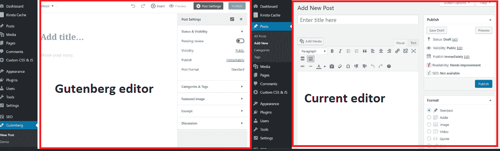
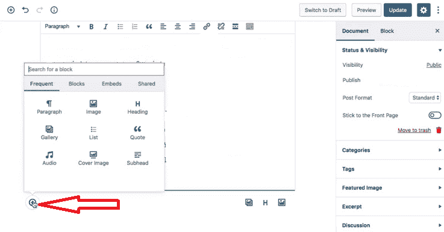

# 准备好使用新的古腾堡 WordPress 编辑器

> 原文：<https://medium.com/hackernoon/get-ready-for-the-new-gutenberg-wordpress-editor-39d24301e17>

振作起来:WordPress 5.0 可能包括新的 Gutenberg 编辑器作为其核心的一部分！

几年来服务于数百万 WordPress 用户的当前陈旧的 TinyMCE 文本编辑器将很快被弃用，它有一个编辑文章和页面的新界面。

这将是自 WordPress 平台推出以来的重大更新之一。因为[古腾堡](https://wordpress.org/gutenberg/)将影响整个 WordPress 的发布体验，你应该为它的发布做好准备。

当然，WordPress 是一个流行的内容管理平台，功能多样，用户友好。例如，拥有超过 16 年前端 web 开发经验的 Awakekat 教人们如何通过创建自己的主题来最大限度地使用 WordPress。你可以在这里观看和学习他的实践项目[。](https://www.liveedu.tv/awakekat/2w1n8-convert-psd-to-wordpress-theme-wordpress/)

**那么，古腾堡带来了哪些新变化？**

当前的 WordPress 可视化编辑器这些年来没有经历重大的变化，即使其他竞争平台已经集成了令人耳目一新的现代界面来使写作和发布变得简单和没有麻烦。

如果你不熟悉的话，WordPress 的 Gutenberg 编辑器是对当前编辑体验的一次全面革新。WordPress 承诺让编写丰富的页面和帖子变得轻松直观。

用于任何最新 WordPress 平台的 Gutenberg 编辑器被创建为不受干扰，同时强调创建内容的容易性。早期版本的大部分功能已经被隐藏或移动，允许用户轻松地创建内容。

古腾堡的中心是街区。通常，块是预先构建的模块，允许您清晰一致地布局内容。目前，对内容进行样式化很困难，需要集成各种功能，比如短代码、主题选项、帖子格式和其他格式元素。

然而，Gutenberg 块为您提供了一种统一的样式化内容的技术，而无需高级编程技能。正是新手想要充分利用 WordPress 平台的地方。

使用这些块，您可以快速自信地定制内容的布局，以满足您的品味和偏好。

例如，您可以通过单击界面左下方的加号图标来包含块。此后，将出现一个菜单，指示您可以添加的各种块选项。

**古腾堡利弊**

如前所述，Gutenberg 给 WordPress 带来了一个已经丢失很久的东西:干净的设计。它采用了最小化的设计，拥有创建交互式和引人入胜的内容的所有基本工具，而不依赖于菜单栏。

然而，最大的缺点可能是缺乏对一些流行的 WordPress 插件如 Jetpack 和 Yoast SEO 的完全支持，这可能会使这些有益的插件无效。

然而，由于 Gutenberg 仍在积极开发中，我们预计会添加更多不会导致与现有 WordPress 插件冲突的功能。

此外，由于 Gutenberg 将在未来的 WordPress 版本中被合并，向后兼容性可能是一个大问题。这可能会迫使[开发人员](http://blog.liveedu.tv/indie-game-developers/)重新设计他们现有的应用程序，以确保变更后的顺利运行。然而，Gutenberg 背后的团队可以引入一个包装器来支持 TinyMCE 向后兼容。

**结论**

Gutenberg 目前作为[插件](https://wordpress.org/plugins/gutenberg/)可用，并计划在 2018 年晚些时候发布 5.0 版本时与 WordPress 核心合并。

虽然一些灰色区域仍然存在，比如用户是否能够禁用它，但是在 WordPress 社区已经有很多关于古腾堡项目的争论。

你对古腾堡有什么看法？你认为这会改善你的 WordPress 写作体验吗？

请在下面的评论区告诉我们。

[http://blog.liveedu.tv/indie-game-developers/](http://blog.liveedu.tv/indie-game-developers/)