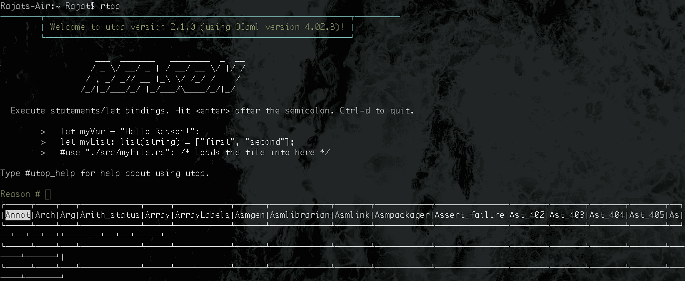

# 使用 Reason ml-第 1 部分

> 原文：<https://medium.com/hackernoon/get-reason-able-with-reasonml-part-1-ac950188141b>

## RTOP、数据类型、字母绑定、词法范围、If-Else 和开关、记录和变量


不仅仅是一种新语言， [ReasonML](https://reasonml.github.io/) (简称 Reason)是一种由 [OCaml](https://ocaml.org/) 支持的语法和工具链。它为 OCaml 提供了一种熟悉的语法，这种语法是面向 JavaScript 程序员的，同时也迎合了 NPM 的工作流程。

在 [BuckleScript](https://github.com/BuckleScript/bucklescript) 的帮助下，Reason 可以编译成可读的 JavaScript 代码。它也可以被编译成一个快速、简单的程序集。

Reason 是静态类型的，在改进代码库的同时为我们提供了更好的清晰度。编译器本身可以推断出大多数类型，而不是一直编写所有类型。

这是 **3 部分系列**的**第 1 部分**，在这里我将帮助你理解 ReasonML 及其所有的语法和语义。我将介绍从基本的**数据类型**到在 ReasonML 中声明**函数**的所有内容。

# 设置和 RTOP

## 原因 CLI

在我们开始之前，请确保您已经在系统上安装了最新版本的 [Reason CLI](https://github.com/reasonml/reason-cli) 。

如果您使用的是 macOS，请打开终端并输入以下命令。

```
npm install -g reason-cli@3.1.0-darwin
```

这将在您的系统上安装 Reason CLI，以及 format 和 Merlin。你还会得到 RTOP，一个交互式命令行工具。这个工具将使我们的事情变得非常容易。

## 使用 RTOP

如果您在命令终端中键入`rtop`,您将看到如下内容:



如果你输入一些像`1 + 1;`这样的基本数学，RTOP 会对它进行评估并给你结果。

```
Reason # 1 + 1;
- : int = 2
```

RTOP 的产出由三部分组成。

```
let binding: type definition = result
```

如果您不在`1 + 1`后键入分号，RTOP 将不会触发评估。

你可能已经注意到在终端的底部有一个列表。这个列表会给我们一组可能的模块和函数，我们可以使用。

当我们`print`出值时，我们将看到值和输出的评价。

```
Reason # print_int(42);
42- : unit = ()
```

# 数据类型和运算符

## 整数和浮点

如果你试图用 RTOP 做`1.1 + 2.2`，你会得到一个错误消息，因为 Reason 有一个特殊的操作符来处理浮点值。

为了执行浮点值的运算，我们需要在运算符旁边添加一个`.`。所以`1.1 + 2.2`会变成:

```
Reason # 1.1 +. 2.2
- : float = 3.30000000000000027
```

## 比较值

为了比较值，我们可以使用几个关系运算符，或者使用`==`的结构等式。

```
Reason # 2 > 3;
- : bool = false
Reason # 2 == 3;
- : bool = false
```

不能直接比较 int 值和 float 值。为此，我们需要首先将 int 转换成 float。

```
Reason # float_of_int(2) > 3.1;
- : bool = false
```

Reason 附带了许多这样的实用函数，可以帮助我们转换类型。

```
Reason # bool_of_string(“true”);
- : bool = true;
```

## 布尔代数学体系的

由于布尔只能为真或假，这与我们通常在 JavaScript 中所做的没有太大的区别。布尔运算符为`!`代表**而非**，`&&`代表**和**，`||`代表**或**。

## 用线串

字符串也是直截了当的。它们只受到使用`""`的限制。可以使用`++`连接字符串。

```
Reason # "Hello" ++ "World"
- : string = "HelloWorld"
```

Reason 还为单字母字符串提供了一种特殊的数据类型。

```
Reason # 'a';
- : char = 'a';
```

## 空

在 Reason 中传递空值类似于我们在 JavaScript 中的做法。Null 是用`()`定义的，有自己的类型叫做 unit。

```
Reason # ();
- : unit = ()
```

# 字母绑定、类型推断和类型别名

## 让绑定

Let 绑定允许我们以一种非常类似于其他语言中变量声明的方式将值绑定到名称。

使用`let`，我们可以像这样将一个字符串值绑定到一个变量:

```
Reason # let name: string = "Rajat";
let name: string = "Rajat";
```

`let`绑定的一般模式看起来是这样的:

```
Reason # let <name>: <type> = <expression>;
```

如果您来自 JavaScript 背景，那么您可能想知道为什么我们需要提供`type`。这是因为 Reason 是静态类型的，与 JavaScript 这样的动态类型的语言有很大的不同。静态类型语言要求我们在编译时声明或推断类型。

## 类型推理

我们已经看到了如何声明我们的类型。现在我们来看看如何推断它们。

```
Reason # let rajat = "Rajat";
let rajat: string = "Rajat";
```

原因编译器推断值的类型是字符串。这是一个很好的特性，因为它允许我们拥有完全的类型安全，而不用一直声明类型。这意味着类型在理论上是可选的，但是如果你想的话，你也可以显式地写下来。

## 不变

`let`绑定是不可变的。因此，如果我们将一个值绑定到一个变量，我们就不能在以后更改它。

但是，我们可以创建一个新的同名的`let`绑定。这个新的绑定将覆盖先前的绑定，并且绑定现在将引用新分配的值。

## 键入别名

隐藏一个`let`绑定后，它与前一个绑定不再有任何关系。所以我们甚至可以为新的绑定使用不同的类型。

```
Reason # type score = int;
type score = int;
Reason # let x: score = 10;
let x: score = 10;
```

# 词法范围

Reason 有词法范围。这将设置变量的作用域(功能范围),以便只能从定义它的代码块中引用它。像这样声明的变量有时被称为私有变量。

首先，我将使用 RTOP 在 Reason 中创建一个局部范围。

```
Reason # { 100; };
- : int = 100
```

该范围可以包含多个命令性语句。最后一条语句将自动返回。

```
Reason # 
{ print_endline("Rajat"); 100; };
Rajat
- : int = 100
```

在范围内，我们可以访问当前范围之外的绑定。但是在作用域内部定义的绑定不能从外部访问。

```
Reason # 100;
- : int = 100
Reason # let x = 10;
let x: int = 10;
Reason # {100 + x; };
- : int = 110
Reason #
{
  let y = 1;
  110 + y;
};
- : int = 111
```

我们也可以在一个作用域内隐藏一个`let`绑定，这不会影响这个局部作用域外的`let`绑定，即使是不同的类型。

```
Reason # let rajat = "Rajat";
let rajat: string = "Rajat";
Reason #
{
  let rajat = 100;
  rajat;
};
- : int = 2
Reason # rajat;
- : string = "Rajat"
```

# If-Else 和开关

## 如果-否则

`if-else`允许我们根据提供的条件执行不同的表达式。

```
Reason # let isHungry = true;
let isHungry: bool = true;
Reason # if (isHungry) {"Pizza!"} else {"Still Pizza!"};
- : string = "Pizza"
```

这里，`if`是一个表达式，因此可以简化为一个值。这意味着它可以绑定到一个`let`绑定。在 JavaScript 这样的语言中，`if`是一个语句，而不是一个表达式。试图将它绑定到一个名称会抛出一个语法错误。

事实上,`if`是理性的一种表达，这可能非常有用。但是它也有其局限性。`if-else`的每一个分支都需要被求值为相同的类型，所以我们不能做如下操作:

```
Reason # let food = if (isHungry) {"Pizza"};
Error: This expression has type string but an expression was expected of type unit
```

所以我们仍然可以使用`if`来打印一个值，只要最后一个语句返回类型单元。`print_endline`确实如此。

```
Reason # if (isHungry) {print_endline("isHungry is set to true")};
isHungry is set to true
- : int = ()
```

## 转换

开关接受一个值并将其与`pattern`匹配。然后计算匹配的大小写，它必须是一个表达式。最简单的形式是，`pattern`只匹配结构相等。

```
Reason # let lamp =
  switch (1) {
  | 0 => "off"
  | 1 => "on"
  | _ => "off"
};
let lamp: string = "on";
Reason # lamp;
- : string = "on"
```

如果您没有为`_`添加 switch 语句，那么 Reason 将继续向您抛出关于情况`2`的警告，然后是`3`，以此类推。`_`类似于 JavaScript 中 switch 的`default`情况。

任何类型的数据都可以进行模式匹配。对于字符串:

```
switch ("Evie") {
| "Altair" => "One"
| "Ezio" => "Two"
| "Connor" => "Three"
| "Edward" => "Black Flag"
| "Arno" => "Unity"
| "Jacob" => "Syndicate"
| _ => "Unknown"
};
_ : string = "Unknown"
```

# 记录

记录允许我们将各种类型的数据存储到一个结构中，并通过名称引用它们。

要创建一个记录，我们首先必须定义它的结构。

```
type super = {
  hero: string,
  alias: string,
};
```

一旦定义完毕，我们就可以为这样的超级英雄创造一个记录:

```
{ hero: "Superman", alias: "Clark Kent" };
- : super = {hero: "Superman", alias: "Clark Kent"}
```

默认情况下，类型是推断出来的，我们不需要指定它。我们还可以像这样访问记录的特定字段:

```
# let super = { hero: "Superman", alias: "Clark Kent"};
let super: super = {hero: "Superman", alias: "Clark Kent"};
# super.hero;
- : string = "Superman"
```

如果你试图访问一个记录中不存在的字段，Reason 会抛出一个错误。

或者，您可以结合使用结构化和`let`绑定。我们从一个`let`绑定开始，然后描述如何映射字段，并放置要结构化的记录。

```
# let {hero: heroName, alias: aliasName} = super;
let heroName: string = "Superman";
let aliasName: string = "Clark Kent";
```

我们还可以重组记录的特定字段。

```
# let {hero: heroName} = super;
let heroName: string = "Superman";
```

# 变体

变体允许我们表达数据结构独有的模块选项。

```
# type answer = Yes | No | Maybe;
```

这是一个引用一组标记的变体。注意，变体中的标签需要大写。

我们使用`let`来绑定这些标签:

```
# let isItRaining: Yes;
let isItRaining: answer = Yes;
```

使用变体，我们可以用任意多的选项来表达任何东西。Variant 对于`switch`表达式最有用。它允许我们检查变体的每一种可能的情况。

```
# let message = 
  switch(isItRaining) {
  | Yes => "Better take an umbrella"
  | No => "Ok then"
  | Maybe => "So take an umbrella to be safe"
  };
let message: string = "Better take an umbrella";
```

使用`if-else`表达式也可以达到同样的效果。但是通过使用带有开关的变体，我们可以获得大量的类型系统助手。例如，如果我们忘记覆盖一个 case，编译器会给我们一个类型错误。

变体的每个标签可以保存额外的数据。比方说，你想开发一款既能记笔记又能做待办事项的应用。注释只需要一个字符串输入，而 todo 需要一个字符串和一个布尔输入来指示任务是否完成。

```
# type item = Note(string) | Todo(string, bool);
# let myItem = Todo("write article", false);
```

我们可以使用析构来做到这一点。这样，我们可以给出参数的名称，并在箭头后面使用它们。

```
# switch (myItem) {
| Note(text) => text
| Todo(text, checked) => text ++ " is done: " ++ string_of_bool(checked)
};
- : string = "write article: false"
```

我们可以给它们取名字，但不一定非要取。我们还可以匹配标签的精确值。

我们可以添加一个与重新设计的网站完全匹配的模式，布尔值设置为`false`。

```
# switch(myItem) {
  | Note(text) => text
  | Todo("redesign website", false) => "Please first fix the app"
  | Todo(text, checked) => text ++ " is done: " ++ string_of_bool(checked)
};
```

# 未完待续…

本系列的第 1 部分到此结束。对于**第 2 部分，**请点击此处:

[](https://hackernoon.com/get-reason-able-with-reasonml-part-2-65d3ab851570) [## 使用 Reason ml-第 2 部分

### 非法状态、选项类型、函数、元组、列表、数组和等式

hackernoon.com](https://hackernoon.com/get-reason-able-with-reasonml-part-2-65d3ab851570) 

我是 Rajat S .有抱负的程序员，还有很长的路要走。一个热爱漫威电影的铁杆 DC 漫画迷。以多任务处理著称。

感谢阅读，希望这是有帮助的！请👏如果你喜欢这篇文章，请在这里和/或 Twitter 上关注我，了解我的最新文章！