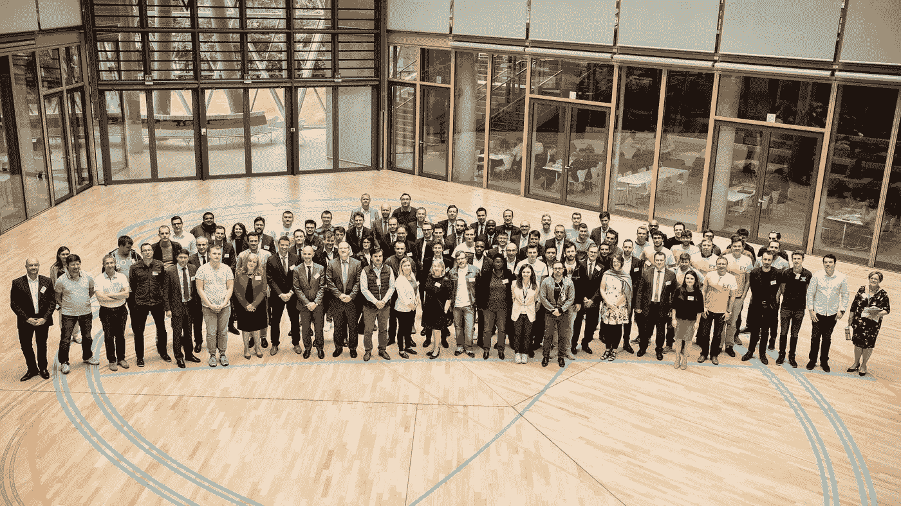

# 了解区块链和智能合同

> 原文：<https://medium.com/hackernoon/get-smart-about-blockchain-smart-contracts-cac62c98470c>

## *如何克服“遗留思维模式”*

The Venue of the “EIB Blockchain Challenge” in Luxembourg from June 13 to June 15, 2018

> *区块链和智能合约并没有那么智能。*

最近经常听到这种论调。

想法很简单:这些技术的当前迭代只有在当前的集中式平台或数据库易于失败(并且不可信)的情况下才有用。否则，在集中式环境中引入区块链和智能合同毫无意义，只会导致新的困难和额外的成本。

结论呢？区块链和智能合约唯一的“真实世界”用途是比特币(或其他数字货币)。

我也经常听到第二种(不同的、相互竞争的)观点:

> *区块链(和智能合约)将是下一代互联网的基础。*

技术的“福音派”信徒经常提到“价值互联网”的引入机会是无穷无尽的。或者说，他们是这么宣称的。区块链和智能合同有可能扰乱流程缓慢而繁琐的行业，以及容易出现人为错误、腐败和欺诈的众多中间人。

如果不接受这些新技术，任何行业、企业或组织都将被颠覆。

在上周由[欧洲投资银行(EIB)](http://www.eib.org/infocentre/events/blockchain-challenge) 举办的区块链挑战赛上，我再次听到了这两种观点。

这两种观点并不新鲜，但有趣的是，它们都“未能”打破房间里也存在的“传统思维模式”。

我所说的“遗留思维模式”并不是指“技术怀疑论者”(即那些简单地将新技术视为时尚或短暂趋势的人)。过去三十年的经验向每个人展示了创新技术是如何改变世界的。我遇到的人中很少有人是真正的怀疑者或不相信者。

相反，有相当一部分人目前不知道如何利用下一代数字技术。这就是“遗留思维模式”

他们希望被说服接受区块链和智能合约的机遇和优势，但这两种相互竞争的未来叙事都不够令人信服。目前，他们更喜欢坚持过去(最近)的“确定性”(遗产)，而不是致力于任何关于技术将我们带向何方的叙述。

这就是我上周在 EIB 所经历的:对未来的不同看法并不能真正说服或说服大多数与会者。

# **缺什么？**

> 那么，*为什么*克服“传统思维模式”并让人们相信区块链技术和智能合同的机会和优势的特定愿景如此困难？

一个很大的原因是大多数非技术人员缺乏关于数字技术的基础知识。在很大程度上,“遗留思维模式”是缺乏底层技术信息的结果。没有必要的知识，就不可能对未来做出任何承诺。

这也是我在我的大学硕士项目中引入“非技术人员的编码”课程的主要原因。这就是为什么每个人都应该“学习如何编码”

不要误会我的意思:我不希望我的学生都成为专业的网页设计师或程序员。我不期望我的学生突然变得有能力进行专业的标准编码。毕竟，编码是很难的，而且“好”的编码不是你在一个强化课程中学到的。

相反,“非技术人员编程”课程旨在教会学生如何在数字时代思考。[正如我在](https://hackernoon.com/why-i-want-my-students-to-code-b358a2b97770)之前所写的，这是关于让他们有能力驾驭一个计算机代码嵌入经济和社会生活方方面面的世界。

因此，“编码”是理解数字世界和克服“遗留思维”的重要资源。我们不应该坐在一起争论对未来的不同看法。相反，我们应该给人们提供资源，让他们了解我们周围正在出现的快速变化的世界。

# **一段意味深长的对话**

> 在当前的数字时代，理解区块链和智能合约背后的底层技术和数学是“必须的”。

它不仅会增加非技术人员的技能、知识和经验。这也将——而且至关重要——使他们能够与技术专家进行有意义的对话(并与他们进行建设性的接触)。

这反过来会让“编码者”变得更聪明。

根据我的经验，编码员、程序员和其他开发人员并不总是理解新数字技术在当前经济、社会或法律环境中的颠覆性潜力。

他们为什么要这么做？编码人员被教导解决问题，但是识别需要解决的问题需要编码人员不具备的本地知识。

例如，我听到许多评论家说，基于计算机的“智能合同”永远无法取代高度复杂的传统合同(传统合同已经发展了许多年，并且是“可预测的”，因为它们有判例法的支持)。

但任何有经验的商业律师都会告诉你，这种对旧世界契约的看法是天真的。诚然，“智能合约”仍然存在许多问题。但我们不要忘记，纸质合同也是如此。至少可以说，我处理的大多数传统合同(这是一个相当大的数字)也是次优的。

当考虑新技术的未来前景时，我们不应该期望那些拥有未来技能的人(编写智能合同)拥有过去遗留问题的知识(起草和处理“纸面”合同)。相反，我们需要认识到技术专家和非技术专家之间有意义接触的重要性，以及实现这一目标的有效策略的必要性。

# **“共同创造”的好处**

非技术人员(如商人、银行家、律师、会计师、广告人、顾问等。)需要对编码有一个基本的了解。同样地，技术专家肯定会从更好地理解组织和社会如何运作以及中介在当前社会和经济环境中的作用中受益。

更多协作形式的“共同创造”有三个非常明显的好处:

## ***1 —更多的知识导致“更聪明”的对话，并促成更有机的合作形式***

[我在](https://hackernoon.com/want-to-understand-blockchains-start-experimenting-bdc5aeaf2d07)之前写过关于“基于区块链”的供应链中合作的力量。这种合作使我们能够发现问题、找到解决方案并揭示新的机会。

另一个例子是一家处于早期阶段的科技公司， [Semada.io](http://semada.io/) ，其中一名法学教授、一名数学教授和几名编码员和分布式账本技术专家共同创建了一个位于区块链的“信誉验证平台”该平台奖励信任方，惩罚不良行为者。信任将通过“永恒的声誉记录”来建立，这种记录将接受审查，并由适当的激励来驱动。

## ***2 —更多协作打破“孤岛”&带来更好的“问题解决”***

在这里描述的合作类型中，考虑了多个视角:技术视角、业务视角以及关键中介(银行家、律师、会计师等)的视角。).

太多时候，我们会孤立地考虑各种技术。

例如，你不必是未来学家就能理解区块链技术的许多问题，如比特币工作协议证明的能源效率低下、“矿池”、区块链组织的匿名性(使他们容易受到“西比尔攻击”和“51%攻击”)，将由其他技术解决。传感器技术、机器学习和深度学习的发展将使基于区块链的平台更加有效和高效。

> **“筒仓式思维”是进步的大敌，更多的合作给了每个人突破这些限制的资源。**

## ***3 —更多的合作最大限度地增加真正创新的机会***

在数字时代，开放、非正式和多学科的合作是必要的。只有到那时，我们才能确保建立一个包容性的数字世界，为每个人提供更大的透明度、便利性、信任和机会。

这是我从上周欧洲投资银行的活动中得到的启示。它表明了技术人员和非技术人员之间共同创造的重要性(世行也欣然承认这一点)。

但这也表明，我们必须首先努力创造最佳的环境，让共同创造的倡议和活动能够蓬勃发展。

这必须从确保我们都说同一种“语言”开始，并且至少能够理解、合作和一起实验。

Coders, bankers, and fintech experts “collaborating” and “co-creating” at the EIB Blockchain Challenge in June 2018

*感谢您的阅读！请点击*👏*下面，还是留下评论吧。*

每周都有新的故事。因此，如果你关注我，你不会错过我关于数字时代如何改变我们生活和工作方式的最新见解。