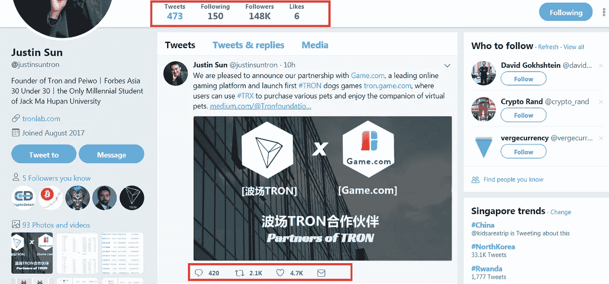
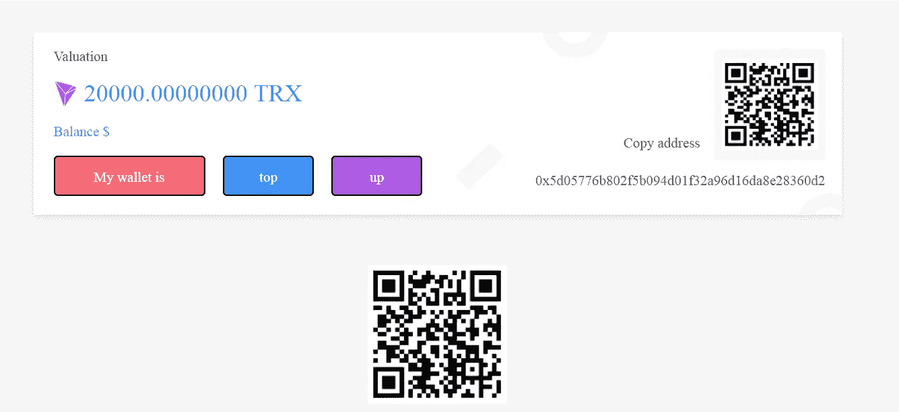
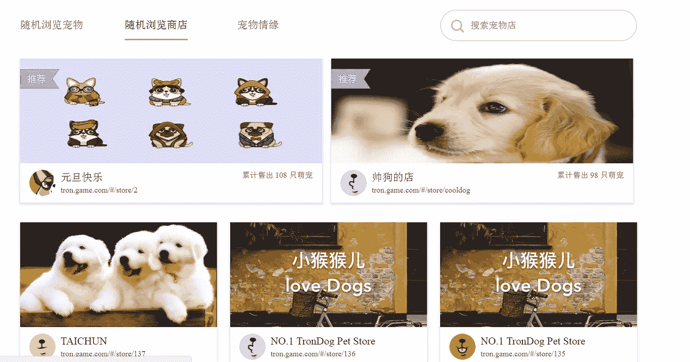
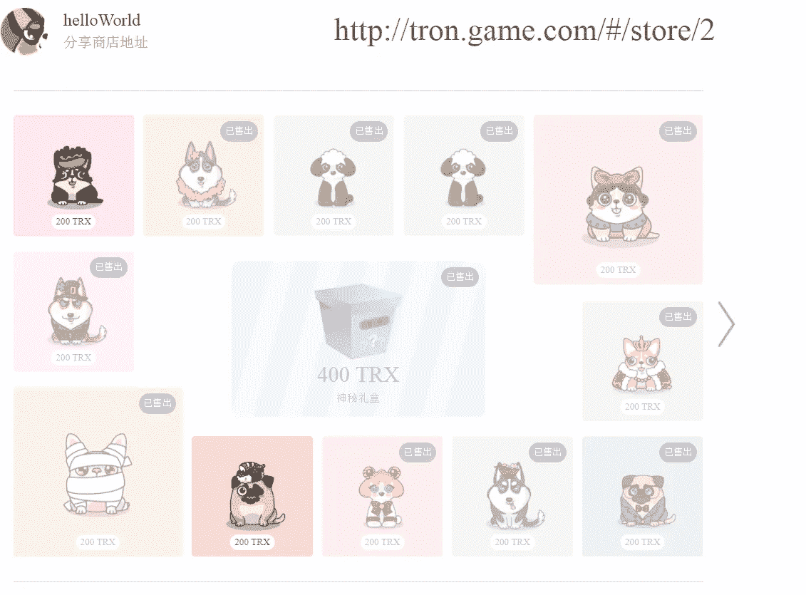
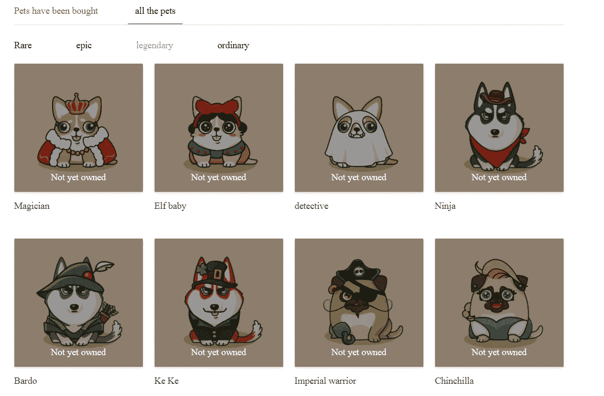
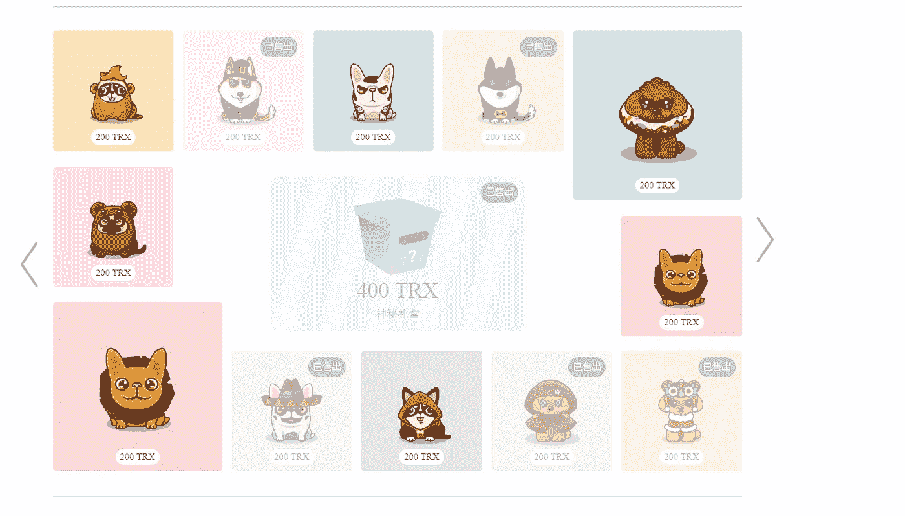

# 宠物星球入门指南——继 Cryptokitties 之后的新热潮

> 原文：<https://medium.com/hackernoon/get-started-now-with-pet-planet-the-new-craze-after-cryptokitties-141af99f315d>

**最后更新日期:2018 年 7 月 1 日**

到现在为止，你们都已经听说过 [Cryptokitties](http://news.fundyourselfnow.com/2017/12/26/cryptokitties-popular-cryptocurrency-game/) ，它用虚拟猫破解了以太坊几天。Cryptokitties 创造了这种区块链口袋妖怪的狂热，其中的数码猫在区块链以每只超过 10 万美元的价格出售。

今天，我和你们分享最近即将到来的热潮，[宠物星球](http://bit.ly/2lRnRmX)，它是昨天推出的。

## 为什么宠物星球会起飞

《宠物星球》是由[创基金会(TRONIX)&Game.com](http://bit.ly/2KLoLMw)创建的第一个大型 Dapp。对于所有不熟悉 Tron 的人来说，它是 12 月份表现最好的加密资产(40 倍回报)，根据 [Coinmarketcap](http://bit.ly/2u45P4J) 的数据，它从 1.39 亿(12 月 4 日)增长到今天的 55 亿。

他们有一个复制自 Cryptokitties 的成熟模型，并在 Twitter 上有大量追随者来推广他们的游戏

148k Followers on Justin Sun (Tron Founder Account) with 2.1k retweet and 428 comments.

## 如何开始

目前，这款游戏非常新，几乎没有文档。该网站现在完全是中文的，所以如果你不懂中文，你将不得不使用谷歌翻译。国际版本将很快推出。

一旦你在网站上注册了用户名和密码，游戏会要求你存入 TRX (TRX)或 GTC(游戏币)令牌。

要得到 TRX，你需要在币安上购买，并把它们转移到游戏提供的钱包里。

Wallet topped up with 20000 TRX (Website was translated using google translate)

一旦你的钱包里有了 TRX，你就可以在市场上浏览宠物了。有三个选项:按宠物浏览，浏览宠物店&采用随机宠物选项。

Sample View of the Pet Store Summary Page

View of the Pet Store

在宠物店，你可以选择你想买的宠物，或者用 400 TRX 买一只神秘宠物。

购买每只宠物都会给你免费的游戏代币，这些代币可以兑换回 TRX 代币(1 个游戏代币兑换 5 个 TRX)。如果你幸运的话，你有可能赢得比你在 TRX 花费更多的游戏币。

## 宠物的类型

宠物分为 4 个等级——普通、稀有、传奇和传奇。目前，宠物现在卖 200 TRX。稀有、史诗和传奇宠物出现在商店的几率要低得多。预计你将能够繁殖宠物，并将宠物升级到下一层。

有一个宠物百科，会向你展示你可能获得的所有宠物(想想《口袋妖怪 go》里的 pokedex)。

## 我如何盈利？

要开始出售宠物，你需要存入 20，000 TRX，用来购买一家允许你出售宠物的宠物店。请注意，没有商店，你就不能出售你买的宠物。

根据网站描述，拥有一个商店将使您有权:

1.  套餐中包含 100 只普通宠物(每只价值 200 TRX)。

2.卖掉 100 只宠物后，你可以选择从 Tron 购买随机宠物来卖掉更多的宠物。

3.每只宠物你都会得到一笔佣金(在 TRX 支付)。估计佣金在 5%到 10%之间。

4.商店是可退还的，你可以把你的商店卖回给 Game.Com(经营游戏的公司)

我查看了目前 100 家正在营业的商店，其中大多数已经售出了 50-70%的宠物。

A mostly sold out pet shop

我希望这个简短的指南有所帮助，尤其是对那些不懂中文的人。

这个游戏仍然很新，有很大的发展空间。如果您有任何意见或事情要补充，请在下面留下您的评论，因为我们都在一起学习！

在 [Twitter](https://twitter.com/cryptokenneth) 上关注作者！

*渴望了解更多关于 FundYourselfNow 的信息吗？在我们的* [*电报*](https://t.me/fundyourselfnow) *群上加入我们的众筹革命对话，或者在* [*Twitter 上关注我们。*](https://twitter.com/fundyourselfnow)

肯尼思(男子名)

联合创始人，FundYourselfNow