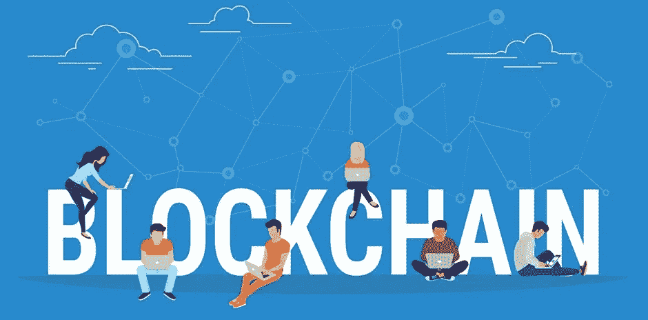
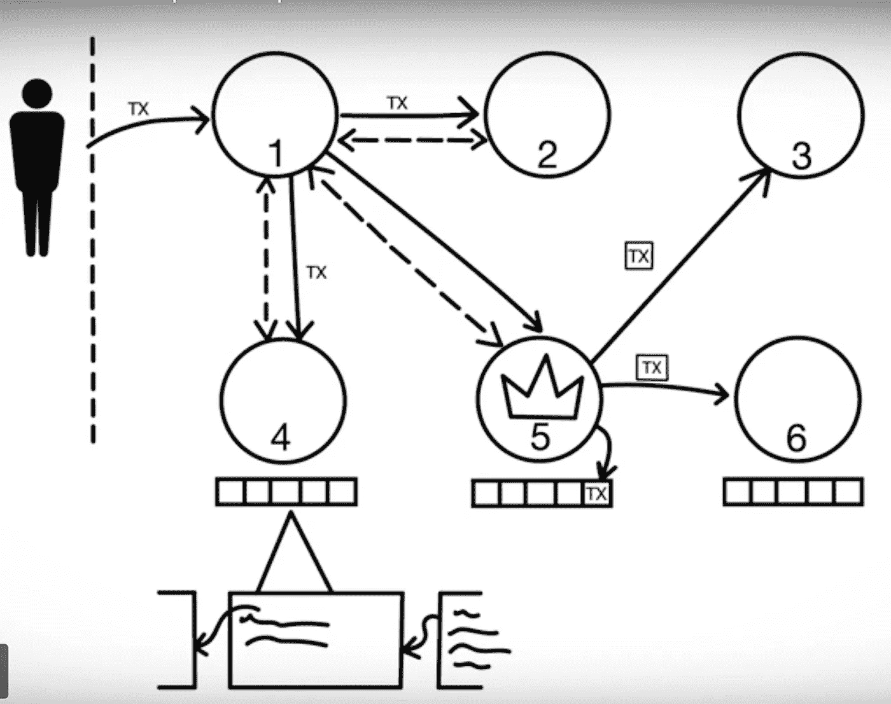
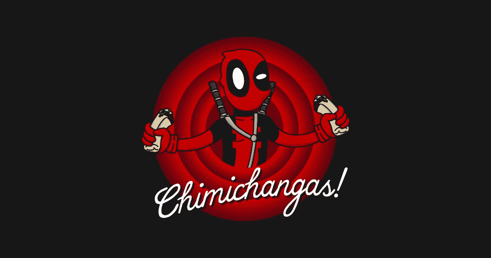

# 2018 年区块链入门

> 原文：<https://medium.com/hackernoon/get-started-with-blockchain-in-2018-cb21896470de>

Source: [http://media2.govtech.com/images/940*464/shutterstock_blockchain.jpg](http://media2.govtech.com/images/940*464/shutterstock_blockchain.jpg)

如果你不知道区块链的技术到底是什么，还不算太晚。然而，越早开始越好。所以让我们从头开始。

无论是关于启动区块链事业还是了解它以扩展你的知识领域，重要的是要知道**是什么**是区块链**T5 和 T6 T7 是如何工作的。**

我在区块链上看到的第一个视频就让我的基础知识变得正确。

为了对区块链有一个简短的鸟瞰，IBM 系列是惊人的。IBM 在区块链做了值得称赞的工作。它开始了一个开源项目:Hyperledger，现在在 Linux 基金会下。我们一会儿会谈到超账本。

它是相互连接的机器或计算机的网络。每个都有相同的数据副本。这就是我们所说的**总账；**一种记录。在每个块中，我们有**个事务**。交易是我们与外界的区块链互动的方式。您只需将事务提交给一个节点，节点会将事务转发给其他节点，这样事务就可以记录在一个块中。每个块包含前一个块的散列，这就是块链的形成方式。随着链变得更长，它变得更强。领导者是第一个添加块的人，然后块也被附加到其他节点。然后节点将进行投票。他们将仔细检查创建该块的人的工作。并投票决定是否有效。如果没有，过程将重新开始。

Summary of the above video.

学习基础知识的其他资源有:

1.  你可以从以下网站下载区块链假人版

 [## IBM 注册表单

### WW _ 区块链假人电子书

www-01.ibm.com](https://www-01.ibm.com/marketing/iwm/dre/signup?source=urx-16905&S_PKG=ov59289) 

2.你可以阅读 IBM 区块链博客

 [## IBM 区块链-企业区块链解决方案和服务

### IBM 区块链使企业能够通过一个高度安全、共享和可扩展的平台将您的交易流程数字化。

www.ibm.com](https://www.ibm.com/blockchain/) 

这都是最基本的。

既然你已经精通了基础知识，让我们来看看区块链的应用。[比特币](https://hackernoon.com/tagged/bitcoin)是区块链技术的应用之一，由中本聪在 2008 年发表的题为“[比特币:一个点对点的电子现金系统](https://bitcoin.org/bitcoin.pdf)”的论文中公布。令人惊讶的是，这篇论文中没有提到“区块链”这个词。

**Hyperledger 上的能源公用事业管理应用:**在一个村子里，你认识一个人，他的房子上有路灯或太阳能电池板。你用你的太阳能电池板，省下一些钱来给路灯供电。

 [## 分散能源公司

### 分散能源公用事业-独立的能源生产者和消费者在一个孤立的分散组织…

devpost.com](https://devpost.com/software/decentralized-energy-utility?utm_source=dwtv&utm_medium=twodw&utm_term=blockchain&utm_campaign=Developer%20Perspectives%20On%20Blockchain) 

**区块链+物联网:**供应链管理成为该领域的主要用例。商品在到达最终用户手中之前要穿越全球。有徒手交换。关于食品欺诈的问题正在增加。污染、食源性疾病和浪费等影响食品安全的问题主要是由于缺乏信息和可追溯性。可能需要数周时间来确定污染的确切位置，从而导致进一步的疾病、收入损失和产品浪费。想象一个通过物联网设备监控资产的世界(例如 GPS、运动传感器等)，使供应商不仅可以跟踪他们的资产，还可以确定损坏发生的时间、谁造成的损坏、温度变化等。

我自己也写了一篇关于这个的文章-

 [## 当物联网遇上❤️区块链

### 物联网(IoT)正在创造新的机会，并为企业提供竞争优势

hackernoon.com](https://hackernoon.com/when-iot-meets-blockchain-%EF%B8%8F-892fecdaf00c) 

你当然可以在网上看到成千上万的区块链的应用。

 [## 2017 年区块链行业十大公司

### 2017 年绝对是区块链和加密货币的一年。比特币已经从 950 多美元飙升到…

cointelegraph.com](https://cointelegraph.com/news/top-10-companies-of-the-blockchain-industry-in-2017) 

在今天的世界里，使用区块链是很容易的，因为它都是开源的。

以下是一些带有分步指南的示例应用程序:

 [## 使用区块链- IBM 代码创建一个待办事项应用程序

### 在一个待办事项应用程序中执行与区块链的传统数据存储事务，使您能够浏览、阅读、编辑…

developer.ibm.com](https://developer.ibm.com/code/patterns/create-a-to-do-list-app-using-blockchain/)  [## 使用区块链- IBM 代码部署资产转移应用程序

### 通过创建一个资产转移应用程序，学习在 Hyperledger Fabric 网络中开发应用程序，以便在…

developer.ibm.com](https://developer.ibm.com/code/patterns/deploy-an-asset-transfer-app-using-blockchain/)  [## 创建一个区块链应用程序，通过 web 界面显示网络并与之交互

### 该应用程序提出了一个分散的能源网络，其中居民谁是通过太阳能生产能源…

developer.ibm.com](https://developer.ibm.com/code/patterns/decentralized-energy-hyperledger-composer/) 

要想成为一名成功的区块链开发者，你会想要熟悉[**Hyperledger Composer**](https://developer.ibm.com/tv/blockchain-demo-hyperledger-composer/)**。**

Hyperledger Composer 是一个应用程序开发框架，它简化并加速了 Hyperledger Fabric 应用程序的创建。

Hyperledger Fabric 应用程序是一个共享的、不可变的分类帐，用于记录交易历史；它正在培育新一代的事务性应用程序。

Hyperledger Composer (Composer)是一组 API、建模语言和编程模型，可用于快速定义和部署业务网络和应用程序，允许参与者发送交换资产的事务。

Composer 编程模型基于定义和部署业务网络定义，业务网络定义包含定义业务网络中资产、参与者和事务的名称和结构的数据模型。

业务网络还指定了交易处理器函数(用 ES5 JavaScript 编写),当客户提交交易时，这些函数会自动在 Hyperledger 结构上运行。

Composer 定义了 JavaScript APIs 来提交事务，并在资产注册中创建、检索、更新和删除资产。
Composer 帮助您实现业务解决方案，并立即部署到结构区块链。你一定要确保把它加入到你的技能中。

如果你想成为区块链大师，下面这篇区块链博客中的文章是必读的。你会知道我们所有的区块链平台，所有的技术趋势是什么。

 [## 17 个区块链平台——简介

### 区块链技术是通过题为“比特币:一个点对点的电子现金系统”的论文公布的…

medium.com](/blockchain-blog/17-blockchain-platforms-a-brief-introduction-e07273185a0b)  [## 以太坊 Web 开发人员入门

### 更新:我已经创建了一个 repo 供您使用，它展示了本文中涉及的大部分内容。

hackernoon.com](https://hackernoon.com/getting-started-as-an-ethereum-web-developer-9a2a4ab47baf) 

这已经是很多知识了，但是区块链领域的知识是超级动态的。你需要不断用新技能更新自己。新技术诞生迅速，发展也同样迅速。确保你对游戏很快，确保你熟悉区块链可能带来的变化。

除了教育，你还需要参与数字对话。你有哪些社交媒体资料？你给网上对话增加价值了吗？你正在参加关于区块链未来的小组讨论吗？

技术优势和教育是你如何保持与这项新技术的相关性。如果你现在没有加入在线对话，你会想尽快开始。

我祝你在区块链之旅中好运，迫不及待地想听到你未来的成功。

Source: [https://res.cloudinary.com/teepublic/image/private/s--4ijiKdlv--/t_Preview/b_rgb:191919,c_lpad,f_jpg,h_630,q_90,w_1200/v1446236902/production/designs/260691_1.jpg](https://res.cloudinary.com/teepublic/image/private/s--4ijiKdlv--/t_Preview/b_rgb:191919,c_lpad,f_jpg,h_630,q_90,w_1200/v1446236902/production/designs/260691_1.jpg)