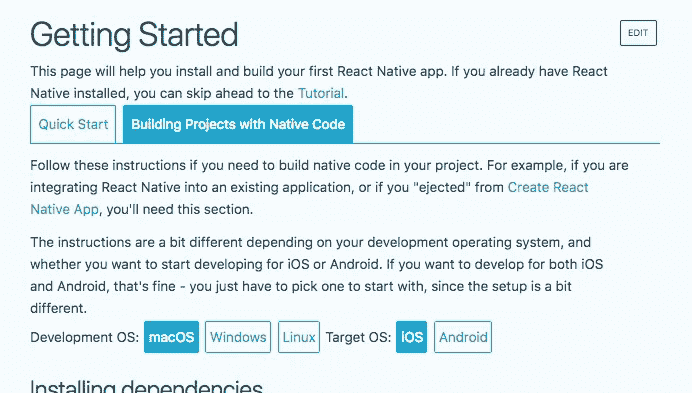

# 以闪电般的速度开始使用 React Native

> 原文：<https://medium.com/hackernoon/get-started-with-react-native-in-lightning-speed-d781701ec2a7>


Image courtesy of [@dominik_qn](https://unsplash.com/@dominik_qn) on @Unsplash

查看这个免费指南。

[React Native](https://hackernoon.com/tagged/react-native) 就是[未来](https://hackernoon.com/tagged/future)。本周末，在 Zonder 上，我们将发布我们的 iOS 和 Android 移动应用，我被开发速度惊呆了。这在很大程度上归功于我们出色的团队，也归功于这个非凡的框架。今天，我们将介绍一门非常入门的课程，展示如何在一个下午内启动并运行您的应用。

[https://Facebook . github . io/react-native/docs/getting-started . html](https://facebook.github.io/react-native/docs/getting-started.html)

react-native 文档是获得这个过程的概述的最佳地方，但是我将深入到更详细的地方，以便更容易地开始。

//注意，我使用 macOS 和 iOS 作为我的环境，我们构建的项目仍将是一个 Android 项目，但它需要一些额外的工作才能开始，如这里概述的。

我们将关注“使用本机代码构建项目”选项卡，因为如果您想在设备上构建应用程序或将其上传到 app store，这是一个更好的长期解决方案。



Select building projects with native code tab

你仍然可以用`create-react-native-app` 做这件事，但是你需要在某个时候运行`npm run eject` ,这是不可逆的，有点棘手，所以这是一条更好的路。

首先你需要安装或升级 node(如果你运行的是< V6).To check your node version run:

【

If node is missing or less than v6.0.0 run:

【

If you are getting an error to the tune of “brew not recognized” or something to that effect, run this command to install it.

```
/usr/bin/ruby -e "$(curl -fsSL https://raw.githubusercontent.com/Homebrew/install/master/install)"
```

And then install watchman too.

【

The next step is to run:

【

which, surprise surprise, installs the react-native-cli, you will also need [Xcode](https://itunes.apple.com/us/app/xcode/id497799835?mt=12) 并且安装了最新版本的命令行工具。

Xcode command line tools ⌘, to open

## 有趣的部分

现在，我们已经奠定了所有的基础，是时候推出我们的应用程序了。为此，请在合适的目录中创建一个项目。

`react-native init AwesomeProject`

`cd AwesomeProject`

和

`react-native run-ios`

这将启动一个相当长的构建过程，但是不用担心，您不必在每次启动新项目时都经历这个过程。另一件要注意的事情是，启动打包程序将在新的终端窗口中启动，在运行上述命令后的某个时候。如果您遇到应用程序卡在加载屏幕上的问题，这是查找可能导致这种情况的错误的好地方。

您的应用程序应该已经启动并运行，并准备在此基础上构建，我们将在下周对此进行研究。

感谢您的关注，这是您能给予任何人的最有价值的东西。写这些帖子最难的事情往往是开始，所以任何关于主题的建议/请求都会被感激！我也欢迎对[之前帖子的反馈。](/me/stories/public)

如果你喜欢你在这里读到的，并且想从我这里听到更多，请在我的个人网站[上注册我的电子邮件列表，或者至少…](https://feargalwalsh.us17.list-manage.com/subscribe/post?u=de3b08e1cdd1bfe1557a056ab&id=c5dad51e33)


[https://www.youtube.com/watch?v=DdCYMvaUcrA](https://www.youtube.com/watch?v=DdCYMvaUcrA)

## 资源

[](https://www.gq.com/story/jeb-bush-saddest-moments) [## 杰布·布什总统竞选中最悲伤的 15 个时刻

### 2016 年的总统选举对唐纳德·特朗普和伯尼·桑德斯很好，但对杰布·布什不好。他的民调数字…

www.gq.com](https://www.gq.com/story/jeb-bush-saddest-moments)