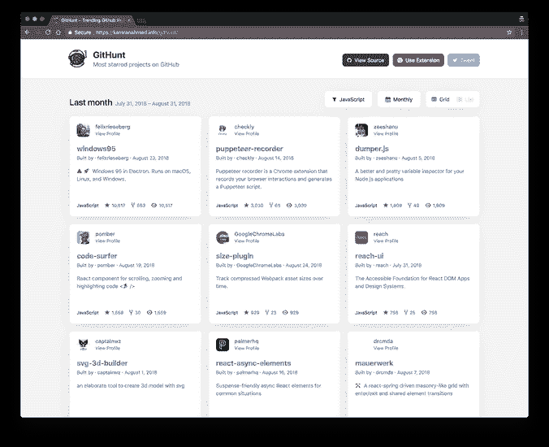
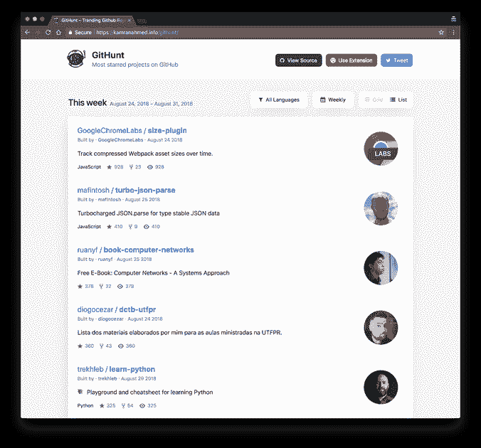

# 使用 GitHunt 在新的 Chrome 标签中获取最受欢迎的 GitHub 项目

> 原文：<https://medium.com/hackernoon/get-the-most-starred-github-projects-inside-your-new-chrome-tab-with-githunt-bf2d0c9f0c5>

几个月前，我写了一篇关于一个非常棒的 Chrome 扩展 Githunt 的文章。它基本上抓取了一天、一周、一月或一年中最受欢迎的 GitHub 库，并将它们显示在你的新 Chrome 标签页中。这样你就离这些仓库更近了。这是一篇致力于这个令人敬畏的 Chrome 扩展的新文章:它现在已经升级，并具有值得关注的附加功能。

它现在有了一个重新设计的用户界面，比起以前的界面，我更喜欢它。它还增加了一个列表，可以在下拉菜单中更容易地找到你喜欢的编程语言。

此外，它还增加了两种显示存储库的方式。您可以以列表形式查看它，也可以在网格选项中查看它。

它也可以作为一个独立的工具在线使用，而不必安装在你的浏览器中。这是一个很好的方法，让你尝试一下这个扩展，更好地了解它的样子，然后决定是否要安装它。你可以通过访问[这个页面](http://kamranahmed.info/githunt/)来参观它。

我很荣幸也很高兴写下这个扩展，因为我认为它是我们开发人员关注最受欢迎的库的一个非常好的方式，这样我们就可以学习、贡献并从中受益。

这个工具不仅可以帮助你及时更新最近 GitHub 上最受欢迎的库，它还是一个开源项目，你可以修改、学习和贡献。在这次升级中，GitHunt 也在 React 中进行了重写，因为它以前的版本是使用 jQuery 编写的。你可以在 [GitHub 这里](https://github.com/kamranahmedse/githunt)看到它的知识库。