# 在 AWS 上获得免费的 SSL 证书

> 原文：<https://medium.com/hackernoon/getting-a-free-ssl-certificate-on-aws-a-how-to-guide-6ef29e576d22>

如果你使用 AWS 的负载均衡器，它会给你一个免费的 SSL 证书(是的，你确实需要为负载均衡器付费，但是它很便宜，而且最终是你的网站应该有的东西),但是我发现设置很混乱。设置负载平衡器、将其连接到 EC2 实例、配置 DNS 并输入所有正确的信息并不是一个简单的过程。本指南为您提供了启动和运行 SSL 证书所需的一切。

包括什么

*   设置安全组
*   使用弹性 IP 设置 EC2 实例
*   使用 Amazon 证书管理器(ACM)设置 SSL
*   设置负载平衡器
*   设置目标群体

我假设你有一些准备部署的应用程序。它在后端使用 NodeJS、Python 还是 Java 并不重要。重要的是它运行在你能控制的端口上。在本文中，我假设端口为 8080。这不是一个特殊的港口。端口 1234、3000 或 5000 的工作方式相同。我只是用 8080 设置了我的东西，这样就很容易跟踪了。

# **设置 EC2 实例**

这部分很简单。登录 amazon 控制台，在 services 下单击 EC2。单击启动实例按钮。看起来是这样的:

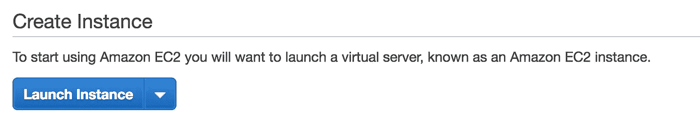

Launch new EC2 Instance

然后你必须选择你想要的 AMI(亚马逊机器映像)。这是实例将使用的操作系统。通常，您只需要一个 linux 实例，但是根据您的需要，您可能需要一些不同的东西。我将选择第一个:

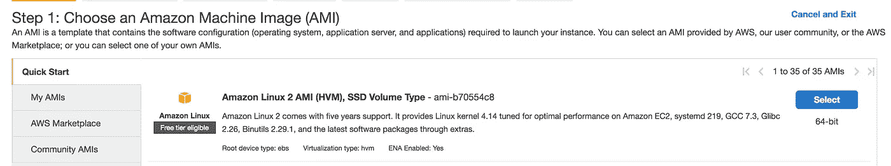

单击选择，然后选择实例类型。这是为了配置您的服务器将有多少内存，有多少处理能力，大小和类型。我个人只是用默认的。让事情变得简单。

当您进行到步骤 6 be 时，您将需要创建一个新的安全组。设置应该如下所示:

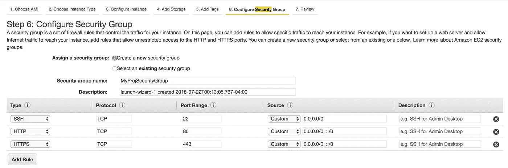

当你点击启动时，你可以选择制作一把新的钥匙。这将让您 SSH 到实例中。创建一个新文件(或者使用一个旧文件，如果您仍然可以访问`.pem`文件并想要使用它)并给它命名。下载下来，放在你电脑上某个容易访问的地方(我一般放在`~/`)。

在您的终端`cd`中，将`.pem`文件放在文件夹中，并按照点击连接按钮时弹出的指示进行操作(您需要通过点击它来选择实例)。一旦你 SSH 到实例中，你就可以从 GitHub 或任何存储的地方克隆你的代码，安装任何依赖项并启动你的服务器。然后退出去。这就是我们要做的所有终端工作:)。

# 设置您的弹性 IP 地址

接下来，您需要为您的实例提供一个 IP 地址，使其可以公开访问。AWS 用弹性 IPs 做到了这一点。它列在左侧面板上。找到它并打开页面。点击`Allocate new address`，然后当您刚刚创建的 EC2 实例出现在列表中时，`CTRL`点击它并选择`Associate Address`。然后选择刚刚创建的实例，点击`Associate`。

访问这个 IP 地址，然后`:PORT_NUM`应该会把你带到你的网站。因此，如果您的弹性 IP 是`34.200.70.235`，并且您的应用程序在端口 8080 上运行，那么访问`34.200.70.235:8080`将向`/`发出 get 请求。

> 附录:感谢[迈克尔·弗拉克斯曼](https://medium.com/u/4970c5a0d076?source=post_page-----6ef29e576d22--------------------------------)捕捉到一个失误！在上图所示的安全组中，不包括端口`8080`，这意味着访问`34.200.70.235:8080`将被阻止。要允许访问，编辑安全组并简单地添加类型为`http`的端口`8080`，其选项与端口 80 和 443 相同。

恭喜你。！您刚刚在 AWS 上部署了您的网站！让我们通过添加 SSL 并将其与域名相关联来尝试改进它。

# 设置 SSL

我们将使用 AWS 的证书管理器 ACM 来完成这项工作。点击服务，搜索`ACM`并点击证书管理器。

点击`Request a Certificate`。你想要一个公共证书。点击“申请证书”,将所有域名添加到框中。这应该只包括主域(也称为裸域)aka `mypage.com`，而不包括像`mypage.com/blah`这样的东西。如果您有其他版本，如`[www.mypage.com](http://www.mypage.com)`或`blog.mypage.com`，也添加它们并点击下一步。

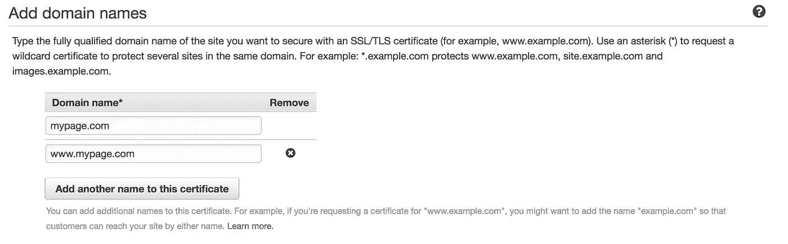

Add your domains

现在 AWS 需要验证您确实是该域名的所有者。如果您有权访问 DNS 设置(这将通过 Route53、name price、GoDaddy 或任何其他域名提供商)，请选择 DNS 验证；如果您无权访问，请选择电子邮件验证。DNS 验证更好更快。如果您使用的是 Route 53(我推荐)，那么剩下的设置非常简单，因为 AWS 可以为您将所需的记录添加到 DNS 设置中。否则你将不得不复制并粘贴它们。保存您的更改，然后您应该会看到类似这样的内容:

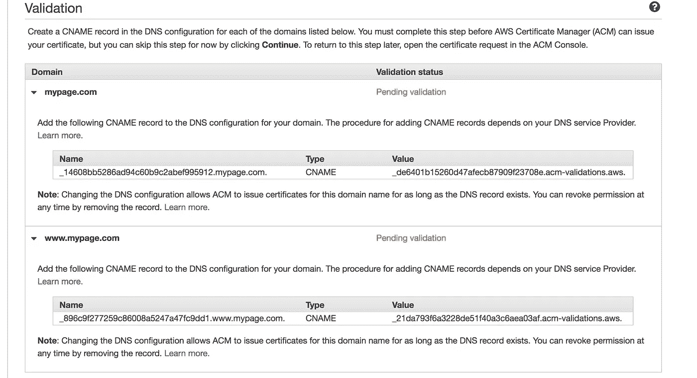

如果您正在使用 Route 53，将会有一个额外的按钮提供添加 CNAME 记录到您的 DNS(如下所示)。对于域的每个版本(www 和非 www 版本以及您在上一步中添加的任何其他子域)，单击它。否则，复制名称和值，并将其作为 CNAME 记录添加到您的 DNS 设置中。每个版本都需要自己的记录，因此请确保将它们全部添加到您的 DNS 设置中。

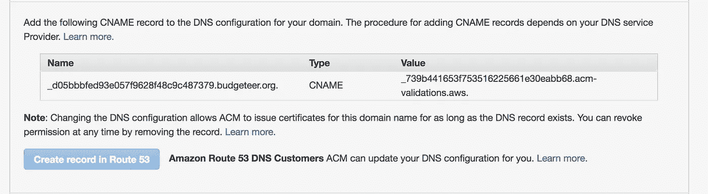

一旦 AWS 验证了所有内容，验证状态将更新为绿色，表示成功。这可能需要一些时间(0-30 多分钟，但通常在 5 分钟左右),所以如果它不会立即发生，请不要担心。

# 设置负载平衡器

现在我们需要配置负载平衡器。这也可以在 EC2 的左侧面板中找到。负载平衡器可以轻松地将您站点的流量均匀地分配给运行它的多台服务器。我们不会真正利用这个方面(因为我们只有一个实例在运行),但这是它的主要功能。打开它的页面，然后单击创建负载平衡器。

这将带您进入这个页面:

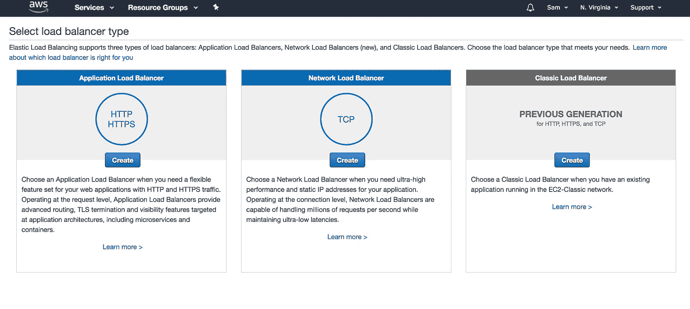

Create Load Balancer Options

我们将使用第一个选项，HTTP 和 HTTPS。单击并给它命名。在`Load Balancer Protocol`下，我们想添加`HTTP`和`HTTPS`作为选项。`HTTP`选项应设置为使用端口 80，而`HTTPS`选项端口 443。选择一些可用区域(至少需要 2 个)。设置应该如下所示:

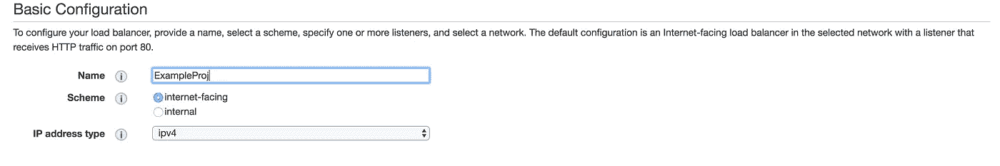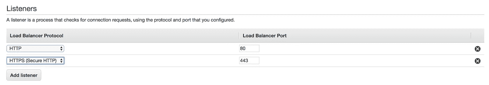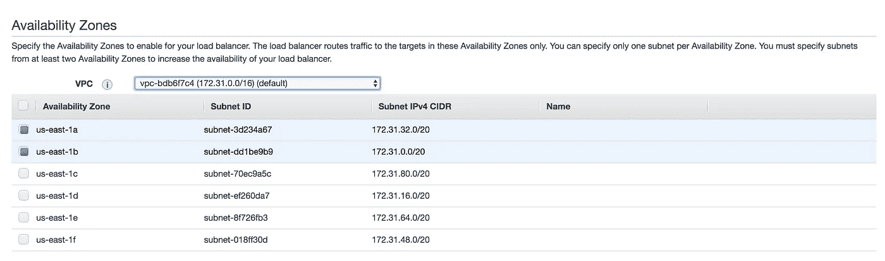

注意它是如何为 port 指定负载平衡器端口的。这是负载平衡器的端口，而不是您的应用程序的端口(8080)。这是因为负载平衡器将位于您的服务器前面，并监听端口 80 和 443(这是我们刚刚设置的)。当一个请求从这些端口中的任何一个传入时，负载平衡器将采取一些措施将请求转发到您的应用程序，该应用程序将监听端口 8080(我们将在下一步中进行设置)。

完成后，单击下一步。

这是您将 SSL 证书连接到负载平衡器的地方。从下拉菜单中选择`Choose a Certificate from ACM`和您刚刚制作的证书。默认的安全策略是可行的。

看，还不错，我们就快完成了。

现在转到目标组，也在 EC2 设置的左侧，负载平衡器的正下方，并创建一个新的目标组。

给它一个名称，并使用 HTTP 作为端口值为 8080 的协议(与实际服务器监听的端口相同)。

选择它，点击底部面板中的目标，然后编辑。您将在底部选择 EC2 实例，然后单击`Add to registered`，确保端口是 8080，然后单击`Save`。它现在应该作为注册目标出现在顶部。

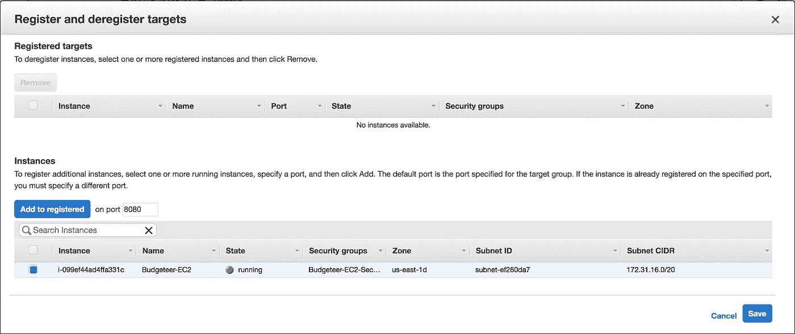

返回负载平衡器设置并选择您的负载平衡器。选择 listeners，点击端口值为 80 的`Add listener`，转发到我们刚刚做的目标组(忽略下面的红色)。

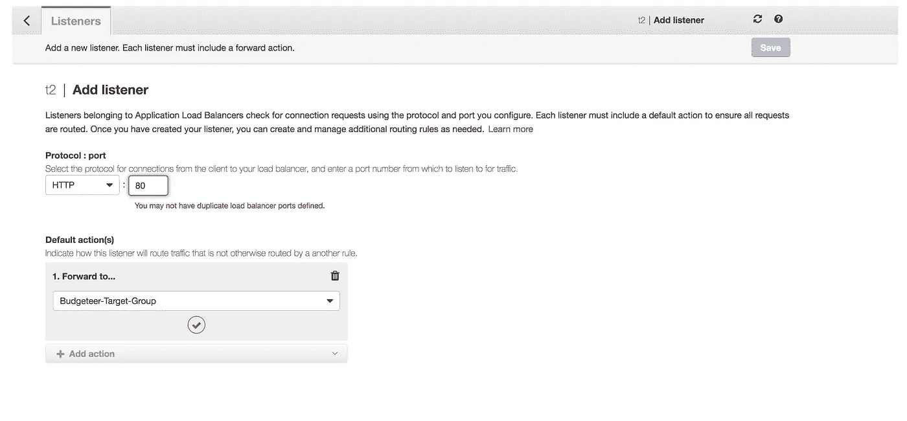

再次做同样的事情，但不是 HTTP 做 HTTPS，并再次使用端口 443 与相同的目标组，我们刚刚作出的。对于这个，我们将 SSL 信息设置为来自 ACM，然后选择我们之前制作的证书。点击 save，现在 listeners 部分应该是这样的。

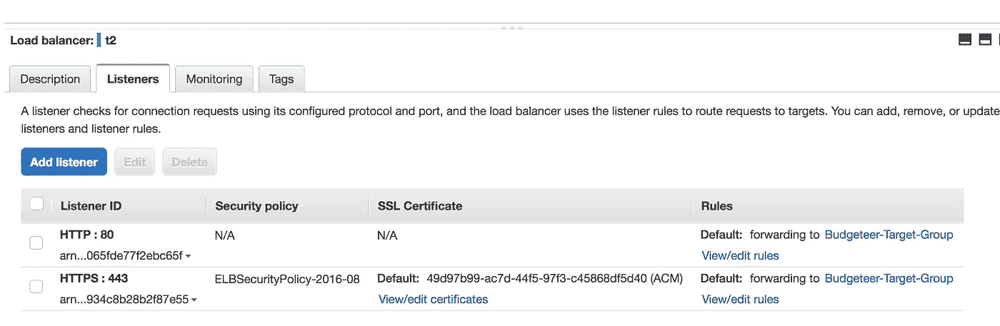

请确保还为负载平衡器设置了安全组，以允许流量通过端口 80 进入。要创建新的安全组，请在 EC2 页面的左侧面板中找到选项卡。创建一个新的安全组，允许来自端口 80 上所有来源的流量，如下所示。如果你得到一个关于`CIDR`的错误，那是因为你必须设置`source`列。

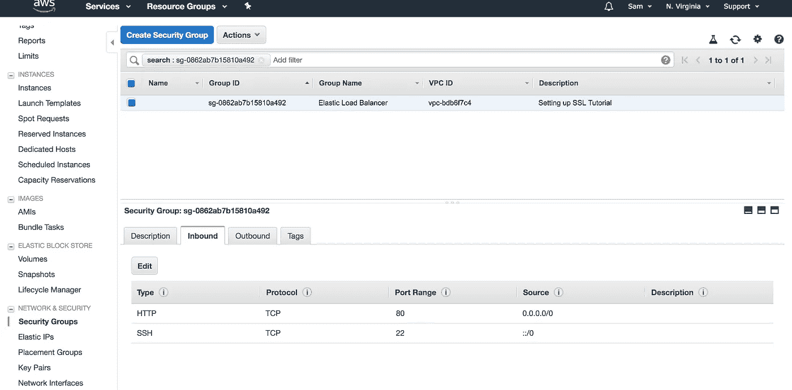

# 将您的域指向负载平衡器

最后一步是更新站点的 DNS 记录，使其指向负载平衡器。

转到控制台中的 Route 53，打开您的域的设置。

如果您还没有它们，您需要添加两个 A 记录。如果你已经有了，你需要更新它们。

对于类型，选择一个记录，然后就在它下面，您会看到别名的是或否选项。选择是。

然后单击 Alias Target 右侧的教科书，并从列表中选择您刚刚创建的负载平衡器。

就是这样！！！

当一个请求进入您的域时(无论是 http 还是 https)，Route 53 将把它定向到负载平衡器，负载平衡器将使用目标组把它发送到 EC2 实例。

如果你遇到任何问题，谷歌一下你正在使用的服务(ACM，EC2，Route53 等)，然后在下面发表评论。我希望这有助于你让你的网站运行 SSL

正如杰布·布什所说，请鼓掌:[https://youtu.be/DdCYMvaUcrA?t=23](https://youtu.be/DdCYMvaUcrA?t=23):)