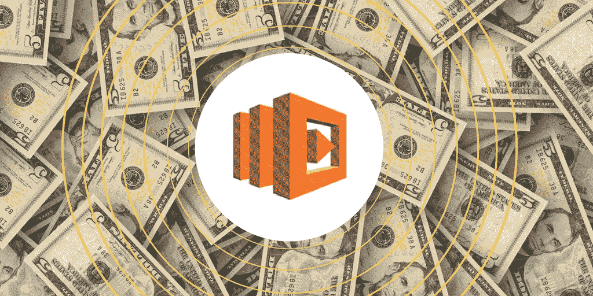
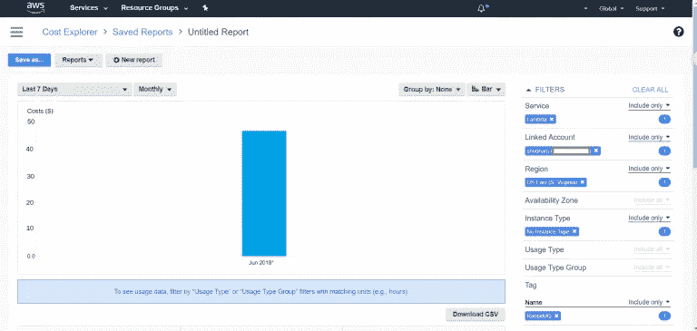

# 在大约 15 秒内控制螺旋上升的 AWS Lambda 成本

> 原文：<https://medium.com/hackernoon/getting-a-handle-on-spiralling-aws-lambda-cost-in-15-sec-5c6e47f85ada>



AWS Lambda 函数在入门时可能看起来价格低廉。尽管开发人员可以限制其最大内存大小和最大函数执行时间，但由于多种原因，成本仍有可能失控。这可能是因为 DDoS 攻击，每个函数的内存分配过多，或者代码中的错误意外地无数次调用一个函数！

> 在这篇文章中，我们将带你了解 Lambda 函数的成本，以及可视化控制台如何帮助你在大约 15 秒内获得清晰的结果(跳到第 4 点，立即观看它的运行！).

# 影响 AWS Lambda 成本的因素:

在顶层，看起来 AWS 只对 Lambda 函数运行的时间收费。实际上，它取决于:

–执行/请求的数量

–功能运行的时间范围(四舍五入到最接近的 100 毫秒)

–函数的内存大小

例如:如果一个函数使用 512 MB，并且在一个月内被调用 500 万次(每次调用持续一秒钟)，那么仅这个 Lambda 的月成本就是 36.8072 美元。考虑一下你将在所有功能上花费多少美元！

> 理想情况下，你必须在内存分配、调用次数和函数运行时间之间保持一个健康的平衡，以避免超额支付的风险。监控 lambda 函数的最优性必须是你常规审计的一部分。否则，花费可能高达数百美元。

以下是监控这些功能以实现成本优化的几种方法:

# #1 传统的手动方法:

## (根据功能的数量，需要几分钟到几小时。)

每次 Lambda 执行时，都会打印一条记录:

```
Duration: 1000 ms Billed Duration: 500 ms Memory Size: 512 MB Max Memory Used: 25 MB
```

上面的记录清楚地显示了该函数只使用了 512 MB 中的 25 MB。在这种情况下，一个 128 MB 内存的函数也能很好地工作，并且每月节省数百美元。但是，如果分配的空间小得多，函数可能会在执行前就被丢弃。

> ***在那个账号上，定期监控 Lambda 记录。然而，这种方法的挑战是，您必须花费大量的时间和精力来监控每个功能。功能越多，你就必须投入更多的时间和精力去了解它们的性能。***

这就是为什么全球几个云工程师[使用 AWS 计算器](https://s3.amazonaws.com/lambda-tools/pricing-calculator.html)或在启动前测试功能，使用不同的内存分配、执行时间和运行时间，然后计算成本。

# #2 成本探索方法:

## (如果所有的 Lambda 函数都被适当地标记，需要几分钟。)

使用 *AWS Cost Explorer* ，您可以密切监控周、月或季度的价格，并根据服务、地区、AZ、使用类型、标签名称等进一步细分。



*Cost of Lambda function that triggers RabbitMQ*

尽管有成本细节，AWS 控制台不提供对实际问题领域的可见性。当一个问题发生时，你可以计算出 Lambda 函数的成本是否已经失控。

如果您已经正确标记了您的 Lambdas，您可以在控制台中查看这些标记的函数本周的价格，并发现问题函数以采取进一步的行动。如果没有，几乎不可能找到罪魁祸首函数。因此，一些开发人员使用 CloudWatch 警报来获得函数超出设定限制时的通知。

# #3 第三方工具方法:

## (根据功能的数量，需要几分钟到几小时)

市场上有几个第三方工具可用，比如 GitHub 上的这个[酷工具，它以近乎实时的方式](https://github.com/concurrencylabs/aws-pricing-tools/tree/master/functions) **计算 AWS Lambda 成本。**即使有这样的工具，你也必须输入所有的细节才能手动获得费用明细。你必须筛选数据来理解整个画面。

# #4 使用可视控制台:

## (需要大约 15 秒，不管函数是否被标记！)

通过**内存、运行时、执行时间、代码大小、子网等来监控 Lambda 成本的一种新方法是使用可视化控制台。**

比如 TotalCloud 最先进的内置滤镜的界面。这些过滤器有助于根据几个参数(如内存利用率、运行时间、执行等)对资源进行分组。在多个层面上。控制台的成本分析器在 3D 空间中分析这些分组资源的开销。最重要的是，这个界面可以帮助你获得 Lambda 使用的可视上下文，并在几秒钟内实时处理开销。观看下面的视频了解更多信息。

# 总结:

如果您观察下表，就会发现监控 Lambda 的性能和成本所花费的时间和精力:

> ***–手动方式:分钟到小时取决于功能数量***
> 
> ***–成本浏览器方式:几分钟，当且仅当您正确标记所有 Lambda 函数***
> 
> ***–total cloud 方式:~ 15 秒，不管你是否标记了函数！此外，您可以在单一控制台上对成本和性能一目了然。***

AWS Lambda function 的按使用付费计费模式，只在执行过程中开启，无疑节省了计算资源和成本。也就是说，密切关注次优功能，同时实时跟踪其成本也同样重要。

*原载于 2018 年 6 月 19 日*[*blog . total cloud . io*](http://blog.totalcloud.io/getting-a-handle-on-spiralling-aws-lambda-cost-in-sec/)*。*