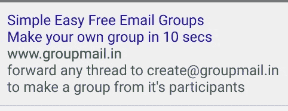
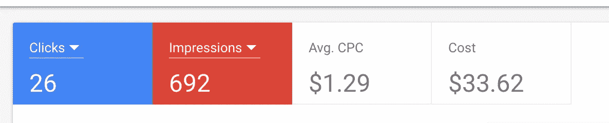
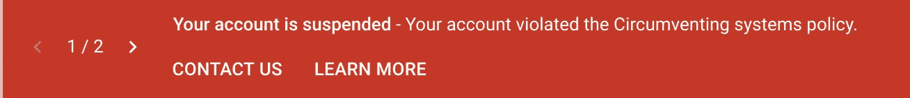
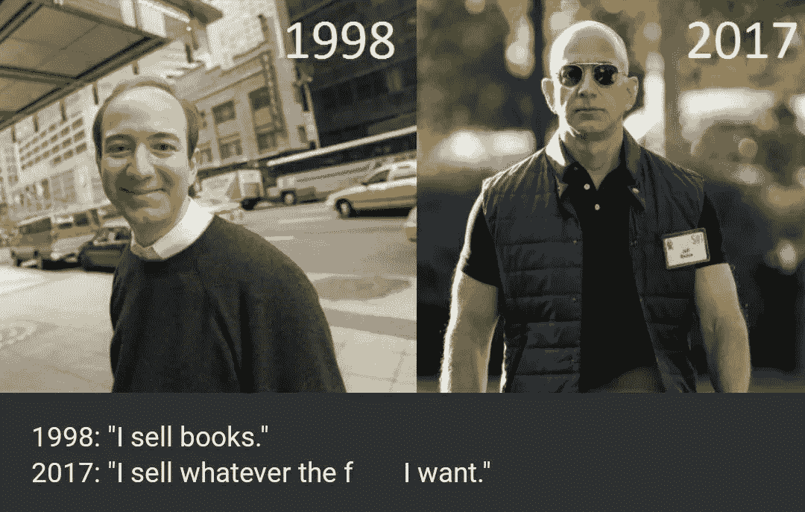
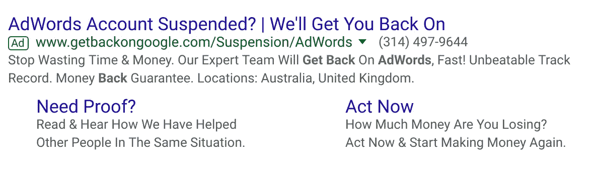

# 我被永久禁止使用 Google AdWords

> 原文：<https://medium.com/hackernoon/getting-banned-from-google-adwords-518d59d881c9>

## 我们的机器人霸主提供客户服务

# 更新

我有一个朋友是谷歌的软件工程师，他提交了一份内部文件来解决这个问题。他说它通过了第一层客户服务。到目前为止一切顺利，对吗？嗯，他今天(2018/11/09)跟我说，票已经内部杀了。如果连内部员工都不能解决这种情况，我只能得出结论，这真的是永久性的。这是一个真正的耻辱，因为我计划使用 AdWords 为[开源答案](https://www.opensourceanswers.com/)购买关于常见错误消息的广告，我认为这将是资助开源开发者并为企业开发者解决问题的一个很好的方式，但这个渠道已经关闭了。

# 概述

我最近辞去了对冲基金的工作，去追求创业。我的假设是，从长远来看，创业优于高薪工作，在创业时，通过选择保守(简单)的问题，并在商业问题上运用理性思维和创造力，可以最大限度地降低失败的风险。我开始记录我的成功和失败[在这里](/@hhuuggoo/entrepreneurship-vs-quantitative-finance-an-experiment-be4fdc05fd8d)，这是第三条。

我的第一个项目是[集团的邮件业务](https://www.groupmail.in)。我将讲述我是如何尝试给群发邮件做广告的，以及我是如何意外地(并且永久地)被谷歌 Adwords 封禁的。

# 营销群发邮件

我刚刚完成了群邮件的建设，我想开始营销它。我迷失了，我在 hackernews，facebook 上发布了链接，得到了一些点击，但不多。开始看关于 [SEO](https://www.kalzumeus.com/2010/01/24/startup-seo/) ，和[长尾关键词](https://www.wordstream.com/long-tail-keywords)。搜索引擎优化分为页面内搜索引擎优化(在你的网站上正确设置 html 以取悦谷歌)和页面外搜索引擎优化(从其他成熟的领域获取链接，以便你在谷歌搜索中排名更高)。曾经有一些 SEO 的黑幕[不再管用](https://cognitiveseo.com/blog/12169/44-black-hat-seo-techniques/)。传统观点认为，创造人们自然链接的好内容是获得好 SEO 的最佳方式。然而 SEO 需要时间，它需要时间产生内容，它需要时间让人们链接到你的网站，让搜索引擎信任你。所以 SEO 并不真的适合快速测试新想法是否可行。

长尾关键词背后的想法是，作为一家初创公司，你永远不会获得像“群发邮件”这样真正受欢迎的短语的排名，然而，更具体的竞争力较低的短语，如“gmail 联系人的免费群发邮件”，你可能会胜出。搜索长尾关键词的人会少一些，但是长尾关键词的人会多一些，所以广撒网就能获得流量。这也适用于 adwords，不太受欢迎的短语每次点击会便宜很多。

# Adwords 上的广告

没时间等 SEO 了，决定从 adwords 入手。我创作了这个广告。

几个小时后它就被批准并开始运行。如果你以前做过网络营销，这个广告的“不不”对你来说是显而易见的。我甚至没注意到。关于我的广告何时开始投放，我有几个问题，所以我联系了客户支持。谷歌给我指派了一个客户代表！一个真正的人能帮我起步，帮我优化我的活动。他打电话给我，似乎很有帮助，但我决定在向他寻求帮助之前先玩一会儿。事情看起来很好。那天，我得到了一些点击，我上床睡觉。

# 麻烦开始了

当我早上醒来时，我收到了两封关于我的帐户被暂停的邮件。一个针对“可疑支付”，一个针对规避系统。当我登录 adwords 时，我看到的是这样的情况。

woah

这很奇怪——我的广告被批准了，而我使用的是我一直使用的信用卡，所以我认为这一定是个错误。如果你点击联系我们，你会被带到一个页面，在那里你可以向谷歌上诉。我不知道我的广告可能出了什么问题——在我开始运营之前它就已经被批准了，我知道我的信用卡是好的，所以我认为谷歌的自动化系统有一个小故障，当一个人审查它时，我就一切就绪了。我得到的回应是:

> 你好，
> 
> 我们很抱歉听说您的 Google Ads 帐户遇到了问题。
> 
> 发生了什么事？
> 
> 我们想让您知道，您的帐户目前正在审查中，我们会优先考虑您可能已经写信给我们的其他问题。
> 
> 我们的专家已经知道这个问题，调查正在进行中。我们出于安全目的定期审查账户，并核实账单信息。
> 
> 你应该期待什么？
> 
> 调查完成后，我们会向您发送更新信息，通常在三个工作日内。
> 
> 一旦我们向您提供了更新，如果您对您的 Google Ads 帐户有任何疑问，请随时回复此电子邮件，或者通过[https://support.google.com/google-ads/contact](https://support.google.com/google-ads/contact)联系我们
> 
> 真诚地
> 
> 谷歌广告团队

好的，听起来不错。等等！我有一个客户代表。当然，与人类交谈将能够解决这个问题！每次给我的代表打电话都会直接转到语音信箱。一旦你被暂停，谷歌不允许任何人与你交谈。我打了 10 次电话！。我留了言解释情况——没有回应。我试着打电话给支持热线，如果我输入我的账号，就会断线。如果我表现得像一个全新的客户，我会得到一个客户服务代理，但一旦我提出暂停，客户支持说他们不能讨论它，也不能帮助你。哦，好吧，希望我们的新机器人领主能帮我解决问题。那天晚些时候，我收到了谷歌的回复。

> 亲爱的广告商:
> 
> 感谢您在此过程中的持续耐心。我们已经确认您的帐户违反了我们的谷歌广告政策。由于这是最终决定，帐户将不会恢复。请避免创建额外的谷歌广告帐户，因为他们将受到同样的暂停。
> 
> 我们的支持团队不能给你更多关于暂停的细节。
> 
> 我们感谢你的理解和合作。
> 
> 真诚地，
> 伊丽莎白
> 
> 您可能会收到一封关于您与谷歌广告支持互动的电子邮件调查。我们重视您的反馈。

我对网络营销一无所知。具有讽刺意味的是，当我在研究联盟营销和亚马逊时，我非常小心。我一直认为亚马逊是一个会在第一时间抛弃分支机构的残忍大师。我读过很多关于如何避免被亚马逊的联盟项目踢出去的文章。

I thought Amazon was the scary one

# 结果

我一直认为谷歌是一个模糊的积极的，不要做邪恶的，无所不知的大公司。事实证明谷歌也很难对付。[我问 reddit 我做错了什么](https://www.reddit.com/r/adwords/comments/926m1x/ad_words_suspension/)。我显然是个白痴。

> 哥们你不能在广告里放邮件哈哈哈

和

> 我很惊讶他们竟然同意开始

好吧——我能理解，我承认我犯了一个错误，犯了一个不不，我再也不会这样做了。然而，现在我被禁止从谷歌广告永远。不仅仅是那个账户。不仅仅是群发邮件。一周后，我决定在房地产方面做一些试验，所以我买了域名 watsonvillehousesforsale.com，建了一个登陆页面，还买了一些广告。3 天内，我的账户因“可疑付款”被暂停。我用了另一张信用卡，但那张信用卡也是在我的名下。我被切断了，我甚至不能和一个人说话来解决这个问题。实际上，还有另一个雨果·史(Hugo Shi)是一位艺术家。你真倒霉！你可能也被禁止了！我希望你永远不需要在谷歌上打广告！

How I Feel

这让我意识到我是多么不喜欢一个实体在互联网上拥有如此大的权力。你可能会想，如果你在制作广告方面不是一个白痴，你就不会有这个问题。确实如此，而且如果你保证你在谷歌的眼里永远不是傻逼，那么我想这对你来说没问题。但是请考虑以下情况

1.  也许你雇佣了一个廉价的 SEO 公司，他们雇佣了一些黑帽策略，现在你的页面被[从谷歌搜索中禁止](https://www.seoworks.com/banned-from-google-what-now/)
2.  也许你雇佣了一个糟糕的营销公司，他们用 AdWords 做了一些坏事
3.  如果您的 gmail 帐户遭到破坏，有人用它发送垃圾邮件，并且您的 gmail 帐户被关闭，该怎么办？

必应只有 10%的市场份额，是第二名的有力竞争者。因此，就获得付费搜索流量而言，真的没有其他选择。我鼓励每个人想一想，如果你失去了 GMail 账户，会发生什么

# 结论

总之，我对谷歌控制互联网的所有意图和目的感到非常不舒服。但是现在有点太晚了。也许新的[去中心化互联网将拯救我们](https://beakerbrowser.com/)。我确实认为你应该认真审视一下你的公司依赖，并弄清楚你能做些什么来最小化你的风险。对我来说，我可能只需要弄清楚如何雇用一家公司在 AdWords 上为我做广告，或者专注于其他广告渠道更值得的业务。或者这些公司中的一个可以让我回到 adwords

我也认为这有点疯狂，你可以为一家公司购买 AdWords 广告，让人们回到谷歌 AdWords 上，但我的所作所为让我终身被禁。

感谢阅读！。我过去的项目是关于简单易用的电子邮件组的，以及获得开源项目的[帮助的](https://www.opensourceanswers.com)。我目前的项目是提供[云托管的 Jupyter 笔记本](https://www.saturncloud.io)。在本系列的下一篇文章中，[我将讲述如何构建群邮件](/@hhuuggoo/building-groupmail-a-group-email-service-fa8ce4a17fc3)..在本系列的下一篇文章中，我将讲述我是如何在 Mechanical Turk 的帮助下优化 GroupMail 登陆页面的。

**脚注**

1.  好的，实际上我在 2013 年创建了我的第一个 adwords 账户。我花了 5 美元买了它，然后就分心去做别的事情了。那个账户还在，但我敢打赌，如果我开始使用它，它就会被关闭。
2.  如果有人能让我回去，我的联系人是 hugo.r.shi@gmail.com