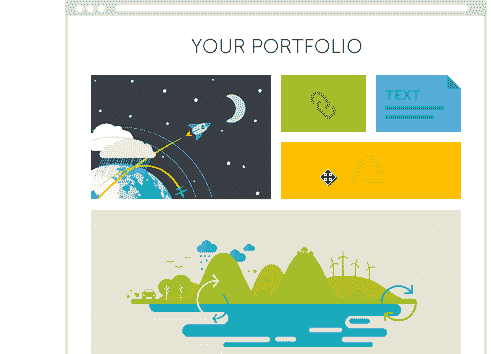
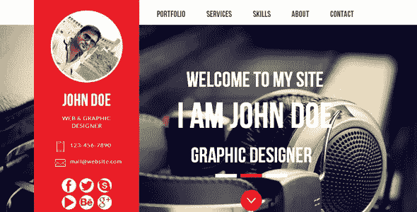

# 在 2018 年找到工作——建立有吸引力的在线投资组合的关键

> 原文：<https://medium.com/hackernoon/getting-hired-in-2018-the-keys-to-building-an-attractive-online-portfolio-a1cf2ca834eb>

## 如何建立雇主会喜欢的工作组合

[pathbrite.com](https://pathbrite.com/)

当招聘非技术和技术职位时，公司正在寻找主动、团队合作并为组织提供卓越价值的全明星人才。然而，当你申请一份工作时，你的简历就变成了一张纸:一页纸的你是谁的简介。

你的简历中真的有足够的东西让你与众不同吗？真的足够展现自己的真实潜力吗？许多招聘人员和招聘机构直截了当地说:“不。”

# 建立在线投资组合的理由

如果你在一个技术领域，这并不重要；被录用是为了增加你在招聘经理、招聘人员和其他利益相关者面前的可见度。如果你希望得到那份梦寐以求的工作，你需要展示自己，而不仅仅是一份简历。

> Cielo 北美执行副总裁兼董事总经理安吉拉·希尔斯(Angela Hills)在接受《纽约时报》采访时说:“在网上持续记录你的成就会让你在网上引人注目，让你在招聘者面前脱颖而出。”。“拥有特定技术技能的人，比如工程师和程序员，可以展示他们建立的网站或使用特定编程语言的项目的例子。 ***不要只是告诉我你有这方面的知识；给我看看你是怎么用的。***
> 
> ****《纽约时报》执行副总裁安吉拉·希尔斯****

# ***显示，不告诉***

*简历会告诉人们你做了什么，但不会切实展示你的劳动成果。它们变成了一堆单词，你试图把让你看起来与众不同的短语串在一起。*

*问题是大家都这样。说你做了什么是一回事，表现出来又是另一回事。不要说:“我很擅长写作”，而是链接到你写的一篇文章，这样面试官就能一窥你的想法。现在，当你接受采访时，他们会问你关于你的文章，以了解更多关于你的思维过程，你的目标受众和结果。*

# *你成就的常青历史*

*假设你是一名崭露头角的平面设计师。如何让潜在雇主注意到你特别引以为豪的设计？你已经给 30 家公司投了简历，那么他们怎么知道简历的存在呢？*

*如果你有一个在线作品集，那么你的简历上就会有一个与你的设计历史相关的链接。你所要做的只是上传你的新项目，每个访问你的作品集的招聘经理都会看到。*

**

# ***讲故事***

*人们喜欢故事。它们令人难忘，并且在情感上与我们联系在一起。在线作品集让你有机会讲述一个关于你自己的故事，展示你是如何思考的，展示你是如何解决问题的，并让你更深入地了解你是一个怎样的人。*

# ***竞争优势***

*如果你不得不在两个简历完全相同的候选人之间做出选择，你不会倾向于选择一个有强大投资组合的人吗？此外，如果有人比你更有经验，但你有一个稳健的在线投资组合，那么他们是否仍比你有优势？也许是，也许不是。*

*在这两种情况下，在线作品集都给了你一个机会，让你在面试过程开始前进行一次小型面试。它让你解释事情，缓和假设，否则可能会让你看起来不那么令人满意。*

**

# *如何建立投资组合*

*理解投资组合的价值是一回事。但是如果你想建立自己的公司，你需要遵循一些步骤，这样你就不会制造更多的问题。当然，如果你是一名开发人员/工程师，最好使用期望的框架来构建你的投资组合。对于那些不太专业的人，你可以遵循这个过程:*

***选择内容管理系统和服务器提供商***

*[**Weebly**](https://www.weebly.com/) 或 [**Wix**](http://www.wix.com/) 都是入门的好地方。如果你想要一个更健壮的解决方案，你也可以使用 WordPress。这些基本上都是点击式界面，允许您快速上传、编辑和部署内容。当然，你将不得不付钱，但是每月一小笔投资可以让你找到一份理想的工作。*

***综合并组织你的内容***

*确定你想申请什么工作，以及他们对候选人有什么要求。是分析师岗位吗？然后精心制作你的文件夹，展示一些你利用了你的分析技能的项目。是设计岗位吗？然后展示你的设计思想，你是如何制作它们的，以及所有不同的迭代。是写作吗？展示你的作品，它在哪里出版，以及一些关于它被接受程度的统计数据。*

***选择个人域名***

*你不一定需要一个个人领域，但这是一个很好的接触，让你看起来更专业。你可以用你名字的排列每年花几美元得到一些域名。你需要一个”。com”才能成功？不。你不是想通过有机搜索引擎优化和谷歌搜索出名，所以任何顶级域名标签都可以。*

***将你的作品集与专业资源联系起来***

*你的作品集应该是你职业成长的常青树。确保它与你的简历、你的 LinkedIn 和你经常使用的任何其他专业媒体平台有清晰的联系。始终确保您的内容保持最新，并在项目和工作完成时上传它们。*