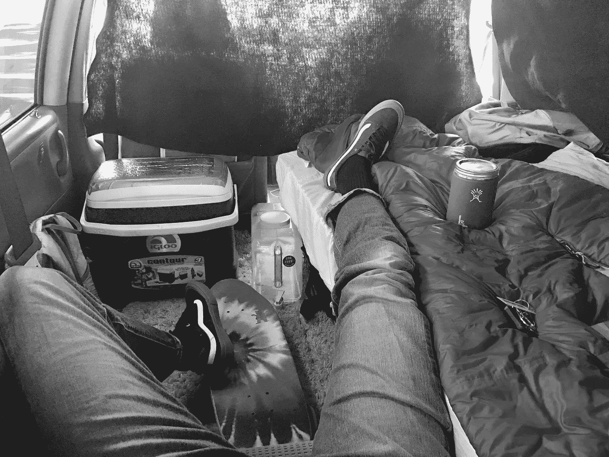

# 在苹果工作，住在我的货车里

> 原文：<https://medium.com/hackernoon/getting-out-of-debt-and-becoming-a-developer-how-living-in-my-van-gave-me-both-ad3f9e708e6b>

当人们问我为什么在一辆小货车里住了将近一年时，我的回答是“这不是因为我必须这样做”。我的目标是，尽快摆脱债务，开始为我的未来投资。我没有住在面包车里，因为我的生活环境太糟糕了，我不得不呆在那里，而是住在面包车里让我摆脱了长期债务，并对挑战有了新的看法。

2016 年 12 月，我第一次睡在我的 1999 年雪佛兰 Prizm 里，并把我的东西放在加州山景城的一个当地仓库里。起初很有趣，反正我是一个攀岩者，攀岩社区的绰号似乎是“[人渣](https://www.tetongravity.com/story/lifestyle/17-signs-you-might-be-a-dirtbag)是有原因的。我确实觉得有点疯狂，因为大多数人都愿意离开舒适的漂亮公寓，住在自己的车里。但与我们对自由是什么或应该是什么的大多数信念相反，选择住在我的车里给了我前所未有的自由，这并不是因为我可以随时随地睡觉。

当然，自由是有代价的，是的，约会和邀请朋友过来似乎很难，但我愿意妥协这些事情，我发现 6 个月后，我真的对这些限制更满意了。举个例子，我住在湾区，在这里[六位数的工资可以被认为是“低收入”](https://www.mercurynews.com/2017/04/22/in-costly-bay-area-even-six-figure-salaries-are-considered-low-income/)，所以想象一下其中的大约一半(不包括税收减免)，你就会开始明白为什么在苹果公司工作甚至不能让一个刚毕业的大学生摆脱湾区的债务。

成为一名开发人员，无论是软件质量保证、软件工程还是任何介于两者之间的工作，都需要牺牲大量的时间和精力，还要在顶级职位的面试和申请过程中克服巨大的竞争障碍，尤其是在硅谷。我把我们当前的“科技热”与 1848 年著名的加州淘金热相提并论是有原因的。所以你已经听说了中产阶级化，听说了住在货车里的故事，坦白地说，并不惊讶湾区在 WalletHub 的[“最多样化”群体](https://www.kqed.org/news/10435390/bay-area-cities-among-most-diverse-in-u-s)中有很好的代表。那么，为什么来到这里，做出牺牲，在某些情况下被迫完全节俭，只是为了满足你或你的家人最基本的需求？

机会是王道，哪里有工作，哪里就有人来，就这么简单。我并不是说湾区没有大的周转率，但我们确实看到大量的需求正在填补先前存在的技术空白。我在这里是因为生活让我来到了这里，就业市场也为我提供了机会。作为苹果公司的一名承包商，在海湾度过过去的两年是…至少可以说是有趣的。在与苹果合作的机构签约之前，我对作为一名承包商意味着什么知之甚少，似乎每年我都要学习大量你可能会说的新“技术”，以应对有些严峻的现实。

> 一个普通承包商的生命周期可能看起来是这样的:你签了短至 3 个月或长至 3 年的合同(有你的签字同意，你可以在任何时候被解雇)，这将结束(如果你足够幸运地坚持到最后)，你将进入[失业](http://www.edd.ca.gov/Unemployment/UI_Online.htm)(是的，那也是征税的)，然后希望你找到另一份合同或在你不存在的租金控制迫使你使用你剩余的存款之前被重新雇用到你的前一份合同。

现在我并不想带来坏消息，但看起来我不得不这样。我和太多聪明可爱的同事一起工作和交谈过，他们被解雇了，很大程度上被利用了，对这种越来越普遍的就业现象只字不提。**如果说这篇文章有什么作用的话，那就是帮助其他进入湾区“科技热潮”的人为他们可能遇到的情况做好准备。**

那么我该怎么做呢？我还住在我的货车里吗？我是不是因为营养不良差点死掉？好吧，我在我的货车床脚逃脱了死亡，我不再住在我的货车里了，我在甲骨文找到了一份全职的网页开发工作。**但在一个令人不安的硅谷式的第 22 条军规中，一旦你成为合同工，招聘人员真的只会这样看待你，只会向你寻求……更多的合同工职位。**这并不是说你不能从合同工变成全职员工，但我觉得这种情况正在减少。

我需要逃离这个鬼地方，对于这种脆弱的就业形式，我能采取的最强大的行动就是参加训练营或者获得另一个学位。Bloc 是我选择的武器。它提供了令人难以置信的毕业生成功的工作证明，灵活的在家工作课程和按比例支付选项，以实现最终的训练营套餐。

这种[全栈网络开发](https://www.coursereport.com/schools/bloc#/courses)学徒制没有先决条件，没有额外的费用，但有一个良好的训练营的所有严格的品质，包括每周的导师会议，以及大量的互动直播课程，以补充他们的核心课程。

但正如我之前所说的，这是一个极其严格和自定进度的选择，如果你不致力于努力工作并严格自律，这可能会带来麻烦。第一次学习[普通 JavaScript](https://medium.freecodecamp.org/is-vanilla-javascript-worth-learning-absolutely-c2c67140ac34) 时，在他们人员不断的导师协助门户的帮助下，我克服了许多棘手的情况。

至于我住在面包车里的日子，我学到了我没想到会学到的东西，找到了一个女孩(住在面包车里时)，我现在幸福地和她结婚了，并且可以全心全意地说*舒适是癌症……*这是我祖父传下来的一句话。生活在不适中迫使我找到一种方法，把我需要的所有东西都装进一个非常小的空间里……我指的是小空间，在弄清楚浴室制度时没有犯错的余地，并且总是做最坏的打算……破门而入。

谢天谢地，我想出了一些简单的解决方案，让我的车远离伤害，最大的玩家是我住在一个离散的马自达小货车与有色玻璃。那么看起来有人住在这辆车里吗…不，因为它不是一辆车顶冒烟的巨型奔驰 Sprinter 面包车。是否有一些嬉皮士贴纸贴在后面，以表明有人肯定在某个时候住在车里…当然没有！我有没有明目张胆地打开侧门，在晚上大声播放音乐，或者和受邀的朋友一起小吵大闹……也许有一两次。

当我住在简陋的面包车里时，我追求开发人员职业的原因对我来说是简单明了的。挑战让我感觉充满活力，永无止境的调整事情以确保峰值优化是令人兴奋的，并需要我渴望的创造性出路。当然，无论是在办公室还是在货车里，你可以随心所欲的自由是值得牺牲舒适的。