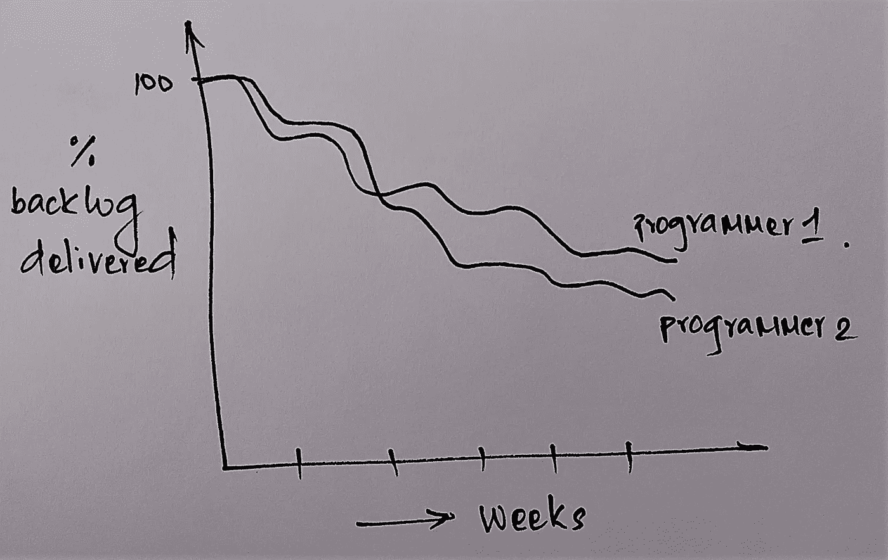

# 说服性配对编程

> 原文：<https://medium.com/hackernoon/getting-pair-programming-right-is-difficult-ac23a81168da>

让*对编程*正确是困难的。只有我们当中的顽固分子才能成功地实现这一点。大多数人已经放弃了。

程序员将不同的先前经验带到一个任务中，合作地，应该交付更好的代码质量，更干净的设计，并且因此，交付**增加的客户价值**。然而， [2009 年对现有结对编程功效研究的荟萃分析](https://www.sciencedirect.com/science/article/pii/S0950584909000123?via%3Dihub)传达了更发人深省的结果。在大多数情况下，额外的成本(努力)可能**而不是**是合理的。

然而，潜在的研究确实有严重的缺陷。这些分析所基于的大多数研究都没有使用专业的程序员。此外，这些研究持续时间非常短，通常只涵盖一项任务。

我怀疑，结对编程的真正价值会在更长的时间内显现出来。在单个项目中，可能会看到 s *打印耗尽*的迹象。但是，在几个项目中，这一点变得非常明显。

那么，我们能做些什么来更好地挖掘结对编程的好处呢？

结对编程是关于正确的群体动力学和心理学。我们能用说服技巧来减轻倦怠的不良影响吗？有没有可能使用神经科学的知识来推动程序员，就像 Joel(Joel on Software 的 Joel)所说的那样，进入“**地带**”？

我们能从这里做些什么:

到这里:

在上图中，这条线越接近 100%显然越好。此外，该图显示了两人的累积努力。因此，理想情况下，交付给客户的故事点应该是单个程序员的两倍。

这种情况很少发生。但是，如果你的图表看起来像上面的图表，月复一月，额外的努力是值得的。您的 3 级支持团队会感谢您改进了代码质量、可读性和可维护性。

乔尔的“区域”，指的是一个孤立的程序员经历高度集中。所有专业程序员都经历过这种情况。对于程序员来说，这是最有生产力的时期。然而，像作家的区块，进入“地带”并不容易。难怪作家需要缪斯的帮助。

> 结对编程的好处是诱人的。认知心理学能被用来把一对对推向这个领域，带来这些好处吗？

对一对来说，进入状态意味着高强度的合作。只有当自我和群体(一对)开始变得模糊时，这种情况才会出现。当程序员反复想象做某件事，然后来到[相信他们已经真正做到了](https://www.psy.plymouth.ac.uk/research/actionprediction/Publications/Wiggett_et_al_SocNeuro_2012.pdf)。

我们应用了恰尔蒂尼博士的两个建议来建立更紧密的群体动力:**持续互惠交流**和**共同创造**。

2015 年，[这篇文章](https://www.nytimes.com/2015/01/11/fashion/modern-love-to-fall-in-love-with-anyone-do-this.html)火了。这是基于一项研究，参与者两人一组，轮流向他们的搭档读问题，他们会回答，然后他们会收到他们的搭档对同一问题的回答。通过这 36 个问题，参与者需要逐渐披露更多的个人信息。一个早期的问题是，“对你来说，什么是完美的一天？”而在这个序列的后面，一个问题会是，“在友谊中你最看重什么？”。

我们的小白鼠的规则，哦，我是说程序员，很简单。

1.  这些节目组鼓励喝咖啡休息。
2.  休息时间不要谈工作。
3.  所有喝咖啡的休息时间都需要以两人一组互相问 2-3 个问题来结束，这些问题是仿照阿伦博士的问题集设计的。

原 [36 题](https://www.nytimes.com/2015/01/11/fashion/no-37-big-wedding-or-small.html)实质上涉及个人。我们的要少得多。例如，我们从第三套中挑出大部分问题，从第二套中挑出相当多的问题。我们的问题集也更小，就像喝咖啡时间一样(我们希望如此)。

结果令人震惊。随着几周时间的推移，我们的专家-新手组合(这种组合似乎效果最好)不断打破他们之前的测量结果。当然，结果是在一个完全不受控制的环境中。不管怎样，我们都很开心。它感觉；程序员们觉得，他们已经进入状态了。

恰尔迪尼建议将“共同创造”作为另一种推动群体动力的方式。他的研究表明，越来越多的经理参与产品开发，导致他们给予产品更高的质量评级。这是可以预料的。你*会*高度评价自己的工作(一般来说)。但是，一个重要的结果是，“经理们越是把项目的成功归功于他们自己，他们就越是把它归功于员工的能力”。

产品负责人(少数情况下也包括 scrum 大师)现在每两个月与 UX 团队会面一次。UX 团队被鼓励*大声思考*。不同的视角为这些*设计思维*对话增添了丰富性。但重要的是，产品所有者的参与度要高得多。团队动力*明显有所改善*！

产品负责人似乎对他们的工作更满意。他们更多地参与客户对话。这应该转化为增加的(感知的)客户价值。感知就是现实。如果顾客开始相信产品更有价值，*那么就是*。

结对编程的所有好处，以及月复一月的生产率提高，似乎都触手可及。这种生产率增长是否会持续？时间会证明一切。

如果其他人有类似的结果，我们可能会有所发现！