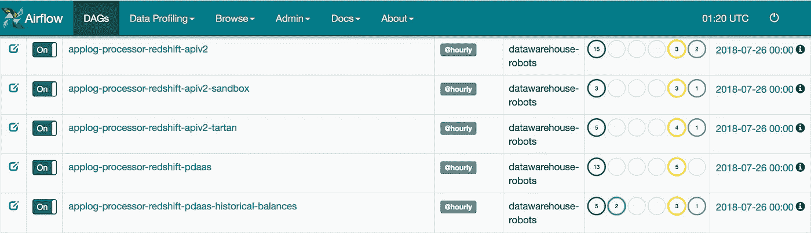
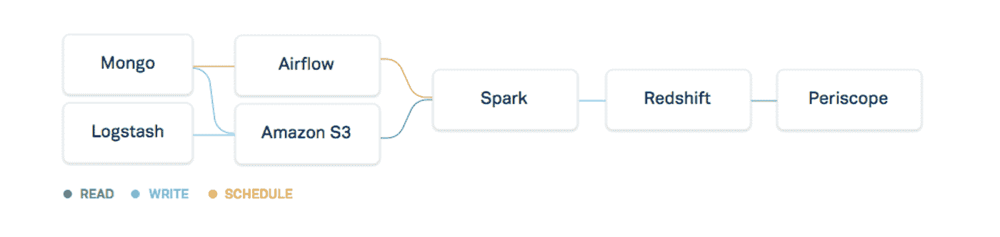
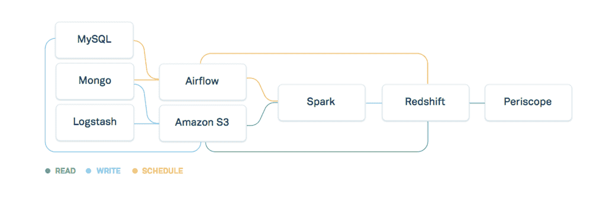
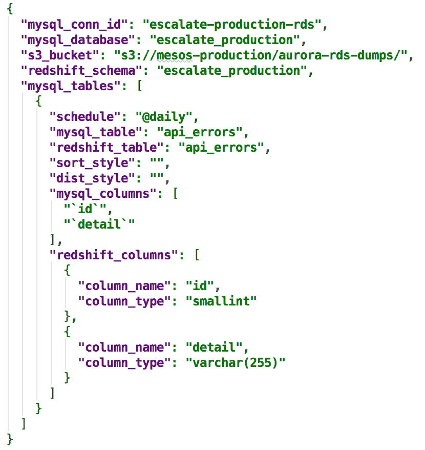
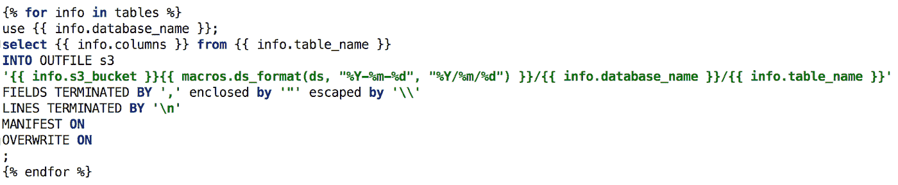
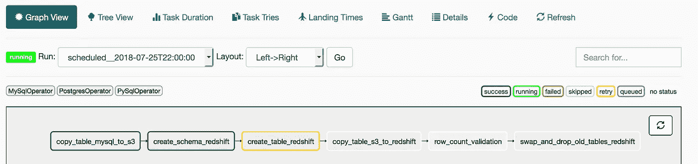
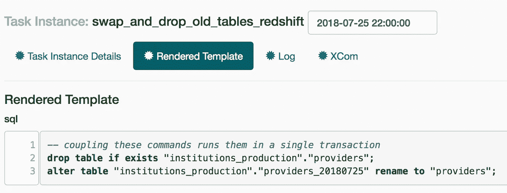
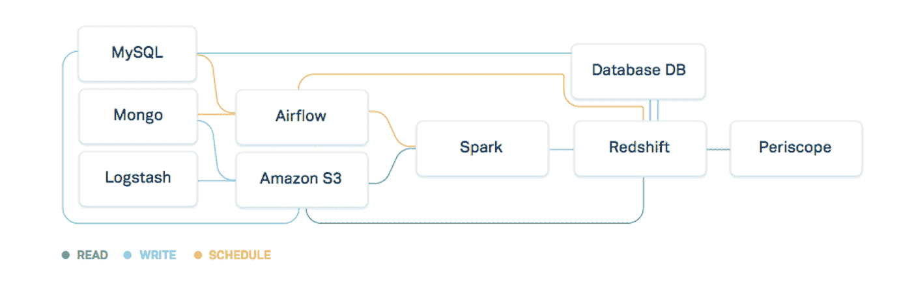
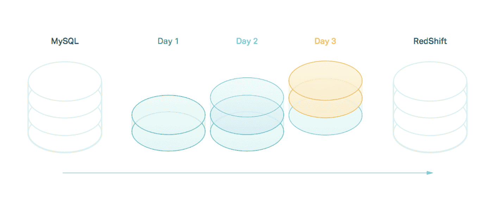

# 通过 MySQL → S3 →红移加速气流

> 原文：<https://medium.com/hackernoon/getting-ramped-up-on-airflow-with-mysql-s3-redshift-defcc4522c8c>

我最近以数据工程师的身份加入了 [Plaid](https://www.plaid.com) ，并开始使用 [Airflow](/airbnb-engineering/airflow-a-workflow-management-platform-46318b977fd8) ，这是一个我们用来管理内部 ETL 管道的工作流工具。如果你完全不熟悉 Airflow，可以把它想象成一个界面更好的升级版 crontab。



It’s fast! It’s flexible! It’s free! It’s Airflow!

在我加入的时候，Plaid 正在迁移到用于可视化 SQL 查询的 [Periscope 数据](https://www.periscopedata.com/),我的直接任务变成了获取更多的数据，人们依赖这些数据来分析我们新生的[红移](https://hackernoon.com/tagged/redshift)集群，即我们从 Periscope 查询的数据仓库。我的同事花了一些时间将我们的 MongoDB 表收集到 Redshift 中，方法是跟踪操作日志并在 Spark 中进行一些后处理，以及在 S3 解析一堆日志转储以创建有意义的分析表。



Plaid ETL pipeline circa early 2018

## 动机

我的同事好心地给我留了一个更简单的任务，帮助我适应 air flow——定期将数据从 MySQL 转移到 Redshift。我们最近开始在 RDS 上使用 Amazon Aurora 实例，需要从 RDS 中获取数据并将其加载到 Redshift 中，以建立这些新数据集的 KPI。



我们的目标是在一周内完成这个练习，所以我们给自己设定了一些限制:

1.  我们将使用 MySQL 的选择 s3 的能力和 Redshift 的卸载命令。
2.  我们每天只对每个表执行一次完整的表复制。由于复制我们最大的表只需要几个小时，我们决定接受每天晚上提取所有数据，这样更容易实现，并且对两个数据源中的变化或不一致更有弹性。
3.  我们将致力于获取最重要的数据，而不是担心像深度嵌套的 json 列或存储在数据库中的二进制图像文件这样的细节。

## 设计工作流程

我们想设计一个从 MySQL 到 Redshift 的转换，并且知道必须有模式的转换。幸运的是，AWS 提供了一个比较 MySQL 和 Redshift 类型的资源[。](https://docs.aws.amazon.com/datapipeline/latest/DeveloperGuide/dp-template-redshift.html)我们可以使用一个简单的查询将模式从 MySQL 中提取出来:

```
**select** 
  table_name, column_name, data_type, ordinal_position, character_maximum_length 
**from** 
  information_schema.columns 
**where** 
  table_schema = database();
```

我们手动处理了一些类型，例如，我们不是移动二进制数据，而是检测一个二进制类型，并返回一个关于列是 null 还是非 null 的布尔值，以避免必须通过网络复制大量二进制数据，这对分析是不可用的。我们将该功能打包到一些生成翻译配置的 python 脚本中。



Example MySQL configuration

然后，我们创建 dag_mysql_processor.py 来接收这些数据库配置并生成相关的 dag。它遍历每个条目，并使用我们使用 [AWS 文档](https://docs.aws.amazon.com/redshift/latest/dg/r_UNLOAD.html)作为指南编写的一系列 SQL 模板生成相应的步骤。例如:



结果是一批 Airflow DAGs，MySQL 数据库中的每个表都有一个。目前，我们每天运行一次这些 Dag，通过每天完全重建一次表，为我们当前的使用情形提供了足够好的延迟。



Our linear DAG pulling data from MySQL to S3 to Redshift

# 道路上的颠簸

第一点麻烦来自尝试热插拔。我们希望在替换旧数据之前确保表看起来是正确的，所以我们添加了一个步骤来验证行数。在我们的 DAG 的第一个版本中，我们将每个语句作为一个单独的气流任务来执行，但是表格偶尔会消失。将交换步骤合并到单个事务性任务中，可以防止我们的全表替换方式出现任何表停机。



V1 of the project had a race condition in dropping and recreating the table.

我们预计完整复制会很麻烦，因为我们的一些表有几十亿行，并且全局“成功或失败”(只进行完整表复制的结果)将很难实时恢复。我们在一些最大的表上运行了一些实验，以了解错误可能发生在哪里，并且`stl_load_errors`很快成为我们的首选调试[工具](https://hackernoon.com/tagged/tool)。

```
**select** * **from** stl_load_errors **order by** starttime **desc** **limit** 1;
```

我们在将列从 MySQL 类型转换为红移类型时遇到了一些问题。通过添加一些逻辑来说明转换过程中的特定类型，并说明我们的模式中的模式，我们能够解决很多这样的问题，我们能够基于列名和类型进行匹配。

```
potential_binary_column = 
  **'md5' in** column_name **or 'uuid' in** column_name
```

错误的另一个罪魁祸首是数据中出现的换行符，这会导致一行被分成两行(或更多行),然后无法解析。这里的解决方案是在等式的两边使用一致且有目的的分隔符。来自 mysql:

```
**select** {{ info.columns }} 
**from** {{ info.table_name }}
**INTO** OUTFILE s3 '{{ info.s3_path }}'FIELDS TERMINATED **BY ','** enclosed **by '"'** escaped **by '\\'** LINES TERMINATED **BY '\n'** MANIFEST **ON** OVERWRITE **ON** ;
```

并将它与红移查询配对

```
**TRUNCATE** "{{ info.schema_name }}"."{{ info.table_name }}";
**COPY** "{{ info.schema_name }}"."{{ info.table_name }}" **from** '{{ info.s3_path }}.manifest'iam_role '{{ PLAID_REDSHIFT_ROLE }}' **DELIMITER** **','
TRUNCATECOLUMNS
EMPTYASNULL
ACCEPTINVCHARS
IGNOREBLANKLINES
NULL AS '\\N'
MANIFEST
REMOVEQUOTES
STATUPDATE ON
MAXERROR** {{ info.max_error }} **ESCAPE** ;
```

# 新一天的黎明——实习生来了

代替硬编码的模式文件，我们希望将配置文件移动到一个持久存储层，我们计划称之为`dbdb`，或数据库-数据库——这是我们从在 Square 工作过类似系统的工程团队成员那里继承的名字。

大约在迈克尔·特鲁特作为软件工程实习生加入我们这个夏天的时候，我们收到了不要称之为`dbdb`的反馈。他确定了对 Plaid 的需求，以支持将 CSV 特别上传到我们的 Redshift 集群，我们同意将 CSV 上传、DBDB 和其他计划中的 ETL 改进合并到更广泛的数据仓库管理之下。



这为我们的开发团队带来了立竿见影的效果。当我们第一次开始使用 Airflow 时，有几个 Dag 由一对配置文件管理，但是几个 MySQL 数据库的增加和用例套件的增加导致团队不得不打开几个 pull 请求来进行配置更改。相反，将状态存储在数据仓库管理器中使我们能够更容易地修改系统——在从上游数据库添加或删除表和列时自动添加和删除表和列，并添加自定义功能，如设置红移排序和分布键，以及为我们的数据库接收部署更好的方法。

我们的一些表有数十亿行，其中许多表要么是“仅追加”的，要么是“滑动窗口”的更新。对于只追加表，众所周知的“低挂果实”是只从数据库中查询新行。对于其他表，更新的行通常是在过去几天内创建的，因此混合使用完全更新、部分更新和增量更新是有意义的。



Iterative loading, easily controlled maintaining state in the Data Warehouse Manager

# 替代解决方案

我们尝试使用现有的解决方案来节省我们的工程工作。这次调查中我们最喜欢的工具是 [Matillion](https://www.matillion.com/) ，如果你正在寻找一个拖放式的数据管道工具，我肯定会去看看。他们提供了一个 Amazon 机器映像(AMI ),您可以将它部署在 AWS 基础设施中，并为这类问题提供强大的支持。最终，我们发现我们的用例需要太多的外部处理，因此 Matillion 不是我们的正确解决方案。

如果你正在寻找云提供商，我们已经成功地使用[缝合数据](https://www.stitchdata.com/)用于数据处理管道，[亚马逊](https://aws.amazon.com/blogs/aws/fast-easy-free-sync-rds-to-redshift/)的这篇文章推荐了其他供应商， [Panoply](https://blog.panoply.io/how-to-move-your-mysql-to-amazon-redshift) 推荐了使用 mysqldump 的类似方法。

# 结论

Airflow 一直是我们的可靠工具，也是我们内部 ETL 工作的重要组成部分。Plaid 可以处理许多不同的数据源，对于非敏感数据集+第三方数据来说, [Stitch](https://www.stitchdata.com/) 和 [Segment](https://segment.com/) 在构建数据工作流中发挥了重要作用。对于我们在本地安全保护伞下的数据，Airflow 已经证明了自己是可靠的、信息丰富的，并且可以被在 Plaid 上增加数据摄取的团队新成员访问。

Plaid 拥有跨越数十亿行的蓬勃发展的数据生态系统。如果你是一个气流老手或生活和呼吸 ETL 管道，我们很乐意聊天！我们特别喜欢开源我们的工作:如果你喜欢处理这类问题，或者认为这个解决方案可以帮助你自己的用例，我们很乐意在下面的评论中联系你。