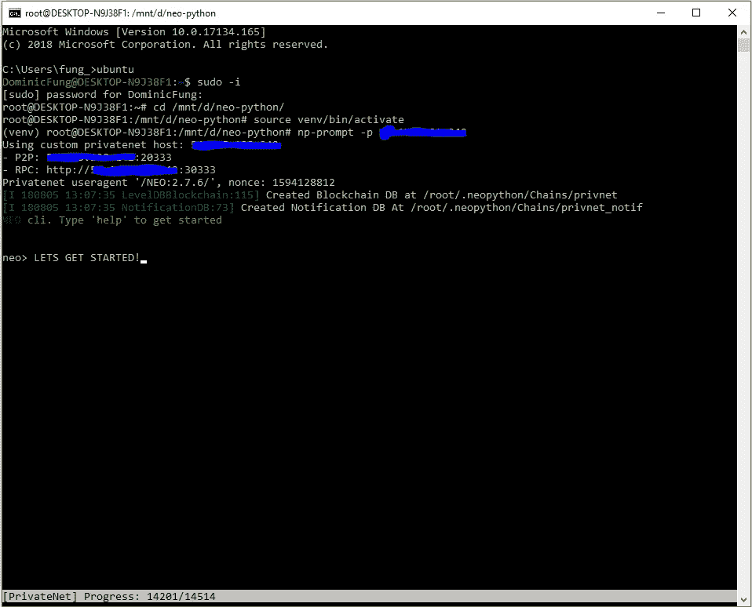
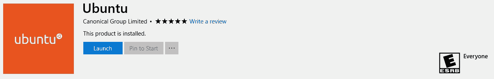
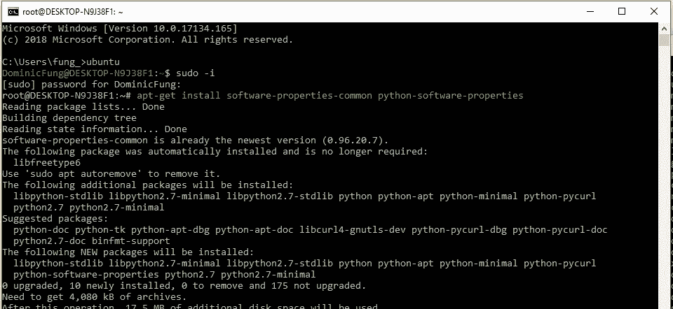

# NEO SmartContract 入门！

> 原文：<https://medium.com/hackernoon/getting-started-on-a-neo-smartcontract-d36927e4bf1f>

在我们开始之前，你可能想知道:什么是 **NEO** ？NEO(前 Antshares)是一家总部位于中国的区块链，它使用*利益证明** 而不是*工作证明*来达成共识。我知道我在大放厥词，但简单地说，NEO 节点/服务器将比其竞争对手更加环保！点击阅读更多关于这个[的内容。](http://docs.neo.org/en-us/basic/consensus/consensus.html)

此外，NEO 的[智能合同](http://docs.neo.org/en-us/sc/introduction.html)可以用任何语言编写！它目前支持 C#、Java 和 Python，并计划在未来[支持 Javascript、C 和 Golang，降低了希望涉足智能合同的开发者的门槛。作为比较，以太坊为契约开发创建了自己的语言 Solidity。](https://hackernoon.com/tagged/future)

希望我已经说服你接触 NEO，但如果没有，你可能想看看我亲爱的朋友 Nathan Mukena 的文章，他写了他是如何发现加密货币、区块链技术和 NEO 平台的！

由于内特涵盖了大的图片，这篇文章将带我们到本质！我们将向您展示如何建立一个开发环境，为您和您的朋友构建一个私有的[网络](https://hackernoon.com/tagged/motivation)，编写/编译您的第一个智能合同，甚至如何创建一个 React 应用程序来与您新部署的合同进行交互！~

激动吗？！让我们开始-

在一个新的区块链平台上构建智能合同可能是一项艰巨的任务。第一步:设置您的环境！



我们将专注于降低成本，安装 NEO-python CLI，通过 AWS 运行我们自己的区块链专用网络，并部署第一份合同！~

查看 [Alex Guba](https://medium.com/u/f277ee6f34f?source=post_page-----d36927e4bf1f--------------------------------) 获得更多深入指导！

第一步:在你的 windows 机器上允许 Linux 子系统！

打开 *Windows PowerShell* 并使用以下命令 *:*

```
Enable-WindowsOptionalFeature -Online -FeatureName Microsoft-Windows-Subsystem-Linuxrestart
```

**第二步:** [下载](https://www.microsoft.com/en-ca/store/p/ubuntu/9nblggh4msv6?rtc=1) +启动 Ubuntu 环境



打开*命令提示符*并启动 Ubuntu *:*

```
ubuntu
```

*设置您的 root 用户名/密码

**第三步:**安装 python 3.6.5，在 Ubuntu 上运行以下命令:



```
sudo -iapt-get install software-properties-common python-software-propertiesadd-apt-repository ppa:deadsnakes/ppaapt-get updateapt-get install python3.6 python3.6-dev python3.6-venv python3-pip libleveldb-dev libssl-dev g++
```

**第四步:**安装 NEO-Python

打开一个新的*命令提示符*，克隆 neo-python 项目:

```
cd <storage location>
git clone [https://github.com/CityOfZion/neo-python.gi](https://github.com/CityOfZion/neo-python.git)t
```

回到 *Ubuntu 终端*:

```
cd /mnt/<drive+storage location>/neo-python
python3.6 -m venv venvsource venv/bin/activate
pip install -e .
```

**第五步:**运行 NEO-Python 提示符*(来自 Ubuntu)* ！

```
np-prompt
```

您现在已连接到**公共** NEO 网络！下周，我们将研究创建一个**私有**网络，您和您的朋友可以在其中连接并部署您的第一个智能合同。

查看我目前正在进行的项目！ [Nodis.io](https://nodis.io) 是一个面向当地企业的营销平台，通过小型活动产生参与度，并向用户奖励加密货币，用户以后可以在这些商店消费。

**下周指南:**在 AWS 上建立自己的私人 NEO 网络。