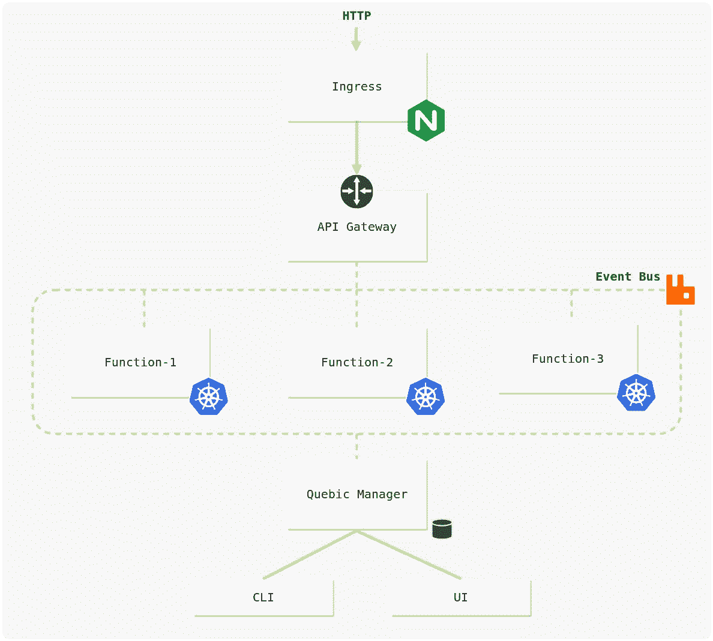
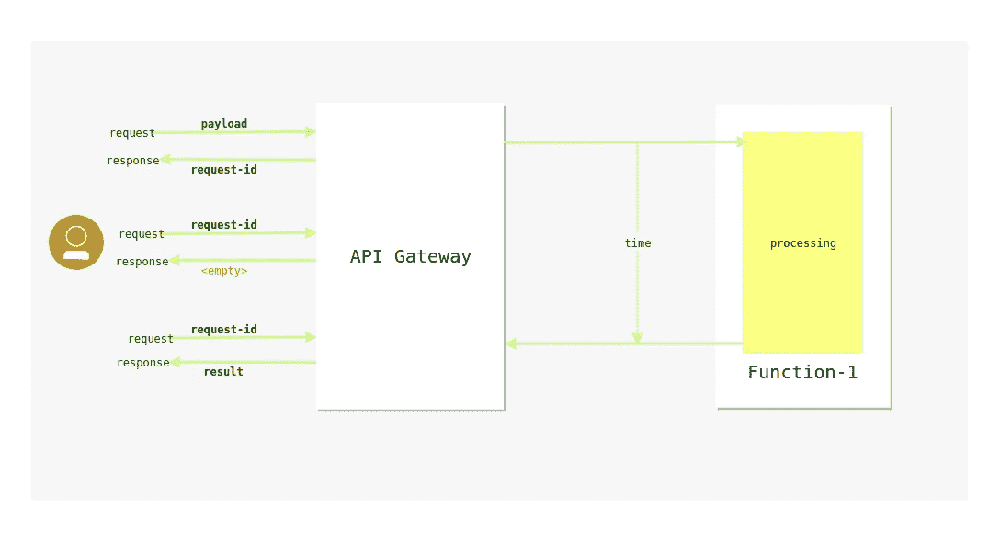

# 开始—魁北克 FaaS 框架

> 原文：<https://medium.com/hackernoon/getting-started-quebic-faas-framework-c05ca0e13e08>

大家好，今天我要介绍的是奎比奇- FaaS 框架。Quebic 提供了编写在 Kubernetes 上运行的无服务器函数的方法。它支持 Java、Python、 [NodeJS](https://hackernoon.com/tagged/nodejs) 运行时。

Quebic 与现有 FaaS [框架](https://hackernoon.com/tagged/frameworks)的主要区别在于，使用 Quebic，您可以开发高度可用的后端来提供实时服务，并支持按需执行任务。大多数现有的 FaaS 框架最适合于按需执行任务。

## 主要话题

1.  先决条件
2.  Quebic 的高级概述
3.  设置 Quebic
4.  API 网关
5.  功能

# 1.先决条件

在启动 Qubic 之前，您需要设置 Kubernetes 集群。有几种方法。在这里你可以找到更多的细节。

您可以在您的本地机器上轻松设置 [Minikube](https://kubernetes.io/docs/setup/minikube/) ，这将提供单节点 Kubernetes 集群。

或者可以使用[托管解决方案](https://kubernetes.io/docs/setup/pick-right-solution/#hosted-solutions)如 Google Kubernetes 引擎、Azure Kubernetes 服务、Amazon Elastic Container Service for Kubernetes 等。

# 2.Quebic 的高级概述



## 魁北克经理

主控制器，负责部署和管理功能和其他组件。

## 功能容器

用户提供的源代码正在函数容器内运行。功能容器由 quebic-manager 部署到 kubernetes 中。

## 事件总线

将事件从发布者传递给消费者。由 RabbitMQ 提供支持。

## API 网关

将 HTTP 负载转换为事件负载。

## Nginx 入口

外部客户的大门。用作 API 的代理。

## 魁北克 CLI

命令行界面(CLI)是一个工具，它提供了与 quebic-manager 通信的界面。

# 3.设置 Quebic

## 下载二进制文件

从[这里](https://github.com/quebic-source/quebic/releases)下载二进制文件。保存并提取到首选位置。

## 运行 quebic 管理器

跳转到 Quebic 二进制位置。然后运行这个命令

```
quebic manager start
```

这个命令在 Kubernetes 集群中部署并启动 quebic-manager。设置入口需要时间。如果您在 MiniKube 集群中使用，这将需要几秒钟的时间。但是对于像 GKE 这样的托管集群，这需要几分钟的时间。

## 将 cli 与管理器连接

此命令将配置 quebic-cli 以连接 quebic-manager。

```
quebic manager connect
```

与 quebic-cli 相关的所有配置都位于$HOME/中。quebic-faas/cli-config.yml 文件。以上命令将更改 quebic-manager 连接字符串。

## 检查 quebic-manager 的状态

要检查管理器的状态，请运行以下命令。

```
quebic manager status
```

## 获取 quebic 管理器日志

您可以通过运行以下命令获取 quebic-manager 的日志。

```
quebic manager logs
```

# 4.API 网关

正如我提到的，所有通过 nginx-ingress 进入 API 网关的流量。要获取入口详细信息，请运行以下命令。

```
quebic ingress describe
```

它将显示入口的 IP 地址。您可以通过将主机头设置为 *api.quebic.io* Sample curl 命令来访问 API 网关。

```
curl http://<ingress-ip>/<resource-path> -h "Host: api.quebic.io"
```

# 5.功能

在这个演示中，我将创建两个函数。一个是*用户验证功能*，另一个是*用户创建功能。*

## 用户验证功能

在这个函数中，它接收一个用户对象作为输入，然后从用户对象获取电子邮件属性。最后，它检查电子邮件是否有效，然后回复。这是它的源代码。

在创建函数之前，您必须提供函数的规范。根据该规范，quebic-manager 将其部署到 Kubernetes 中。这是用户验证函数的规范文件。

在**函数**部分，您可以定义函数的运行时配置。

*第 2 行*:功能名称

*第 3 行*:函数的源位置。NodeJS 运行时支持单个源文件或打包的 tar.gz 文件。

*第 4 行*:函数的导出处理程序。

**<处理程序文件>。<导出的处理程序>**

*第 5 行*:功能运行时间

*第 6 行*:您需要为该功能保留的副本数量

第 7–8 行:活动列表。函数可以监听多个事件。

*第 9–11 行:*环境变量

在 **route** 部分，您可以定义如何配置 HTTP 路由以通过 API 网关访问该功能。

*第 14 行* : HTTP 方法

*第 15 行*:访问函数的资源路径

*第 16–18 行*:HTTP 请求参数和事件负载属性之间的映射

*第 19–20 行* : HTTP 头需要传入函数

让我们创建这个函数。将函数规范文件的文件路径设置为- file 参数。运行此命令。

```
quebic function create --file <user-validate-function-spec>.yml
```

创建函数后，您可以使用 Quebic CLI 测试它。运行此命令。

```
quebic function test --name <function name> --payload '{"message":"hello"}'
```

这就是如何通过 API 网关执行功能。样本卷曲命令。

```
curl [http://<ingress-address>/users/validate?q=t1@gmail.com](http://[ingress-address]/users/validate?q=t1@gmail.com) -H "Host: api.quebic.io"
```

## 用户创建功能

这个函数接收用户对象。然后发布由用户验证函数监听的*用户验证*事件。然后用户创建函数等待，直到收到用户验证函数的响应。

如果 responses 是 success one，那么它创建一个新用户并返回创建用户的 id。否则返回错误响应。这是用户验证函数的规范文件。

这是它的源代码。

这是用户创建函数的规范文件。

我已经涵盖了前一节的大部分内容。

*第 3 行:*函数的源位置。Java 运行时支持 jar 文件。

*第 4 行:*处理程序的类路径。

*第 8–12 行:*正如我前面提到的，Quebic 最适合高可用性后端，也支持执行按需任务。

使用 Quebic，你可以根据自己的需求配置函数容器的唤醒方法。这意味着开发者可以通过请求配置函数来启动它的容器，也可以配置容器的理想超时。或者开发者可以配置函数来连续运行它的容器。

在这里，我将这个函数配置为根据请求加速旋转。

*第 17 行:*异步调用*。*通过配置 API，网关不会等到任务完成。它立即向 API 调用者返回 r *请求 id* 。然后 API 调用者可以使用那个 *request-id* 检查其请求的响应。最终，呼叫者的请求得到了响应。



使用此命令创建函数。

```
quebic function create --file <user-create-function-spec>.yml
```

这就是如何通过 API 网关执行功能。样本卷曲命令。

```
curl -v --request POST -H "Content-Type: application/json" --data '{"email":"[t1@gmail.com](mailto:t1@gmail.com)", "name":"quebic"}'  [http://<ingress-address>/users](http://[ingress-address]/users) -H "Host: api.quebic.io"
```

It response request-id 获取请求的响应。这是一个 curl 命令，通过传递 request-id 来获得响应。

```
curl [http://<ingress-address>/request-tracker/<request-id](http://[ingress-address]/request-tracker/[request-id)> -H “Host: api.quebic.io”
```

我已经介绍了 Quebic 的大部分关键功能。你可以在[这里](https://github.com/quebic-source/quebic-sample-project/tree/master/demo-1)找到相关的源代码。如果你想知道如何将 Quebic 用于基于微服务的开发，请参考本文[事件驱动的微服务与 Quebic](https://hackernoon.com/event-driven-microservices-with-quebic-f65f99a5b25a) 。我真的很期待你的反馈。如果你有任何疑问，请在下面留言。谢谢你。