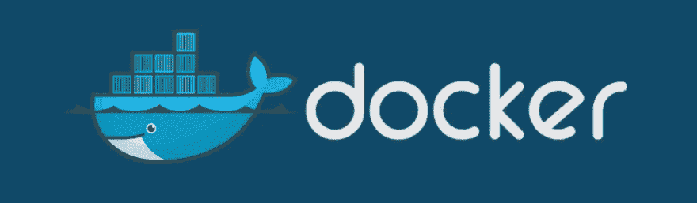
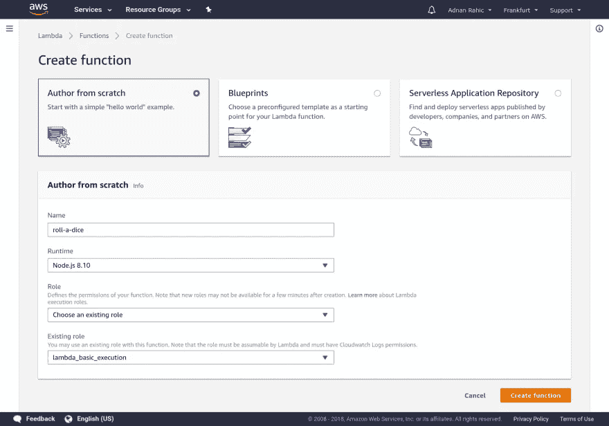
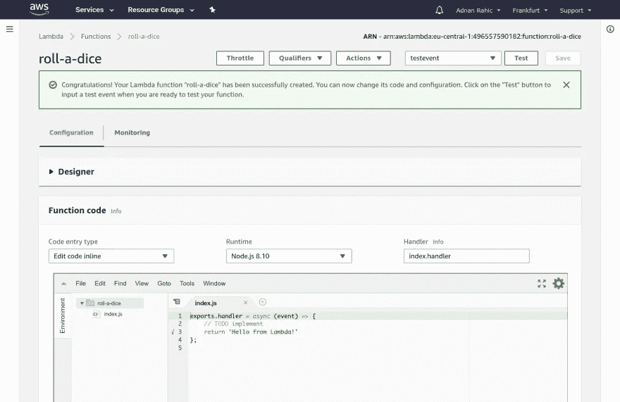
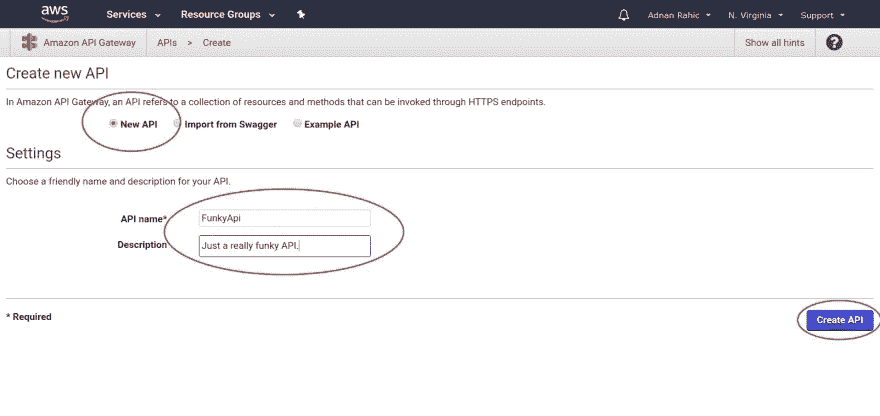
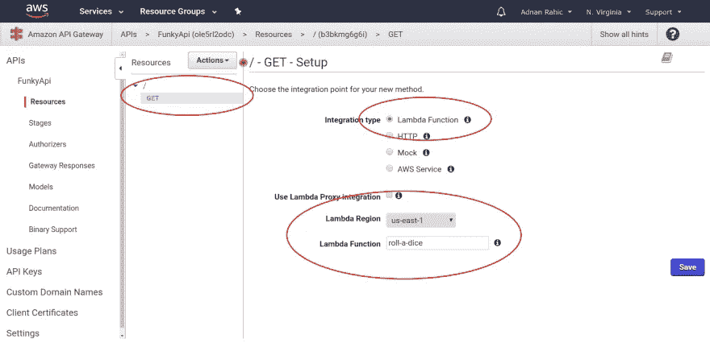
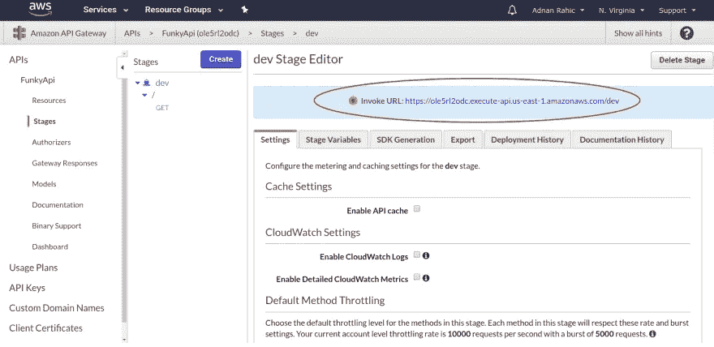
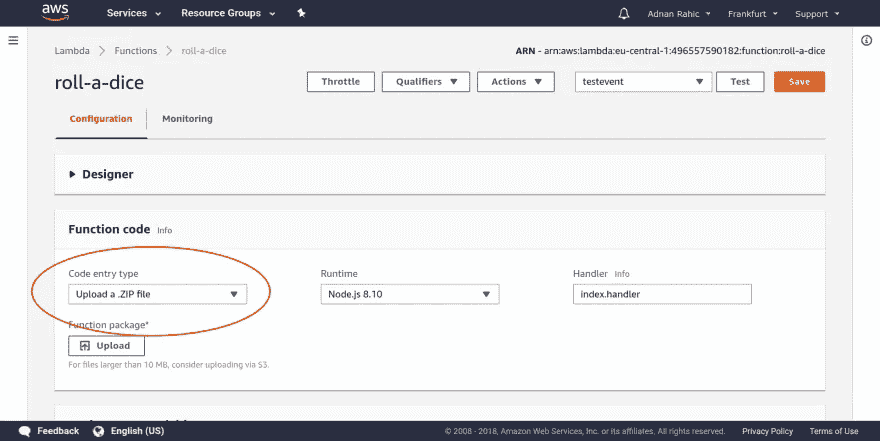
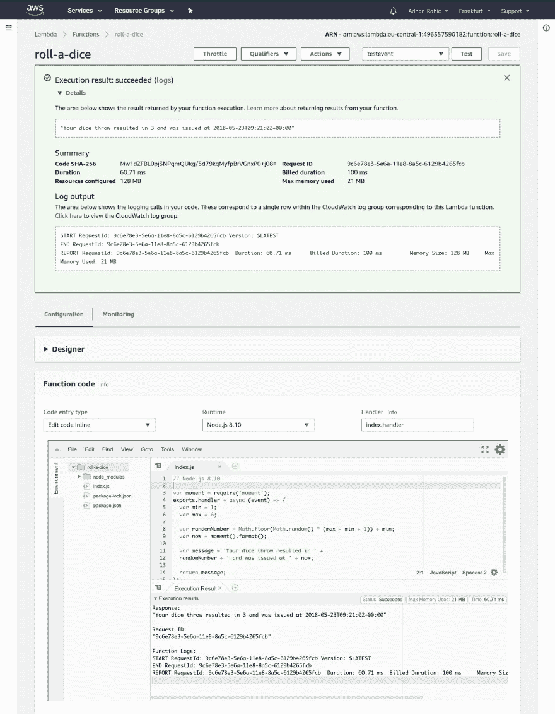
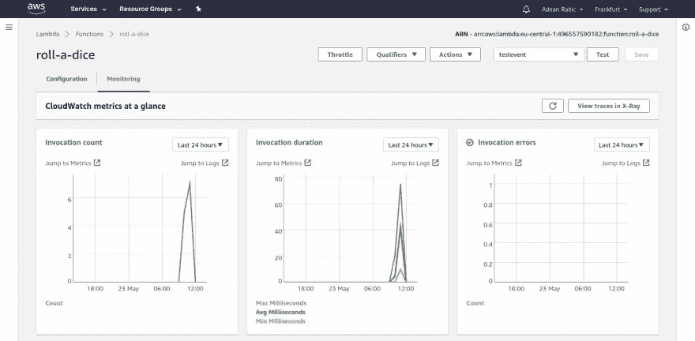
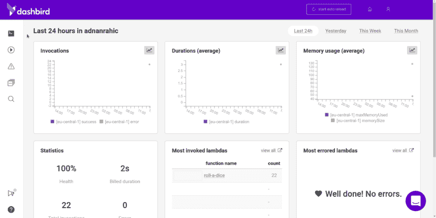

# AWS Lambda 和 Node.js 入门

> 原文：<https://medium.com/hackernoon/getting-started-with-aws-lambda-and-node-js-4ce3259c6dfd>


很久很久以前，有一句话引起了我的注意。**λ**。这引起了共鸣，想起了小时候玩半条命的美好时光。我一点也不知道 AWS Lambda 是什么，以及它有多棒。如果你感兴趣，留下来。我只占用你已经很忙的一天几分钟，你肯定不会介意的。

## TL；速度三角形定位法(dead reckoning)

*   [功能即服务](#20c4) —定义 AWS Lambda 背后的架构。
*   [创建你的第一个函数](#0883)——通过 AWS 控制台创建一个简单的 Lambda 函数。
*   [编写一些逻辑](#4b8e)——添加一些*真实的*逻辑到混音中，并编写一个随机骰子滚动函数。
*   [连接一个 API](#90bc) —通过 AWS API Gateway 增加一个事件触发器来触发该功能。
*   [上传带 zip 文件的代码](#c4b7) —添加 npm 模块并上传为. ZIP 文件。
*   [监控](#a10c) —监控工具概述。使用名为[仪表板](https://dashbird.io/)的[自由工具](https://dashbird.io/pricing/)进行调试。

# 作为服务发挥作用

让我们直接开始吧。AWS Lambda 所属的架构被称为[无服务器计算](https://en.wikipedia.org/wiki/Serverless_computing)或[功能即服务](https://en.wikipedia.org/wiki/Function_as_a_service)。这是开创性的，因为缺少服务器。听起来很奇怪。代码不会在土豆上运行，对吧！？好吧，那只是一种说法。实际上，作为开发人员，您不需要担心代码运行的基础设施。您将代码部署到云中，它自己处理所有需要的资源的创建。但是怎么做呢？集装箱！


不，不是那些。这些！



> Docker 是全球领先的软件容器平台。开发人员在与同事合作编写代码时，使用 Docker 来消除“在我的机器上工作”的问题。运营商使用 Docker 在隔离的容器中并行运行和管理应用，以获得更高的计算密度。企业使用 Docker 构建灵活的软件交付管道，以便更快、更安全、更自信地为 Linux、Windows Server 和 Linux-on-mainframe 应用交付新特性。

每当一个 [AWS Lambda 函数](https://aws.amazon.com/lambda/)被创建时，一个容器就会旋转起来为它服务。尽管它实际上不是 Docker 容器，而是由 AWS 构建的专有容器。我只是用了这个例子，这样你会更容易理解。

代码被部署到容器中，然后被执行。从而使每个后续请求更快，因为如果容器已经存在，AWS 将跳过容器的初始创建。

# 创建您的第一个函数

在看到代码之前，您需要在 AWS 控制台中创建新函数。也就是说你需要一个 AWS 账户。如果你没有帐户，不要犹豫创建一个，他们有令人难以置信的免费层，包括各种服务，并持续长达 12 个月。

继续，打开浏览器，导航到你的账户。从那里你需要找到λ。按下服务下拉菜单并选择 Lambda。


你将登陆 Lambda 主页，有一个大的橙色按钮提示你创建一个新功能。好了，不要再等了，按吧。


这将带您到主函数创建向导。因为这个例子将覆盖一个模拟掷骰子的基本函数，所以让我们忘记蓝图，从头开始创作一个。

厉害！现在你只需要为函数添加一个名字和[角色](http://docs.aws.amazon.com/IAM/latest/UserGuide/id_roles.html)，最后开始写一些代码。关于角色，请随意选择一个现有的角色，如`lambda_basic_execution`。对于这个简单的例子来说，这已经足够了。

确保不要忘记添加 **Node.js 8.10 作为运行时**。最后，继续创建函数。



太好了！现在你终于看到一些代码了。好多了。让我们开始吧。有几个选项需要考虑。代码输入类型选项设置如何将代码添加到函数中。可以是*内联*，*上传一个. zip 文件*，也可以是*从 S3* 上传。

我们将使用第一个选项，内联编辑。对于小函数，内联编写代码完全没问题。但是当你有更多的代码时，它会变得很烦人。这就是为什么有一个. zip 上传选项，我们稍后也会谈到。

将运行时设置为`Node.js 8.10`，这是本文撰写时 Lambda 最新支持的 Node.js 版本。处理程序也可以保持不变。这里，`index`代表文件的名称，而`handler`是函数的名称。



对于 AWS Lambda (6.10)上以前版本的 Node.js，有 3 个主要参数:

*   `event`参数包含当前事件信息。这意味着触发该函数的事件会将信息发送给该函数使用。一个例子是 HTTP 请求发送到端点的数据，比如它是否有请求参数或主体。
*   `context`包含关于函数本身的所有信息。它运行了多长时间，消耗了多少内存等等。这被视为运行时信息。
*   `callback`是相当不言自明的。当你想告诉函数结束它的执行时，你调用回调。它有两个参数，第一个是错误，第二个是您希望作为 Lambda 函数的响应发送回来的数据。

有了`Node.js 8.10`，事情有了变化，因为有了`async/await`的支持。`handler`现在可以接受一个承诺值。这就是为什么我们现在可以将一个`async function`赋给`handler`，并直接返回一个承诺。不再愚蠢的`callback`参数。太牛逼了！

# 写一些逻辑

这是足够的设置了。让我们编码一些东西。

我们从这段代码开始。目标是编写一段模拟骰子滚动的代码。

这里什么都没有。

不错！这就行了。现在该函数将返回一个介于 1 和 6 之间的随机数。既然这样，我们就来测试一下。

按下橙色测试按钮，继续创建一个简单的测试事件。没有特别的理由，给它一个时髦的名字。只是为了好玩搞一个名为`FunkyName`的测试赛。现在，您可以继续测试该功能了。按下测试按钮后，您会看到类似这样的内容。


以虚线轮廓为边界的部分显示了函数输出，更准确地说是由函数发回的返回值。

那很有趣！你现在有了一个**掷骰子**函数，但是还没有办法在 AWS 之外触发它。

# 连接 API

关键的部分来了。你认为一个 lambda 函数如何知道如何开始它的执行？伏都教？魔法？不，很遗憾没有。每个函数调用都由一个事件触发。它可以是当一张图片上传到 S3 时，它可以是亚马逊的 Alexa 技能，或者只是一个普通的 HTTP 请求。

让我们创建一个 HTTP 事件，并告诉它调用我们的函数。要做到这一点，您首先需要在 AWS 控制台中跳转到 [API 网关](http://docs.aws.amazon.com/apigateway/latest/developerguide/welcome.html)。在服务下拉菜单中选择 API 网关，你将在这里登陆。


您将立即被提示创建一个 API。忽略所有的建议，选择**新 API** 并为你的 API 输入一个名字。我将坚持使用 **FunkyApi** ，它听起来很合适。继续并点击创建。



现在有趣的部分来了。最后把 API 挂接到函数上。首先按下**动作**下拉菜单，选择**创建方法**。您将看到另一个更小的下拉菜单出现。按下它，并选择**获取**。将集成类型设置为 Lambda Function，选择创建函数的区域，并写下函数的名称。



点击保存和欣喜！

API 已经设置好了。您现在只需要部署它。再次按下**动作**下拉菜单，点击**部署 API** 。选择一个新的部署阶段，记下 **dev** 作为阶段名，然后就可以部署 API 了。


终于！API 端点已准备就绪。您现在可以访问**开发阶段编辑器**上的**调用 URL** 。



在浏览器窗口中随意打开 API 端点并检查输出。你看到了什么？不，真的，你看到了什么？应该返回一个介于 1 和 6 之间的随机数。

这有多牛逼！？在不到 5 分钟的时间里，您已经创建了一个 Lambda 函数，将它连接到 API Gateway，并创建了一个随时可以使用的端点。

# 上传带 ZIP 的代码

如果需要使用 npm 的一些模块怎么办？不能内联添加。必须有一种方法来运行具有依赖关系的代码。嗯，有，但是要做对有点棘手。不管怎样，让我们继续吧！

首先，创建一个目录并初始化 npm。

```
$ mkdir roll-a-dice && npm init -y
```

一旦你完成了这些，继续安装 [moment](https://dev.to/moment-js-a-better-date-library-for-javascript/) ，一个简单的日期时间库。

```
$ npm install moment --save
```

这将创建一个包含所需依赖项的`node_modules`文件夹。要包含它们，你需要压缩所有文件并上传**。将**文件压缩到 Lambda。

***重要提示*** *:只压缩项目目录内的文件和文件夹。做* ***不做*** *压缩整个文件夹。如果你这样做，将破坏配置和 Lambda 功能将失败！*

在您继续压缩文件之前，用您刚刚安装的新 npm 模块添加一些代码，以确保 Lambda 函数使用它。

在项目目录中创建一个新文件，并将其命名为`index.js`。将 AWS 中现有的 lambda 函数粘贴到文件中，并稍加编辑。

保存所有文件，然后把它们拉上拉链。记住，只有 **roll-a-dice** 目录中的文件和文件夹。

您现在有了一个. ZIP 文件。继续跳回 AWS 控制台。



将**代码输入类型**更改为**上传一个. ZIP 文件**并上传您刚刚压缩的文件。太好了！现在，滚动回页面顶部，再次按下橙色大按钮进行保存，并测试功能。



不错！它可以工作，并且显示当前的日期和时间。您正确地压缩了函数和 npm 模块。为了以防万一，跳回浏览器窗口，再次尝试端点。它现在应该显示更新的消息。

# 监视

如何洞察你的职能？简单，有一个**监控**标签！在这里，您可以检查关于您的函数行为的指标。



但是，当您有多个功能时，要获得正确的洞察力可能会有点困难。在这种情况下，您可能想要查看一个 [AWS Lambda 监控](https://dashbird.io/monitor-aws-lambda/)报告工具，如 [Dashbird](https://dashbird.io/features/) 、IOPipe、Datadog 或类似的工具。

这里有一个关于 [Dashbird](https://dashbird.io/) 如何给你一个 AWS Lambda 函数的合适的[仪表盘的例子。](https://dashbird.io/features/aws-lambda-serverless-monitoring/)



***注意****:dash bird 团队在过去几个月中增加了一系列新功能，包括* [*跟踪*](https://dashbird.io/docs/user-guide/tracing/) *支持 X 射线，新的详细图表，基于使用量的计费，新的* [*自由层*](https://dashbird.io/pricing/) *，而且还将延迟减少到了 20 秒以下，这意味着仪表盘更新速度快如闪电。*

# 现在怎么办？开始编码！

Lambda 是一个不可思议的工具，可以与 AWS 上的大量其他服务很好地配合。Lambda 函数可以响应文件上传等事件，也可以用于聊天机器人、REST APIs 等等。

我们上面编写的这个简单的 API 示例仅仅是个开始。但是你能明白这一点。只需担心代码就可以避免如此多的开销，而不必关心底层的基础设施。我敦促你继续使用这项技术，因为它在未来只会越来越受欢迎。开始编码吧。不管是什么，都不重要。开始写代码吧，因为你自己动手会学到最多。

我们 [Dashbird](https://dashbird.io/) 希望通过让[跟踪错误](https://dashbird.io/features/lambda-error-tracking/)变得像在公园散步一样，为创建无服务器应用创造一个更友好的环境。如果你有任何问题，请在下面的评论中告诉我。

如果你错过了上面的任何步骤，[这里是包含所有代码的库](https://github.com/adnanrahic/getting-started-with-aws-lambda-and-nodejs)。

要了解更多关于无服务器技术的信息，您可以查看我的个人资料。

[](/@adnanrahic) [## 阿德南·拉希奇-中型

### 阅读 Adnan Rahi 在媒体上的文章。dashbird.io 的开发/倡导者，bookvar.co 的联合创始人。作者在 packtpub.com…

medium.com](/@adnanrahic) 

希望你们喜欢读这篇文章，就像我喜欢写这篇文章一样。直到下次，保持好奇，玩得开心。随时加入我的时事通讯，了解所有未来的更新！

*最初发布于*[*dev . to*](https://dev.to/adnanrahic/getting-started-with-aws-lambda-and-nodejs-1kcf)*。*