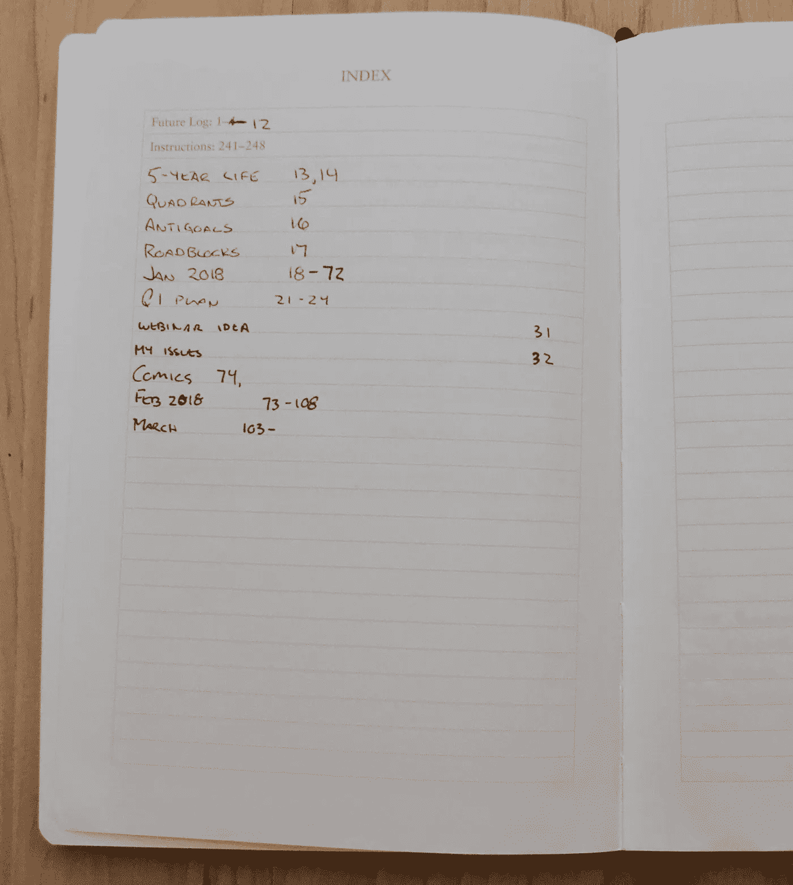
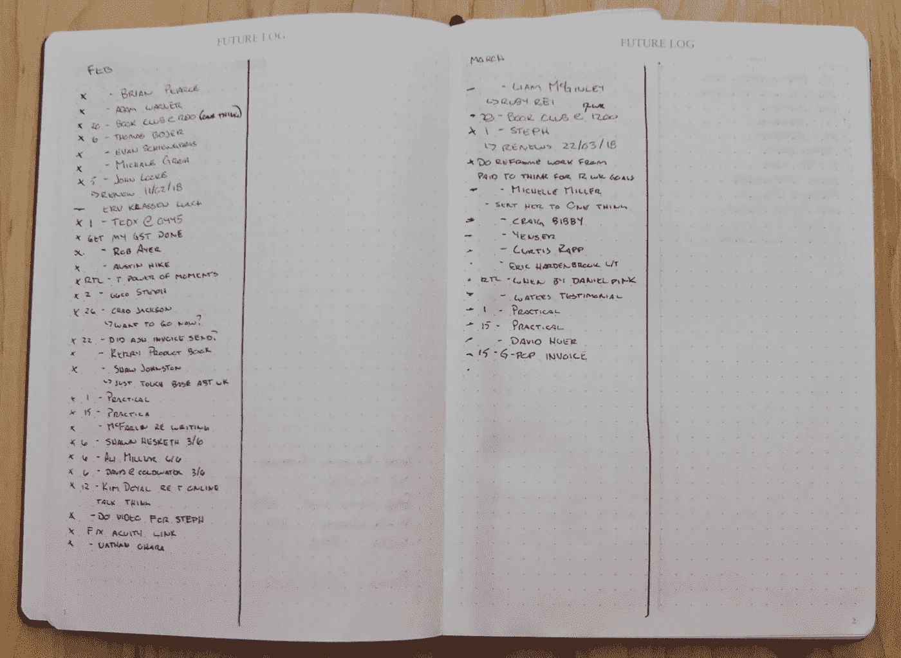
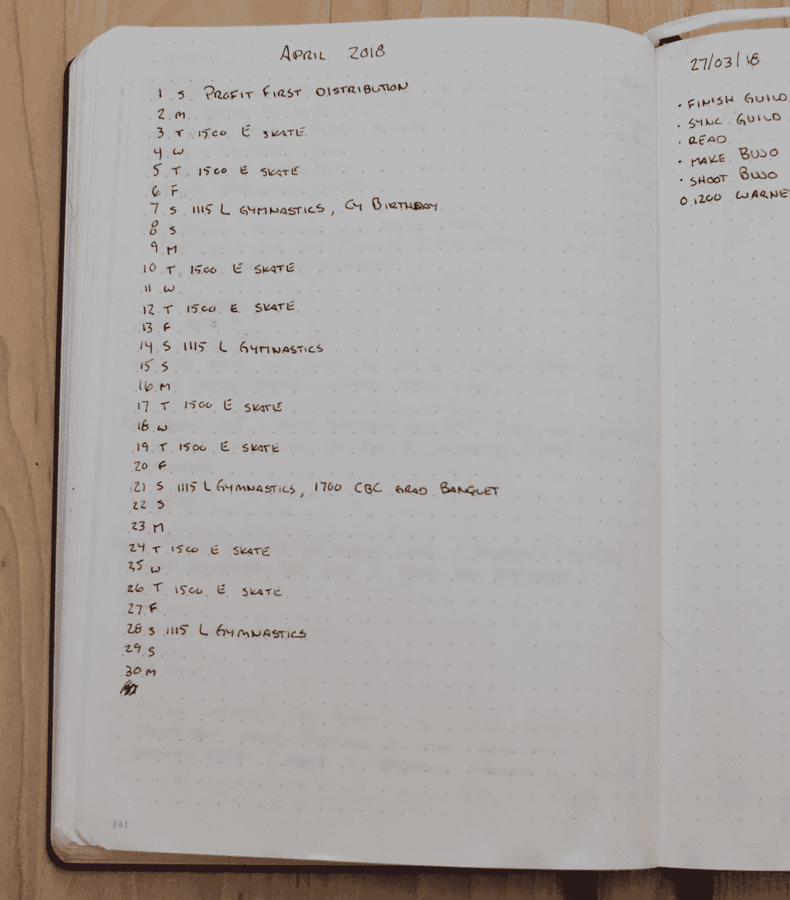
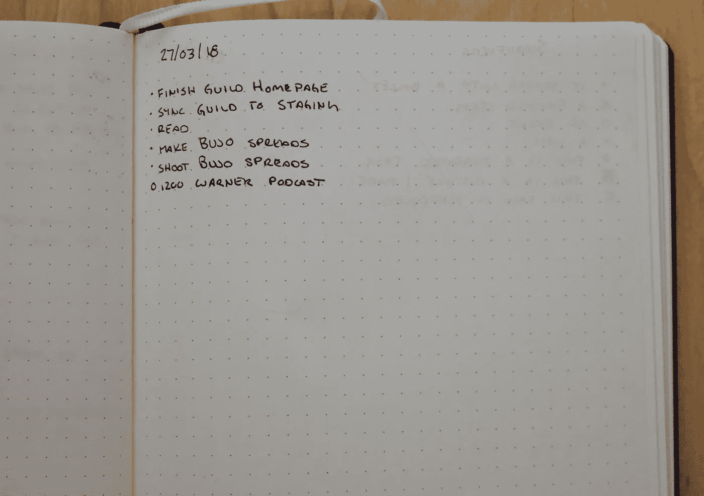
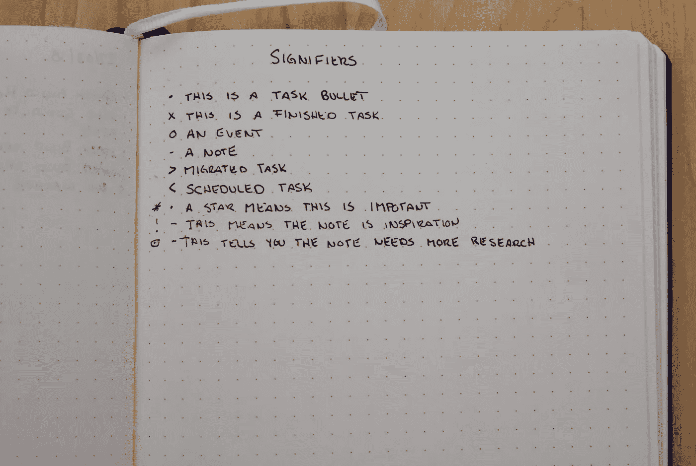

# Web 开发人员快速入门

> 原文：<https://medium.com/hackernoon/getting-started-with-bullet-journalling-for-web-developers-4b44455519f4>

一段时间以来，我一直在写我的模拟生产力系统。我从你需要的 10 个约束和你应该采取的 1 个行动开始。

今天，我们将深入了解子弹日志系统的基础知识，以便您熟悉它。下周我们将看看我是如何为我的网络[开发](https://hackernoon.com/tagged/development)业务修改这个系统的。

首先要做的是坚持基本原则。就像任何[生产力](https://hackernoon.com/tagged/productivity)系统一样，有很多子弹杂志色情在那里。只要在 Pinterest 或谷歌上搜索 Bullet Journal 的图片，你就会看到很多漂亮的图片，而我永远也不会去创作这些图片。说真的，我甚至不知道它们中的一些在艺术实践之外还有什么用。

当我们参观我的系统时，你会看到，我不是艺术家，也不在我的日记里画任何东西，除非我正在做的任务需要一些东西的草图。大多数时候，这意味着我在决定如何将想法联系起来，所以这更像是一张头脑风暴图，而不是看起来很棒的东西。

你所需要的只是一本书。页面上有网格布局或点网格都很好。能给你的页面编号真好。拥有官方的子弹期刊当然很好，但是这些都不是必须的。

## 什么是项目符号日志模块

你的子弹日志从一个**索引**开始。就像任何一本书一样，索引是你知道所有东西在书里的位置的方法。我通常坚持大群体。我把每个月放在索引里，而不是每周。

This is the index for your Bullet Journal

你的索引之后是**未来日志**。这是未来几个月的清单，所以你可以写下需要在某个时间完成的任务，而不是现在。我每个月留下一页，涵盖接下来的 6 个月。我未来日志的最后一页是为“未来”准备的，这意味着它是我目前记录的 6 个月后需要完成的任何任务的集合。

可以覆盖 6 个月以上或者更少。我选择 6 个月，因为这是我写日记的时间。大约在 4 个月的时候，它基本上写满了，我转移到了一本新书上。

I keep 6 months ahead going as I work on my Bullet Journal Future Log

你的**月日志**，是一个月内发生的所有事情的日志。通常这发生在你已经完成一些任务之后。所以可能在第 24 页或者第 100 页。在最初的系统中，它只是一个月中所有日期的列表，然后是与之对应的一周中的日子。

这就给你留下了每天一行的记录，对我来说这还不够，所以我对它做了一些修改，当你看到我如何修改 Bullet Journal 以适应 web 开发业务时，我们将在我的下一篇文章中讨论。

官方子弹日志系统的最后一个组件是**每日日志**。这包括一个日期，然后是某一天的任务/项目。有几个能指，但都是从子弹开始的。在这篇文章的后面，我们会深入探究到底什么是能指。

Daily Log in The Bullet Journal System

一旦你开始浏览子弹日志，你会注意到许多人做每周日志，我没有提到它。作为未来计划的一部分，我每周五做一次每周日志。每周日志不是原始子弹日志系统的一部分，所以我们将在稍后讨论它，因为我会谈到我的特定模块以及我如何使用它们。

## 什么是子弹日志快速记录？

项目符号日志的下一个关键组件叫做快速日志。这实际上只是用一个花哨的名字快速写下事情，但却掌握着一个很好的关键，这个关键在子弹杂志网站上没有很好地浮出水面。

关键的想法是，你不是在写日记。这不是一篇博文。这是一个快速记下任务的地方，让它快速而简单。

快速测井包括四个部分:

1.  主题
2.  页码
3.  子弹
4.  短句

你从一个主题开始，这个主题告诉你一个页面是关于什么的。最简单的话题就是当前日期。我喜欢用 dd/mm/yy 格式，因为那是我们在加拿大用的。你选择的格式只对你有影响，所以使用适合你的。

第二个上来的是**页码**。您将使用项目日志的前几页创建索引，因此您需要页码来帮助您找到索引外的项目。这就是像[官方子弹杂志](https://curtismchale.ca/recommends/leuchtturm-1917-bullet-journal/)这样有编号的笔记本能帮你节省大量时间的地方，因为你不用手动编号。

> 这出自我的新书[模拟生产率](https://curtismchale.ca/recommencds/analogue-productivity)。你可以用纸和笔为工作带来更多价值。

是时候决定哪些工作你再也不会做了。

是时候停止搬动躺椅，开始完成你的工作了。

是时候开始建立那个完美的模拟系统了，这样你就可以停止一直分心。

我们尊重你的隐私。

您可以通过每隔一页或每隔 10 页进行编号来简化编号过程。没人说你必须在每一页上签名。如果这看起来像一个障碍，不要让它成为障碍。

你可以决定按月份给页面的一角涂上颜色，这样你就可以从侧面快速找到你想要的月份。唯一的要求是，通过你的索引，你可以在你的个人生产力系统中快速找到你想要的页面。

第三是**子弹**是子弹日志系统的核心符号。在这篇文章的后面，我们将会更多地讨论意符。每个条目都有一个项目符号，从该行的开头开始。

最后是**短句**用来表示任务或事件，或笔记。这里的要点是保持简短和可操作性。你不写“特德”，你写“打电话给特德，谈谈咖啡”。如果你只写下联系人的名字，那么你必须花精力去想清楚这个名字对应的是什么动作。确保每一项都是可操作的，这样就不会出现这种情况。

Bullet Journal Rapid Logging

## 什么是子弹日记符号？

**意符**是在你的子弹日记中标记一个项目的方式。这一切都始于一颗子弹，在标准子弹日志系统中有六个核心符号。

Bullet Journal Signifiers

正如我说过的，你可能也猜到了，整个系统是从一颗子弹开始的。这可以放在你清单中的每一项之前。

子弹之后，当你完成一个任务时，你把子弹变成一个 **X** 。

使用 **>** 来表明一个任务已经被迁移到了一个**集合**中，是的，我们稍后将讨论**集合**到底是什么。

使用 **<** 表示任务已经以某种形式被调度。

您可以将任务转换为——使其成为便笺。笔记是不可操作的，但也许你认为它会被操作。笔记的一个例子是你在油漆店喜欢的颜色，你想在你的厨房里。

最后是代表一个事件的 **O** 的一些变化。事件是与日期相关的活动，我在它们旁边添加时间来显示当天的约会。

在此之后，在标准系统中还有几个其他的**能指**。你用一个 ***** 来表示一项任务是当天的优先事项。

使用**！**表示该物品为灵感物品。这通常配有一张纸条，可能是你当天最喜欢的一句话。

最后，它们有一个眼睛符号，向你显示这个物品是你需要注意的。也许你需要新的牛仔裤，但商店没有适合你的款式，所以你必须研究一下哪里可以找到更适合你体型的款式。

随着你对这个系统越来越熟悉，你可以自由地想出任何符合你需求的意符。开始，**不要这样**。坚持系统，只在需要的时候修饰。记住你系统中的一个[关键概念应该是解决问题](https://curtismchale.ca/2018/04/02/a-new-productivity-system-must-solve-problems/)。如果你的新能指不能解决问题，不要使用它，也不要担心它。

不要因为花漂亮就开始用它。如果漂亮能让你做更多的事情，那很好，但是要保持简单。

## 什么是子弹期刊收藏？

用 Bullet Journal 的话说，**集合**，是页面的任意分组。所以网站内容的想法列表就是一个集合。一月份的**月日志**和任何**日日志**也是集合。

由一个共同主题相关联的任何一组笔记或任务都是一个集合。

你不需要对如何处理收藏有太多的幻想。翻到下一页，然后开始您想要开始的收藏。在页面顶部添加主题，然后，如果需要，确保页面已编号。

> 这出自我的新书[模拟生产率](https://curtismchale.ca/recommends/analogue-productivity)。你可以用纸和笔为工作带来更多价值。

是时候决定哪些工作你再也不会做了。

是时候停止搬动躺椅，开始完成你的工作了。

是时候开始建立那个完美的模拟系统了，这样你就可以停止一直分心。

我们尊重你的隐私。

你不应该担心“保存”页面来扩充收藏。如果您需要另一个页面，请翻回到索引并添加查找整个集合所需的辅助页面。这意味着你的收藏可以分成很多页。

是的，我发现这很令人恼火，但是我有一个“黑客”来处理收藏和索引，当我们看我如何为我的 [WordPress 会员业务](https://sfndesign.ca)修改子弹日志系统时，我们会谈到它。

## 如何迁移到新的项目符号期刊？

子弹日志的主要好处之一是**迁移**需要时间。这是对系统的一个约束，因为如果感觉很难推进一项任务，那么很明显它没有足够的价值来跟踪。不要迁移它，从你的列表中删除任务。

假设你有一份当天的任务清单，并附带一些笔记。也许就像这样:

Bullet Journal Task List

如果你没有在一天内完成，你需要开始你的迁移。这就是你的 **<** 和 **>** 发挥作用的地方。将每项任务标记为**预定**或**迁移**，然后忘记这一天。你的任务被记录在系统中。

## 在一个数字化的第一世界里与模拟生产力同行

然后…就这样。有了上面的信息，你就可以开始使用标准的子弹日志系统了。

如果你和我一样，你已经准备好深入了解如何每天使用子弹日记。下周，我将向你详细介绍我是如何使用子弹杂志来经营我的 Web 开发业务、我所有的写作和我的余生的。