# Windows 10 上的 Docker 和 Kubernetes 入门

> 原文：<https://medium.com/hackernoon/getting-started-with-docker-and-kubernetes-on-windows-10-40017e2b69ff>

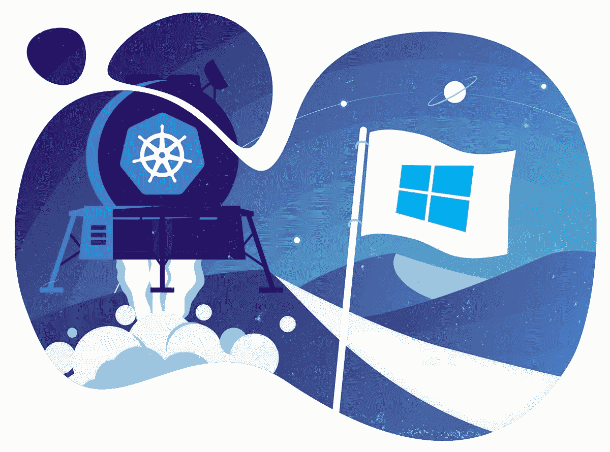

当你不知道从哪里开始时，在 Windows 上开始使用 [Docker](https://hackernoon.com/tagged/docker) 和 [Kubernetes](https://hackernoon.com/tagged/kubernetes) 可能会令人望而生畏。

安装软件并不容易，这也于事无补。

事实上，你应该已经是一个 Docker 和 Kubernetes 专家来导航如何安装它们的选项。

*但是不要担心！*

如果您刚刚开始使用 Windows 上的容器和 Kubernetes，那么这篇文章是为您准备的。

您将学习如何在 Windows 上设置开发环境时做出正确的选择。

先说 Docker。

# 使用 Windows 10 Home？您将无法运行 Docker for Windows

当 Docker 的人决定在 Windows 上实现 Docker 时，他们选择了 Hyper-V 作为他们的虚拟化技术。好处显而易见:卓越的性能和本机虚拟机管理程序。

**不幸的是，并非所有 Windows 版本都附带 Hyper-v。**

如果你使用的是 Windows 10 家庭版或学生版，你就没那么幸运了。您将无法安装和运行 Docker for Windows。

但是游戏还没有结束。

基于 [Docker Machine](https://docs.docker.com/machine/) 有大量的替代品，如 Docker Toolbox 或 minikube。

Docker 机器的工作方式很简单:有一个运行 Linux 和 Docker 的虚拟机。并且从您的主机连接到该虚拟机中的远程 Docker 守护进程。

Minikube 是基于 Docker Machine 的最有趣的虚拟机之一— *如果你对运行 Kubernetes 集群感兴趣的话。*

事实上，minikube 是一个运行 Docker **和** Kubernetes 的虚拟机。它通常只用于运行 Kubernetes，但是您也可以用它来运行 Docker 容器。

你不会达到和 Docker for Windows 一样的速度，但是你可以不用 Hyper-V 来构建和运行容器。

# 有了 Windows 10 Pro，Docker for Windows 就是最好的——除非它不是

你有最新的 Windows 10 Pro，可以安装 Docker for Windows。

出色的性能和优秀的开发者体验。你被分类了，不是吗？

*也许。*

Docker for Windows 使用的管理程序非常强大— *实际上它被称为第 1 类管理程序*。

它如此强大，以至于不能很好地与较弱的虚拟机管理程序配合，如 VirtualBox 中的虚拟机管理程序— *或类型 2 虚拟机管理程序*。

您不能让类型 1 和类型 2 虚拟机管理程序同时在您的计算机上运行。或者换句话说，如果你运行 Docker for Windows，你将无法在 VirtualBox 上启动你的虚拟机。

根据您的设置，这可能是一个无关紧要的细节。

也许你完全致力于一个集装箱化的世界，而你却把虚拟机留在了身后。

一段久远的记忆。

但是，如果你仍然依赖虚拟机和工具，如流浪者，也许你应该意识到烦恼。

**你可以随意启用和禁用 Hyper-V 虚拟机管理程序，但需要重启电脑。**

如果您经常从容器切换到虚拟机，也许 minikube 是一个更方便的选择。当您从容器更改为虚拟机时，不需要重新启动计算机。

但是你并没有从额外的性能或改进的体验中获益。

最后，如果您对运行 Windows 容器感兴趣，那么 Docker for Windows 是唯一的选择。

为此，您需要 Windows 10 Pro 或企业版。

# 运行本地 Kubernetes 集群

如果你想在本地运营 Kubernetes，你应该考虑 minikube。

Minikube 是一个运行在嵌入式 Linux 发行版(Buildroot)上的虚拟机，预装了 Docker 守护进程。

**这是带电池的 Kubernetes。**

Minikube 可以使用 VirtualBox 或 Hyper-V 运行虚拟机— [也有更多的选项](https://github.com/kubernetes/minikube#quickstart)。

如果您已经有了 Hyper-V，并希望对 Docker 和 minikube 使用相同的虚拟机管理程序，这是一个好消息。

如果你不能运行 Hyper-V，这也是一个好消息，因为你可以使用 VirtualBox。

有很多选择和权衡，所以下面是讨论内容的总结:

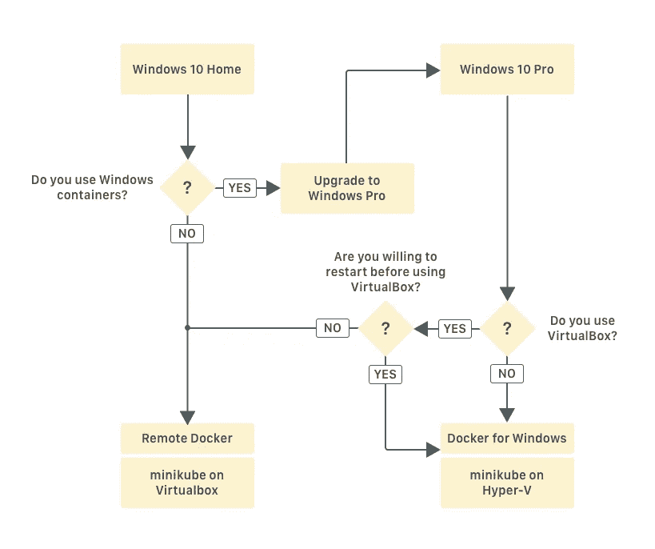

# 先决条件

可以下载安装 Docker for Windows、Docker Toolbox、VirtualBox、kubectl、Docker CLI 等所有依赖项。从官方网站，但这是很难的工作。

你必须访问网站，希望网址仍然有效，搜索下载页面，选择正确的版本，下载，安装，最后添加到你的路径。

这是可行的，但我相信你宁愿花时间做更多的编码，而不是从互联网上寻找和安装可执行文件。

**输入 Chocolatey。**

Chocolatey 是一个用于 Windows 的软件包管理器。你告诉它你想安装什么可执行文件，然后 Chocolatey 会帮你安装。

你把供应软件的艰苦工作都外包给了别人。

安装 Chocolatey 很容易。你可以在官网找到[的完整说明。但简而言之，这就是你要做的:](https://chocolatey.org/install)

1.  以管理员身份开始`cmd.exe`
2.  执行这个长命令:

`@"%SystemRoot%\System32\WindowsPowerShell\v1.0\powershell.exe" -NoProfile -InputFormat None -ExecutionPolicy Bypass -Command "iex ((New-Object System.Net.WebClient).DownloadString('https://chocolatey.org/install.ps1'))" && SET "PATH=%PATH%;%ALLUSERSPROFILE%\chocolatey\bin"`

3.重新加载`cmd.exe`

如果安装成功，您现在可以搜索要安装的应用程序:

```
choco search docker
```

既然你在那里，你可以试试`choco`。您可以安装[Cmder](http://cmder.net/)——一个现代的 Windows shell，具有:

```
choco install cmder -y
```

Chocolatey 在`C:\tools`安装了二进制。如果您希望使用 Cmder 继续本教程，您应该以管理员身份启动二进制文件。

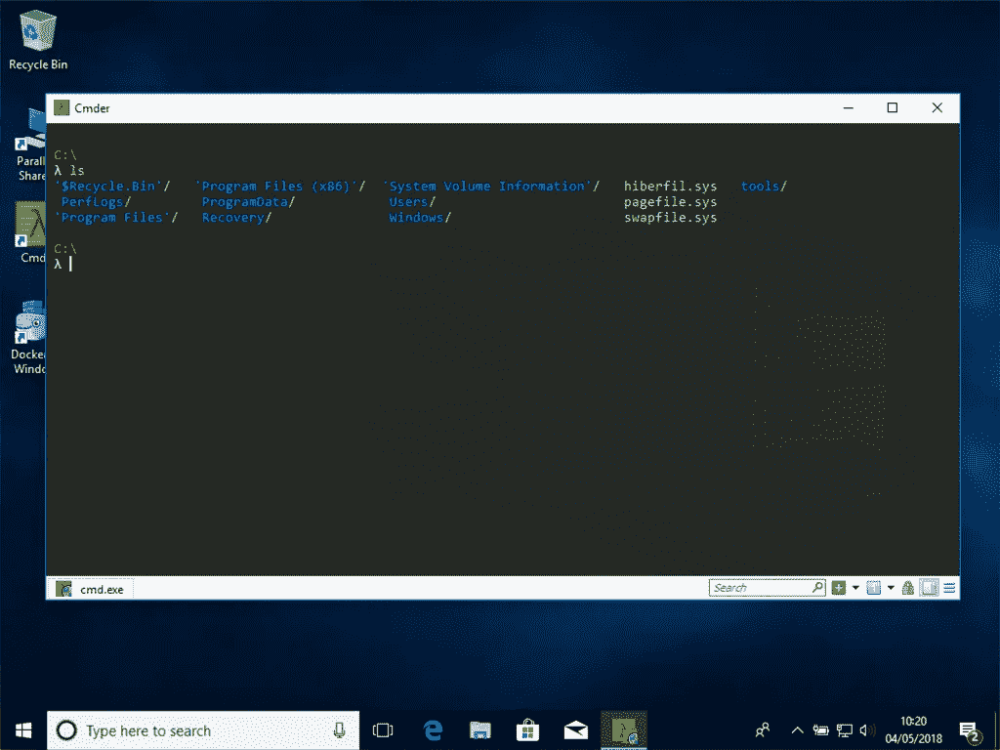

看起来不错！

# 1.在 Windows 10 Pro 上安装 Docker 和 Kubernetes

# 安装 Docker

您可以通过以下方式下载 Docker for Windows:

```
choco install docker-for-windows -y
```

重启你的笔记本电脑。Docker 将询问您是否希望启用 Hyper-V。

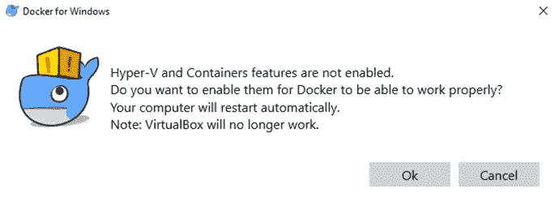

是的，你有！

您应该知道，Docker 要求在运行任何容器之前启用 VT-X/AMD-v 虚拟硬件扩展。根据您的计算机，您可能需要重新启动并在 BIOS 中启用它。

> *您可以通过在命令提示符下运行* `*systeminfo*` *来检查 VT-X/AMD-v 是否启用。*

如果您不确定是否启用了 VT-X/AMD-v，请不要担心。如果没有，Docker 会用下面的错误消息向您问候:

> *必须在 BIOS 中启用硬件辅助虚拟化和数据执行保护。*

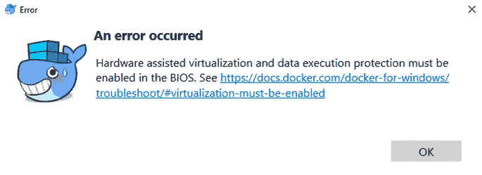

另一个常见错误与 Hyper-V 虚拟机管理程序未启用有关。如果您遇到此错误:

> *无法启动:正在运行的命令已停止，因为首选项变量“ErrorActionPreference”或公共参数设置为 Stop:“mobyluxvm”无法启动。无法启动虚拟机“MobyLinuxVM ”,因为其中一个 Hyper-V 组件未运行。*

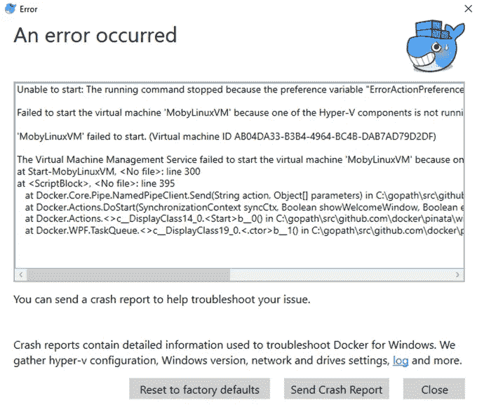

您应该启用 Hyper-V，以管理员身份打开一个新的命令提示符，并键入以下内容:

```
bcdedit /set hypervisorlaunchtype auto
```

你应该重新启动你的机器，Docker 应该最终启动。

*但是你怎么知道 Docker 是否在工作呢？*

打开新的命令提示符并键入:

```
docker ps
```

如果一切正常，您应该会看到一个空的容器列表正在运行。

如果您的 Docker 守护进程没有运行，您可能会遇到以下错误:

> *连接时出错:获取* [*http://%2F%2F。% 2f pipe % 2f docker _ engine/v 1.37/containers/JSON:*](http://%2F%2F.%2Fpipe%2Fdocker_engine/v1.37/containers/json:)*open//。/pipe/docker_engine:系统找不到指定的文件。在 Windows 的默认守护程序配置中，docker 客户端必须以提升的权限运行才能连接。此错误也可能表示 docker 守护程序没有运行。*

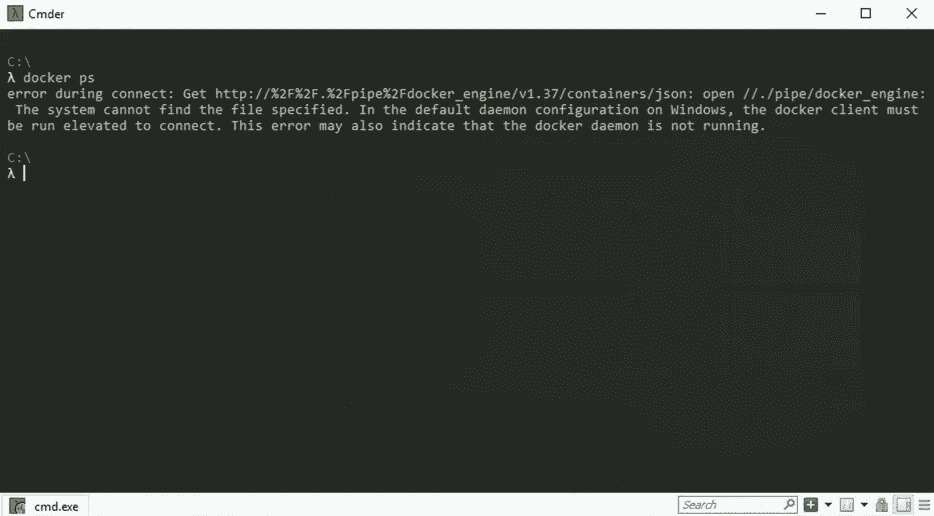

上面的错误表明您的 Docker 安装没有正常运行，无法启动。

您应该在连接到 Docker 守护进程之前启动它。

# 在 Hyper-V 上安装 Minikube

您可以通过以下方式下载 minikube:

```
choco install minikube -y
```

在启动群集之前，您应该创建一个外部网络交换机。

首先，您需要确定您的计算机上有哪些网络适配器。

你应该忽略虚拟接口，关注真实的、活动的、物理的网络适配器，例如*以太网*或 *WiFi* 。

选择一个真正的适配器将让您与虚拟交换机共享互联网连接。

要检查当前的网络适配器，可以使用 Powershell 中的`Get-NetAdapter` cmdlet。

点击左下角的 Windows 图标，开始输入“PowerShell”打开它。

键入以下命令列出所有适配器:

```
Get-NetAdapter
```

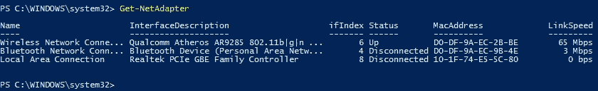

> *如果您发现很难选择适配器，请尝试选择在*状态*栏中* ***向上*** *的适配器。*

确定正确的适配器后，您可以使用以下命令创建外部虚拟交换机:

```
New-VMSwitch –Name "minikube" –AllowManagement $True –NetAdapterName "INSERT_HERE_ADAPTER"
```

不要忘记插入您之前选择的适配器。

如果未能创建网络交换机，则在启动 minikube 时会看到以下错误:

> *e 0427 09:06:16.000298 3252 start . go:159]启动主机时出错:创建主机时出错:执行步骤时出错:运行预创建检查。未找到外部 vswitch。有效的 vswitch 必须可用，此命令才能运行。检查*[*https://docs.docker.com/machine/drivers/hyper-v/.*](https://docs.docker.com/machine/drivers/hyper-v/.)

您可以使用以下工具测试您的 minikube 安装:

```
minikube start --vm-driver=hyperv --hyperv-virtual-switch=minikube
```

> *请注意* `*--vm-driver=hyperv --hyperv-virtual-switch=minikube*` *仅在首次启动时需要。如果你想改变驱动程序或内存，你必须* `*minikube destroy*` *并用新的设置重新创建虚拟机。*

如果由于任何原因 minikube 无法启动，您可以使用以下命令进行调试:

```
minikube delete 
minikube start --vm-driver=hyperv --hyperv-virtual-switch=minikube --v=7 --alsologtostderr
```

额外的详细日志记录应该有助于您找到问题。在我的例子中，minikube 曾经失败过:

> *e 0427 09:19:10.114873 10012 start . go:159】错误启动主机:错误启动已停止的主机:退出状态 1。*

不是很有帮助。启用详细日志记录后，问题变得更加明显:

```
+ Hyper-V\Start-VM minikube 
+ ~~~~~~~~~~~~~~~~~~~~~~~~~ 
   + CategoryInfo : FromStdErr: (:) [Start-VM], VirtualizationException 
   + FullyQualifiedErrorId : OutOfMemory,Microsoft.HyperV.PowerShell.Commands.StartVM
```

我的内存快用完了！

是时候测试你的安装是否成功了。在命令提示符下键入:

```
kubectl get nodes
```

您应该能够在 Kubernetes 中看到单个节点。

# 在 VirtualBox 上运行虚拟机

由于您在设备上启用了 Hyper-V，您将无法在 VirtualBox 上启动任何虚拟机。您仍然可以尝试启动您的虚拟机。但是，您可能会遇到以下错误:

> *您的电脑遇到问题，需要重启。我们正在收集一些错误信息，然后我们会为您重新启动它。*

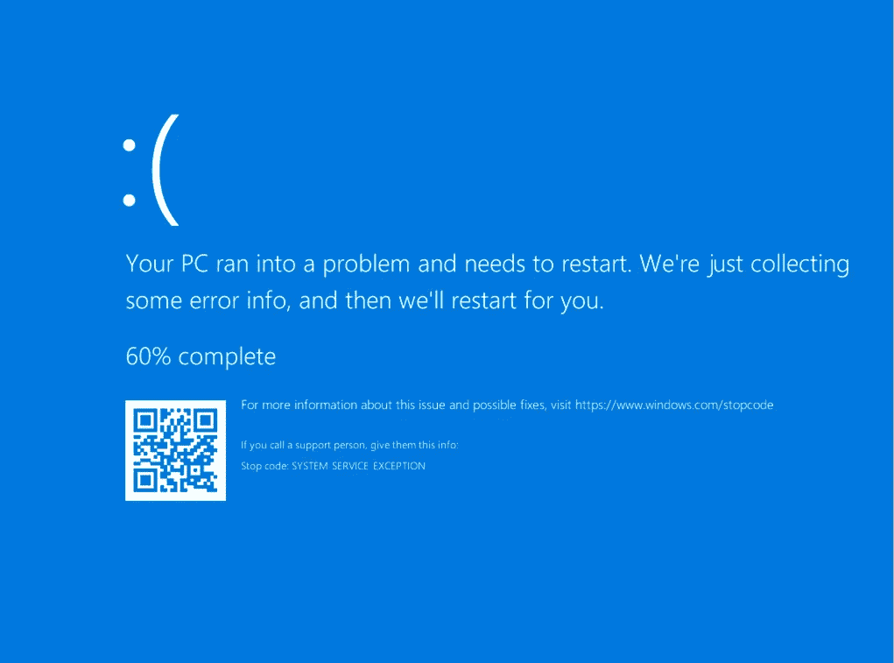

**如果您希望使用 VirtualBox 或任何其他使用第二类管理程序的可执行文件，您应该先禁用它并重启计算机。**

以管理员身份打开新的命令提示符，并键入以下内容:

```
bcdedit /set hypervisorlaunchtype off
```

重新启动设备后，您应该可以像往常一样使用 VirtualBox。

如果你想再次使用 Docker 和 minikube，你应该启用 Hyper-V 并重启你的机器。

以管理员身份打开新的命令提示符，并键入以下内容:

```
bcdedit /set hypervisorlaunchtype auto
```

重启，现在您已经准备好运行和部署容器到 Kubernetes 了！

[跳到测试你的 Docker 安装](https://learnk8s.io/blog/installing-docker-and-kubernetes-on-windows#testing-your-docker-installation)

# 2.在 Windows 10 Home 上安装 Docker 和 Kubernetes

如果你打算使用 Windows 10 家庭版或学生版，你可能会省去安装另一个 Docker 工具如 Docker Toolbox 的麻烦。

您应该将 minikube 用作远程 Docker 守护进程以及本地 Kubernetes 集群。

您可以下载并安装 minikube:

```
choco install minikube -y
```

安装结束时，您可以使用以下命令启动 minikube:

```
minikube start
```

该命令将为 VirtualBox 下载一个 ISO 并启动虚拟机。一旦启动，您应该能够使用以下命令查询 Kubernetes 集群:

```
kubectl get nodes
```

看到一个节点。

要连接到远程 Docker 守护进程，您应该安装 Docker 客户端，并安装:

```
choco install docker -y
```

您可以通过以下方式连接到 minikube 远程 Docker 守护程序:

```
@FOR /f "tokens=*" %i IN ('minikube docker-env') DO @%i
```

> *请注意，每次打开新的终端时，都要键入上述命令。提醒自己该命令的一个更简单的方法是键入* `*minikube docker-env*` *。*

如果连接成功，您应该能够列出所有正在运行的容器，包括:

```
docker ps
```

你应该会看到很多运行的容器。其中大部分属于库伯内特。

你已经走了这么远:你准备好了。

但是在继续之前，您应该知道使用 minikube 作为远程 Docker 守护进程的一些限制。

Docker 由两部分组成:

*   Docker 守护进程——你可以把它想象成一个带有 API 的服务器。您可以向 API 发送命令，Docker 将代表您接收并执行它们。
*   **Docker CLI**—向 Docker 守护程序 API 发送命令的可执行文件

大部分时间你都在和 Docker CLI 交互，看不到 Docker 守护进程。

*那么为什么要有客户端和服务器呢？*

为什么没有单一的二进制？

**这一切都归结于灵活性。**

当您运行 Docker for Windows 时，Docker CLI 会连接到您的本地 Docker 守护进程。

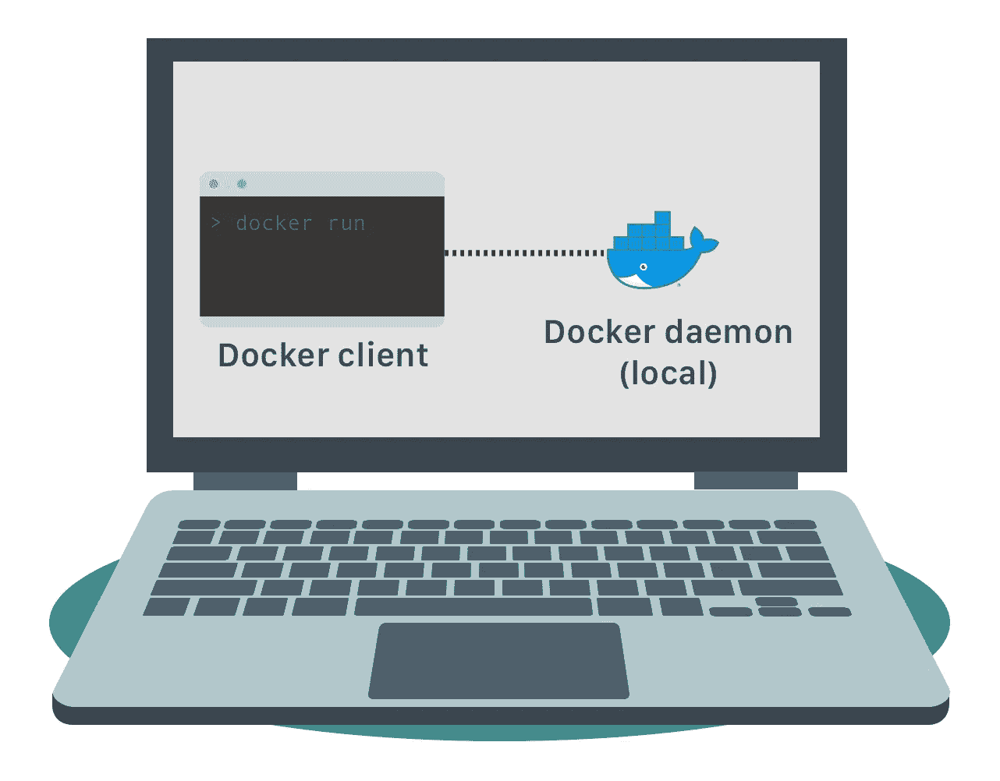

**但是有时候你没有 Docker 守护进程。**

也许您想在远程机器上构建容器。

也许你不能在你的机器上运行 Hyper-V，你的 Docker 守护进程安装在 VirtualBox 的一个虚拟机上。

如果你运行 minikube，情况正是如此。

您的 Docker CLI 远程连接到 minikube 虚拟机中的 Docker 守护程序。

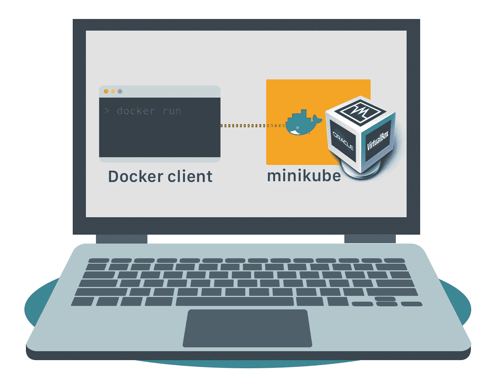

当您针对远程 Docker 守护进程运行容器时，您需要调整您的端口绑定。

在 Docker for Windows 中，您可以使用以下命令在端口 8080 上运行并绑定容器:

```
docker run -ti -p 8080:80 nginx
```

> *请注意容器如何暴露端口 80，以及您如何将该端口映射到 8080。*

可以访问 [http://localhost:8080](http://localhost:8080/) ，看到*“欢迎使用 Nginx”*页面。

如果您使用远程 Docker 守护进程运行相同的命令并访问相同的页面，您将看不到任何内容。

无法访问该 URL。

*那么，有什么不同呢？*

Docker 守护进程负责运行容器和转发端口。

使用 Docker for Windows，守护程序在本地运行——在您的本地主机上。

因此您可以访问 localhost 上运行的容器。

另一方面，Minikube 在虚拟机内部运行 Docker 守护进程。

这是一个远程 Docker 守护程序。

如果你想看到你正在运行的容器，你需要用 Docker 守护进程访问机器。您可以使用以下命令找到 IP 地址:

```
minikube ip
```

可以访问[http://your _ mini kube _ IP:8080](http://your_minikube_ip:8080)查看*“欢迎使用 Nginx”*页面。

# 测试您的 Docker 安装

你安装了 Docker，但是你怎么知道它是否真的能工作？

在您的终端中键入:

```
docker run -ti -p 8080:80 wordpress
```

一旦 Docker 下载完所有的包，你应该访问 [http://localhost:8080/](http://localhost:8080/) 。

> *请注意，如果你运行 minikube 作为你的远程 Docker 守护进程，你应该使用*[*http://minikube _ IP:8080*](http://minikube_ip:8080)*作为你的 URL。*

你应该能够看到 Wordpress 安装向导。

万岁！

Wordpress 正在为容器内的流量提供服务！

> *请注意，你将无法完成 Wordpress 的安装，因为没有数据库。*

# 测试您的 Kubernetes 集群安装

是时候测试您的本地 Kubernetes 集群了。在本节中，您将部署 [Smashing.io 仪表板](https://smashing.github.io/)。

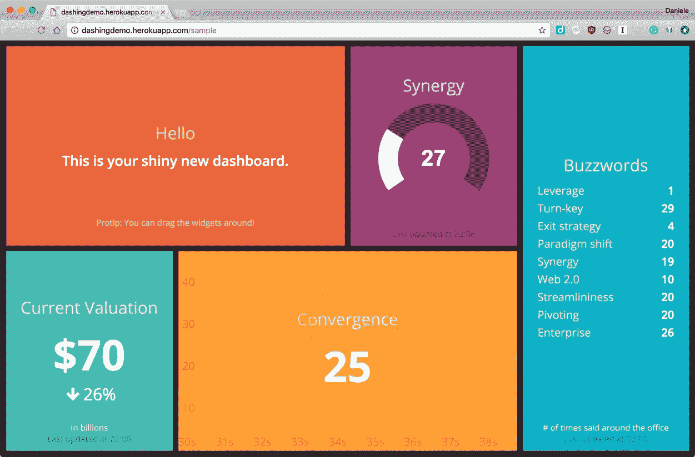

# 部署粉碎到 Kubernetes

您可以通过以下方式将您的仪表板部署到 Kubernetes:

```
kubectl run smashing --image=visibilityspots/smashing --port=3030
```

一旦 Kubernetes 完成了容器的下载，您应该会看到它正在运行:

```
kubectl get pods
```

# 暴露仪表板

您可以通过以下方式公开您的部署:

```
kubectl expose deployment smashing --type=NodePort
```

您可以通过以下方式在浏览器中打开仪表板:

```
minikube service smashing
```

您可以从 Kubernetes 访问仪表板！万岁！

# 库伯内特斯的鸟瞰图

迷你库贝装满了好吃的东西。

您可以通过以下方式访问官方 Kubernetes 仪表盘:

```
minikube dashboard
```

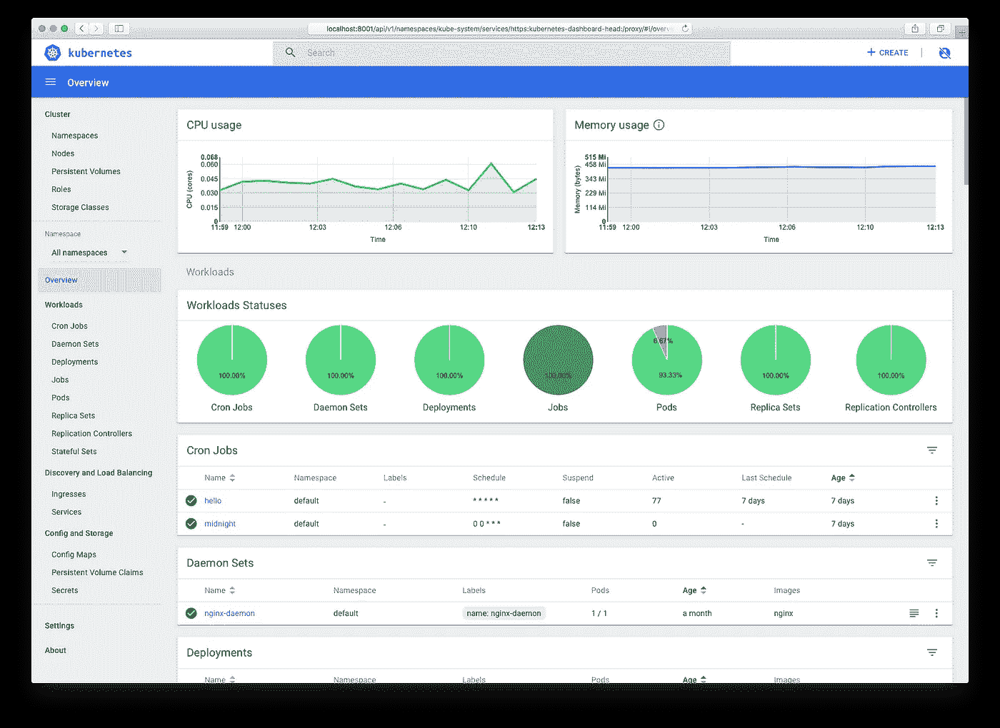

从那里，您可以探索您的集群并部署应用程序。

# 摘要

*仅此而已！*

现在你知道在 Windows 上安装 Docker 和 Kubernetes 的所有选项了。

如果你无意中发现了文章中没有描述的错误，请随时在 Twitter [@learnk8s](https://twitter.com/learnk8s) 或 [Slack](https://learnk8s-slack-invite.herokuapp.com/) 上联系。

既然您已经有了一个完整的工作环境，那么您应该看看关于如何将 Laravel 应用程序部署到 Kubernetes 的教程。

如果你喜欢这篇文章，你应该继续关注！订阅我们的时事通讯！

*原载于 2018 年 6 月 5 日*[*learn k8s . io*](https://learnk8s.io/blog/installing-docker-and-kubernetes-on-windows)*。*