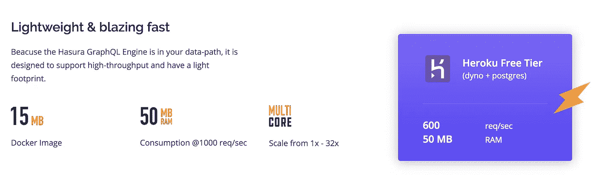

# Heroku 上的 GraphQL APIs 入门

> 原文：<https://medium.com/hackernoon/getting-started-with-graphql-apis-on-heroku-fa688ce0a56f>

## 开源的 Hasura GraphQL 引擎给了你比 Postgres 更高性能的 GraphQL APIs。在 30 秒内部署到 Heroku 自由层。

Get started with GraphQL in just 30 seconds with Hasura GraphQL Engine on Heroku

在 [Hasura](http://hasura.io) ，我们一直是 Heroku 基于 git push 的部署工作流的忠实粉丝。我们所有的工程师都曾在某个时候与 Heroku 一起运行过兼职项目，我们最受欢迎的开源项目之一 [Gitkube](http://gitkube.sh) ，将 Heroku 工作流引入了 Kubernetes 集群。

我们使用 Hasura GraphQL 引擎的目的是帮助您以最少的摩擦设置一个 GraphQL 服务器，这样您就可以不用任何设置就开始构建应用程序。考虑到这一点，我们在 Heroku 的自由层上展示了 Hasura 部署。

30 秒到达 GraphQL zen！

Basic deployment of the Hasura GraphQL Engine on Heroku

# 导入您自己的数据

如果您已经有了数据，Hasura 允许您导入数据并立即开始使用 GraphQL 查询。方法如下:

Import your existing Postgres database and get GraphQL APIs with Hasura

(对于这个演示，我们使用了免费提供的 [Chinook 数据集](http://schemaspy.org/sample/relationships.html)

# 额外收获:连接您现有的 Heroku Postgres

我们设计了 Hasura，允许运行现有基于 Postgres 的应用程序的开发人员迁移到 GraphQL，而无需编写任何后端代码。

如果你已经在 Heroku Postgres 上运行，Hasura 可以直接连接给你 GraphQL APIs。你可以在这里得到分步说明[。](https://docs.hasura.io/1.0/graphql/manual/deployment/heroku/using-existing-heroku-database.html)

# 为高性能而设计

设计 Hasura 时，我们有两个目标:

1.  Hasura 应该能够在任何地方运行，从你的本地机器到 Heroku 免费层到亚马逊、谷歌或微软的服务器。
2.  你应该能够获得最大的性价比。

因此，我们针对低内存占用和低延迟优化了 Hasura。

Hasura GraphQL Engine gives you ~600 req/s while consuming only 50 MB of RAM on Heroku’s free tier

我们已经在[这篇博文](https://blog.hasura.io/architecture-of-a-high-performance-graphql-to-sql-server-58d9944b8a87)中写了设计决策。

# 🎉🎉Hasura GraphQL 引擎是开源的！🎉🎉

我们刚刚开源了 Hasura GraphQL 引擎。在 [Github](https://github.com/hasura/graphql-engine) 上查看完整的回购，并告诉我们您的想法！我们希望收到您的来信——我们在 [discord 服务器](https://discord.gg/vBPpJkS)上非常活跃。

[***Hasura***](https://goo.gl/fR68ep)*让你无需编写任何后端代码就能在任何 Postgres 数据库上使用即时 GraphQL APIs。*

*如果您想了解 Hasura 的最新动态，您可以注册我们的* [***简讯***](http://eepurl.com/dzefQj) *。*