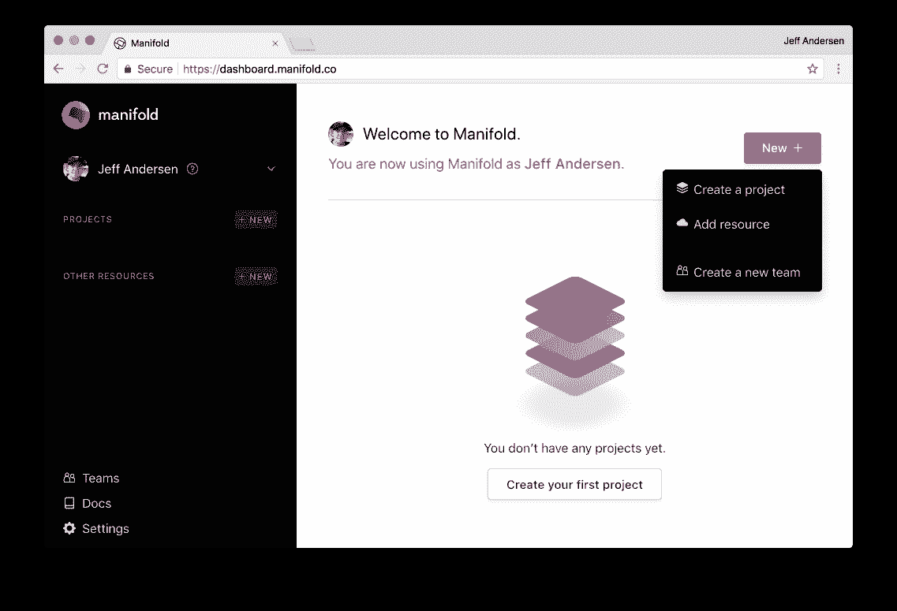

# 歧管入门

> 原文：<https://medium.com/hackernoon/getting-started-with-manifold-f0c2c5ab9e95>

> 披露: [**歧**](https://bit.ly/2lk2sCG) **，**开发商 marketplace，此前曾赞助黑客正午。 [**使用 code HACKERNOON2018 获得任何服务 10 美元的折扣。**](https://bit.ly/2lk2sCG)

[**流形**](https://bit.ly/2lk2sCG) 是独立[开发者](https://hackernoon.com/tagged/developer)服务的市场。您可以在一个帐户下查找、组织最佳云服务，并将其直接连接到您团队的工作流，月末只需一份账单。

我们提供两种不同的方法[创建一个多账户](https://dashboard.manifold.co/register):连接你的 GitHub 账户，或者输入你的电子邮件地址和密码。如果您通过电子邮件注册，您需要验证您的地址才能继续。

Create a project, add a resource or start a new team from the Manifold Dashboard.

# 创建团队和协作

[Manifold](https://hackernoon.com/tagged/manifold) 允许您在一个帐户下组织所有的云服务。团队可以很容易地共享服务的配置和秘密，他们的网络控制面板，并在一张账单上汇总一切。

这意味着不再需要追踪谁拥有哪个账户，或者谁能给你与核心服务通信所需的 API 密钥。

团队还使开发人员的入职变得非常简单——邀请一个新人加入您的团队，他们就可以获得他们所需要的东西。

# 开始你的第一个项目

项目使您能够创建属于单个应用程序或基础设施组件的服务的逻辑分组。

每个项目都有一个唯一的名称，并且可以包含您需要的任意多的服务。然后，您将能够一起访问该项目中所有服务的配置。因为项目有助于可视化您的堆栈，所以它进一步简化了入门。

Choosing your first Service on Manifold.

# 发现您需要的服务，添加外部配置

您的 Manifold Dashboard 从展示所有可提供的独立开发人员服务开始。所有服务都可以按类别过滤，因此您可以轻松找到您想要的服务。

开始第一项服务有三个步骤:

1.  选择你想要的产品
2.  选择一个计划
3.  选择您的自定义

然后，Manifold 负责提供您从提供商那里需要的东西。

如果您有不能通过 Manifold 获得的服务，或者想要将您的所有配置放在一个项目中，您可以使用自己的服务。使用我们的加密密钥值存储，您可以添加任何需要导入的秘密或配置。

An IronCache instanced named cache-master part of the queue-service project.

# 配置您的服务

大多数服务都有自己的仪表板，您可以在其中查看您的使用信息并控制您的偏好。Manifold 使得通过单点登录来共享对这些资源的访问变得很容易。一次点击，你将被重定向，认证，到服务的控制面板。

# 整合您的开发工作流程

现在您已经建立了一个项目，很容易通过我们的工作流集成之一将您的配置和秘密直接交付到您的应用程序中。

开发时，使用[歧管 CLI](https://blog.manifold.co/manage-your-cloud-services-like-a-developer-with-our-cli-tool-f02c88d9a7fd) 通过*歧管运行*将您的配置作为环境变量注入。

当您准备好部署到生产时，您可以使用我们的 [Terraform 或 Kubernetes integrations](https://blog.manifold.co/manifold-%EF%B8%8F-kubernetes-terraform-9dcf09703e5a) 来轻松地将您的云服务部署到您现有的基础架构中。

# 你还在等什么？

[兑换优惠券 ***HACKERNOON2018*** 并获得 10 美元用于您选择的任何服务。](https://bit.ly/2lk2sCG)

