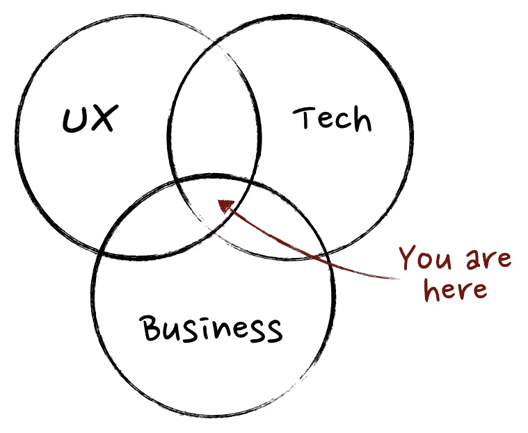

# 产品管理入门—什么是产品管理？

> 原文：<https://medium.com/hackernoon/getting-started-with-product-management-what-is-product-management-852d7db49586>

最近，我看到进入产品管理领域的人呈北升趋势。

他们来自工作的各个方面——设计、开发、测试、销售、营销和支持。

他们的经历从几年到多年不等。

有时，他们会以“产品管理到底是什么，项目经理的一天会做些什么”这样的问题开始，然后继续询问产品管理的长期范围。

在这里，我只是想把我所知道的分享给那些对产品管理感兴趣的人。

我会把这篇文章写得很短，并在接下来的文章中进一步介绍。

从 30，000 英尺高空进行产品管理

我通常从宏观的角度进行概念性的观察，这给了我一个事物的轮廓，也有助于我朝着远景规划我的短期目标。很难确定产品管理的具体定义，因为它涵盖了设计、客户支持、工程以及营销等更广泛的领域。

如果画一张设计、工程和商业的文氏图，产品管理在战略上位于任何产品的三个主要组成部分的交叉点上

© 2011 Martin Eriksson

产品经理基本上将技术、业务和设计以恰当的比例混合在一起，为用户提供愉快的体验。

事实上，在我工作的 Zoho Corp，产品管理在谷歌被称为项目经理，而在 Adobe 被称为模块经理，当你在你感兴趣的领域与不同公司的不同产品管理人员交谈时，这种情况会不断变化。

不管你叫什么名字，作为产品经理，你基本上与工程师、设计师、营销、法律、公共关系、产品支持和销售一起工作。

> ***要开始产品管理，你不需要任何先决条件或特殊知识。***

然而，这并不意味着这很容易。

你需要理解维恩图中的三个主要方面。

**技术**:

技术与工程相去甚远。

事实上，技术是工程的简化版。

换句话说，它是工程本身的产物。

这是你在处理复杂理论、公理、推论和其他科学研究和观察的一章中的主要标题。

让我们以抽吸电机为例，这是一种我们在管道解决方案中经常见到的技术。

早期人类习惯于从附近的水源取水，这需要花费更多的精力和时间，很快他们开始解决在解决方案上投入太多精力和时间的问题，并引入了管道解决方案，将水从附近的水源直接引入我们的家中。

制造一台发动机需要复杂的工程技术。

轴的长度、线圈的数量、齿轮比和压力阀被设置为将持续的流量引入系统。

一项工程的最终成果是我们称之为发动机的技术。

**设计**:

技术本身只是工程的一种应用，为了接触到面临类似问题的更广泛的受众。我们利用这项技术设计了一个解决方案。

只有制造发动机的工程师才知道如何操作发动机。

这肯定不是发动机的预期目的。

*原始形式的工程和技术是不可消耗的。*

这就像开采出来的天然黄金一样，不能直接消耗。我们需要将工程和设计过程融入其中，以获得由它制成的珠宝或配饰。

管道解决方案是涉及抽吸电机和管道的技术，工程将是如何建造抽吸电机，它应该具有的轴长度，以及管道应该用什么材料建造，抗拉强度等等。

这种复杂需要简化，而这种简化叫做设计。

**商业**:

解决方案的商业方面就是业务的含义。

在提供解决方案的交易过程中，应该有有形或无形的回报。

19 世纪早期，电磁学领域的研究发生了剧变，接着是制造马达，很快电动马达就出现了。

当电动机——交流电动机和 DC 电动机投入生产时，我们今天使用的电力被进一步商业化，为政府增加了收入。

因此，总的来说，产品经理了解什么是技术，并将其应用到用户体验中。

这就是最简单的所谓产品。

> 在 IT 环境中，
> 
> SaaS 就是我们所说的技术。
> 
> Web 组件就是我们所说的设计。
> 
> 我们的利润和亏损流就是我们所说的业务。

有了这样的理解，我们就可以开始产品管理了，但是我们想把它留到以后的另一篇文章中。

你的掌声对我来说意义重大，谢谢。