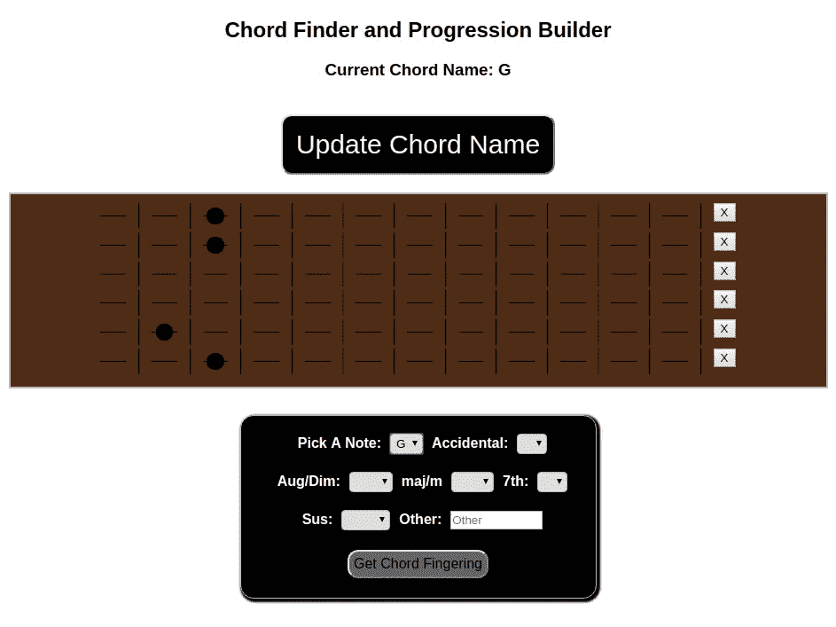
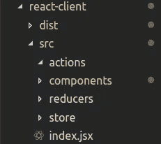
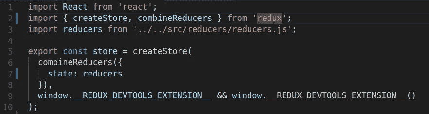
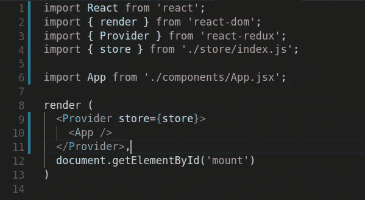
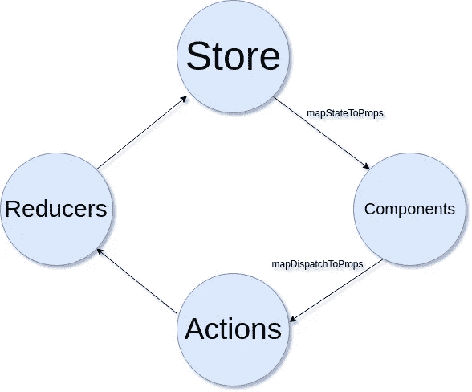
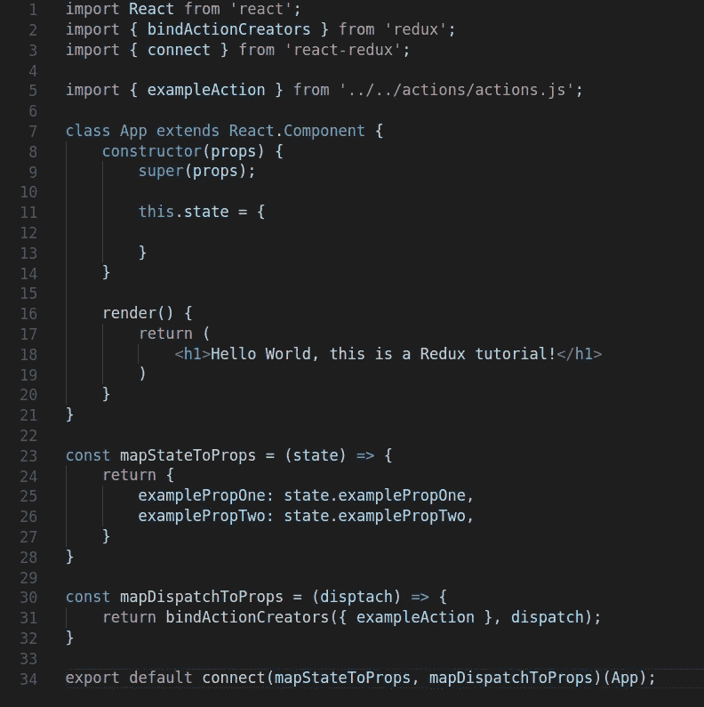
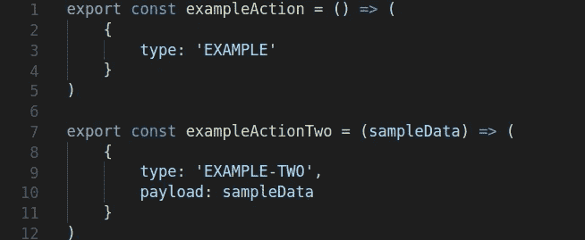
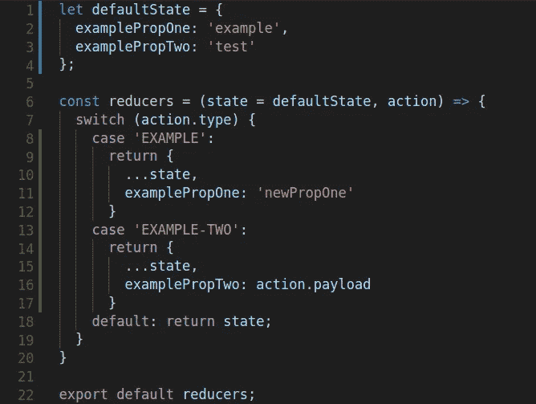

# React-Redux 入门

> 原文：<https://medium.com/hackernoon/getting-started-with-react-redux-1baae4dcb99b>


让我来做个铺垫:你想出了一个 web 应用程序的好主意，你决定用 React 来构建它。举个完全随意的例子，假设它是一个带有交互式吉他琴颈和提交表单的吉他和弦查找器(比如说，[这个](https://rechord-progression-builder.herokuapp.com/))。



Shameless self-promotion!

你已经列了几个任务清单，看了几个教程，你认为你已经掌握了所有这些“道具”的窍门，所以你马上投入进去。进展得足够好——你已经有了顶级的应用程序组件，可能是一个表单，一个吉他组件……然后，它开始向你展示。你将需要一把吉他…有六根弦…每根弦有十二个品…它们都需要传达关于它们是否静音、按下或打开的信息…它们需要能够与形式交流并表达和弦…在你知道它之前，六个小时已经过去了，到处都是纱线，你很确定你已经发现了一个莫名其妙地牵连完全虚构的人和美国邮政署​的阴谋。


Side note for Always Sunny fans, did you ever notice that “Pepe Sylvia” sounds an awful lot like how an illiterate person would try to read “Pennsylvania”? That’s the sort of subtle comedy we need.

但是不要担心(双关语)！有一个很酷的工具叫做 Redux，你可能听说过，它是为这样的场景设计的，当你的组件嵌套失控，道具被左右传递的时候。由于 React 最近重组的 Context API 和其他竞争库，它可能会被淘汰，它可能会激起开发人员的热情，他们可能会认为它是自切片面包以来最好的东西，也可能是令人困惑的混乱，但它肯定仍然有它的位置。

关于 Redux 使用的黄金法则，来自它的创造者和全世界的开发者，是类似于“如果你不确定你是否需要 Redux，你可能不需要。”对那些人，我说…嗯，你可能是对的。Redux *是否为简单的任务增加了很多复杂性和样板，我们很快就会发现。事实上，我*用普通的旧 React 做了*这个吉他应用程序，它运行得很好。但是，那时(两个月前)我还年轻天真，所以为了解释起见，让我们来看看它是如何让我们的生活变得更容易的。一旦我们解决了样板文件，Redux 就有能力让您的应用程序更具可伸缩性、更高性能、更易于调试和推理。另外，我真的很喜欢！*


An artist’s rendering of a React app. Who’s got time for all that nesting?

因此，让我们假设您已经构建了一个 React 应用程序。如果没有，可以查看其中一个[多](https://tylermcginnis.com/reactjs-tutorial-a-comprehensive-guide-to-building-apps-with-react/) [大](http://buildwithreact.com/tutorial) [教程](https://ihatetomatoes.net/react-tutorial-for-beginners/) [出](https://egghead.io/courses/the-beginner-s-guide-to-react) [出](https://github.com/enaqx/awesome-react)。如果你愿意，甚至可以尝试 [create-react-app](https://www.npmjs.com/package/create-react-app) 。一旦你开始运行，我们要做的第一件事就是安装我们的软件包！

```
sudo npm install redux
sudo npm install react-redux
```

敏锐的读者可能会注意到，我们同时安装了 Redux 和一个特定于 React 的版本——这是怎么回事？！Redux 实际上是一个框架无关的库。你可以使用它与骨干，或秘银，或角，或流星，或 Vue 它将与他们所有的工作！不过，React 的特定版本有一些方法，当我们在组件中进行设置时，这些方法会变得非常有用。

安装完成后，我们将设置我们的文件结构，这比我们在传统的 React 应用程序中使用的文件结构多一些。每个人的做法都有所不同，但通常我喜欢在我的 react-client/src 目录中创建一个 **actions** 文件夹、一个 **reducers** 文件夹和一个 **store** 文件夹，如下所示:



You may see some folks use constants, I don’t bother with those.

太好了！所以让我们从**商店**开始——这是 Redux 工作的原因。你可以把它想象成一个外部状态容器，React 组件可以通过一些特殊的方法直接与之交互，而不管它们在项目层次结构中的嵌套层次。需要一些状态吗？去**店**！需要更新状态？向**商店**派遣行动！一切都是相通的！


That’s right, I used the same reference twice in one article. It’s… a metaphor for how Redux makes you write the same thing in a few places in your app… or something.

让我们在我们的**商店**文件夹中创建一个 **index.js** 文件。首先，我们将导入 React，这样我们就可以访问它——这是有意义的。接下来，我们将直接从 Redux 导入两个方法: *createStore* 和 *combineReducers。这些听起来就像是真的一样！什么是**减速器**，为什么我们要把它们结合在一起？让我们暂时搁置这个问题，只是说我们还将导入我们的 **reducers.js** 文件，我们还没有在我们的 **reducers** 文件夹中创建这个文件。在我们所有的导入语句之后，我们将创建一个名为 *store* 的变量，并将其中的**reducer**与 *combineReducers、*组合，后者将一个对象作为参数，并将成为我们的全局应用程序状态*。*把所有这些放在一起，它看起来像下面的。*



Line 9 is exclusively for using Redux’s excellent browser extension. I highly recommend it, but it’s not mandatory.

还有一个缺失的部分:Redux 的*提供者*组件**。这是一个上下文包装器，它需要包围你的整个应用程序，并接收**存储**作为属性，允许你的所有其他**组件**通过 Redux 的方法访问它。在我们应用程序的最高层，我们附加的 **index.jsx** 文件对 DOM 作出反应，我们将简单地导入**商店**、*提供者*和我们的**应用程序组件**(我们将在一秒钟内构建)并将所有东西打包，就像这样。**



This way, our entire application has access to our store!

现在我们已经建立了我们的**商店**，让我们来谈谈 Redux 生态系统的其余部分。这是最复杂的部分，所以请耐心听我说。实际上，您有一个循环关系，即**存储**->-**组件**->-**动作**->-**减速器**->-**存储**(见下图)。



通过一个名为 *mapStateToProps* 的小函数，将**商店**的状态映射到**组件**——你可以将此视为订阅服务。事实上，它使用的本地 Redux 方法叫做 *subscribe* (尽管在本教程中我们不会直接使用它)。对**商店**所做的任何更改都将向下传递到已经订阅了**商店**中该属性的任何**组件**，从而触发重新渲染。很整洁，是吧？

然而，为了真正影响应用程序的状态，一个**组件**必须使用一个单独的函数: *mapDispatchToProps* 。 *Dispatch* 是另一个 **store** 方法，它接受一个**动作**(我们导入的)并将其发送给一个 **reducer** ，后者接收那个**动作**，并实际改变应用程序的状态。我知道这有点拗口，但是让我们一步步来，从一个超级简单的**组件**开始。这将是我们最高级的**应用组件**，它还将从 Redux 导入一个名为 *bindActionCreators* 的方法，以及从 React-Redux 导入一个名为 *connect* 的方法。前者只是让编写我们的 *mapDispatchToProps* 函数更加简洁，而后者是一个**高阶组件**，它将*我们的* **组件**与 *mapStateToProps* 和 *mapDispatchToProps* 捆绑在一起，以便这些方法可以访问**存储库**。也就是说:



Notice how we’re importing our action on line 5*.*

这里还有几个其他的小问题——注意 *mapStateToProps* 如何将应用程序状态作为参数，以及我们如何从该状态中提取单个属性。这些属性可以在那个**组件**的*道具*上访问，所以如果我们想获得*示例比例*，我们可以在**组件**的渲染函数中这样做(注意< p >标签):

```
render() {
    return (
        <div>
            <h1>Hello world, this is a Redux tutorial!</h1>
            <p>Here is our property: {this.props.examplePropOne}</p>
        </div>
    )
}
```

这样，对*示例对象*所做的任何更改，即使来自另一个**组件**，也将流经并呈现在这个**组件**中。您不必从您的 *mapStateToProps* 函数中的 state 对象中挑选出所有属性——只引入您的**组件**关心的那些属性！

*mapDispatchToProps* 类似地，将*调度*作为参数。 *Dispatch* 是 Redux **store** 的一个特殊方法，通过 *bindActionCreators* 将我们的**动作**与它关联起来，我们都将它附加到**组件**的 props 上，并且说，每当它被调用时，它将把有问题的**动作**分派给要被调用的**缩减器**

这里有一个关于*和*如何在同一个组件的函数中出现的例子:

```
exampleFunction() {
    this.props.exampleAction();
}
```

还和我在一起吗？在**组件**中要注意的最后一件事是*连接*方法的语法——它将总是带有两个参数，并且它们将总是按照顺序是 *mapStateToProps* 和 *mapDispatchToProps* 。您可以很容易地省略 *mapDispatchToProps* ，但是如果您想要省略特定**组件**上的 *mapStateToProps* ，请确保在其位置保留一个 *null* 值。应该在*连接*语句的最后调用**组件**本身的名称。下面是另一个例子，这次没有使用 *mapStateToProps* ，而是使用了一个叫做 **List** 的**组件**:

```
export default connect(null, mapDispatchToProps)(List);
```

到目前为止，我们已经处理了 Redux 生命周期中的**商店**和**组件**部分。这样就剩下**动作**和**减速器**了。

**动作**是简单的部分——它们只是创建 JavaScript 对象的函数，有一个强制属性叫做*类型*。按照惯例，*类型*通常全部用大写字母书写，非常能描述**动作**实际做的事情。它通常有另一个名为*有效载荷*的属性，在这个属性中，我们将任何实际的数据传递到**动作**中。一般来说，我们希望避免在这些**动作**中包含任何实际的应用程序逻辑:它们应该简单地传递一个*类型*和一些潜在的数据。下面是我们的 **actions/actions.js** 文件可能的样子:



Notice how the second action receives an argument, which it passes along as a payload.

这就是**行动**的全部内容！

此时，我们的生命周期中只剩下一个项目:**减速器**。一个**缩减器**实际上是一个巨大的开关语句，它接受一个**动作**，并根据其*类型*，更新应用程序的状态。如果您还记得，当我们在上面创建我们的**存储**时，我们导入了我们的**reducer**并在我们的 *createStore* 函数中通过*combiner reducer*传递它们，这意味着无论从我们的**reducer**返回什么，都将更新**存储**的状态。然后，这些更改将通过我们放在**组件**中的任何 *mapStateToProps* 函数向下流动，以订阅**存储**，我们的数据将被完全链接。那是 Redux！我们做到了！

现在，有一个重要的概念我已经忽略了——事实上，它是 Redux 中最重要、最基本的概念之一:*不变性*。简而言之，使用 Redux，为了更容易的调试、干净的单例代码和更高性能的应用程序，我们实际上从不直接改变应用程序的状态。相反，每一个单独的状态改变都被记录为及时的快照，并且每一个改变都是对状态的拷贝版本进行的。举一个最明显的例子来说明这一点是如何有用的，以前面提到的 Redux dev 工具为例:它在整个应用程序的生命周期中保存了*状态的全部历史记录，这样你就可以一步步地看到事情是如何以及何时发生变化的。超级有用！如果你有时间的话，我强烈推荐你使用它。*

话虽如此，这里有一个**缩减器**可能看起来像什么的例子——也就是说，一个函数接受应用程序的状态，以及传入的**动作**，通过一个 switch 语句运行它，并返回状态的更新版本以传送到**存储**:



我们不必像我在这个例子中那样提供默认状态——在一些应用程序中，您将在不同的文件中定义一个默认状态，赋予它初始化属性，然后将其导入到您的 **reducer** 中。在其他应用程序中，您可以使用 ES6 的默认参数简单地将状态初始化为空对象。初始化状态没有严格的规则，除了它必须被定义，你的**减速器**必须*总是*返回一个状态。为此，我们不要忘记第 18 行的默认情况，这也很重要。

至关重要的是， **reducer** 应该接受一个状态对象和一个**动作**作为参数，在**动作**的*类型*属性上设置一个开关，然后返回一个复制版本的状态，并带有所需的更新属性。请注意第 10 行和第 15 行的扩展操作符:这些操作符在添加和/或修改所需属性之前扩展了先前的状态，这意味着您最终将通过每个**操作**向**存储库**返回一个复制的、稍微修改过的状态版本。您也可以使用 Object.assign 来实现这一点，但是我发现 spread 操作符更优雅。还要注意在第 16 行我们如何使用**动作的** *有效负载*属性将数据传递到我们的状态，而在第 11 行我们硬编码了对*example propene*的修改。

当谈到 React-Redux 时，我们可以谈论更多的内容。举个例子，异步动作:传递 API 调用的结果，这种大多数时候都很轻松的操作，如果你有**个动作**需要在执行前满足一定的标准，可能会引起麻烦。有一个名为 *redux-thunk* 的库可以帮助处理这个问题。你也可以在一个项目中有多个**减速器**，然后你可以通过**存储**文件中的*组合减速器*函数来传递。此外，局部状态在单独的**组件**中仍然非常有用，并且您应该只在嵌套的**组件之间传递状态的情况下才使用**存储**。**我鼓励您阅读更多内容，并开始尝试学习 Redux 的所有优点，并阅读竞争状态管理解决方案，包括 mobx 和前面提到的 Context API。

不过，在这一点上，我希望你能看到 Redux 如何让我们的吉他应用程序变得简单一点。假设用户点击一个品，我们需要更新它所在的弦、吉他组件、应用组件**和表单组件**。与其到处传递*道具*，通过可能根本用不到的多个关卡，我们可以改为发送一个**动作**并设置几个订阅，我们就可以开始了！在有大量嵌套和大量状态要管理的特别大的应用程序中，这可以使你的生活简单很多，并且是一个非常棘手的问题的一个可能的解决方案。****

**如果你做到了这一步，感谢你的阅读！这是一只可爱的雪貂作为感谢。**

****