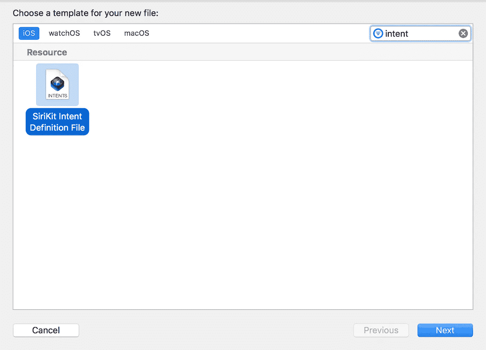
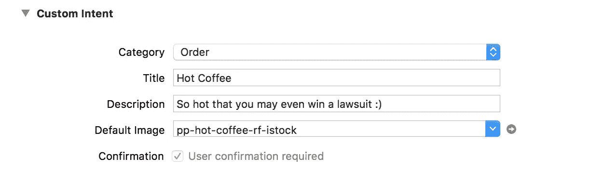
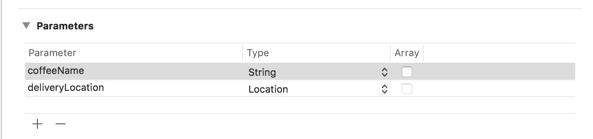
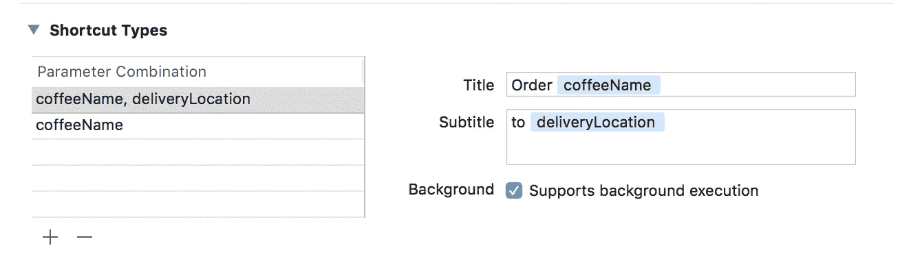
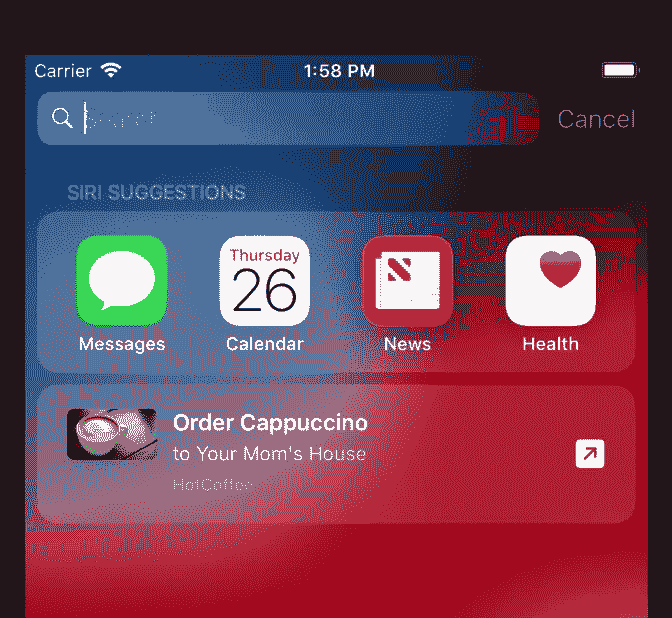

# 使用意图在 iOS 12 中开始使用 Siri 快捷方式

> 原文：<https://medium.com/hackernoon/getting-started-with-siri-shortcuts-in-ios-12-using-intents-8206099aa5ce>

[https://cdn-images-1.medium.com/max/2000/1*bhonbY4jHhFNGXzBkodmbw.png](https://cdn-images-1.medium.com/max/2000/1*bhonbY4jHhFNGXzBkodmbw.png)

在我的上一篇文章中，我谈到了如何使用 NSUserActivity 快速创建 Siri 快捷方式。当你想通过[快捷方式](https://hackernoon.com/tagged/shortcuts)打开你的应用程序时，NSUserActivity 非常有用。在更高级的场景中，如果你想更好地控制快捷键体验，建议你使用[意图](https://hackernoon.com/tagged/intents)。

在这篇文章中，我将向你展示如何开始使用意图，以及如何设置意图定义文件作为 Siri 快捷方式的蓝图。

# 意图是什么？

Intents 允许你更好的控制快捷键。这意味着 Siri 不会说

"*您的咖啡已经点好了，它将会到达一个地点*"

Siri 可以说一些更有意义的话，比如

"*您的* ***卡布奇诺*** *已经订购，将于* ***10*** *分钟*到达您的 ***办公室***

*Intents 还可以用于创建自定义响应，甚至自定义用户界面，允许用户甚至不用打开应用程序就可以下单。现在不要太担心自定义用户界面，我会在下一篇文章中介绍。*

# *定义你的意图:*

*意图在意图定义文件中定义。向您的项目添加一个新文件，并在搜索栏中搜索“intents”。选择如下图所示的“ **SiriKit 意图定义文件**”:*

**

*默认情况下，Intents 文件为空。单击底部的“+”号，添加新的意向。将意向从其默认名称重命名为“ **OrderCoffee** ”。*

*意图定义文件分为多个部分。让我们从顶部的“**自定义意图**”部分开始。您可以在这里定义意图、描述、类别和默认图像的名称。*

**

*因为，我们的应用程序负责订购咖啡，这就是为什么我们选择类别为“**订单**”。选中确认复选标记，表示需要用户确认才能执行此意图。*

*接下来，我们将为您的意图设置参数。参数是可以传递给意图的附加数据。配合 Siri 语音快捷键使用时，Siri 也会使用参数。*

**

*我们使用两个参数 **coffeeName** 和 **deliveryLocation** 。需要注意的一件重要事情是，deliveryLocation 的类型是 Location，而不是 String。这意味着我们甚至可以用它来计算预计到达时间。*

**你也可以使用你的自定义类作为参数。在这些情况下，参数类型将是自定义的。**

*最后，我们将设置“**快捷方式类型**”。快捷方式类型允许 Siri 了解更多关于您的快捷方式行为的信息。快捷方式类型实际上取决于应用程序，应该以一种有意义的方式来定义。在我们的应用程序中，我们定义了两种快捷方式类型，这样 Siri 就可以学习咖啡和位置可用时以及位置不可用时的行为。*

**

*继续构建您的应用程序。在后台，Xcode 将查看 Intents 文件，并创建一个相应的 Swift 类"**ordercefecoffeintent**"。在下一节，我们将学习如何捐赠我们的意图。*

# *捐赠意向*

*最后，捐献我们意愿的时候到了。我们首先创建一个 placemark 实例，它表示咖啡需要送到哪里。这可以通过使用 CLLocation 和 CLPlacemark 类来实现，如下所示:*

*接下来，我们将创建一个由 Intents 定义文件自动生成的 **OrderCoffeeIntent** 类的实例。*

*最后，我们将使用 INInteraction 实例贡献我们的意图，如下所示:*

*就是这样！*

*接下来运行应用程序并捐赠您的意图。在你捐赠了快捷方式后，你应该可以在“ **Siri 应用建议**”下看到你的捐赠，如下所示。*

**

*不错！*

*在下一篇文章中，我们将通过为您的快捷方式实现一个自定义用户界面来将我们的应用程序提升到一个新的水平。这将允许我们甚至不用打开应用程序就可以订购咖啡。*

# *掌握 iOS 的 Siri 快捷键*

*如果你喜欢这篇文章，并想了解更多关于 Siri 快捷方式的知识，那么请查看我的 3 个多小时 Udemy 课程“ [**在 iOS 中掌握 Siri 快捷方式**](https://www.udemy.com/mastering-siri-shortcuts-for-ios/?couponCode=SIRIFORMED) ”。该课程更详细地介绍了如何使用 NSUserActivity、Intents、自定义响应、自定义用户界面等创建 Siri 快捷方式。*

* [## 在 iOS | Udemy 中掌握 Siri 快捷键

### 用快捷方式简化你经常做的事情

www.udemy.com](https://www.udemy.com/mastering-siri-shortcuts-for-ios/?couponCode=SIRIFORMED)*