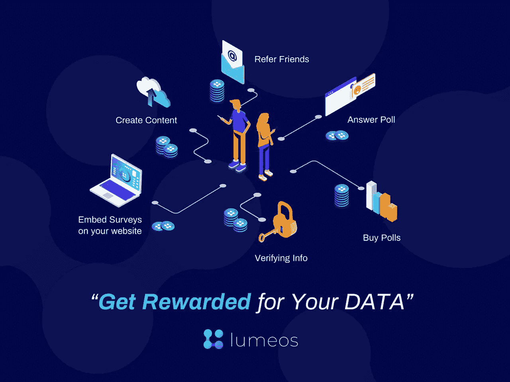

# 充分利用您的数据

> 原文：<https://medium.com/hackernoon/getting-the-most-out-of-your-data-def9b0b46225>

Your data is very valuable, that’s why you should have ownership and full control over it.

你的个人[数据](https://hackernoon.com/tagged/data)值多少钱？很难说。2013 年[在*金融时报*上的一篇文章](https://ig.ft.com/how-much-is-your-personal-data-worth/)将这个数字定为 0.007 美元，这是关于你个人的每个独特事实——年龄、性别和地理位置等等。虽然这个数字听起来可能不是很多，但如果你考虑到你可以透露的广泛的个人信息，你会看到一些严重的金钱。

但每件 0.007 美元的估价也是五年前的，这在科技行业可能是一个世纪。在那些年，硅谷是一个非常非常不同的地方。在那里，你可以花 100 美元买到比特币，巨人队是世界职业棒球大赛的冠军。今天，我估计每份个人资料价格要高得多。虽然没有一个普遍接受的数字，但是使用[数据](https://calc.datum.org/)快速计算会得出一个接近每件一美元的数字。累积起来，2018 年的全球数据市场估计每年价值 0.25 万亿美元。在今天的世界里，这意味着你可以通过出售自己的平凡信息来谋生。

> 数据是新的数字石油。

这并不夸张。在最近的*《经济学家》* [封面文章](https://www.economist.com/briefing/2017/05/06/data-is-giving-rise-to-a-new-economy)中，数据被比作石油:一种定义整个世纪的商品。这也不是夸张。据 [Statista](https://www.statista.com/statistics/254266/global-big-data-market-forecast/) 称，仅大数据一项——不包括脸书邮报之类的东西——每年就价值惊人的 420 亿美元。这一数字预计将在未来九年跃升至 1030 亿美元。如果是小数据，那些平凡的脸书帖子，你开车的里程数等等。随着这一趋势的发展，我们预计未来十年每年的估值将超过 6000 亿美元。鉴于每天有 30 亿活跃的互联网用户，假设每个用户平均分配数据(事实并非如此)，这意味着每年 200 美元。鉴于美国每分钟产生 2，657，700 千兆字节的互联网数据(世界上每天的总量为 2.5 万亿字节)，美国人将享受这些好处的大部分——每年数千美元。

疯狂的是，这些数字代表了平均被动的数据货币化。如果你辞掉工作，全职在网上出售你的数据，你不仅仅是生存。你会活下来。什么是公平游戏？脸书、Twitter 和 Linkedin 的活动、博客文章、直接分享给广告商的数据……几乎所有你能想到的你在网上做的事情。除了现在不只是像平常一样使用这些服务，你将在很大程度上受益。

# Lumeos 是在线数据共享领域的游戏规则改变者

这是我的公司的目标。你的数据应该为你工作。你可能会问，为什么它还没有这样做呢？目前，你的数据正在为别人工作。实际上，它对很多人都有效。大公司也是。这方面最好的例子是脸书。当用户注册脸书账户时，他们愿意泄露信息，以换取使用该平台的权利。然后，脸书在这些用户不知情的情况下，将这些数据像蛋糕一样卖给任何感兴趣的人。公司可以在脸书上发布精确定位的广告，以吸引尽可能广泛或具体的人群，这些广告都带有普通的个人数据。

这个新创造的广告市场已经变得非常非常大。据搜索营销公司 Wordstream 称，脸书广告的每次点击成本为 1.72 美元。谷歌，另一个臭名昭著的数据收割机，平均每次点击成本价格为 **$2.32** 。你的数据价值巨大——和其他人的数据加在一起价值数十亿。这些钱你可能一毛钱都没见过。

我想和我的公司一起改变这种状况。Lumeos 将使人们能够控制属于他们的数据，如果没有合法的、双方同意的交易，这些数据不应该属于任何其他人。使用我们的平台，您可以创建和回答简短的民意调查，给出您认为合适的或多或少的个人信息。Lumeos 将把这些自愿泄露的数据出售给数据管理提供商，这些提供商本质上是这些信息的大型存储平台，数据分析师和顾问随后可以访问这些数据。

我们的[区块链](https://hackernoon.com/tagged/blockchain)支持的系统——加上我们团队的[资深技术经验](/@lumeos/meet-the-team-625b7d2eb6ec)——是 EOS 上的第一个此类系统，它将使 Lumeos 成为世界上首屈一指的分散数据中心。要想了解更多关于如何充分利用数据的信息，请在我们精心策划的 Instagram 或 Jason Silva 批准的 Twitter 上关注 Lumeos。你也可以阅读我们的[白皮书](https://drive.google.com/file/d/1yKEfwnNjcl00hR4HoWSFhQD2h-lmXM6e/view)，加入我们的[电报](https://t.me/lumeos)群。