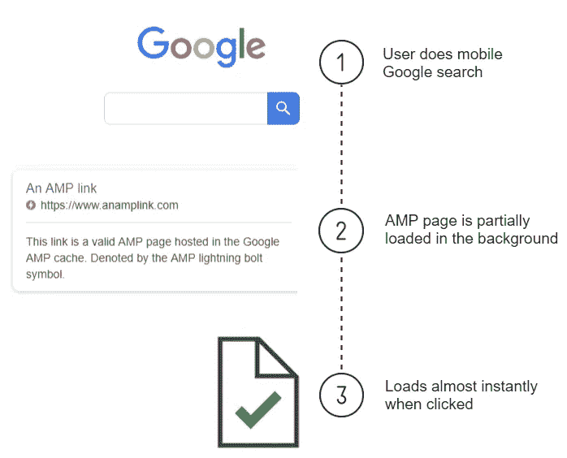
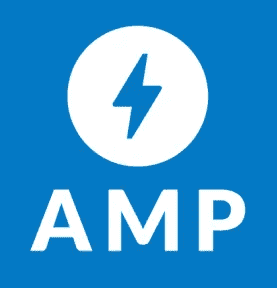
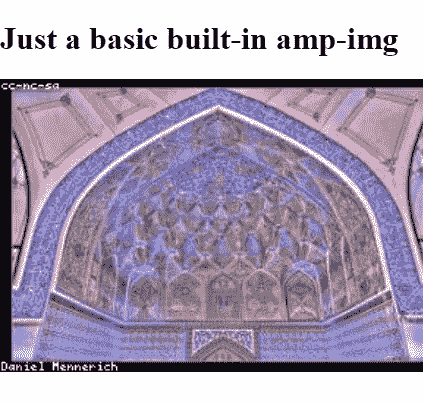
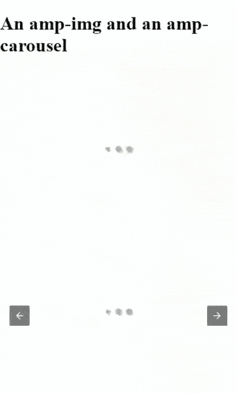
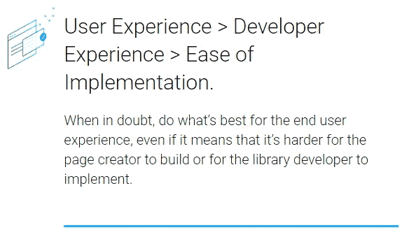
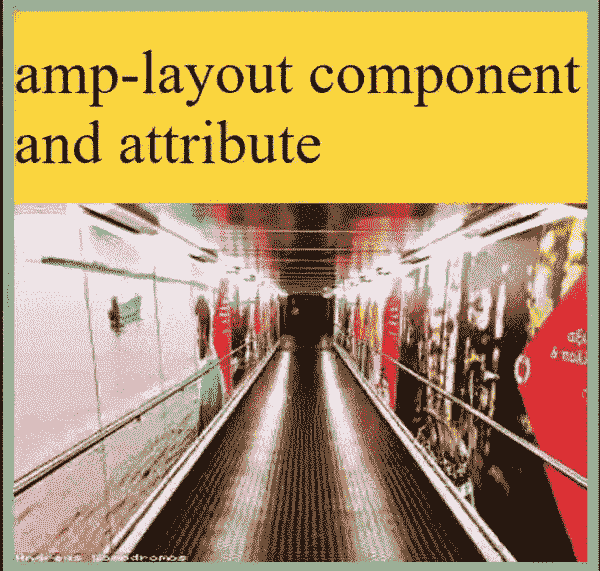
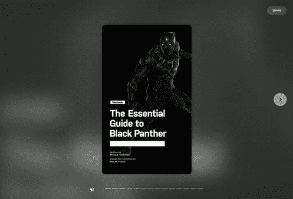

# 使用谷歌加速移动页面

> 原文：<https://medium.com/hackernoon/getting-up-to-speed-with-google-accelerated-mobile-pages-374578e726cd>

谷歌的加速移动页面(AMP)项目是一个[开源库](https://github.com/ampproject/amphtml/)，包含非常快速的 HTML Web 组件，可以帮助我们非常快速地建立非常快速的网站。

它从 2015 年末开始出现，并且是一项持续发展的工作。每天都在发展和成长，对未来有着雄心勃勃的计划，拥有超过 500 名贡献者的团队。

这也是[一套规则](https://www.ampproject.org/docs/fundamentals/spec)，如果我们遵守，意味着[谷歌](https://hackernoon.com/tagged/google)将在他们非常快的 cdn 上缓存我们的页面。当移动用户搜索我们的某个页面时，谷歌甚至会开始部分预取，提供近乎即时的页面加载。



Example user flow illustrating how AMP pages can load almost instantly

我们将介绍 AMP 的基本原理，浏览一些当前可用组件的快照，并了解我们如何在遵循规则的同时构建我们想要的丰富的交互式网站。

# 从哪里开始

我们用 HTML 编写 AMP，但是为了这样做，我们必须首先包含我们想要使用的组件的脚本。



AMP — “Fast by default”

在最基本的情况下，我们只需要在我们文档的`<head>`(下面的第 5 行)中包含大约 77kb 的 AMP 运行时脚本，然后我们就可以使用一些基本的内置 AMP 组件，比如`<amp-img>`(下面的第 10–11 行)。

The bare bones HTML needed to load the AMP runtime and use a built-in component



Output of above HTML

AMP 运行时为其他 AMP 组件提供了运行平台，并管理资源——惰性加载一切。这个`<amp-img>`组件提供了加载图像所需的接口。

对于所有其他组件，我们还需要包括它们各自的库。例如，如果我们想使用`<amp-carousel>`(下面第 15–23 行)，我们需要包含它的脚本(下面第 6–7 行)。

Example of auto-playing carousel



Output of above HTML

光是这一点就让我们有能力使用大量的 AMP 组件并构建非常快速的网站，然而，如果我们还想利用 AMP 缓存和谷歌搜索预取的能力，那么我们需要遵循规则。

# 规则

## 1-样板文件

有一些强制性的样板文件。以下是它在页面上的实际样子，具体可以在[官方入门文档](https://www.ampproject.org/docs/getting_started/create/basic_markup)中找到。

Bare minimum valid AMP HTML boilerplate

## 2-HTML

虽然大多数 HTML 是允许的，但一些可能减慢或阻止页面加载的标签被禁止使用[或被替换为 amp](https://www.ampproject.org/docs/fundamentals/spec)。

```
Replacement tags include:
======================
     =>  <amp-img>
<video>   =>  <amp-video>
<audio>   =>  <amp-audio>
<iframe>  =>  <amp-iframe>Prohibited tags include:
========================
<frame>
<embed>
<style>   =>  With exceptions
<script>  =>  With exceptions
```

## 3 — CSS

我们的自定义 CSS 必须包含在一个内部的`<style amp-custom>`标签中(下面的第 5–9 行),不超过 50kb，不使用`!important`,并且遵循[和其他一些 CSS 规则](https://www.ampproject.org/docs/design/responsive/style_pages)。

amp-custom CSS style tag

考虑到庞大的 CSS 关键帧动画，还有一个最大可达 500kb 的`[<style amp-keyframes>](https://www.ampproject.org/docs/fundamentals/spec#keyframes-stylesheet)` [标签。](https://www.ampproject.org/docs/fundamentals/spec#keyframes-stylesheet)

## 4 — JavaScript

`<script>`标签只能用来存储数据(状态)。它也可以加载 AMP 库，但不能用于任何定制的 JavaScript。所以，不幸的是，JavaScript 违反了规则，被禁止了…目前是这样。

Video of what’s allowed by the AMP rules

如果我们能够遵守[这些规则](https://www.ampproject.org/docs/fundamentals/spec)，我们就有了一个**有效的 AMP 页面**，它将被缓存在 Google CDN 中，并为 Google 移动搜索用户预取。[可在开发、CI/CD 和生产过程中检查](https://www.ampproject.org/docs/fundamentals/validate)有效性。

不遵守所有规则但仍然使用 AMP 功能的页面被一些人称为**脏 AMP 页面**，它仍然工作良好，速度非常快，但不会获得 AMP 的其他好处。

对自定义 JavaScript 的限制对 web 开发有着巨大的影响，足以让一些人却步，但 AMP 解决了太多的问题，并且越来越受欢迎，不容忽视，2018 年初报道了来自超过 2500 万个域的超过 40 亿个 AMP 页面，包括顶级网站的名人录。

据我所知，这些限制不仅仅是为了搞笑或惹恼开发者，甚至更邪恶地试图控制网络。所有这些都是为了把**用户放在第一位**，这样我们就能建立更好的网络体验，牺牲掉[其他一切阻碍这个咒语的东西](https://www.ampproject.org/about/amp-design-principles/)。



“Do what’s best for the end user experience “— [https://www.ampproject.org/about/amp-design-principles/](https://www.ampproject.org/about/amp-design-principles/)

现在还不是把我们所知道的所有关于 web 开发的东西都扔出窗外的时候，但是把 AMP 作为我们工具箱中另一个非常方便的工具是值得的。这个工具确实给了我们做大多数我们想做的事情的方法。因此，让我们来领略一下一些组件和实现模式。

# 布局

AMP 有点痴迷于在不获取资源的情况下了解页面上的内容以及它们的尺寸。布局有两种表现形式:

*   一个[多用途容器组件](https://www.ampproject.org/docs/reference/components/amp-layout)，它知道如何调整自己的大小以及它的像素尺寸或长宽比。它是 AMP 运行时的内置组件。
*   还有一个 [AMP-HTML 属性](https://www.ampproject.org/docs/design/responsive/control_layout#the-layout-attribute)，它让各个组件知道如何做同样的事情。

它们有一个[有用的值集合](https://www.ampproject.org/docs/design/responsive/control_layout)，根据布局的类型，`width`和`height`可能需要，也可能不需要，可以作为像素尺寸或纵横比。如果没有`layout`出现，AMP 将尝试根据`width`和`height`的出现进行推断。

这不仅确保了在客户端为用户呈现页面所花费的时间最少，还为我们开发人员提供了一个更好的 API 来调整元素或容器的大小，比编写响应性 CSS 有所收获。

以下面的例子为例:

我们使用一个带有`layout="fill"`的`<amp-layout>`组件来创建一个填充所有可用空间的元素，它是绿色的只是为了显示它的边界。

接下来我们有一个带有`layout="fixed-height" height="200"`的`<amp-layout>`组件(下面的第 1 行)来制作一个固定高度为 200 像素的元素。它将占据所有可用的宽度，并且是黄色的。

在该组件中，我们有一个关于`<amp-fit-text>`组件的`layout`属性的例子(下面的第 2 行),它只是将文本的大小缩放到所请求的大小，在我们的例子中，我们已经设置了`layout="fill"`,所以它占用了其父组件的所有空间。

最后是一个长宽比为 1.6 乘 1 的响应式`<amp-img>`。

如果我们把所有这些放在一起，看起来可能是这样的:



Output of above examples of layout

# 模板

AMP 有一个`<amp-mustache>` [组件，允许通过 mustache . js(](https://www.ampproject.org/docs/reference/components/amp-mustache)[mustache docs](https://github.com/janl/mustache.js/))进行无逻辑的模板化，官方文档中列出的主要特性有:

*   `{{variable}}`:一个变量标签。它输出变量的 HTML 转义值。
*   `{{#section}}{{/section}}`:一个节标签。它可以测试一个变量的存在性，如果它是一个数组，就可以对它进行迭代。
*   `{{^section}}{{/section}}`:一个倒置的标签。它可以测试变量的不存在性。

`<amp-mustache>`本身并不工作，它必须被用作父节点中的模板解决方案，父节点可以从 CORS JSON 端点获取数据，比如`<amp-list>`。

以这个示例模板为例，它使用一个`<amp-list>`从[星球大战 API](https://swapi.co) 和`<amp-mustache>`获取可迭代数据，以显示每次迭代:

`{{name}}`(下面第 4 行)从返回的响应数组中写出属性的值。

`{{#url}}`(下面的第 7–9 行)该变量包含一个值，因此它被视为一个条件变量，其中的`<a>`只有在`url`存在时才会被呈现。

`{{#films}}`(下面的第 12–18 行)返回一个数组，因此它被视为一个循环，在这个循环中，我们选择在`<amp-list>`中嵌套另一个 CORS JSON 端点，这样我们就可以获得每个角色出现过的电影的名称。`{{.}}`(下面第 13 行)表示数组中该项的值。

Example of iterating over JSON and templating the response


Output of above amp-mustache and amp-list example

# 媒体组件

除了我们已经看到的`<amp-img>`，还有对[音频](https://www.ampproject.org/docs/reference/components/amp-audio)、[视频](https://www.ampproject.org/docs/reference/components/amp-video)等的替换。虽然[大多数组件都可以有一个](https://www.ampproject.org/docs/reference/common_attributes) `[fallback](https://www.ampproject.org/docs/reference/common_attributes)` [和](https://www.ampproject.org/docs/reference/common_attributes) `[noscript](https://www.ampproject.org/docs/reference/common_attributes)` [标签](https://www.ampproject.org/docs/reference/common_attributes)，但是当您提供一组级联的`<source>`供其过滤时，像这样的资源也可以自动降级(下面的第 20–21 行)。

Example media components, with fallback and alternative sources

还有许多专有组件，可以轻松快速地从 YouTube、Instagram、Twitter、Imgur、Hulu、Soundcloud 等来源加载内容。

这里我们使用一个名为`<amp-carousel>`的布局组件来循环显示几个媒体组件。

Example of various media components in a carousel


Output of above example of media components

# 行动和事件

元素属性为我们提供了一种在用户事件上触发动作的方法。实现遵循以下模式:

`on="event:target[.action[(...args)]]"`

## 1-事件

`event`是元素监听的事件的名称。所有元素上都有`tap`事件，这是实现点击事件监听器最直接的方式。元素单独公开了与它们相关的其他有用事件，如`change, submit, input-debounced`。

## 2 —目标

`target`是触发动作的元素的 DOM #id。它还可以通过`AMP`调用 AMP 运行时本身来做类似`navigateTo(), setState()`的事情。

## 3 —行动

`action()`是触发该元素的可选方法。它是可选的，因为元素有默认的动作。所有的元素都有一些共同的动作，如`toggleVisibility(), scrollTo()`和元素特有的动作，如`submit(), open(), close(), toggle()`。

## 4-参数

`args`是可选的键=值对，如`'name'=event.value`。

在下面的例子中，我们创建了一个默认为`hidden`的`section`(下面的第 3 行)，一个带有`tap`事件的`button`，该事件通过`id`指向`section`并切换其可见性(下面的第 1 行)。在那个`section`中是另一个带有`AMP.navigateTo`动作的标签(下面的第 6 行),它把我们带到一个 URL。

最后，一个`input`(下面的第 9 行)将滚动到`#my-image`(下面的第 13–15 行)，无论我们在`input-debounced`事件上输入内置的 300 毫秒去抖之后输入多少毫秒。

Examples of actions and events


Output of above example, showing scroll duration determined by input value

你可以在官方文件中阅读更多关于 [AMP 行动和事件的信息。](https://www.ampproject.org/docs/interaction_dynamic/amp-actions-and-events)

# 动态组件

我们已经提到了`<amp-list>`和`<amp-mustache>`，它们为我们提供了动态检索和显示 JSON 数据的方法。我们也可以使用`<amp-form>`来提交表单数据或制作 xhr。

还有一些非常方便的组件，比如`<amp-date-picker>`提供了一个非常棒的 API 和 UX 用于日期选择，还有`<amp-geo>`让我们可以根据地理位置改变内容。

我们还可以在一个`<amp-iframe>`中提供不支持的交互内容，包括 JavaScript。[这些 iframe](https://ampbyexample.com/components/amp-iframe/)不能在初始视窗的前 75%或 600 像素，以较小者为准。除了发送一个`postMessage`之外，它们没有访问父窗口的权限。

## amp-iframe

interactive embedded google maps iframe component


JavaScript enabled google maps iframe

## 安培绑定

但是真的，这里的大的是`<amp-bind>`。Bind 支持数据绑定和表达式，它于 2017 年在野外发布，代表了 AMP 的一次重大飞跃。它允许**状态、绑定和表达式**:

## 1 —州

通过硬编码的 JSON 或 CORS JSON 端点设置和获取**状态** 。我们可以定义多个可变状态对象。

Examples of valid amp-state

可以通过`AMP.setState()`动作更新状态。如`AMP.setState({state: {'name':'Chewbacca'}})`。我们也可以使用`pushState()`在浏览器的历史堆栈中添加一个新条目，这样当我们的用户向后导航时，他们将恢复之前的状态值。

## 2-绑定

[创建数据**组件/元素属性与状态之间的**](https://www.ampproject.org/docs/reference/components/amp-bind#bindings) 绑定。有一些可绑定的属性是所有元素共有的，例如`height, width, text, class`和许多特定于单个组件的属性，例如`src, srcset, alt, placeholder, value, href`。

在下面的例子中，`h1`的`text`将从`state.name`动态更新。我们可以通过它的#id 来引用状态。绑定`[...]=`仅在用户操作后更新。

After user action the default text will be updated with whatever is in state.name

当绑定开始变得过于冗长或者我们想让它们可重用时，我们可以使用`<amp-bind-macro>`到[来创建可调用的表达式](https://www.ampproject.org/docs/reference/components/amp-bind#defining-macros-with-amp-bind-macro)。

Example of amp-bind-macro creation and consumption

## 3-表达式

使用 JavaScript 的[子集，编写能够引用我们的状态](https://www.ampproject.org/docs/reference/components/amp-bind#white-listed-functions)的**表达式**。这些表达式可以引用文档的*状态*，但不能引用`document`本身或`window`。

下面，在这个按钮的`tap`事件上，我们创建一个新的状态对象，其#id 为`remoteState`，并使用一个表达式为一个随机的星球大战角色创建一个端点。

Example of using expressions

如果我们把所有这些放在一起，它可能看起来像这样:

An example using state, binding and expressions


Output for above HTML

Video introduction to amp-bind

# 演示组件

我们有像`<amp-timeago>`这样的组件，它输出一个格式良好的时差，`<amp-mathml>`格式化数学公式，但这里的明星是`<amp-story>`。

`<amp-story>`允许轻松创建内置丰富媒体和动画功能的杂志或数字故事格式。对于常见的杂志布局要求，还内置了额外的功能。


Example of magazine article built with amp-story

它针对纵向模式下的移动设备进行了优化。在横向模式下，它会发出旋转回纵向模式的警告，而在平板电脑和桌面等更宽的视窗中，它不会响应或自适应地扩展。



Non-mobile experience for amp-story

最后一页后有一个可选的书挡，可以有社交媒体链接、其他相关链接和行动号召按钮。它们可能是静态生成的，或者来自 JSON 端点，其中存在一些定制的范围。


Example bookend for amp-story

# 人们用 AMP 做什么

这里有更多使用上述组件和策略的 live AMP 页面示例，等等。


AliExpress


Evening Standard

# 资源

我们刚刚尝试了一下，如果你喜欢这里的温度，这里有一些资源:

官网—[https://www.ampproject.org](https://www.ampproject.org)

Github 回购—[https://github.com/ampproject/amphtml/](https://github.com/ampproject/amphtml/)

所有组件的示例负载—[https://ampbyexample.com](https://ampbyexample.com)

AMP 游乐场—[https://ampbyexample.com/playground/](https://ampbyexample.com/playground/)

入门模板—[https://www.ampstart.com/](https://www.ampstart.com/)

官方代码实验室—[https://codelabs.developers.google.com/](https://codelabs.developers.google.com/)

# 谢谢！

非常感谢您的阅读。

如果您有任何反馈或问题，请通过 Medium 或 [twitter @sanj9000](https://twitter.com/sanj9000) 联系我们。

如果你在英国伦敦，那就来参加我们的 [AMP meetups](https://meetup.com/London-Accelerated-Mobile-Pages-AMP-Group/) ，如果你正在寻找一个好的工作地点，那么我们[正在招聘优秀的人才](https://techjobs.comparethemarket.com/)！