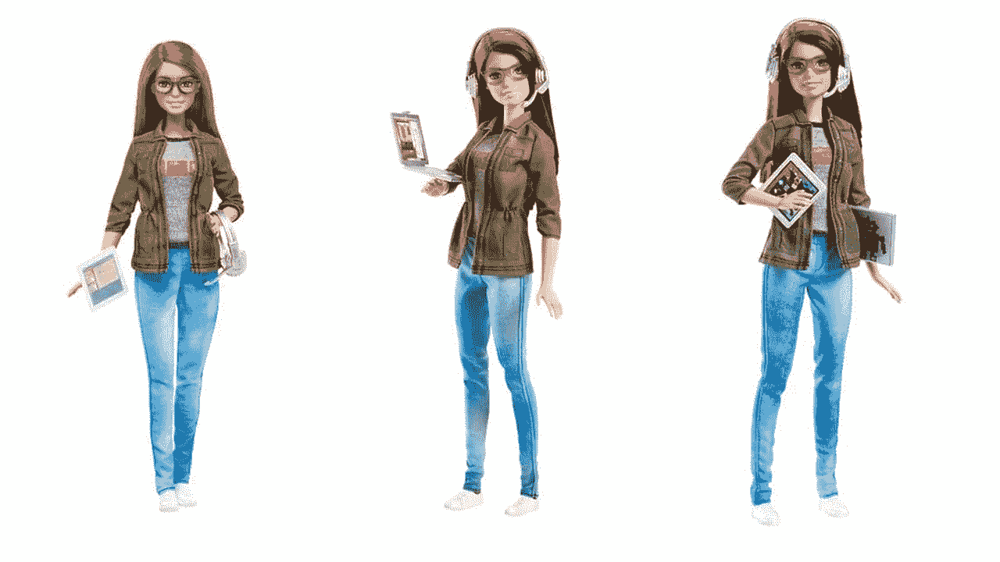

# #GirlsBehindTheGames 是像我这样的女人现在需要的

> 原文：<https://medium.com/hackernoon/girlsbehindthegames-is-what-women-like-myself-need-right-now-95463e8a52a9>

## 看看这些游戏开发行业的女士们

Game Developer Barbie

我的一个朋友和我分享了一些让我开心的事情。如果你过去几天一直在 Twitter 上——特别是如果你花时间在该网站的游戏方面——那么你肯定会看到一个全新的标签出现在你的时间轴上。#[**girlsbehindthe games**](https://twitter.com/hashtag/girlsbehindthegames?src=hash)是一个全新的计划，旨在通过突出在该行业充满激情工作的女性，激励年轻女性从事电子游戏开发职业。

自 1 月 25 日以来，来自世界各地和游戏开发各个方面的女性一直在使用该标签与世界分享她们自己的故事和她们的工作，为一些我们最喜欢的游戏中的一些工作添加了一些面孔。

Thank you for the Sombra sprays! She’s my main hero.

该活动由新西兰游戏公司 [Runaway](http://www.runawayplay.com/) 发起，旨在激励更多年轻女性在她们的行业中追求职业生涯。目标是在活动开始和 3 月 8 日国际妇女节之间收集尽可能多的故事。他们不仅建立了一个 [**Twitter 账户**](https://twitter.com/grlsbehindgames)——在那里他们使用标签分享一些故事——还建立了一个 [**网站**](https://www.girlsbehindthegames.com/) 来概述他们活动的灵感:

> “你知道吗，47%的游戏玩家是女性，而女性只占游戏产业劳动力的 22%？Runaway 希望通过提高业内女性的意识和突出她们所做的不可思议的工作来帮助改善这些数字。

根据他们的网站，Runaway 雇佣了一个由 26 名开发人员组成的团队，其中将近一半(总共 10 人)是女性。他们还以女性担任董事总经理和创意总监这两个领导职位而自豪。

> “员工的多样性使我们的团队能够制作吸引更广泛观众的游戏，包括女性和其他边缘群体，”该网站解释说。“但这种招聘多样性需要一群有才华的女孩加入游戏行业，并得到支持留在游戏行业。”

这场运动似乎正在发挥作用，因为许多使用该标签的推文也包括年轻女性，她们现在受到鼓舞，加入了游戏背后的当前女孩的行列。

Runaway 通过提交表格在他们的网站上收集故事，人们可以写下自己的职业生涯或在这个行业中激励他们的女性。他们也有机会让目前的女性游戏开发者指导有前途的人才。

如果你是一个渴望进入游戏的女人，我鼓励你与分享她们故事的女人联系。在你进入下一两个游戏之前，一定要感谢这些女人。当我看到女性追求自己的激情时，无论是为了自己的享受还是为了帮助他人，我总是心存敬畏。像我这样的女性现在需要这个标签，因为与科技的其他方面相比，这是一个女性参与仍然被视为例外而不是现状的行业，因为它的男性员工和消费者占主导地位。更令人惊讶的是，我遇到的大多数推文都来自对技术和艺术完全陌生的女性，但她们决定追求游戏是因为她们对艺术、游戏或技术的热情——这些来自不同行业的女性表现出了足智多谋和决心，尽管她们的教育背景、以前的工作经验和可用的资源都不尽相同。这种社交媒体活动将向全世界(尤其是女性)证明，女性在游戏行业的存在和激情是有价值的。