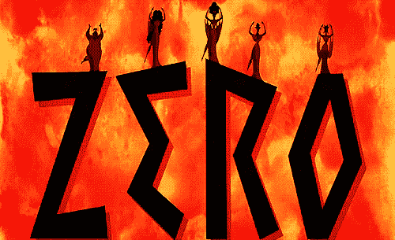
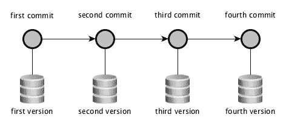

# 从零到英雄——从基础开始

> 原文：<https://medium.com/hackernoon/git-from-zero-to-hero-starting-with-foundations-e42e49b524c5>



如 git 页面中所述:

“Git 是一个自由开放源码的分布式版本控制系统，旨在快速高效地处理从小型到超大型的所有项目。”— [git-scm](https://git-scm.com/)

让我们首先分析一下这意味着什么。

作为一个**版本控制系统，**意味着它允许你一路上创建你的项目的不同版本。

**分布式意味着它可以沿着网络复制。这非常合理，因为整个团队都在使用它。**

首先要知道的是 git 是如何管理事情来执行这个**版本控制**。本文将重点讨论 git foundations，以便在接下来的文章中我们能够处理更高级的概念。

# 如何进行版本控制

要使用 git，必须做的第一件事是在文件夹中初始化一个 git 存储库。当然，您也可以克隆现有的项目，但是让我们从头开始。

```
> mkdir git-project
> cd git-project
> git initInitialized empty Git repository in /Users/stupidgopher/git-project/.git/
```

正如您所看到的，一个空的 git 存储库被初始化在我们目录中的. git 文件夹中。

为了保存你的代码版本，你必须执行一个动作，进行一次交互。所以第一个结论是你和 git 之间有一个互动点。

这个交互点被称为提交。提交可以被描述为 git 的项目变更事务。

为了提交一些更改，我们必须将文件或文件夹添加到临时区域。阶段可以被描述为一个桶，您可以在其中放置下一个要提交的更改。

让我们通过向 stage 添加我们的第一个文件和文件夹来看看这个操作:

```
> mkdir folder
> echo "a file" > folder/A
> echo "a file" > B
> git add folder B
> git statusOn branch masterNo commits yetChanges to be committed:
  (use "git rm --cached <file>..." to unstage)new file:   B
new file:   folder/A
```

第一条反馈线表示我们在主分支上。分支机构将在下一篇文章中介绍。现在认为大师是我们的背景。

我们添加了文件夹和文件 B，现在它们都是要提交的更改。

让我们提交更改，使用选项 **-m** 关联一条消息。关联消息是必须的，所以如果您没有提供 **-m** 的关联消息，默认的系统编辑器会提示您一条消息。

```
> git commit -m "Adding the first files"[master (root-commit) 967d0ac] Adding the first files
 2 files changed, 2 insertions(+)
 create mode 100644 B
 create mode 100644 folder/A
```

因此，我们进行了第一次修改，创建了项目的第一个版本。让我们进行第二次提交，这样您就可以开始了解全局:

```
> echo "one more line" >> B # >> appends a new line to the file
> git add B
> git commit -m "Add changes to file B"
```

我们现在有两个提交，第一个用第一行将文件添加到您的 git 存储库中。第二次提交建立在第一次提交的基础上。

Git 就像一个图形数据库，每个提交都建立在前一个的基础上，除了第一个没有任何祖先的提交。因此，从这里您已经可以掌握一个模型，就像我将在下一张图片中展示的模型一样:



Graph showing a sequence of commits

每个提交都隐藏在对应于一个版本的快照后面。这是 git 的一个重要特性，与保存更改的其他版本控制系统相反。为什么这很重要？

如果我们存储了项目的几个版本，那么将来我们可能会想回到以前的提交。通过保存快照而不是更改，我们可以从点 D 到达点 A，而无需重新访问中间点。


# 提交 id 和引用/指针

像在任何数据库中一样，记录需要有一个 ID。Git 也不例外，每次创建提交时，都会有一个新的惟一 ID 与该提交相关联。在这种情况下，会生成一个 **sha1 散列**,以便我们稍后可以识别该提交。

提交的另一个重要特征是一旦创建就不能更改。它是不可变的，所以如果我们需要改变包括消息在内的任何东西，必须生成一个新的提交。

让我们使用几个选项来执行 git log 命令，这会使输出更漂亮:

```
> git log --pretty --graph --oneline* d316650 (HEAD -> master) Add changes to file B
* 967d0ac Adding the first files
```

正如你在这种情况下看到的，我们的第一次提交有一个以 **967d0ac** 开始的散列，第二次提交有 **d316650** 。如果你跟随并复制我的步骤，你的散列将会不同。

您可能注意到，在最后一次提交中，我们有(HEAD -> master)。这表示**头**指向**主分支**并且**主分支**指向最后一次提交。

**HEAD** 是指向项目当前状态的引用。

正如你可能已经猜到的，a 分支也是一个指针，但是具有不同于 HEAD 的特征。这将在下一篇文章中解释。

# 下钻版本存储

在这篇文章的结尾，我们将深入研究快照存储，使用提交作为起点。我将要使用的命令对于日常使用并不重要。但是在我看来，重要的是要知道事情是如何在引擎盖下工作的，以便更自信地使用 git。

到目前为止，提交是由一个 **SHA1 ID** 和一个提交**消息**定义的。如果我们执行不带选项的 git log，我们将看到更多信息:

```
> git log
commit d316650f83e2cc2ec2f44485c521b3f42872d403 (HEAD -> master)
Author: *** <[***@gmail.com](mailto:henrmota@gmail.com)>
Date:   Sun Jun 17 01:52:53 2018 +0100Add changes to file Bcommit 967d0acee11b5156c48b833c24cc6696e6804bd3
Author: *** <[***@gmail.com](mailto:henrmota@gmail.com)>
Date:   Sun Jun 17 01:38:03 2018 +0100Adding the first files
```

到目前为止，我们得到的是:


我们知道一个提交为**的消息**，**作者**和**日期**。我们没有看到提交是如何引用祖先和那个版本的树的快照的。

我们将使用一个新命令 **git cat-file** 。Git cat-file 为存储库对象提供内容或类型和大小信息，如 [git 手册](https://git-scm.com/docs/git-cat-file)中所述。

所以 git 使用对象来存储信息。我们将通过互动的方式来发现这些物品，让我们开始吧:

```
> git log --pretty --graph --oneline* d316650 (HEAD -> master) Add changes to file B
* 967d0ac Adding the first files
```

首先让我们分析第一次提交:

```
> git cat-file -t 967d0ac
commit # the type of this object is commit> git cat-file -p 967d0ac
tree 1b8369392f39b30c2da28ae285476572394e145e
author *** <[***@gmail.com](mailto:henrmota@gmail.com)> 1529195883 +0100
committer *** <***[@gmail.com](mailto:henrmota@gmail.com)> 1529195883 +0100Adding the first files
```

所以我们首先用-t 执行 cat-file 来查看提交对象的类型。正如所料，类型是**提交**。其次，我们用-p 选项“pretty print”执行了 cat-file，我们在对象中有作者和消息。但是新信息是树引用。什么是树对象？

```
> git cat-file -t 1b8369392f39b30c2da28ae285476572394e145e
tree> git cat-file -p 1b8369392f39b30c2da28ae285476572394e145e
100644 blob 02f6335fc4f28cc4ea2d0846aacff267a149effb B
040000 tree da97193026f17ed933494b723517904586648324 folder
```

树对象，因为他的类型说，这是一个文件树。在这种情况下，树对象作为两个引用。第一个是一个 **blob** ，注意在这个引用的前面我们有文件名，在这个例子中是 b。第二个是另一个**树**，正如所料，因为正如你所知道的，我们向我们的项目添加了一个文件和一个文件夹。

让我们分析一下这个斑点:

```
> git cat-file -t 02f6335fc4f28cc4ea2d0846aacff267a149effb
blob
> git cat-file -p 02f6335fc4f28cc4ea2d0846aacff267a149effb
a file
```

blob 是一个存储文件内容的对象。为了一致起见，让我们在这个 blob 的同一层上看树。

```
> git cat-file -t da97193026f17ed933494b723517904586648324
tree
> git cat-file -p da97193026f17ed933494b723517904586648324
100644 blob 02f6335fc4f28cc4ea2d0846aacff267a149effb A
```

哇，这棵树引用了一个名为 **A** 的文件，它和我们之前看到的 blob 是一样的。这是因为**文件夹**中文件 **A** 的内容与文件 **B** 的内容相同。Git 很聪明，它只存储他需要存储的东西，仅此而已。

所以我们分析了第一个提交，这是一个特例，因为它没有任何祖先。让我们看看第二次提交:

```
> git cat-file -t HEAD # HEAD > MASTER > current commit

> git cat-file -p HEAD
tree 3c7e122c50226fdb638ad38f44beffe717d4922e
**parent 967d0acee11b5156c48b833c24cc6696e6804bd3**
author *** <[***@gmail.com](mailto:henrmota@gmail.com)> 1529196773 +0100
committer *** <[***@gmail.com](mailto:henrmota@gmail.com)> 1529196773 +0100Add changes to file B
```

注意，这个提交中的引用是祖先。

最后让我们看看树。重要的是要记住，第二次提交只在文件 b 中引入了更改。

```
> git cat-file -p 3c7e122c50226fdb638ad38f44beffe717d4922e
100644 blob 84a9ec3809e10f40ac7e1b248e036c0ce1237ee6 B
**040000 tree da97193026f17ed933494b723517904586648324 folder**
```

文件夹中树的散列保持不变，git 只为变化构建新的 blobs 和树。一切未被触及的都保持原样。


how git keeps track of versions

希望你喜欢这第一篇文章，如果它太长了，我很抱歉。在下一篇文章中，我们将关注分支。

和平，

愚蠢的地鼠