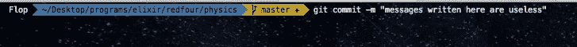
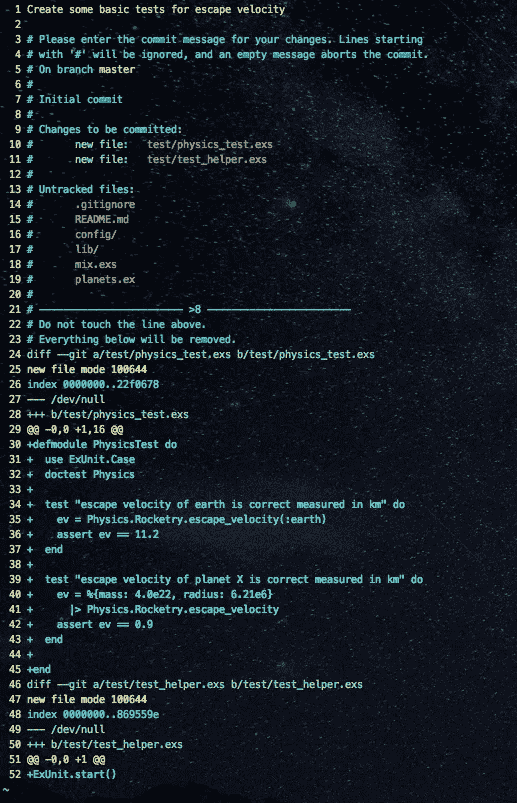
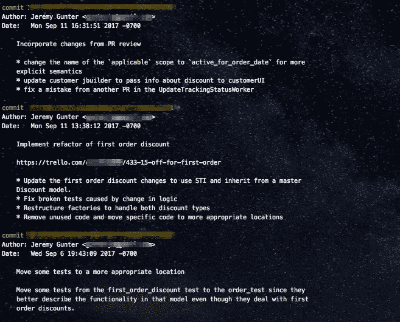
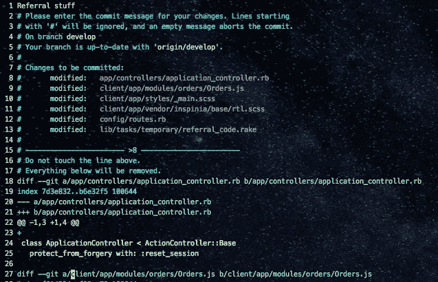
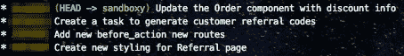
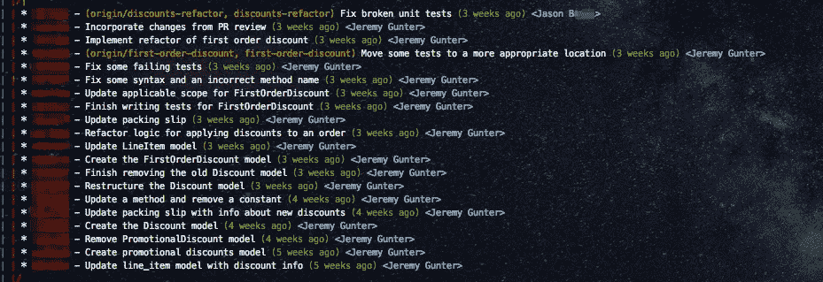

# “Git”it together:初级开发人员提交礼仪和最佳实践的一些技巧

> 原文：<https://medium.com/hackernoon/git-it-together-some-tips-on-commit-etiquette-and-best-practices-for-junior-developers-1f147b8dfd56>

Photo by [Olu Eletu](https://unsplash.com/photos/DXYyKCCvWiM?utm_source=unsplash&utm_medium=referral&utm_content=creditCopyText) on [Unsplash](https://unsplash.com/?utm_source=unsplash&utm_medium=referral&utm_content=creditCopyText).

从我成为一名软件工程师的第一天起，我就被告知 Git 礼仪的基本知识，我感到非常幸运(谢谢你，[克拉伊洛](https://twitter.com/ckrailo)！).一个看起来很小的概念，是我作为一个初露头角的开发人员学到的第一批东西之一，因此我把在那次教育中传达给我的重要性放在了它上面。

令人惊讶的是，在我看来，似乎有许多开发人员似乎不熟悉软件开发中可能最普遍的工具 Git 的[该做什么和不该做什么](https://www.slideshare.net/TarinGamberini/commit-messages-goodpractices)。由于许多程序员是在工作中学习 git 的，他们很可能没有在一些被认为是软技能的东西上接受过最佳实践的指导，而且很难相信有人会选择使用糟糕的 Git 礼仪。尽管如此，这个问题在所有技能水平的开发人员中仍然很普遍。

不过不要担心，这个解决方案不需要几个小时的阅读和完全改变你的工作流程。事实上，这是一个相当容易解决的问题，只需要你遵循一些容易记住的原则。

所以让我们从一些基本的开始。这些概念的知识和实现将帮助你迈出从 greeny-junior 到 Git-guru 的第一步。

# 使用 CLI 和编辑器…

..并停止使用`git commit -m “Useless message here"`

Trying to fit a well-formed commit message into a single command doesn’t work.

## 提交消息应该需要一分钟。

你应该停下来思考你刚刚做的工作，以便向可能参与该项目的其他人以及你未来的自己解释，如果你需要重新审视这些变化的话。

## 写一条经过深思熟虑的信息是你将你所做的改变写进“历史”的方式，并解释你改变了什么，以及为什么。

当你花时间在文本编辑器窗口中(而不是在命令行中)编写你的消息时，它会让你慢下来，并确保你的更改是完整的，值得分享，并允许你在解释为什么需要更改时更具描述性。

## 当您使用编辑器编写消息时，它可以帮助您更快地发现代码中的错误。

例如，我在工作流中使用了 [Oh-My-Zsh](https://github.com/robbyrussell/oh-my-zsh) git 别名。命令`gc`扩展成`git commit --verbose`，这将打开您的默认编辑器，以注释的形式给出您当前更改的摘要。什么是暂存的，什么不是，未跟踪的文件，以及您当前提交的更改的差异，允许您在编写提交消息时查看更改。

***提示* :** 在写消息之前通读差异可以让你免于提交“调试器”代码和/或帮助发现通常在代码审查之前不会被发现的打字/拼写错误。

# 遵循正确的提交消息格式

## 标题行

写标题的时候，我试着遵循三条规则:

1.  标题行以大写字母开头，不超过 50 个字符，结尾没有标点符号。
2.  应该是祈使语气。*即“添加新的关于我们的页面”或“重构订单模型的测试”*
3.  它应该正确地完成句子，
    `“If accepted, this commit will <your commit message goes here>.”`

A super-basic commit message using proper grammar and structure. (`git commit — verbose` usingNeovim)

## 身体

变化的简要总结。如果这些变化足够简单，只需要一个“标题”就可以理解，那么你可以选择不看这一部分(上图是一个不需要详细解释的变化的好例子)。

身体应该为你的改变解释“什么”和“为什么”，而不是“如何”。任何阅读代码的人都应该能够看出您是如何实现您的更改的。使用正文部分来覆盖可能不太明显的部分。

An example of pretty thorough commit messages with explanatory body sections

***提示:*** 如果你使用的是票务[管理](https://hackernoon.com/tagged/management)系统(特雷罗、吉拉等。)，*包括卡/发行的链接*。这是一个很好的参考，对于那些可能不熟悉这个问题的人或者从事相同项目的其他开发人员来说。

# 保持原子性，并在相关的提交中一起保存更改

## 在同一个提交中将类似的更改组合在一起

Not even close to logical grouping

不要在同一个提交中抛出一些配置更改和新的 CSS。以一种合乎逻辑的方式把东西分开。(请记住，即使您一次做了多个变更，您仍然可以以合理的方式提交它们，按照相似的变更进行分组)

The same changes from the previous image, but broken out into more “atomic” commits.

您的提交显示了代码的进展。让它成为一个容易理解的故事。即使现在看起来不重要，能够跟踪代码的历史可以帮助你通过逻辑推理定位回归的来源(*控制台中的 JS 错误很可能不是来自你更新 CSS 和改变页脚中的一些图标*的提交)。

The Git log from a feature I recently worked on.

这绝不是熟练使用 git 所需要知道的全部，但它是构建的坚实基础。了解你的工具以及如何最好地使用它们只是成为高质量开发人员的一个方面。关注这些“小”事情会帮助你变得更有效率，让和你一起工作更加愉快。即使唯一受益的人是十周后的你。

是的，像你提交信息的形式这样的小事可能看起来不重要或者乏味，但是关注小事和培养好习惯是成功的关键。

> “我们就是我们反复做的事情；因此，优秀不是一种行为，而是一种习惯。”——亚里士多德

***如需进一步阅读，请查看:***

Tim Pope 的这篇[博客文章](http://tbaggery.com/2008/04/19/a-note-about-git-commit-messages.html)和 Chris Beams 的这篇[博客文章](https://chris.beams.io/posts/git-commit/)是本文大部分材料的来源。

[Caleb Thompson 为](https://robots.thoughtbot.com/5-useful-tips-for-a-better-commit-message) [Thoughtbot](https://thoughtbot.com/) 撰写的文章绝对是*必读的*。

沙孔的书[&施特劳布的](http://amzn.to/2vYspfn)【Pro Git】。=== **GitBible**

Atlassian 的这套教程经常是我在一些更高级的 git 主题上的首选参考资料(**非常可靠的例子和解释* *)。

# 如果你喜欢这篇文章，请点击👏按钮，并考虑跟随我。越多的人对我写的东西感兴趣，我就越有可能继续创作。谢谢！