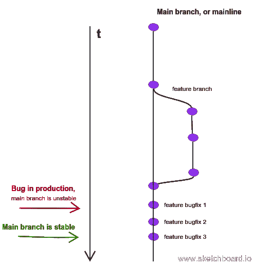
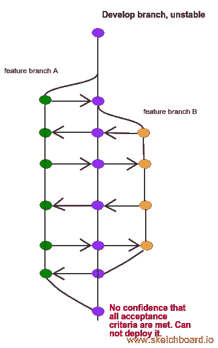
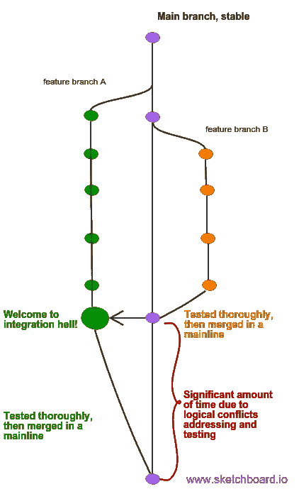
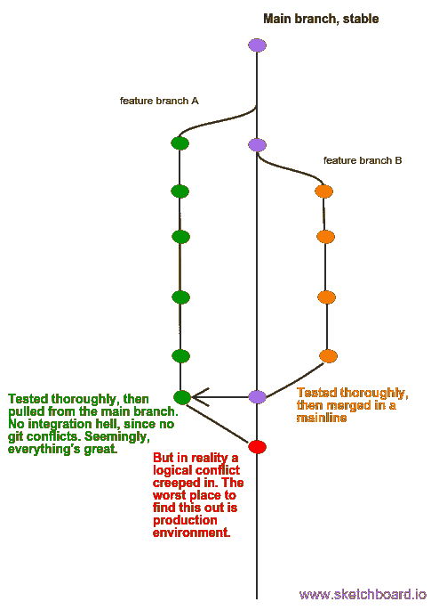
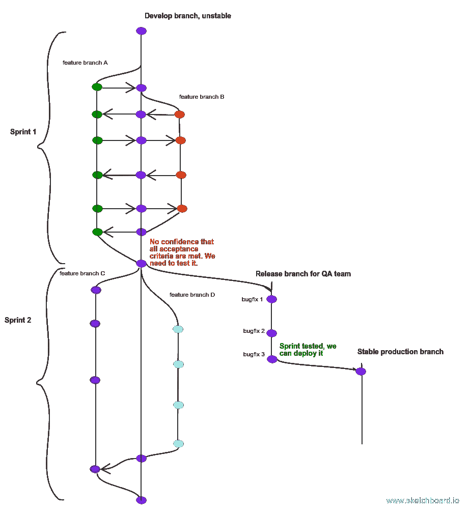

# Gitflow 是一个糟糕的分支模型黑客

> 原文：<https://medium.com/hackernoon/gitflow-is-a-poor-branching-model-hack-d46567a156e7>

## 原因如下。

让我重复一遍: [gitflow](https://nvie.com/posts/a-successful-git-branching-model/) 只是一个糟糕的分支流黑客，表明你的团队的工程实践水平低下。

好吧，在你生吞我之前，让我解释一下。

## 版本控制系统的主观简史

**风投前的日子**
基于除功能之外的任何东西的独立开发导致了可能持续数年的集成地狱。

SVN
SVN 在我 20 多岁的时候抓住了我，当时我的编程文化显然比现在低。我没有编写单元测试，我的面向对象编程很差，我既不了解 SCRUM 也不了解任何其他敏捷方法，但 SVN 教会了我一件事，那就是责任。我无法签入不起作用的代码。可能没有单元测试，代码可能一塌糊涂，但它必须工作。

**Git**

**Git + CI**
大量的分支并连续合并成 develop 分支。

因此，相当多的人抓住了至少三个主要的风投里程碑，以及他们所有的理念。这里有一个问题:什么是对的，什么是错的？使用什么分支策略？开发分支应该稳定不稳定，或者稳定到什么程度？

嗯，其实是反过来的。您的分支模型应该反映您团队的工作流程。

## 编写代码

你写单元测试吗？什么时候？你把它们和代码一起写吗？你的代码覆盖率是多少？如果你所有的测试都通过了，你能确定一切都很好吗？或者，换句话说，您能否将您的功能分支与主功能分支合并，并立即进行部署？如果没有，很明显，你的代码需要进一步的测试——无论是手工测试还是功能测试。因此，如果您有一个对应于当前生产环境的主分支，或者用 Fowler 的话来说，一个主线——您不能只是将您的分支合并到其中:从合并到测试该特性并修复所有错误的时间可能是很重要的。如果您认为这不是问题，请想一想当生产中出现一个关键错误，您需要尽快修复它的情况。但是您不能:在您的主分支中要么有未测试的代码，要么没有工作(或者两者都有)。

所以现在你有两个选择。要么你[遵循持续集成实践](https://martinfowler.com/bliki/FeatureBranch.html)并且有一个额外的不稳定分支，在那里你的团队持续地将他们的代码合并到:

或者您根本不合并代码，而是将它保存在自己的特性分支中:

在后一种情况下，QA 不能并行测试特性，因为在主线中将它们合并在一起后，可能会出现冲突。最糟糕的是当 git 悄悄合并代码，但是逻辑冲突还在，你看不到:

Logical conflicts when testing branches in parallel

所以唯一可行的选择是在它们的分支中测试这些特性，然后合并到主分支中，这样它们就不会不可预测地互相干扰，但是在下一节中会有更多的测试。

## 测试

你的 QA 团队编写功能测试吗？什么时候？主要的问题是一样的:在什么时间点你可以确定你做了正确的事情并且没有破坏任何东西？

**典型方法** 你写一些代码，可能还要进行一些单元测试。但是你没有信心认为一切都很好。无论如何，当你完成你的用户故事的时候，你不能确定[一切都像预期的那样工作](https://www.seguetech.com/what-characteristics-make-good-agile-acceptance-criteria/)并且你没有破坏任何东西。你能做的最糟糕的事情就是将这些代码放在它自己的分支中，将代码集成不可避免的痛苦推迟到 sprint 的最后。如前所述，更好的选择是将它合并到 develop branch 中。之后，你的同事把 develop 拉进自己的分支。即使他们都不写测试，他们也有可能遇到错误的行为，但是修复它更容易，因为他们知道是最近的`git pull origin develop`破坏了他们的分支。因此，他们不是在两周的代码堆中寻找 bug，而是浏览昨天的工作。很有可能，如果他们在他们的开发聊天中或在他们都坐的房间里询问问题，他们会马上得到答案。再说一次:如果从错误出现到被发现的时间间隔很短，就更容易找到错误行为的原因。

不管怎样，在 sprint 接近尾声的时候，你的 QA 团队加入进来，开始测试 sprint 用户故事。如果他们真的开始测试 sprint 的结尾，我打赌他们会手动测试。在 sprint 期间手动测试用户故事是没有任何意义的，因为任何后续的提交都会破坏事情。此外，万一测试过程停滞不前，它不应该阻止开发人员从下一个 sprint 实现用户故事。所以 QA 团队必须有自己的分支来测试 sprint。这是它的样子:

你知道这个工作流程对应什么分支策略吗？对，是 gitflow。

**好方法** 坏的工程实践经常导致上面讨论的延迟和不可预测的部署。因此，一般来说，你的测试套件不仅应该包含单元测试，而且至少应该包含功能测试。这自然意味着 QA 团队应该尽快开始编写他们的测试。所以在这种情况下，你的处境与我在前一章描述的完全相反。简而言之，只要代码准备好了，你就可以部署它，你只需要一个分支，这个分支总是稳定的。对了，这叫[连续发货](https://continuousdelivery.com/)。

## 部署

您是否手动部署？[自动](https://puppet.com/blog/continuous-delivery-vs-continuous-deployment-what-s-diff)？需要多长时间？您准备好在主分支中部署每个提交了吗？如果没有，您可能需要至少一个稳定的分支，该分支当前正在生产中，用于紧急的 bug 修复，而第二个分支虽然稳定，但是由于部署过程的困难，每天部署一次。因此，这里有另一个适合您的工作流的分支模型。

## 摘要

理想的分支模型是不存在的。根据您团队的工作流程(这反过来又取决于它的工程文化水平)，一些特定的分支工作流程最适合您。在切换到另一个分支模型之前，确保你的团队已经准备好了。

查看我关于以下主题的纯粹主义帖子:
*讨论[坚实原则](https://hackernoon.com/solid-principles-530b2cc2badf)背后的具体基础以及它们所基于的价值观；
*如何构建弹性可靠的[SOA](/@wrong.about/how-to-implement-soa-dc6bf08fba9a)；
*在创建[微服务](https://hackernoon.com/why-microservices-fail-6cdc006f9540)时最需要提防什么，以及最常见的失败原因；
*我的承担以下无处不在的概念:[实现继承(恶！)](https://hackernoon.com/inheritance-based-on-internal-structure-is-evil-7474cc8e64dc)、[如何分解域](https://hackernoon.com/on-good-domain-decomposition-385ee8ce5a3)和[避免贫血域模型](https://hackernoon.com/how-to-avoid-anemic-domain-model-5e1c3e6fe4d0)、[如何将一个系统分解成模块](https://hackernoon.com/how-to-decompose-a-system-into-modules-796bd941f036)、[静态类(又恶！)](https://codeburst.io/static-classes-are-evil-or-make-your-dependencies-explicit-af3e73bd29dd)、[迪容器(无用的恶)](https://hackernoon.com/you-dont-need-a-dependency-injection-container-10a5d4a5f878)、 [ORM(也是恶)](https://hackernoon.com/you-dont-need-an-orm-7ef83bd1b37d)、[域服务类(正、恶)](https://hackernoon.com/you-dont-need-a-domain-service-class-in-ddd-9ecd3140782)。