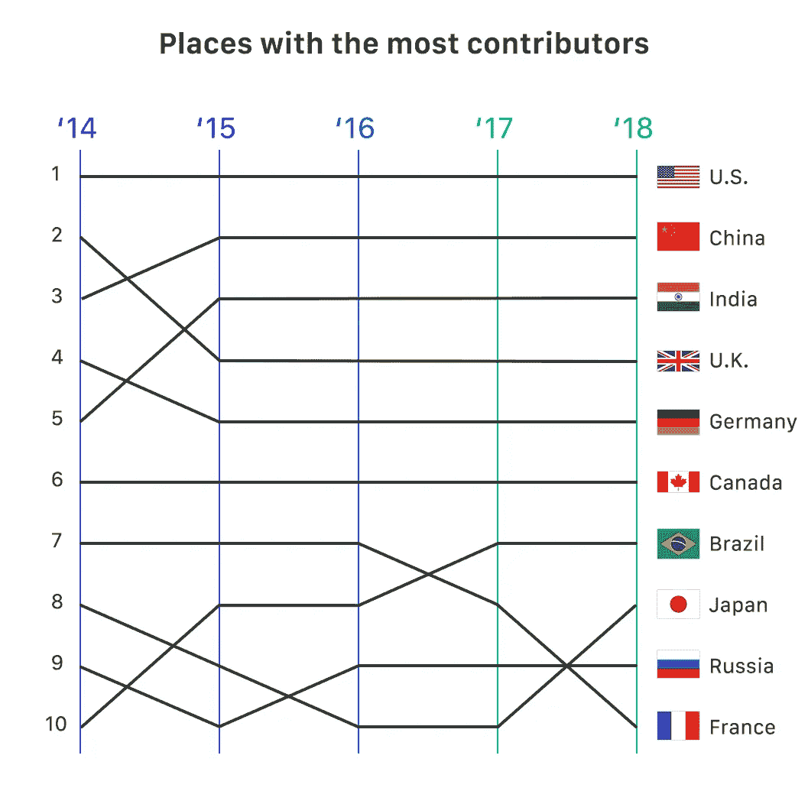
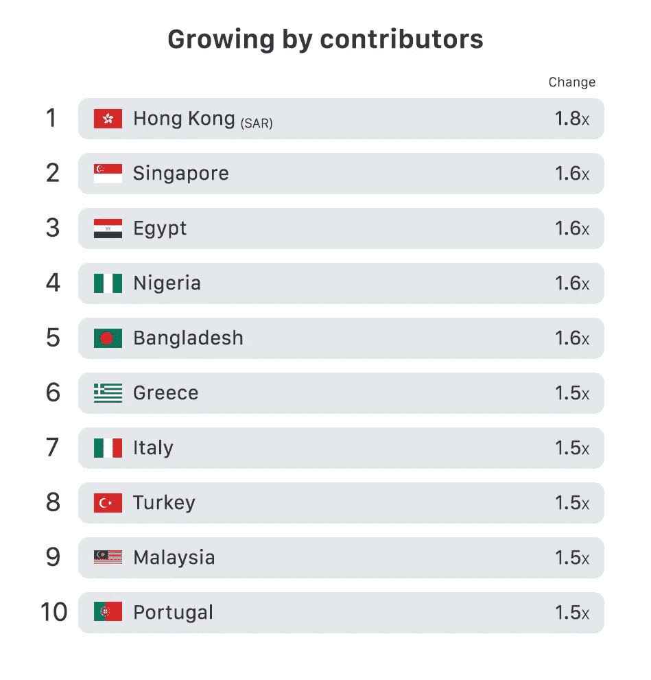
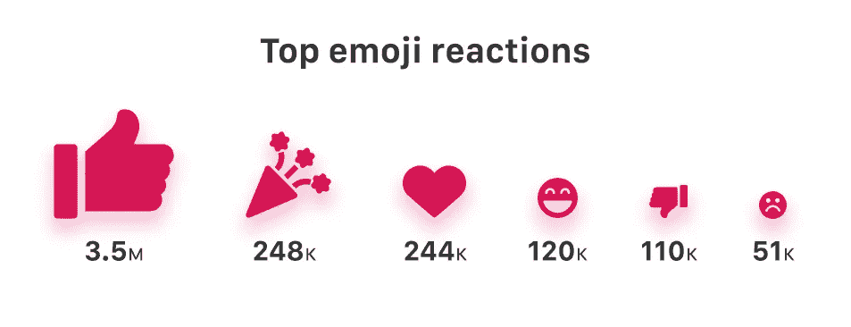
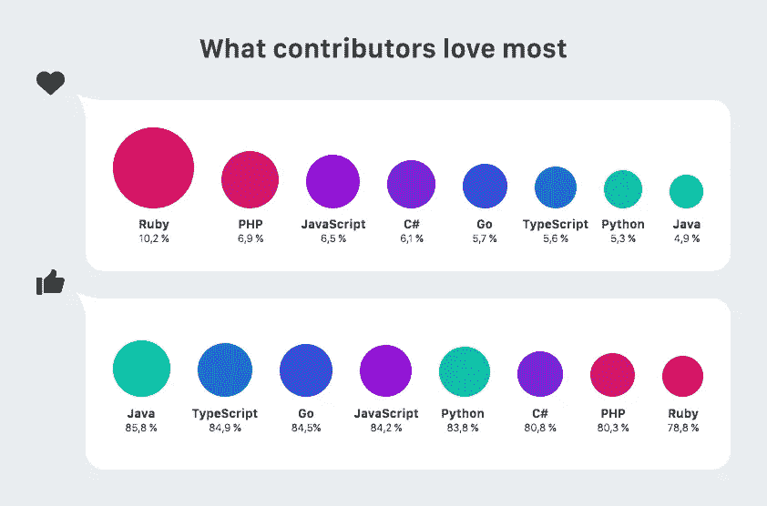
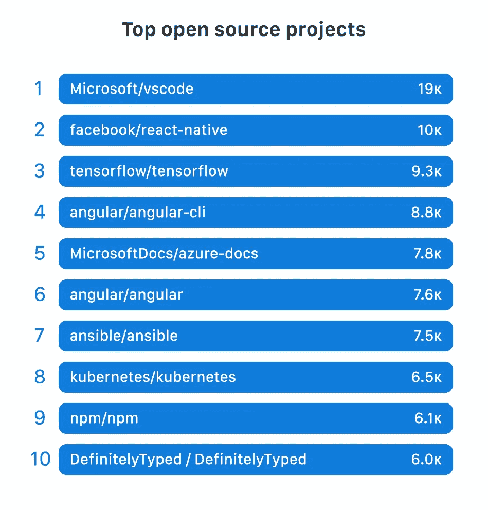
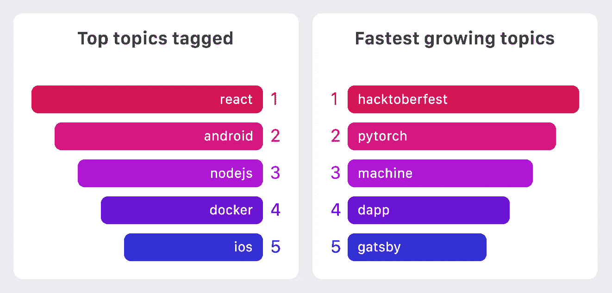
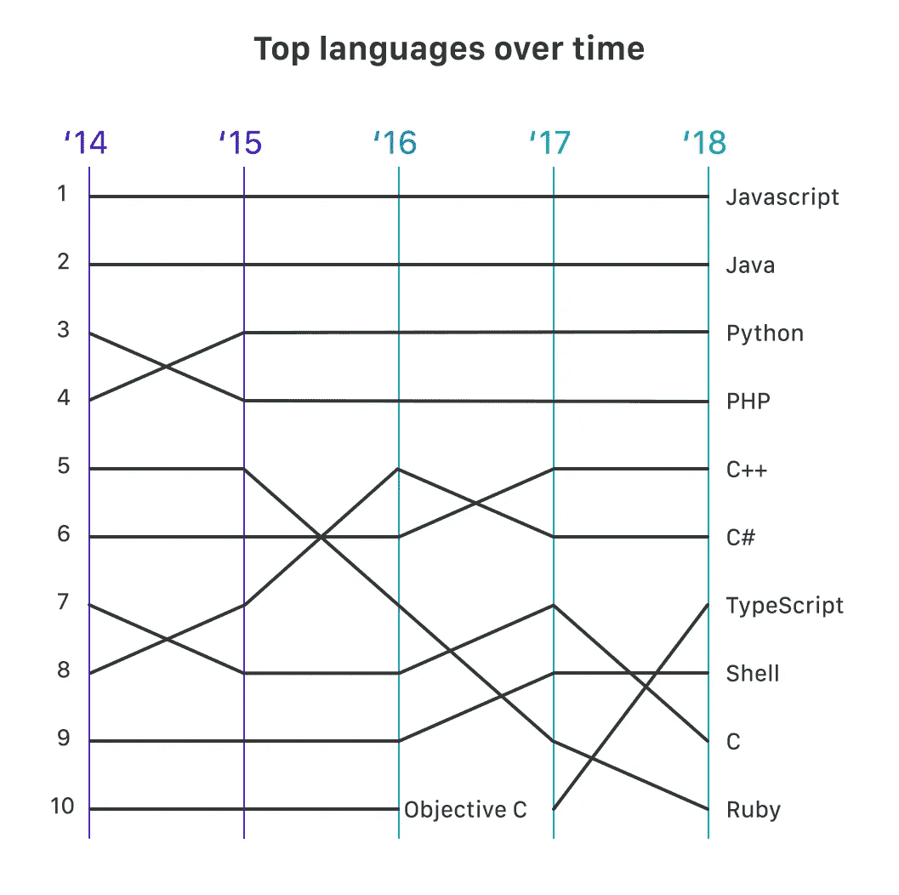

# GitHub 2018 年概览中的热门趋势

> 原文：<https://medium.com/hackernoon/github-octoverse-2018-overview-top-trends-ea0d91d3b760>

GitHub 的 Octoverse 状态回顾了软件开发领域的顶级趋势。今年的版本是从 2017 年 10 月 1 日到 2018 年 9 月 30 日的过去 365 天的统计数据制成的。

过去一年做了大量工作，迄今已有超过 11 亿笔捐款，打破了去年 10 亿笔捐款的记录。

今年的综述着眼于位置、时机、仓库、营销、安全等方面。

# 人民

如今，GitHub 拥有 3100 万用户。毫无疑问，人们赋予了这个平台生命，做出了贡献，创造了让世界变得更美好的东西。

在过去的一年里，GitHub 新增了 700 万用户。去年[发布 GitHub 的《Octoverse 之州》时，用户总数为 2400 万，相比之下，这是一个巨大的增长。](https://dashbouquet.com/blog/web-development/blog/web-development/github-octoverse-2017-overview-top-trends)

捐款几乎来自世界各地。仅美国的贡献就占 20%，世界其他国家占 80%。考虑到过去几乎完全由美国一国的贡献所主导，这是一个进步。

中国和印度对该平台的项目贡献分别位居第二和第三，与去年持平。

看看排名上升的国家，日本和西班牙都移动了两位——日本从第 10 名升至第 8 名，西班牙从第 14 名升至第 12 名——而香港从前 20 名之外升至第 17 名。

毫无疑问，亚洲是发展最快的开发者社区，中国、印度、日本和香港在贡献最多的前二十名中占据了不同的位置。

埃及和尼日利亚也在 GitHub 社区发表声明。根据贡献者、创建的组织、创建的库和创建的开源库的数量对增长最快的国家进行排序时，这两个国家都进入了前十名。

一个非常明显的趋势是假期期间的活动大幅减少。圣诞节至新年期间，活动大幅放缓，到 1 月中旬恢复正常活动。看起来开发商充分利用了假期。

使用 GitHub 的不仅仅是专业开发人员，学生也是如此。大约有 18，000 所学校正在使用 GitHub，110 万名学生通过该平台学习。60 万名学生正在使用 GitHub [学生开发包](https://education.github.com/pack/offers)，2 万名教师正在使用 GitHub 提高教学质量。

结果，GitHub 现在有大约 300 万个教室知识库。

关于人的更多信息:

# 这些项目

如今 GitHub 上有很多项目。该平台现在托管着大约 9600 万个存储库，有超过 2 亿个拉取请求。仅在 2018 年，就有大约 6700 万个拉请求，超过了 2017 年的 4700 万个拉请求。

在今年的报告中， [VSCode](https://github.com/Microsoft/vscode) 和 [React Native](https://github.com/facebook/react-native) 仍然是贡献最多的项目， [NPM](https://github.com/npm/npm) 从去年报告中的第三位下降到第九位。Tensorflow 在十大项目中排名上升最快，大多数贡献者从第六位上升到第三位。

[微软的 Azure 文档](https://github.com/MicrosoftDocs/azure-docs)、 [Pytorch](https://github.com/pytorch/pytorch) 和 [Godot 游戏引擎](https://github.com/godotengine/godot)是增长最快的三个开源项目。这让我们看到了云基础设施和深度学习在技术领域的美好未来。

看看趋势公司，在员工贡献最多的公司名单中，微软以 7700 的贡献排名第一，谷歌以 5500 的贡献排名第二，红帽以 3300 的贡献排名第三。

当谈到开发者感兴趣的话题时，JavaScript 相关的话题似乎是趋势。React 和 Node JS 分别是第一和第三大标签话题，android 话题位居第二。其他与 JavaScript 相关的话题包括 Angular 和 electronic，它们都是标签最多的话题。

说到语言的选择，去年没有什么变化。用于项目贡献的前四种语言仍然是 JavaScript、Java、Python 和 PHP。

尽管数百万程序员热爱这种语言，但 Ruby 的下滑趋势持续了多年。Ruby 自 2015 年排名第五以来一直在下降，目前该语言排名第十。

TypeScript 是过去一年中排名最高的，从第十位上升到第七位，这令人印象深刻。

在增长最快的语言列表中，Kotlin、HCL 和 TypeScript 位列前三。HCL 上榜并不令人意外，因为这是过去一年人们对 DevOps 兴趣浓厚的结果。

其他前景巨大的语言如 Rust 和 Go 分别是第五名和第七名。

# 平台

在过去的一年中，GitHub 平台上添加的应用数量增长了 33 %,应用安装量增加了两倍。这些应用帮助超过 150，000 名开发人员和组织的工作效率提高了一倍。

从 Github 安装的应用程序中，排名前三的是:

*   CI +安全+项目管理
*   CI +安全性+代码质量
*   CI +项目管理+代码质量

GitHub 今年还推出了一个安全警报功能，提醒开源项目的贡献者他们应用程序的漏洞问题。这个功能已经引发了超过 500 万个问题。

仍在谈论安全性，从 Github 的 [Bug Bounty](https://bounty.github.com/) 计划，应用安全工程师和研究人员已经解决了 213 个 Bug 报告，在此过程中赚取了超过 30 万美元。

# 包扎

这些年来，越来越多的开发者开始使用 GitHub 来托管他们的项目。这意味着年度报告将让我们更好地了解整个技术生态系统。开发人员、测试人员、管理员、项目经理可以利用这些洞察力。

从今年的概述中，我们可以看到亚洲作为一个大洲开始在开源项目的开发中拥有强大的发言权，GitHub 的学生开发者包实际上正在对软件开发社区产生影响。

从项目的角度来看，Tensorflow 和 Pytorch 看起来像是未来非常重要的人工智能工具。看起来 Godot 游戏引擎在未来的视频游戏开发中将会有巨大的发言权。

对于仍然怀疑 DevOps 能力的开发人员和系统管理员来说，今年的综述应该足以显示它在软件开发过程中有多大的前途。

最后，安全性仍然是每个软件的关键问题。漏洞总是存在的，因此开发人员应该尽可能地了解构建软件的最佳实践，以帮助减少漏洞。

[*安东·沙列尼科夫*写的](https://www.linkedin.com/in/anton-shaleynikov-45812a1/)