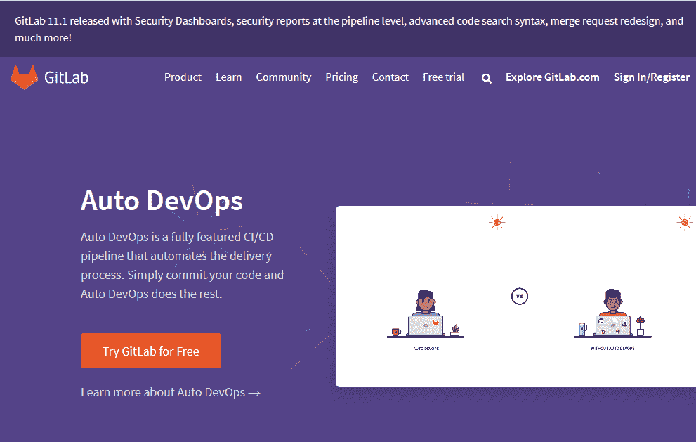

# GitHub 和 git lab——哪个更适合开源项目？

> 原文：<https://medium.com/hackernoon/github-vs-gitlab-which-is-better-for-open-source-projects-31c45d464be0>

目前，存储库管理服务——如 GitHub 和 git lab——是成功开发软件的重要方面，无论是单独开发还是合作开发。

如果没有这些服务，将很难管理开源项目的变更，同时确保随着开发的继续保持效率。

例如，Asitaka 依赖 GitHub 来跟踪源代码变更并与其他开发人员协作。

你可以观看和学习他的一个项目，他在 Kotlin [这里](https://www.liveedu.tv/asitaka/2w9nx-how-to-create-simple-instagram-like-android-app-in-kotlin/)创建了一个简单的类似 Instagram 的 Android 应用程序。

在为开源项目寻找最佳代码管理服务时，开发人员通常会比较两个最流行的平台:GitHub 和 GitLab。

在本文中，我们将尝试评估这两个平台，以帮助您决定最适合您的项目的平台。

# **什么是 GitHub？**

你可能知道，2008 年推出的 GitHub 是一个基于 git 的存储库管理平台，是世界上最受欢迎的。

虽然 GitHub 支持托管开源代码，但它并不是完全开源的。截至 2008 年 6 月，GitHub 报告拥有超过 2800 万用户和 8500 万代码库，打破了其行业第一的位置。

2008 年 6 月，微软宣布将以 75 亿美元收购 [GitHub，震惊了整个开发者圈。一些开发者反驳道，因为他们认为这个科技巨头不会保持 GitHub 的开发者至上的精神。](http://blog.liveedu.tv/microsoft-buys-github-what-next/)

平台上的项目是公开的。然而，如果你想让你的项目私人化，你需要一个付费的 GitHub 计划——个人开发者和团队每个用户每月起价分别为 7 美元和 9 美元。

# **git lab 是什么？**

GitLab 于 2011 年推出，是另一个基于网络的 git 存储库，正在开源项目的爱好者中获得关注。该平台的社区版是开源的，允许开发者为其功能的增强做出贡献。

与 GitHub 不同，GitLab 为开源项目提供免费的私有库。然而，如果你想使用更多的功能，你需要付费版本，每个用户每月 4 美元起。

当微软宣布将收购 GitHub 时，一些开发人员将他们的项目转移到了其他竞争平台，特别是 GitLab，它报告说[导入库的数量大幅增加](https://twitter.com/gitlabstatus/status/1003887898142367744?lang=en)。

然而，GitHub 未来的 CEO 表示，只有“[极少数](https://www.reddit.com/r/AMA/comments/8pc8mf/im_nat_friedman_future_ceo_of_github_ama/)的开发者做出了举动。

# **GitHub 和 GitLab 的对比**

比较 GitHub 和 GitLab 就像比较两个双胞胎；每一个都有细微的变化。事实上，如果你登录了 GitHub 的网站，你会很难认为自己不在 GitLab 的网站上。

多年来，这两种存储库管理服务都吸取了彼此的最佳特性，并集成到了各自的平台中。

以下是它们共有的一些基本特征:

*   拉取请求
*   第三方集成
*   派生/克隆存储库
*   代码审查
*   代码片段
*   问题跟踪
*   高级权限管理
*   降价支持

尽管如此，代码管理库之间仍然存在差异，这可能会使您更喜欢其中的一个。

事实上，虽然在技术上他们彼此接近，但主要的差异主要是关于哲学。

GitHub 强调其基础设施的高可用性和性能，并将其他复杂的功能委托给第三方工具。

相反，GitLab 专注于将所有功能包含在一个久经考验且集成良好的平台上；它在一个屋檐下为完整的 DevOps 生命周期提供一切。

关于人气，GitHub 绝对是把 GitLab 裤子打下来的。GitLab 向平台推送开源代码的开发者较少；尽管最近对 GitHub 的收购给了它一些动力。

此外，关于定价，GitHub 更贵，这使得它不适合预算低的用户。

# **那么，哪一个最好呢？**

对于开源项目，在 GitHub 和 GitLab 之间做出决定可能很困难，就像陌生人很难区分双胞胎一样。

然而，通过一点地下挖掘，你可以做出一个好的决定。

例如，如果您正在处理一个大型开源项目，涉及到与几个开发人员的协作，那么 GitHub 可能是您的最佳选择。

你会在 GitHub 上找到一个大型的充满活力的社区，它可以帮助你完成你的项目。

另一方面，如果您正在进行一个项目，其中价格是一个问题，高性能并不重要，那么使用 GitLab 可以帮助您节省成本。

此外，如果您想要一个真正开源的平台，那么 GitLab 可能非常适合您的项目。

此外，您喜欢在您的开源项目中使用第三方工具进行持续集成(CI)和持续交付(CD)吗？或者，您更喜欢不需要单独安装的内置工具吗？

如果你喜欢使用 CI 和 CD 用途的预集成工具，那么 GitLab 可以更好地为你服务；否则，请使用 GitHub。

# **包装完毕**

最终，GitLab 与 GitHub 之间的选择取决于您打算用您的开源[编程项目](https://www.liveedu.tv/guides/programming/)实现的特定目标。

因此，您应该仔细评估您的期望，选择最适合您需求的存储库管理平台。

或者说，GitHub 和 GitLab 你更喜欢哪个？

请在下面分享你的想法。