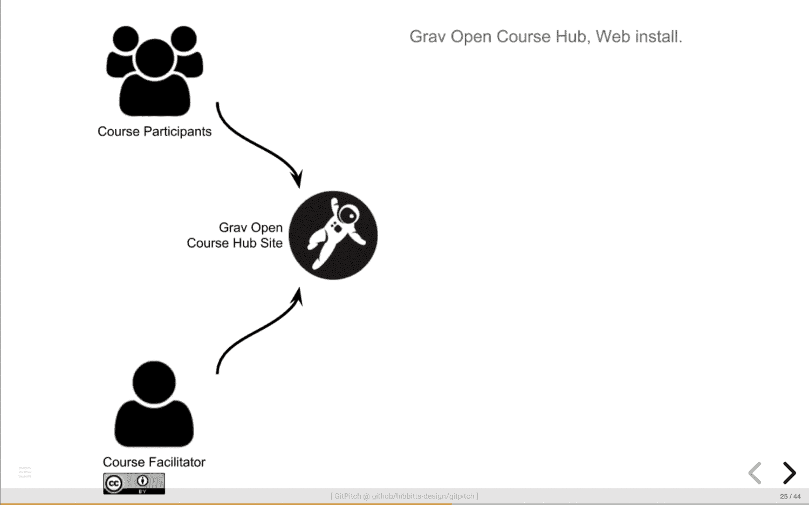

# 2018 年 GitPitch ❤️学习节

> 原文：<https://medium.com/hackernoon/gitpitch-%EF%B8%8F-festival-of-learning-2018-2bc0c296e45b>

> 强大的新减价演示语法快捷方式。


欢迎来到 GitPitch *今日展示*系列的最新帖子。本系列文章重点介绍了 GitPitch 社区中开发的一些优秀作品。

你可以在这个博客[这里](/@gitpitch)找到本系列早期文章的链接以及相关内容。

# 请击鼓…

事不宜迟，让我来介绍今天最新的 *GitPitch 演示:*

**提示！**点击上面的演示文稿进行聚焦，然后按`F`键打开演示文稿进行全屏观看。

这个演示是由保罗·希比茨创作的。你可以分别在 Twitter 和 Github [这里](https://twitter.com/hibbittsdesign)和[这里](https://github.com/hibbitts-design)联系到 Paul。

Paul 身兼多职，既是教育家，又是交互设计师和开源开发者。今天的演示介绍了 Paul 令人激动的开源项目 Grav Course Hub。

[](https://github.com/hibbitts-design/grav-skeleton-course-hub) [## Hib bitts-设计/grav-框架-课程-中心

### grav 课程中心与 Git 同步，旨在支持一个开放和协作的环境…

github.com](https://github.com/hibbitts-design/grav-skeleton-course-hub) 

本演示文稿是为即将到来的 2018 年学习节会议准备的。庆祝高等教育教学的会议。毫无疑问，这是一次非常值得庆祝和支持的会议。

要了解关于即将到来的会议的更多信息，请点击[此处](https://bccampus.ca/festival-of-learning-2018/)。

# 演示技巧和窍门！

这一系列的博客文章试图强调一些特色演示所使用的 GitPitch 的优秀特性。

今天我将重点介绍功能强大的新 markdown **快捷语法**的使用，它可以用来增强任何演示文稿的外观和感觉。

# 提示 1。分步项目符号列表快捷语法

演示文稿作者通常需要一步一步地向观众介绍想法。这有助于保持观众的注意力集中。同时也一次在简单的想法上揭示更复杂的想法。

GitPitch 现在支持新的`@ol`和`@ul`快捷语法标签，分别用于有序列表和无序列表。这些标签使得创建这种类型的分步幻灯片内容非常非常简单。

这是今天专题演讲的一个降价片段:

```
### @fa[laptop] What Skills are Required? @fa[laptop]

@ul[squares]

- Intended for “Tech-savvy” educators:
 - Code editor usage (e.g. Atom or Brackets)
 - Markdown or HTML basics
 - Understanding folder hierarchies (i.e. relative links)
 - Web server access
 - GitHub working knowledge (recommended)

@ulend
```

通过在这些新标签中包装标准的 Markdown 项目符号列表语法，GitPitch 将列表项转换成片段。这些片段会一个接一个地显示在您的幻灯片上，如下所示:


有关此功能的详细演示，请参见下面的演示文稿。点击此处启动[。](https://gitpitch.com/gitpitch/feature-demo/frag-shortcut-syntax#/)

# 秘诀 2。文本颜色快捷语法

任何 GitPitch 演示文稿使用的所选[主题](https://github.com/gitpitch/gitpitch/wiki/Theme-Setting)决定了任何幻灯片上呈现的文本的默认字体颜色。

例如，今天的专题演示使用了`night`主题，因此幻灯片上的文本默认呈现为`white`文本。

但有时，演示文稿作者需要一种简单的方法来覆盖默认设置并在文本上应用自定义颜色。GitPitch 现在支持一个新的`@color`标签，可以让你做到这一点。

这是今天专题演讲的一个降价片段:

```
### @color[black](Open Publishing Space)


```

请注意，幻灯片标题文本现在呈现在`black`文本中。生成的幻灯片如下所示:


# 秘诀三。幻灯片背景色语法

我们刚刚讨论了在文本内容上应用自定义颜色。改为对整个幻灯片背景应用自定义颜色怎么样？

嗯，再简单不过了。这是今天专题演讲的另一个降价片段:

```
---?color=#8fa33b

### What About Other Open-related Grav Projects?
```

生成的幻灯片如下所示:


# 秘诀 4。字体超赞快捷语法

字体牛逼图标库真的是**牛逼**。实际上有数百个渲染精美的图标可以用来增加一点视觉上的活力🚀任何幻灯片。

这是今天专题演讲的一个降价片段:

```
### @fa[rocket] Topics to Explore Today @fa[rocket]1\. What is Grav?
2\. Grav Open Course Hub Project
3\. Other Open-related Grav Projects
4\. Next Steps
```

生成的幻灯片如下所示:


关于在 GitPitch 演示幻灯片中使用字体牛逼图标的详细介绍，请参见之前的[博客文章](https://hackernoon.com/gitpitch-presentations-for-developers-are-now-font-awesome-342c8aa86715)。

# 秘诀 5。逐步图像序列

显然，今天的专题演示使用了许多出色的功能。但是我想再强调一个非常有用的特性。

逐步图像序列的引入。

让我们快速探究一下这种效果是如何产生的。首先，演示文稿作者在他们的`PITCHME.yaml:`中设置了一个自定义的`transition`

```
transition : none
```

该设置防止在幻灯片之间移动时出现*滑动*效果。

接下来，演示充分利用了强大的[图像分隔符](https://github.com/gitpitch/gitpitch/wiki/Image-Slides#background)来渲染连续幻灯片上的每幅图像:

```
---?image=assets/img/grav-open-course-workflow-1.png&size=contain&color=white

---?image=assets/img/grav-open-course-workflow-2.png&size=contain&color=white

---?image=assets/img/grav-open-course-workflow-3.png&size=contain&color=white

---?image=assets/img/grav-open-course-workflow-4.png&size=contain&color=white
```

这里显示的 markdown 片段只是将一系列图像注入到一系列幻灯片中。幻灯片演示中的最终效果如下所示:



# 从创意到展示的最快方式

我知道我今天已经讲了很多内容，但是今天的专题演讲确实有很多值得喜欢的地方。

我希望您能够从今天的专题演示中获得一些灵感或有用的提示。再次感谢 Paul Hibbitts 分享您精彩的演讲。

我祝愿保罗和所有参与即将到来的 2018 年学习节的人在高等教育的教学和学习方面取得巨大成功。

在我结束之前，**我想请**帮个小忙。如果你喜欢今天的这篇文章，请鼓掌表示你的欣赏👏对于这篇文章。


你的掌声有助于提升在[媒体](https://medium.com/u/504c7870fdb6?source=post_page-----2bc0c296e45b--------------------------------)上的文章。这有助于让人们了解 GitPitch，以及所有特色演示和作者。

如果你有任何问题或反馈，你可以在下面的评论区联系我，或者直接在 Twitter 上或通过电子邮件联系我，【david@gitpitch.com。

**别忘了！在此领取 GitPitch Pro 一个月免费试用版**[](https://gitpitch.com/pricing)****。****

**感谢您今天的阅读。欢迎大家。大卫。**

**[](https://twitter.com/gitpitch)**

****您可以在**[**Medium**](/@gitpitch)**或**[**Twitter**](https://twitter.com/gitpitch)**上关注我，了解 GitPitch 社区的更多新闻、技巧和独特创意。****