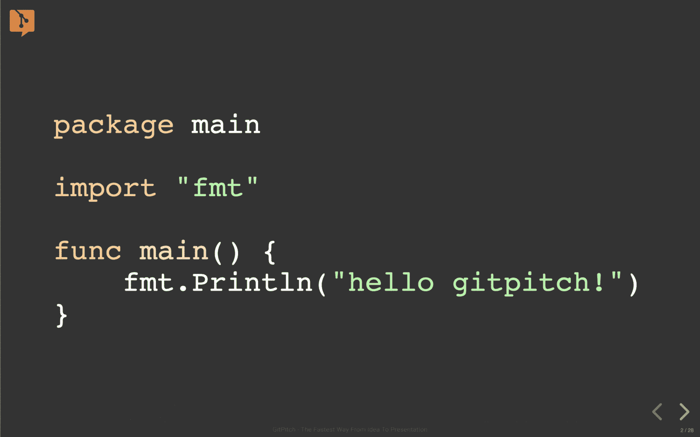
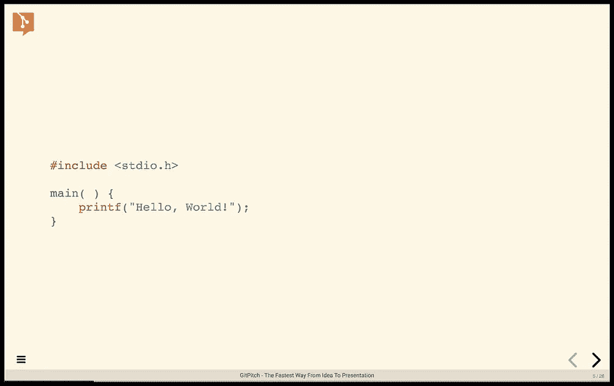
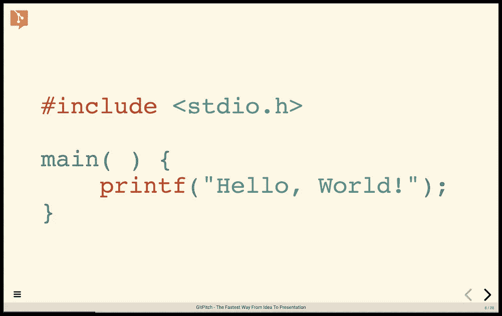
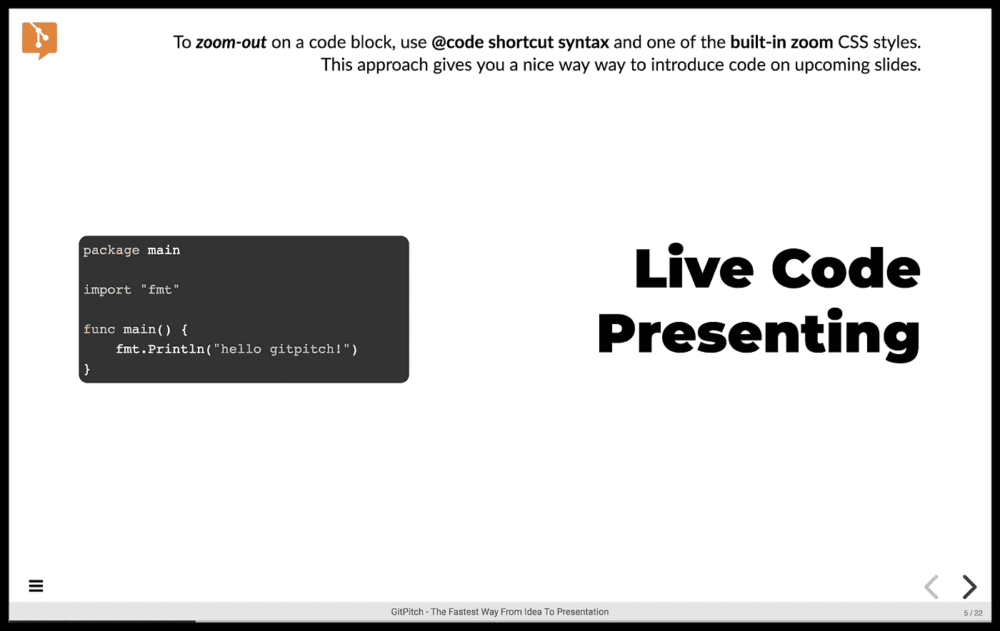
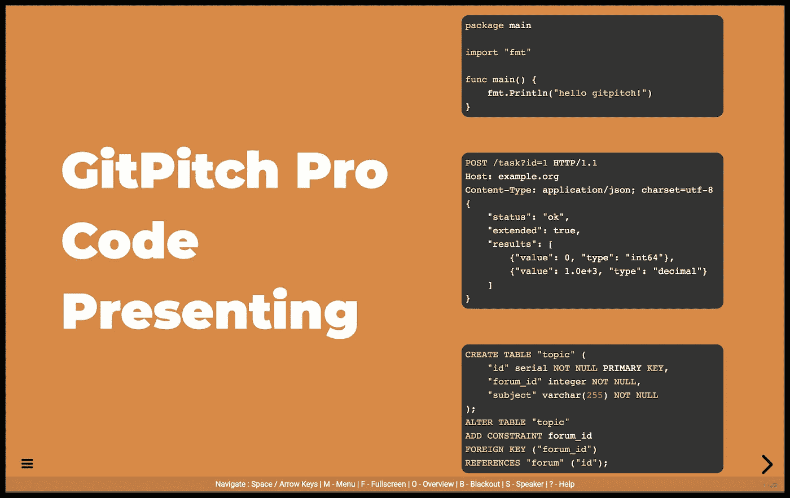

# GitPitch 为幻灯片添加代码缩放

> 原文：<https://medium.com/hackernoon/gitpitch-adds-code-zoom-for-slide-decks-49c9cf2cd3df>

> 放大、缩小和逐步查看任何幻灯片上的存储库源代码和 GitHub 要点。



[ GitPitch Live Code Presenting with CODE ZOOM. ]

从一开始，[gitpitch.com](https://gitpitch.com)markdown 演示服务的核心就是现场代码演示。如果您是 GitPitch 演示文稿的作者，这个特性允许您*逐句通过*代码，就好像您仍然在 ide 中一样。但是直接在你的幻灯片上做。

由于 **GitPitch 与 Git** 的独特无缝集成，实时代码呈现可以与 Git 存储库中的任何源代码、数据、日志或文本文件一起工作。它也适用于任何 GitHub GIST。

现场代码演示是许多独特而强大的 [GitPitch 特性](https://gitpitch.com/features)之一，对 GitHub、GitLab 和 Bitbucket 上的每个人都是完全免费的。

> 要亲自体验 **GitPitch** **现场代码演示**，请点击以下链接，在您的网络浏览器中启动一个示例演示。点击[这里](https://gitpitch.com/gitpitch/pro-code-presenting)。

# 代码缩放的力量

随着最近 **Code Zoom** 的发布，GitPitch 朝着为开发者 提供 ***终极幻灯片解决方案又迈出了重要的一步。***

当激活时，**代码缩放**的效果是立即和戏剧性的。如以下幻灯片并排快照所示，显示了*标准代码*渲染与*代码缩放*渲染:



如您所见，**代码缩放**提供了美观的代码幻灯片，清晰易读，极具视觉吸引力。更不用说全互动感谢 GitPitch [**现场代码呈现**](https://gitpitch.com/docs/code-features/presenting) 。

在`**PITCHME.md**`中使用的 GitPitch markdown-syntax 提供了非常好的代码缩放效果，再简单不过了。这里有一个例子:

```
@code[c zoom-21](src/c/hello.c)
```

就是这样！一行。`**code**` markdown 语法的工作方式如下:

1.  它接受存储库中任何源文件的相对路径，在本例中是`hello.c`文件。该文件中的代码呈现在您的幻灯片上。
2.  语法接受语言提示，在本例中是`c`。该提示确保使用最合适的代码语法突出显示来呈现您的代码。
3.  最后，语法还接受可选的`**zoom-xx**`样式。样式名的`**xx**`部分表示特定代码块所需的*缩放程度*。大于 1 的值*放大代码上的*。

你可以在 *Markdown Pro Widgets guide* 中找到这个特性的完整文档，以及大量使用资源库源文件和 GitHub GIST 的示例，参见[这里](https://gitpitch.com/docs/markdown-features/pro-widgets)。

# 缩小代码缩略图

当你第一次想到**代码缩放**时，你可能会自然而然地想到*放大*…来欣赏和分享在你的幻灯片上放大的代码。

但是**代码缩放**的另一个重要用途是*缩小*功能。这给了我们创建 ***代码缩略图*** 的能力。通过示例可以更好地理解这一特性:



上面幻灯片中完整的`PITHCME.md`降价片段如下:

```
---@snap[west span-40]
@code[golang zoom-07](src/go/sample.go)
@snapend@snap[east span-50]
### Live Code Presenting
@snapend
```

使用代码缩略图，您不局限于每张幻灯片只有一个缩略图。您可以根据特定幻灯片设计的需要添加缩略图，例如:



同样，您可以在*Markdown Pro Widgets guide*中找到该功能的完整文档，以及大量示例，包括使用存储库源文件和 GitHub 要点的*缩小示例*，请参见[此处的](https://gitpitch.com/docs/markdown-features/pro-widgets)。

# 开发人员的终极幻灯片解决方案

对于 GitHub、GitLab、Bitbucket 上的数百万用户来说，***Git 版本控制下最重要的内容是代码*** 。

正是由于这个原因，GitPitch 继续用新的、令人兴奋的实时代码呈现特性来取悦用户。像**码变焦。**

无论你是放大还是缩小，我都希望你在下一次会议、聚会或培训课程中玩得开心。

**记住，如果你喜欢 GitPitch，但只是必须拥有(1)用于离线工作和演示的桌面工具，(2)用于管理云中演示访问的工具，或者(3)访问各种各样的** [**强大功能**](https://gitpitch.com/docs/pro-features/bonus) **，包括代码缩放，那么请查看 GitPitch Pro。现在有一个 7 天的免费试用期。**

我鼓励您尝试一下 GitPitch Pro。更多详情，见[此处](https://gitpitch.com/pricing)。

感谢您今天的阅读。非常感谢为这个帖子鼓掌。欢迎大家。干杯，大卫。

[](https://twitter.com/gitpitch)

**您可以在** [**Medium**](/@gitpitch) **或**[**Twitter**](https://twitter.com/gitpitch)**上关注我，了解 GitPitch 社区的更多新闻、技巧和独特创意。**