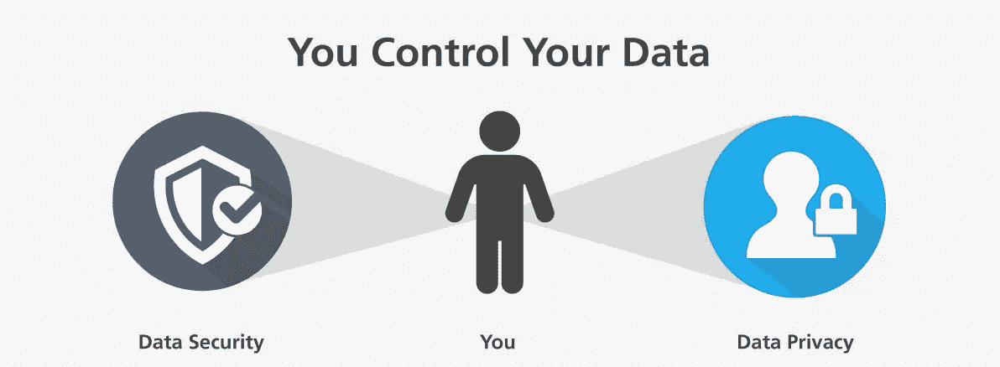
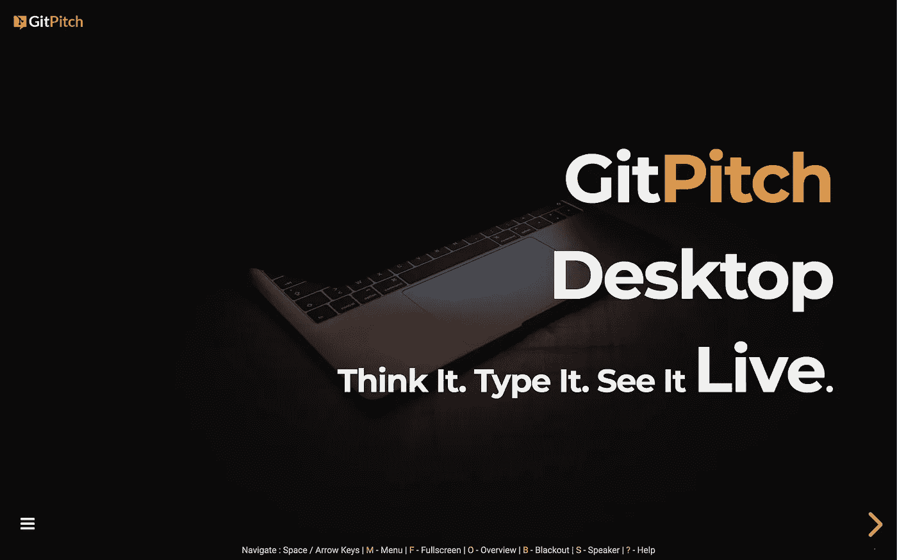

# GitPitch 增加了对 GitHub 企业内部部署服务器的支持

> 原文：<https://medium.com/hackernoon/gitpitch-adds-support-for-github-enterprise-on-premise-servers-f15a5b91de5a>

> 为您的内部 GitHub 企业服务器激活 GitPitch markdown 演示服务。

如果您的组织已经在内部部署了 GitHub Enterprise server，那么这份公告是为您和您的团队准备的。

**今天，我很高兴宣布推出 GitPitch Enterprise，它提供了与自托管 GitHub Enterprise 服务器的无缝集成。**

[ Click above image to launch a live GitPitch Introductory Presentation ]

# GitPitch 企业简介

GitPitch Enterprise 为企业内部的自托管 GitHub 服务器提供与 gitpitch.com T2 T3 相同的 markdown 演示服务。

GitPitch Enterprise 的推出意味着您现在可以从现有的 GitHub Enterprise 投资中获得更多收益。 **GitPitch 解锁由现有 Git 基础设施支持的幻灯片演示服务**。

# 使用 Docker 容器技术交付

GitPitch Enterprise 使用 Docker 交付，Docker 是世界领先的软件容器化平台。

这种方法可确保您的组织享受简单一致的服务器部署和管理。

# GitPitch 企业 100%数据隐私保证

GitPitch Enterprise 是一个无状态的服务器容器，没有外部软件依赖。没有任何类型的出站或呼叫总部功能。

GitPitch 服务器只读取直接用于幻灯片演示的存储库文件数据。而且服务器从不写数据。

对私有存储库中演示的访问完全由 GitHub 个人访问令牌管理，可以根据需要授予和撤销这些令牌。

GitPitch 服务器的无状态特性也意味着容器可以随意启动、停止、丢弃和重启，而不用担心数据丢失或损坏。

# GitPitch Enterprise 捆绑 GitPitch 桌面

除了 GitPitch 服务器之外，企业许可证还解锁了 [GitPitch 桌面](https://gitpitch.com/desktop)。桌面应用程序允许用户直接在桌面上开发、预览和演示幻灯片演示。

GitPitch 桌面可以在 Linux、Windows 和 OSX 上使用。桌面应用程序可以在线和离线工作，因此非常适合现场演示环境。

# 从创意到展示的最快方式

GitPitch Enterprise 提供了部署在[gitpitch.com](https://gitpitch.com)上的相同软件——git pitch 开源服务器的一个增强的、生产就绪的版本。

如果您有兴趣在您的组织内讨论部署或下载 GitPitch Enterprise 试用评估版，请联系我们，我们会帮您实现。GitPitch 企业联系表[此处](https://gitpitch.com/enterprise)。

感谢您今天阅读本公告。干杯，大卫。

**您可以在** [**Medium**](/@gitpitch) **或**[**Twitter**](https://twitter.com/gitpitch)**上关注我，了解 GitPitch 社区的更多新闻、技巧和独特创意。**