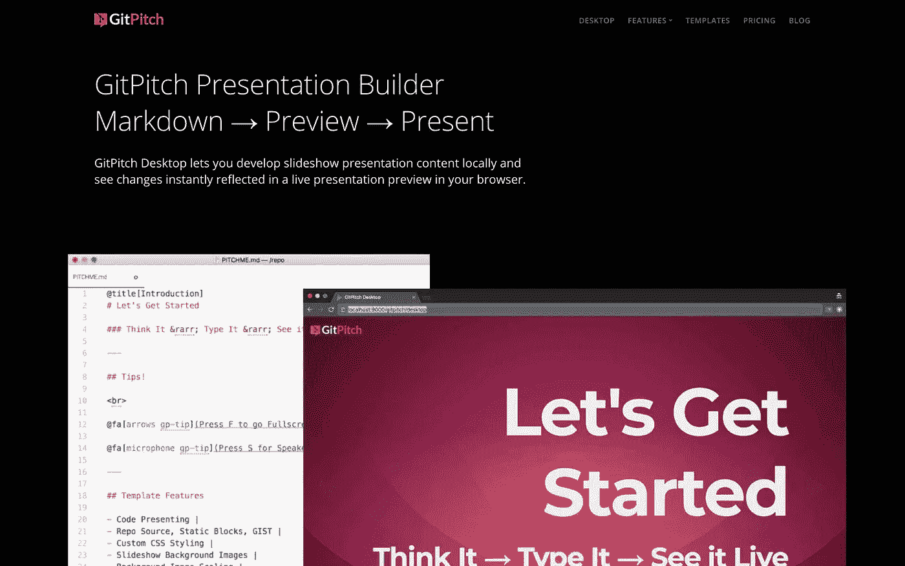

# GitPitch 桌面—先睹为快！

> 原文：<https://medium.com/hackernoon/gitpitch-desktop-sneak-peek-da23190dd5c3>

> Presentation builder 即将出现在各地的桌面上。

> ***注:经过两个月的时间和 GitPitch 社区的巨大反响，beta 计划已于 2018 年 4 月 5 日正式结束。GitPitch Pro 现已上线。详情*** [***此处***](/@gitpitch/announcing-gitpitch-pro-7a643cdd8e56) ***。***

GitPitch 桌面是我很久以来就想做的东西。现在它在这里。面向所有 GitPitch Pro 用户。

# 什么是 GitPitch 桌面？

## 思考它——输入它——现场观看它。

这是一个专用于桌面的减价演示生成器。它可以在您的浏览器中实时预览 GitPitch 演示文稿。

**它允许您在线或离线工作**。**并且不再有 Git *提交-推送-预览*周期😄 🍾**

# 无缝桌面+云体验

GitPitch 桌面还在桌面开发和将你的演示发布到 https://gitpitch.com 的云端之间提供了一个无缝的桥梁。

# 即将推出

我很兴奋！你呢？

请为这篇博文注册掌声，或者在下面给我留下你的评论或问题。

我将很快为大家带来更多关于 GitPitch 桌面的消息。

> 你还有时间试驾 GitPitch Pro Beta，从这里[开始](https://gitpitch.com/login)。

**您可以在**[**Medium**](/@gitpitch)**或**[**Twitter**](https://twitter.com/gitpitch)**上关注我，了解 GitPitch 社区的更多新闻、技巧和独特创意。**