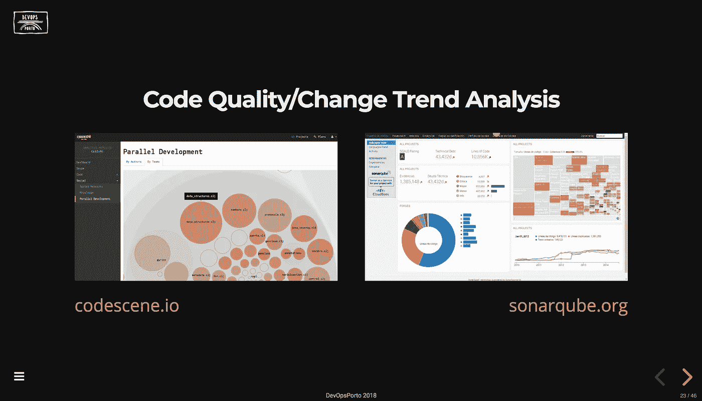
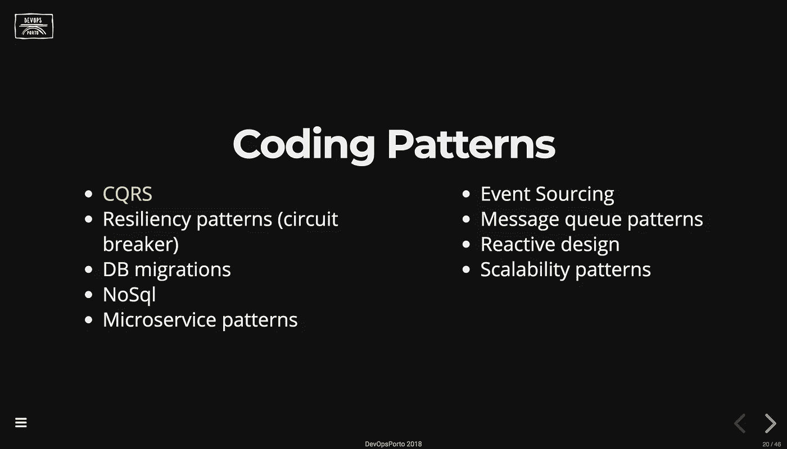
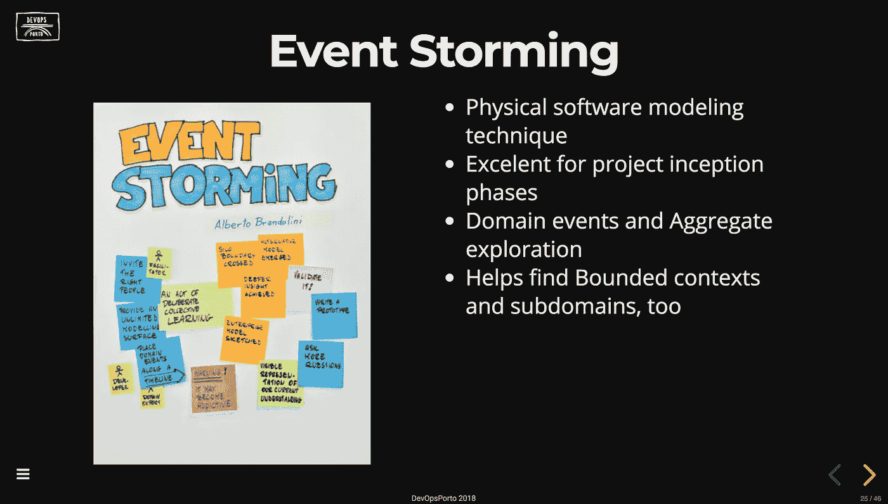
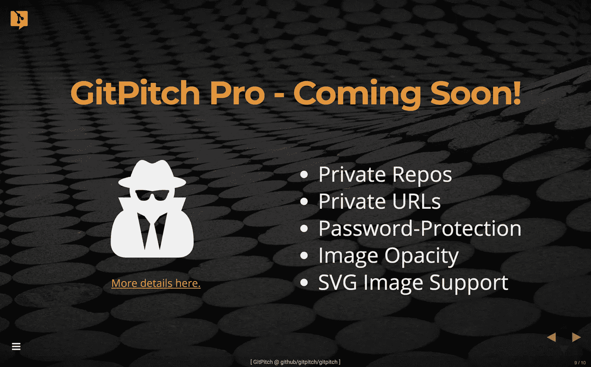

# 第 7 天的 GitPitch 演示

> 原文：<https://medium.com/hackernoon/gitpitch-presentation-of-the-day-7-249e04ac501f>

> 了解如何使用一点自定义 CSS 为 GitPitch 幻灯片创建全新的布局。

欢迎来到新年的第一个帖子。我想借此机会祝 GitPitch 社区**的每个人在 2018 年**健康快乐。

这也是*展示日*系列的最新帖子。本系列重点介绍了在 GitPitch 社区中开发的一些优秀作品。你可以在这个博客[上找到这个系列早期帖子的链接以及相关内容。](/@gitpitch)

# 请滚鼓…

让我毫不费力地介绍一下最新的*git pill 当日演示文稿*:

[ GitPitch Presentation of the Day ] — Click To Focus

**提示！**演示文稿聚焦后，按`F`键打开演示文稿进行全屏查看。

本演示文稿由 **Miguel Alho** 创建，可在 GitHub [上找到，此处为](https://github.com/MiguelAlho)。本演示文稿是为最近在德文波特举行的一次会议准备的。新年伊始，让这个展示完美的是它传递的信息。它**鼓励对*终身学习*** 采取积极的态度，并以一个非常简单但强大的挑战作为结束，我在这里与你们分享:

> 2018 年，去学点新东西吧！

您可以在 2018 年开始学习，直接前往 GitHub repo 观看 GitPitch 演示文稿，查看演示文稿的`PITCHME.md`降价和`PITCHME.yaml`促销，了解演示文稿是如何制作的:

[](https://github.com/MiguelAlho/LearningChallenge2018) [## 米高/学习挑战 2018

### 学习挑战 2018-2017 年 12 月德文波特会议的幻灯片-挑战与会者学习一些东西…

github.com](https://github.com/MiguelAlho/LearningChallenge2018) 

# 演示技巧和窍门！

我在这个*每日简报*系列中的目标之一是用每篇帖子来强调今天专题简报中使用的一些强大的 GitPitch 功能。

今天，我将重点介绍如何使用[自定义 CSS](https://github.com/gitpitch/gitpitch/wiki/Slideshow-Custom-CSS) 为幻灯片创建新的有趣的布局。

# 并排图像幻灯片布局

以下是在大多数 GitPitch 演示文稿中您不会每天看到的内容:



这张幻灯片有什么特别之处？它是使用标准的向下标记定义的**，然而幻灯片上内容的默认自顶向下呈现已经被并行内容呈现所取代。**

此处显示了此幻灯片在`PITCHME.md`中找到的标记:

```
#### Code Quality/Change Trend Analysis

<div class="left">
[codescene.io](https://codescene.io)</div><div class="right">
[sonarqube.org](https://www.sonarqube.org)</div>
```

如你所见，这都是有效的降价。HTML `div`元素的添加允许米盖尔分别激活定制的 CSS 类`left`和`right`来**将他的幻灯片内容**分割成并排的块。

这个渲染技巧是用非常简单的 CSS 实现的。你可以在这里看到这个演示文稿的完整定制 CSS 文件。

# 并排混合内容幻灯片布局

使用相同的`left`和`right`自定义 CSS 类，Miguel 能够交付多种并排幻灯片内容，包括并排列表:



并排混合图像和列表内容:



以这种方式呈现的幻灯片内容通常被许多演示工具使用，今天的*演示*是一个很好的例子，展示了 GitPitch 演示作者如何使用这种流行的幻灯片布局。

# 简单的自定义 CSS？

激活这种自定义幻灯片布局的自定义 CSS 有多简单？

我自己也在使用类似的布局在 GitPitch [介绍性](https://gitpitch.com/gitpitch/gitpitch)演示文稿中展示以下幻灯片:



我为这张幻灯片提供这种并排布局所需的整个自定义 CSS 如下所示:

```
.reveal div.left {
    float: left; z-index: -10; width: 45%;
}.reveal div.right {
    float: right; z-index: -10; width: 55%;
}
```

简单！您可以在这里查看 GitPitch 介绍性演示文稿[的完整定制 CSS 文件](https://github.com/gitpitch/gitpitch/blob/master/assets/css/PITCHME.css)。如果需要，可以随意重用其中的任何部分或全部:)

# Git 上每个人的演示文稿。

今天到此为止。我希望您能够从今天的专题演示中获得一些灵感或有用的提示。再次感谢 Miguel Alho 的精彩演讲。

GitPitch 让你毫不费力地制作和分享关于你所关心的事物的美丽内容。**用它来推销、推销或呈现绝对的任何东西；)**

> 如果您有自己的演示文稿，并且您认为它是当天 GitPitch 演示文稿的最佳候选，请联系我们。

[](https://twitter.com/gitpitch)

**您可以在**[**Medium**](/@gitpitch)**或**[**Twitter**](https://twitter.com/gitpitch)**上关注我，了解 GitPitch 社区的更多新闻、技巧和独特创意。**