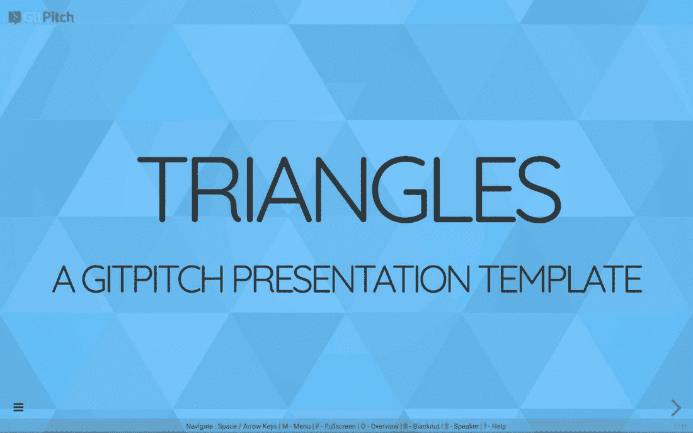

# 由 SVG 支持的 GitPitch 演示模板

> 原文：<https://medium.com/hackernoon/gitpitch-presentation-templates-powered-by-svg-46a56d6bc03e>

> 使用 SVG 图像的像素完美的幻灯片背景图像。

## 2018 年 9 月更新:这篇博文中描述的模板现在已经不推荐使用了。请看新的博文， [GitPitch 模板](/@gitpitch/gitpitch-the-template-40ac9cbf74c1)。

如果你是那种喜欢弯曲像素和布局的人，可能没有什么比*空白画布*更令人兴奋的了。

**对我们其他人来说，有模板。**

模板为各种创造性的努力提供了一个简单而有效的引导:写简历、建立网站，当然还有创建幻灯片演示。

因此，今天我很高兴地宣布一套新的降价演示模板，现已在 [GitPitch](https://gitpitch.com) 模板库中提供。

[ Click to visit GitPitch Presentation Templates Gallery ]

如果您想使用这些模板在 GitHub、GitLab 或 Bitbucket 上启动您自己的演示，您可以激活免费的 GitPitch Pro beta 订阅。你可以在这里登录[来完成。](https://gitpitch.com/login)

# 小型 SVG 图像的强大功能

SVG 为在 Web 上显示图形提供了一种独立于分辨率的格式，允许以任何比例或分辨率使用相同的图像文件。

SVG 也可以很紧凑。这些最新的 GitPitch 演示模板使用的 SVG 图像的平均大小只有大约 2kb。很小。相比之下，一些现有的 GitPitch 演示模板中使用的 **png** 和 **jpg** 背景图片的平均大小为 200kb。

这两个特性:**独立于分辨率和紧凑的尺寸**，使得 SVGs 成为演示作者非常有用的工具。

# 将 SVG 理论应用于演示实践

我决定让 SVG 代表 GitPitch 社区工作，通过使用 SVG 背景图像构建一套新的 GitPitch 演示模板。

我在谷歌上快速搜索了一下，很快就找到了我要找的东西。看看 svgbackgrounds.com。一个奇妙的资源。非常感谢网站创建者和维护者 Matt。

由此产生的支持 SVG 的模板现在可以在 GitPitch [模板库](https://gitpitch.com/templates)中获得。您可以在这里通过查看以下嵌入式实时模板来感受这些新模板:

[ GitPitch Presentation Template — Click to focus, then press F to go fullscreen ]

# 演示模板一键式下载

[模板库](https://gitpitch.com/templates)为每个模板提供了*一键式*下载功能。要开始使用您选择的模板，只需将下载包中的文件添加到 GitHub、GitLab 或 Bitbucket 上的任何公共或[私人回购](https://gitpitch.com/pro-features)中。

下载整个模板库最快的方法是在 Github 上分叉模板回购，见[这里](https://github.com/gitpitch/templates)。

# 从创意到展示的最快方式

随着时间的推移，新的模板将被添加到库中。因此，记得不时回来查看，或者在 GitHub 上简单地[观看这个报告](https://github.com/gitpitch/templates)，并自动获得更新通知。

有了模板，GitPitch 让制作和分享你关心的事物的美丽内容变得前所未有的简单。**用它来推销、推销或呈现绝对的任何东西；)**

> *马上上手 GitPitch SVG 图片支持，登录* [*这里*](http://https//gitpitch.com/login) *。*

**您可以在**[**Medium**](/@gitpitch)**或**[**Twitter**](https://twitter.com/gitpitch)**上关注我，了解 GitPitch 社区的更多新闻、技巧和独特创意。**