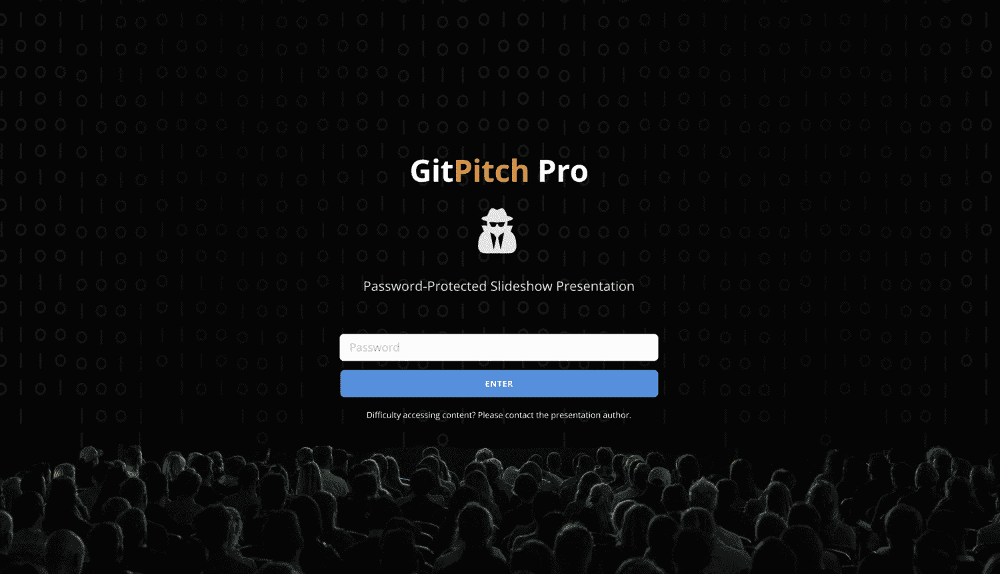
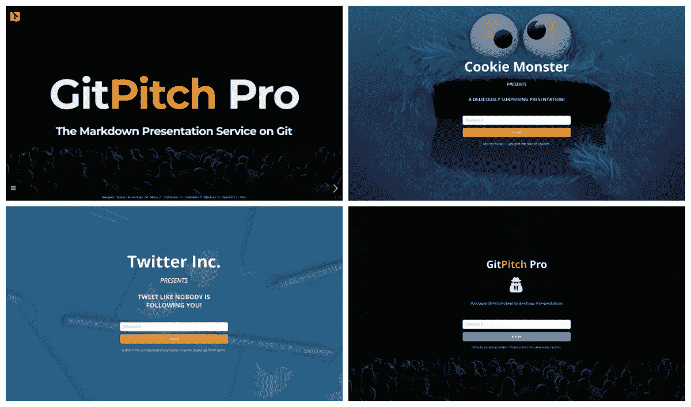

# GitPitch 私有 Git 回购支持—第 3 部分

> 原文：<https://medium.com/hackernoon/gitpitch-private-git-repo-support-part-3-c19aad572c14>

> 使用私人 Git repos 保护受密码保护的演示文稿。

这个由三部分组成的博客系列的前两篇文章可以在 [Hackernoon](https://hackernoon.com/) 找到:

*   [*文章#1 使用私有 Git repos 发布公共演示文稿*](https://hackernoon.com/gitpitch-private-git-repo-support-part-1-aa85ebc70f7e)
*   [文章#2 使用私有 Git repos 共享 GitPitch 私有 URL](https://hackernoon.com/gitpitch-private-git-repo-support-part-2-e6aea33565d7)

本文是本系列的最后一篇，解释了如何通过使用私有 Git 存储库激活 GitPitch 演示的密码保护来**安全地管理私有、机密甚至付费的内容。**

> 您现在就可以开始使用私人回购支持，登录[此处](http://https//gitpitch.com/login)。

# 授予仅密码访问权限

出于[介绍性文章](https://hackernoon.com/gitpitch-private-git-repo-support-part-1-aa85ebc70f7e)中概述的所有原因，演示文稿作者**必须明确授权**访问任何使用私有 Git 回购交付的 GitPitch 演示文稿。



当演示文稿作者没有明确授权访问私有 Git repo 中的演示文稿时，**任何查看演示文稿内容的尝试都将被拒绝。**

那么，如何创建和共享幻灯片演示，要求每个用户在访问演示内容之前提供有效的密码令牌呢？

简单。激活 GitPitch Pro [**保密模式**](https://gitpitch.com/pro-guide) **。**

# 激活机密模式

激活非常简单，只需为私有 Git 存储库中的任何幻灯片演示向`PITCHME.yaml`添加一个`confidential`属性。

`confidential`属性接受一个由一个或多个*密码令牌*组成的逗号分隔列表。令牌可以是任意字符串值，例如:

```
confidential : 54321, GitMagic, earlyacce$$
```

一旦激活机密模式，任何访问演示文稿的尝试都会被 GitPitch 拦截，并且**用户需要提供有效的*机密令牌*** 作为演示文稿的密码。

令牌管理就像在 PITCHME.yaml 文件中的`confidential`属性上添加和删除令牌一样简单。以这种方式管理令牌为您提供了一种随着时间的推移授予和撤销对您的演示文稿的访问权限的快捷方式。

# 机密模式用户体验

与其用文字描述机密模式用户体验，不如使用下面的嵌入式 GitPitch 演示文稿，让您有机会亲身体验工作流程:

[ GitPitch Password-Protected Sample Presentation — try 54321 password token. ]

这个嵌入式幻灯片演示是一个使用私有 GitHub repo 交付的受密码保护的 GitPitch 演示的示例。当质询表上提示输入密码时，您可以使用以下任何一个令牌来获得访问权限:`54321`、`GitMagic`或`earlyacce$$`。

# 密码挑战定制和品牌化

作为内容创作者，你自己的品牌也许是你最重要的名片。它是一个强有力的视觉提醒，提醒你已经和你的观众建立了信任。

因此，**有能力在每一次演讲中把你的品牌放在最前面和中心是很重要的，甚至是至关重要的。**

出于这些原因，GitPitch 机密模式挑战表可以完全重新标记，以反映您的产品、服务或内容。



表单的每个方面:从文本到图标，到配色方案，以及背景图像都可以定制，以反映您的品牌。上面的屏幕截图展示了表单定制的一些例子。作为一名演示文稿作者，无论你能想到什么品牌，你都可以用 GitPitch 来实现。

要了解更多关于机密模式表单定制的信息，请参见 *GitPitch Pro 指南* [此处](https://gitpitch.com/pro-guide)。

# 从创意到展示的最快、最安全的方式

这就结束了这个由三部分组成的博客系列，它介绍了如何使用私有 Git repos **来交付 GitPitch 服务提供的核心的表示安全性**。

GitPitch Pro 版本的主要目标之一是将这些安全扩展添加到服务中，而不会给演示文稿作者的整体工作流程带来复杂性。

我希望本系列的文章有助于**展示 GitPitch *发布*、*隐身*和*机密*模式的强大和简单。请记住，您可以随时查看 *GitPitch Pro 指南*以获取这些功能的详细[文档](https://gitpitch.com/pro-guide)。**

> 您现在就可以开始使用私人回购支持，登录[此处](http://https//gitpitch.com/login)。

GitPitch 让你制作和分享关于你关心的事物的美丽内容。用它来宣传、推销或展示任何东西；)

[](https://twitter.com/gitpitch)

**您可以在** [**Medium**](/@gitpitch) **或**[**Twitter**](https://twitter.com/gitpitch)**上关注我，了解 GitPitch 社区的更多新闻、技巧和独特创意。**