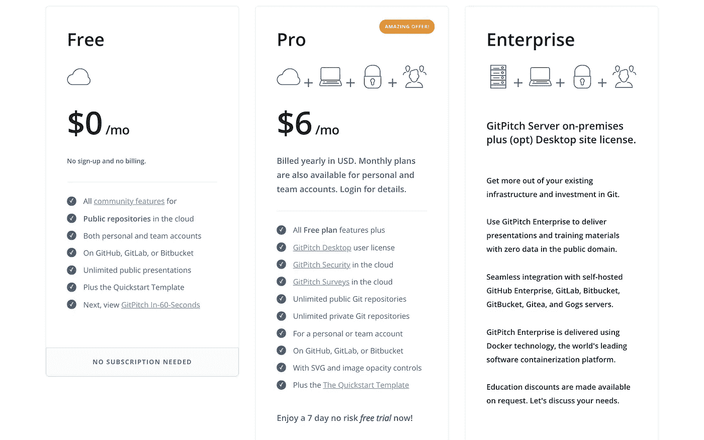

# GitPitch Pro 面向所有人的定价

> 原文：<https://medium.com/hackernoon/gitpitch-pro-pricing-for-everyone-9d48f100bc75>

> 单一订阅计划。功能齐全。卓越的价值。

# 你的声音已经被听到了

我已经问过了。我一直在听。我学到了。

现在是我将从与 GitPitch 社区的对话中学到的经验付诸行动的时候了。

**今天，我很高兴地宣布 GitPitch Pro** 的全新订阅定价模式。

现在只有一个单一的订阅定价计划。所有功能都由这一个计划解锁。我希望你会同意，这个新计划提供了真正卓越的价值。

> 注意:现有的 GitPitch 用户已经自动升级到这个新计划。

# 一杯咖啡+松饼/月的价格

GitPitch Pro 使用 Git 在您的离线工作之间提供无缝桥梁，包括在您的桌面上开发和演示，以及在云端共享幻灯片演示。

使用 [GitPitch 桌面](https://gitpitch.com/desktop)，你可以访问 Linux、Windows 和 OSX 上的本地 markdown 演示工具。这个工具可以让您在桌面上单独开发、预览和演示。完全离线，不需要 Wifi。

使用 [GitPitch Security](https://gitpitch.com/security) ，你可以将公共的、私人的、有密码保护的幻灯片演示发布到云端。您不仅可以即时在线共享您的演示文稿，还可以管理您的观众。它支持私人、机密甚至付费内容的交付。

使用 [GitPitch 调查](https://gitpitch.com/surveys)，你可以通过与听众展开双向对话，从你的演讲中获得更多。调查由专业调查工具支持，包括 SurveyMonkey、JotForm 和 Google Forms。

除了 GitPitch 桌面、安全性和调查之外，专业版订阅还提供了其他功能，保证会让任何演示文稿作者感到高兴。更多细节，包括代码缩放、图像功能、自定义字体、表情符号支持等，请参见[文档](https://gitpitch.com/docs/pro-features/bonus)。

# 从创意到展示的最快方式

今天到此为止。我希望您对 GitPitch Pro 的全新和大幅改进的定价计划感到兴奋。我强烈建议你尝试一下。这完全没有风险，因为在 [GitHub](https://medium.com/u/8df3bf3c40ae?source=post_page-----9d48f100bc75--------------------------------) 、 [GitLab](https://medium.com/u/68f5136d3254?source=post_page-----9d48f100bc75--------------------------------) 和 [Atlassian](https://medium.com/u/5aa6b9976187?source=post_page-----9d48f100bc75--------------------------------) Bitbucket 拥有账户的每个人都可以免费试用一个月。

**认领你的 GitPitch Pro 一个月免费试用** [**就在这里**](https://gitpitch.com/pricing) **！**

在我结束之前，我想请你帮个小忙。如果你喜欢今天的这篇文章，请鼓掌表示你的欣赏👏对于这篇文章。

你的掌声有助于提升媒体上的文章。这有助于让更广泛的用户群体了解 GitPitch。

感谢您今天的阅读。欢迎大家。大卫。

**您可以在**[**Medium**](/@gitpitch)**或**[**Twitter**](https://twitter.com/gitpitch)**上关注我，了解 GitPitch 社区的更多新闻、技巧和独特创意。**