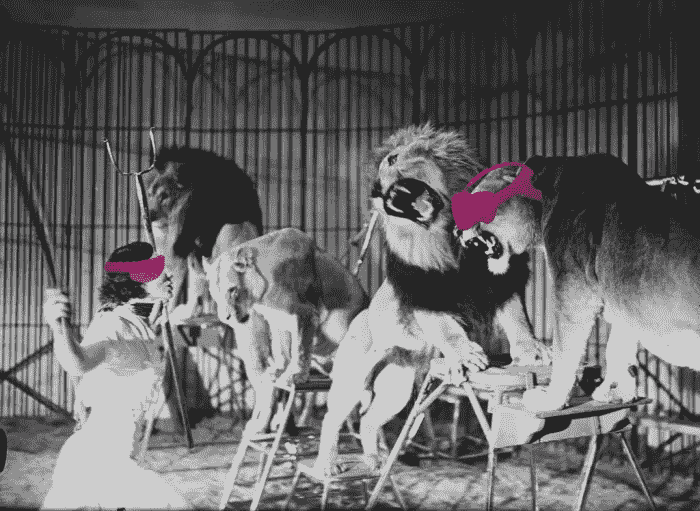

# 给他们老三环马戏团

> 原文：<https://medium.com/hackernoon/give-em-the-old-three-ring-circus-77c6db5ee192>

随着 Magic Leap 最终交付给开发者，Lytro 关闭了一个令人难以置信的产品和开发它的公司的大门。我们扪心自问的问题是，为什么有些公司可以依靠实验技术的承诺生存下来，而另一些公司却经受不住这场风暴？

有很多证据表明 Lytro 支持的技术将会走得很远。光场[技术](https://hackernoon.com/tagged/technology)在虚拟现实和增强现实世界中都是一种令人难以置信的令人兴奋的可能性，并且得到了许多公司的支持。[谷歌](https://hackernoon.com/tagged/google)最近宣布他们正在花费大量现金[调查光场的可能性](https://www.technologyreview.com/s/610458/vr-is-still-a-novelty-but-googles-light-field-technology-could-make-it-serious-art/)，而像 Raytrix 这样的商业机构则直接向创作者出售硬件。

问题是它还没有准备好迎接黄金时间。技术是未来，但不是现在。Hammer & Tusk 发现，当我们与 Lytro 合作制作击剑视频时，我们正在与国际击剑联合会合作。这些剑是如此的纤细，移动如此之快，以至于光场摄像机都无法捕捉到它们。尽管桌子两边都做了惊人的工作，这个项目最终还是被取消了，我们用一个 360°的视频代替。

资金是创办任何新公司最难的部分，找到愿意长期投资的投资者是一项挑战。谷歌的雄厚财力意味着它可以支持尚未完全成熟的技术，让他们有灵活性和喘息的空间来慢慢跨越终点线。

看着类似的故事在 Magic Leap 身上上演是一件很有趣的事情，按理说，Magic Leap 不应该有这么多钱。但与 Lytro 不同的是，Magic Leap 能够吸引足够多的投资者，使他们在多次丑闻和技术失误中幸存下来。有些是轻微的手，但有些是很好的老式的眼花缭乱。

不幸的是，你的技术有多强并不总是那么重要。重要的是你的游戏有多强。

*由雷恩·汉德曼为*[*www.hammerandtusk.com*](http://www.hammerandtusk.com/blog/article/give-em-the-old-three-ring-circus)*所写。*