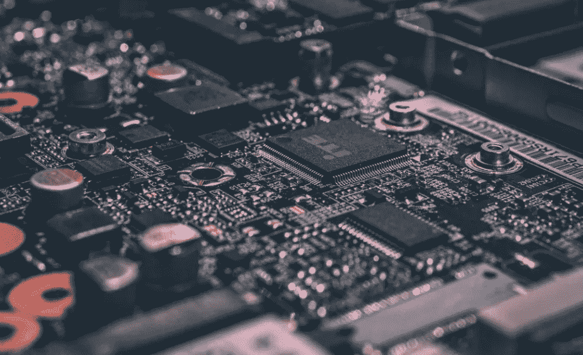
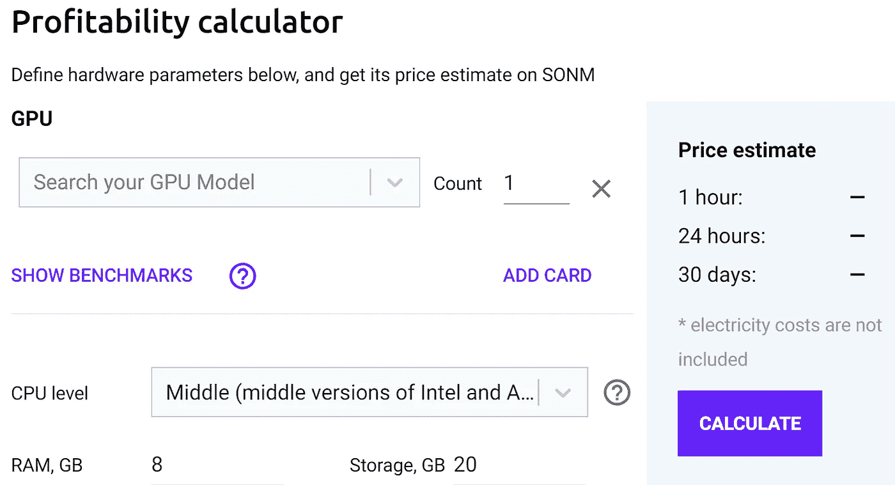
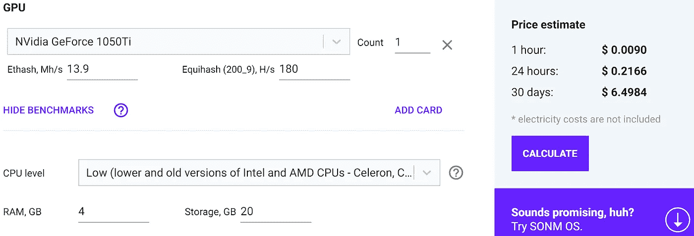
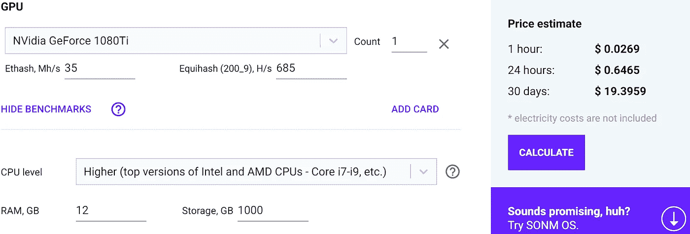

# 给你闲置的计算能力一个加密的侧面

> 原文：<https://medium.com/hackernoon/give-your-idle-computing-power-a-crypto-side-hustle-4f24b401b51>

Don’t let those motherboards get bored

区块链科技及其相关加密货币的广泛采用需要的不仅仅是猜测。

你我都充分意识到我们宝贵的数字资产的革命性潜力。但在它们为现实世界服务之前，它们将继续戴着会计部多疑的黛比赋予它们的“假互联网货币”的标签。

如果我们的幼鸟要离开它们的巢去飞翔——如果我们的硬币和代币有一天要戴上太空头盔，它们必须首先成熟起来，为世界提供实际价值。

分散式雾计算区块链项目—**—正好可以做到这一点。你可能会问，为什么会这样？**

**好吧，如果你至少拥有一台发动机罩下有足够马力的采矿钻机或计算机，Sonm 平台允许你提取比你的硬件目前可能提供的更多的价值。**

**在我进入进一步的细节之前，我会坦率地告诉你…**

*****免责声明*** *:这不是投资或理财建议。无论如何我都不是金融专家。本文中的信息主要是个人观点。***

***我* ***可能会也可能不会*** *收到用于创建此内容的少量令牌分配。也就是说，我尽最大努力保持公正和公平。我尽量避免所有的 FOMO 和 FUD，不希望在我的秘密伙伴中唤起这些情绪。***

**The dog days are over. For now…**

# **保持硬件价值**

**从挖掘密码中获得疯狂利润的喜悦暂时消退了。你再也不能只是建立一个钻机，并收集可观的奖励。**

**加密行业目前令人心碎的熊市已经导致采矿设备大量断电。曾经盈利的业务对底线造成了如此巨大的打击，以至于保持机器运行在财务上没有意义。**

**除非你是一个坚定的信徒和长期的霍德勒愿意亏本操作，希望未来上涨，没有理由继续处理。**

**但是 Sonm 想要颠覆这个概念。**

> **Sonm 网络为加密矿工和强大计算硬件的所有者提供了租用闲置资源以换取 ERC20 令牌的能力。**

**因此，你可以连接到 Sonm 网络并要求奖励，而不是在这个加密的冬天给你的采矿钻机一个假期。不要把你的硬件藏在壁橱里或者在易贝上出售——让这些机器发挥作用吧！**

# **最小的努力**

**秘密矿工已经知道睡觉时赚钱的乐趣。当他们迷迷糊糊地梦见 hashrates 时，他们的钻塔把积木放在链子上，同时在这个过程中赚取密码。**

**Sonm 平台的工作原理相同。**

> **与亚马逊、IBM、微软和其他云计算服务提供商相比，允许企业为自己的需求租用你的计算能力可以为他们省钱。**

**通过充分利用 CPU、GPU、RAM 以及磁盘和服务器资源，Sonm 可以从任何给定的设置中获取最大的价值。**

**资源提供者通过项目的$SNM 实用程序令牌获得报酬。由于 Sonm 项目远远超出了 ICO 阶段并在 MainNet 上运行，您可以在主要交易所交易$SNM 代币，包括 [**【币安】**](https://www.binance.com/en?ref=22792198) 和 [**KuCoin**](https://www.kucoin.com/#/?r=7drude) 。**

**因此，你可以通过给公司必要服务的折扣来间接挖掘，而不是直接挖掘。**

****

**The more powerful the rig, the more profitable its side gig**

# **计算盈利能力的概率**

**他们说生活中没有保证，但是我 99.99%确定以太坊现在的价格不会和我刚刚给你的数字一样。**

**无论你有一个专用的采矿设备还是一台也喜欢玩视频游戏的电脑，在决定数字方面的努力是否值得时，有几个因素在起作用。**

**一台机器的收获能力必须超过开采的硬币或代币的当前市场价格减去电费。**

**廉价能源是矿工最好的朋友。希望你在使用 [**Sonm 的盈利能力计算器**](https://sonm.com/calculator/) 时，不用为果汁消费扣除太多。如果谣言是真的，无论如何，在 BTC 的情况下，世界上大多数的节点都在使用可持续的绿色能源。**

**我已经帮你查了一些数据。你的装备可能落在中间地带，但我为你找到了一个高峰和低谷:**

****

**The low end for a single machine**

**但是让我们把 hashrate 转起来。毕竟，特别是如果你正在采矿或 3D 渲染或设计图形，你已经相应地建立了你的机器。**

****

**Stronger machines nearly triple the potential for profits**

# **启动**

**从您的机器中获取额外的价值始于安装 Sonm 操作系统。**

**点击 [**此链接**](https://sonm.com/sonm-os-download/) 将 SONM 操作系统下载到您的机器上。**

> ****重要提示:****
> 
> **安装操作系统将会清除现有的计算机数据。建议安装专用硬件或虚拟机。**

**现在，我不会让*告诉*如何处理这个文件，而是让 Sonm 团队向您展示:**

**Visit [https://sonm.com/sonm-os-download/](https://sonm.com/sonm-os-download/) for the OS plus written instructions**

**整个安装过程不到 10 分钟。但是如果你中途遇到困难，只需向 [**Sonm Support**](https://sonm.com/support/) 寻求你需要的帮助。**

# **最后的想法…**

**当前的秘密熊市不需要完全无利可图。如果 ETH 或 BTC 的价格对你来说太低，你可能会更好地让你的矿工为 Sonm 工作。**

**知道有替代品存在当然令人欣慰。恢复专用采矿钻机的用例可能是某些公司和个人的救星。**

**例如，比特大陆，*可能*阻止了裁员一半。**

**计算专用矿机的双探潜力并不需要太多的努力。当一个被开采的秘密红蜡烛低于预先确定的公平市场价值时，这就是 Sonm 季节的正式开始。**

**Sonm 正在为一个在财务上苦苦挣扎的行业注入第二次生命。具有讽刺意味的是，这是 2018 年是#BUIDL 年的一个光辉例子。**

**一个降低成本、拥有客户、解决现实世界问题的项目继续与市场的其他部分一起下沉。逻辑决定了像 Sonm 这样的项目价值的增加，但是密码市场既没有逻辑也没有理性。**

**好消息就在后面。像 Sonm 这样的项目(也许也是)正在悄悄地构建人们想要、需要并且会实际使用的平台。当前价格未能捕捉到内在的未来潜力。**

**你开始嗅到这里的分权原则了吗？这是显而易见的，原因有三:**

1.  ****真正的分布式网络。类似于节点的独立机器在全球各地运行。交易发生在 P2P 上。****
2.  ****削减成本。**这些“节点”的开销远低于集中式节点。**
3.  ****从技术垄断企业转移资源。来吧，谷歌，你已经足够富有了。我们可以将一部分流向你塞满的钱柜的菲亚特代币化，并把它藏在我们的数字钱包里。****

**这些原因，我的朋友们，体现了为什么我如此迷恋加密和区块链理工大学。这个领域不断挑战现状，没有哪个行业能免受审查。**

**Sonm 正在尽自己的一份力量，通过为蓬勃发展的云计算产业提供真实世界的价值来推广区块链的应用。该项目提供了一个双赢的局面。**

**如果你的个人或公司的采矿努力感到悲观，Sonm 平台很可能会释放多头。**

## **DYOR**

**在参与区块链项目之前，做自己的调查总是一个好主意。**

**如果你认为你可能想参与，我鼓励你更深入地研究一下这个问题。**

**这里有一些 **Sonm 资源**可以帮助你:**

**[**网站**](https://sonm.com/) **|** [**文档**](https://docs.sonm.com/) **|** [**盈利能力计算器**](https://sonm.com/calculator/)**

**👇**接触 Sonm 团队**👇**

**[**Bitcointalk**](https://bitcointalk.org/index.php?topic=1845114.0)**|**[**脸书**](https://www.facebook.com/SONMproject)|[**GitHub**](https://github.com/sonm-io)**|**[**Reddit**](https://www.reddit.com/r/SONM/)**|**[**电报**](https://t.me/sonm_eng) **|** [**推特**](https://twitter.com/sonmdevelopment)**

## **顺便说一下…**

**如果你喜欢你刚刚读到的东西，并且想要帮助你把你的加密信息传递给大众，我很想听听你的项目。**

**即使你只是想聊聊加密或你最喜欢的区块链创新，你也可以在这里找到我:blockchainauthor at Gmail**